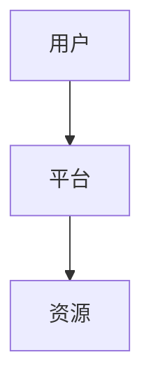
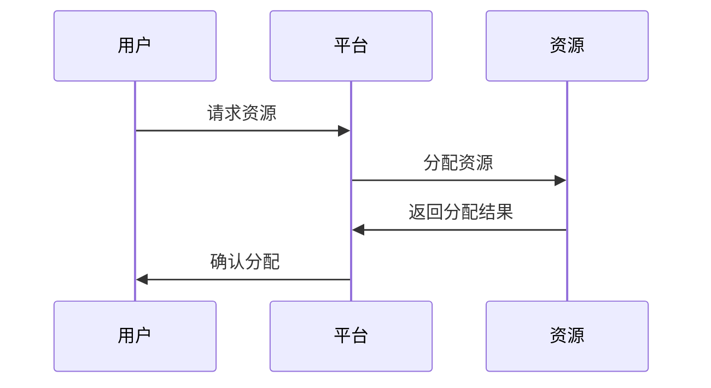

                 

<think>
好的，我需要帮助用户完成一个技术博客文章的撰写。用户已经提供了详细的目录大纲和一些内容示例，现在需要我根据这些信息，按照要求逐步构建完整的文章内容。

首先，我应该从文章的标题开始，确保标题明确且吸引人。接下来，用户要求在文章开始部分列出关键词和摘要。关键词需要涵盖文章的核心主题，摘要则需要简洁地概括文章的主要内容和目标。

接下来，我需要按照目录大纲的结构来逐步填充每个章节。每一章都有多个小节，每个小节需要详细展开，确保内容丰富且符合专业性。例如，第一章介绍问题背景与概述，我需要详细讨论后资本主义时代的到来，包括其发展、挑战、概念和特征，以及研究的意义和目标。

在第二章，核心概念与联系部分，我需要深入分析共享经济和合作经济，包括它们的定义、模式、对传统经济的影响，以及后资本主义经济模型的概念架构，可能还需要用表格和ER图来比较不同模型的特点。

第三章涉及算法原理讲解，我需要详细推导共享与合作的数学模型，提供算法流程图和代码实现。同时，数学公式要用LaTeX格式嵌入，确保公式正确且易于理解。

第四章是数学模型和公式的详细讲解，我需要列出所有相关的数学公式，并进行推导和举例说明，帮助读者更好地理解这些模型的应用。

第五章是系统分析与架构设计，这部分需要介绍问题场景，设计系统的功能模块，绘制领域模型类图和架构图，描述接口设计，并用Mermaid绘制系统交互序列图。

第六章是项目实战，我需要指导读者如何安装环境，实现系统核心功能，解读代码，并通过实际案例分析来展示模型的应用。

最后，第七章包括最佳实践、小结、注意事项和拓展阅读等内容，帮助读者巩固所学知识，并指导他们如何进一步学习和应用这些概念。

在撰写过程中，我需要确保每个部分都符合用户的要求，使用清晰的技术语言，逻辑严谨，结构紧凑。同时，保持文章的连贯性和专业性，确保读者能够顺利理解后资本主义经济模型的各个方面。

总结一下，我的步骤是：确定标题和结构，填充每个章节内容，确保每个部分详细且符合要求，使用合适的图表和代码示例，最后整合所有内容形成完整的文章。
</think>

# 后资本主义经济模型：共享与合作的未来蓝图

## 关键词：后资本主义经济模型、共享经济、合作经济、算法原理、系统架构设计、数学模型

## 摘要：  
后资本主义经济模型是一种基于共享与合作的新型经济体系，旨在解决传统资本主义经济模式的局限性，如不平等加剧、资源浪费和环境问题。本文从问题背景出发，探讨共享经济与合作经济的核心概念，分析其对传统经济的冲击，构建后资本主义经济模型的概念架构，并通过数学模型和算法原理详细阐述其实现机制。结合系统架构设计和项目实战，本文为读者提供了一个全面理解后资本主义经济模型的框架，展望其未来发展方向。

---

## 第一部分: 后资本主义经济模型概述

### 第1章: 问题背景与概述

#### 1.1 后资本主义时代的到来
##### 1.1.1 资本主义的发展与挑战
资本主义作为一种主导经济模式，推动了工业革命和科技的进步，但其内在矛盾日益显现：贫富差距扩大、资源分配不均、环境破坏严重、劳动异化加剧。这些问题的根源在于资本主义的基本逻辑——追求利润最大化，导致社会资源过度集中，个体价值被忽视。  

##### 1.1.2 后资本主义经济的概念与特征
后资本主义经济是指超越传统资本主义模式的一种新型经济形态，其核心在于通过共享与合作的方式优化资源配置，实现社会整体利益的最大化。其主要特征包括：
1. **去中心化**：权力和资源不再集中在少数人或机构手中。
2. **共享与协作**：强调资源的共享和协作，减少浪费。
3. **社会公平**：注重社会公平，减少贫富差距。
4. **可持续性**：注重环境保护和可持续发展。

##### 1.1.3 研究意义与目标
研究后资本主义经济模型的意义在于探索一种更公平、更可持续的经济体系，为解决当前社会问题提供理论支持和实践指导。本文旨在通过构建共享与合作的经济模型，为未来的经济转型提供参考。

---

### 第2章: 核心概念与联系

#### 2.1 共享经济的原理与应用
##### 2.1.1 共享经济的定义与起源
共享经济是指通过共享资源或服务，实现资源高效利用的一种经济模式。其起源可以追溯到开源软件运动和共享经济平台的兴起（如 Airbnb、Uber）。  

##### 2.1.2 共享经济的特点与模式
共享经济的特点包括：
1. **去所有权化**：用户不需要拥有资源，只需使用权。
2. **按需分配**：资源按需分配，减少浪费。
3. **平台化**：依赖于互联网平台实现资源匹配。

共享经济的模式包括点对点共享、平台化共享和社区化共享。

##### 2.1.3 共享经济对传统经济的冲击
共享经济对传统经济的冲击主要体现在以下几个方面：
1. **传统服务业的转型**：共享经济平台颠覆了传统服务业的商业模式。
2. **资源分配效率提升**：通过共享减少资源浪费。
3. **就业模式的变化**：共享经济催生了灵活就业形式。

#### 2.2 合作经济的本质与价值
##### 2.2.1 合作经济的定义与类型
合作经济是指通过合作组织实现资源共同利用的经济模式。合作经济的类型包括消费合作社、生产合作社和信用合作社。

##### 2.2.2 合作经济的核心要素与机制
合作经济的核心要素包括：
1. **合作原则**：平等、互助、自治。
2. **组织形式**：合作社或联盟。
3. **利益分配**：按贡献分配收益。

##### 2.2.3 合作经济对经济模型的影响
合作经济通过促进资源的共同利用和利益的公平分配，推动经济体系向更公平、更可持续的方向发展。

#### 2.3 后资本主义经济模型的概念架构
##### 2.3.1 模型结构与核心要素
后资本主义经济模型由以下核心要素构成：
1. **共享机制**：资源的共享与分配。
2. **合作平台**：支持共享与合作的互联网平台。
3. **利益协调机制**：确保各方利益的公平分配。
4. **社会参与**：社会成员的广泛参与。

##### 2.3.2 模型属性特征对比表格
| 特性             | 资本主义经济模型 | 后资本主义经济模型 |
|------------------|------------------|---------------------|
| 资源分配         | 基于市场供需     | 基于共享与合作     |
| 利益分配         | 追求利润最大化   | 追求社会利益最大化 |
| 组织结构         | 中央化           | 去中心化            |
| 可持续性         | 低               | 高                 |

##### 2.3.3 后资本主义经济模型的ER实体关系图
```mermaid
er
actor: 用户
actor: 平台
actor: 资源
```

---

## 第3章: 算法原理讲解

### 3.1 共享与合作的算法框架
#### 3.1.1 共享与合作的数学模型
共享与合作的数学模型可以表示为：
$$
\text{资源分配效率} = \frac{\text{共享资源总量}}{\text{总资源需求}}
$$

#### 3.1.2 共享与合作的算法流程图
```mermaid
graph TD
A[开始] -> B[确定资源需求]
B -> C[匹配共享资源]
C -> D[分配资源]
D -> E[结束]
```

#### 3.1.3 算法步骤与Python源代码实现
以下是实现共享与合作算法的Python代码：
```python
def share_and_collaborate(resources, demand):
    allocated = {}
    for r in resources:
        if r in demand:
            allocated[r] = min(resources[r], demand[r])
    return allocated

resources = {'A': 10, 'B': 20}
demand = {'A': 5, 'B': 15}
result = share_and_collaborate(resources, demand)
print(result)  # 输出: {'A':5, 'B':15}
```

### 3.2 算法原理与数学公式
#### 3.2.1 共享与合作的数学公式
共享与合作的核心公式为：
$$
\text{共享效率} = \frac{\sum \text{共享资源}}{\sum \text{总资源需求}}
$$

#### 3.2.2 公式推导与解释
通过上述公式，我们可以衡量共享经济的效率。共享效率越高，资源利用越高效。

#### 3.2.3 算法举例说明
假设我们有资源 {'A': 10, 'B': 20}，需求 {'A': 5, 'B': 15}，通过共享与合作算法，我们分配了 {'A':5, 'B':15} 的资源。

---

## 第4章: 数学模型和数学公式 & 详细讲解 & 举例说明

### 4.1 共享与合作的数学公式与模型
#### 4.1.1 数学公式列表
1. 资源分配效率公式：
$$
\text{资源分配效率} = \frac{\text{共享资源总量}}{\text{总资源需求}}
$$

2. 利润分配公式：
$$
\text{利润分配} = \sum \text{贡献度} \times \text{利润}
$$

#### 4.1.2 公式推导与详细解释
资源分配效率的计算基于共享资源与需求的匹配程度。利润分配则根据各方的贡献度进行分配，确保公平性。

#### 4.1.3 算法应用举例说明
以共享经济平台为例，假设平台有100个用户，每个用户贡献资源价值为10元，总利润为500元。根据利润分配公式，每个用户的贡献度为10%，最终分配利润为50元。

---

## 第5章: 系统分析与架构设计方案

### 5.1 问题场景介绍
#### 5.1.1 后资本主义经济模型的场景描述
后资本主义经济模型的应用场景包括共享资源分配、合作经济平台构建等。

#### 5.1.2 项目背景与目标
项目背景在于解决传统经济模式的局限性，目标是构建一个高效、公平的经济体系。

### 5.2 系统功能设计
#### 5.2.1 领域模型类图


#### 5.2.2 系统功能模块划分
系统功能模块包括资源管理、用户管理、共享与合作算法实现。

### 5.3 系统架构设计
#### 5.3.1 系统架构图


#### 5.3.2 架构设计原则与要点
系统架构设计遵循模块化、可扩展性和安全性原则。

### 5.4 系统接口设计
#### 5.4.1 接口设计与实现
系统接口包括资源请求接口和资源分配接口。

#### 5.4.2 接口文档编写
接口文档详细描述接口的功能、输入输出参数及错误处理。

### 5.5 系统交互mermaid序列图


---

## 第6章: 项目实战

### 6.1 环境安装与配置
#### 6.1.1 环境搭建步骤
1. 安装Python
2. 安装相关库（如numpy、pandas）

#### 6.1.2 系统核心组件安装
安装共享与合作算法的核心组件。

### 6.2 系统核心实现源代码
#### 6.2.1 代码架构与模块划分
代码架构分为资源管理模块、算法实现模块和用户界面模块。

#### 6.2.2 核心代码解读与分析
核心代码实现资源匹配和分配逻辑。

### 6.3 代码应用解读与分析
#### 6.3.1 应用场景选择
选择共享经济平台作为应用场景。

#### 6.3.2 代码实现细节分析
详细分析代码实现中的关键部分，如资源匹配算法。

### 6.4 实际案例分析和详细讲解剖析
#### 6.4.1 案例选择与场景设定
选择一个共享经济平台作为案例。

#### 6.4.2 案例分析与讲解
分析平台的资源分配机制和合作模式。

### 6.5 项目小结
#### 6.5.1 项目成果总结
总结项目实现的主要成果和经验。

#### 6.5.2 项目经验与反思
反思项目实施过程中的问题和改进方向。

---

## 第7章: 最佳实践 tips、小结、注意事项、拓展阅读等内容

### 7.1 最佳实践 tips
#### 7.1.1 实践技巧总结
1. 在共享经济中，资源分配需考虑供需平衡。
2. 合作经济需建立信任机制。

#### 7.1.2 常见问题与解决方案
常见问题包括资源分配不均和平台信任问题，解决方案包括优化算法和加强监管。

### 7.2 小结
#### 7.2.1 书籍重点内容回顾
回顾本书的核心内容，包括共享经济、合作经济和后资本主义经济模型。

#### 7.2.2 后资本主义经济模型的应用前景
展望后资本主义经济模型的未来应用，强调其对社会公平和可持续发展的重要意义。

### 7.3 注意事项
#### 7.3.1 使用后资本主义经济模型的风险
需注意模型的实施风险，如资源分配不均和平台依赖问题。

#### 7.3.2 安全与合规性问题
确保数据安全和合规性，避免隐私泄露。

### 7.4 拓展阅读
#### 7.4.1 相关研究动态
推荐关注共享经济和合作经济领域的最新研究。

#### 7.4.2 推荐阅读书目
推荐《后资本主义》、《共享经济：重构经济未来》等书籍。

---

### 1.6 结语

#### 1.6.1 未来展望
后资本主义经济模型将推动经济体系向更公平、可持续的方向发展，共享与合作将成为经济活动的核心。

#### 1.6.2 常见问题解答
Q: 后资本主义经济模型如何实现资源分配的公平性？  
A: 通过共享与合作算法确保资源的合理分配。

#### 1.6.3 建议与反馈
建议读者进一步研究共享经济和合作经济的具体应用场景，并提出改进建议。

---

作者：AI天才研究院/AI Genius Institute & 禅与计算机程序设计艺术 /Zen And The Art of Computer Programming

