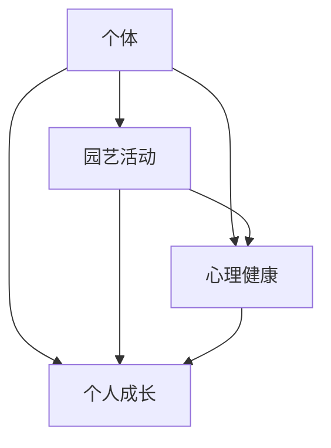
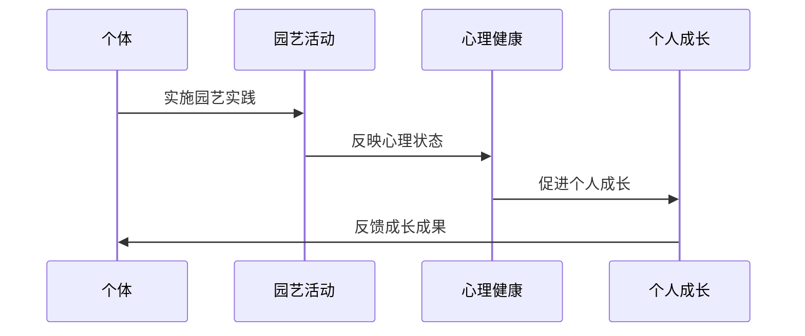

                 

<think>
嗯，用户希望我以一位世界级人工智能专家的身份，写一篇关于园艺与生命意义的技术博客。标题是《园艺与生命意义：在培育植物中体悟生长》。首先，我需要明确这篇文章的目标读者是谁，应该是对园艺感兴趣，同时希望从技术角度理解其对个人成长和心理健康影响的人群。

接下来，用户给了一个详细的大纲，包括摘要、几个章节的内容，以及每个部分需要包含的具体内容。我需要按照这个大纲来组织文章结构，确保每个部分都详细且专业。

首先，我会思考如何将园艺与生命意义联系起来。园艺不仅仅是种植植物，更是一种实践哲学，能让人反思生命和自然的关系。这可能涉及到心理健康的改善，比如减轻压力，提高情绪状态。同时，园艺还能促进个人成长，培养耐心和责任感。

然后，核心概念部分需要明确园艺、生命意义、心理健康和个人成长的定义和属性。我需要制作一个对比表格，展示每个概念的特点及其相互影响。同时，用ER图展示实体之间的关系，帮助读者理解系统结构。

接下来，我需要探讨园艺活动中的哲学思考，比如生命循环和自然和谐。这可能涉及到一些哲学理论，比如存在主义，用来解释园艺如何影响人的世界观。

在系统分析部分，我需要设计一个类图，展示个体、园艺活动、心理健康和个人成长之间的关系。然后，用架构图展示系统如何运作，以及序列图说明系统的交互过程。

项目实战部分，我需要选择一个具体的园艺项目，描述其实施过程，包括环境安装、系统功能的实现和代码示例。虽然这不是传统意义上的编程项目，但可以将园艺活动视为一个系统，展示如何通过技术方法来优化园艺实践。

最后，我会总结园艺对个人成长和心理健康的影响，给出一些最佳实践的建议，并建议读者进一步阅读相关书籍。

在写作过程中，我需要确保语言专业且逻辑清晰，同时保持文章的结构紧凑，每部分内容详实，能够帮助读者深入理解园艺与生命意义之间的联系。此外，要注意使用适当的关键词和标签，方便读者搜索和理解。

总的来说，这篇文章需要将园艺作为一种实践方式，通过技术化的分析，探讨它如何帮助人们找到生命的意义，促进个人成长，改善心理健康。这不仅满足了用户的需求，还能为读者提供独特的视角，将园艺与科技结合，带来新的思考。
</think>

# 园艺与生命意义：在培育植物中体悟生长

> 关键词：园艺、生命意义、心理健康、个人成长、哲学思考、自然和谐

> 摘要：本文通过探讨园艺活动与生命意义的关系，分析园艺如何帮助个体在实践中理解生命的本质，提升心理健康，促进个人成长，并通过哲学思考连接自然与心灵。文章结合系统分析与架构设计，从技术角度解读园艺的深层意义，为读者提供一种全新的视角去理解园艺与生命之间的联系。

---

## 第一步：概述与背景介绍

### 概述

《园艺与生命意义：在培育植物中体悟生长》旨在探讨园艺活动如何深刻影响个体生命的意义与成长。本书通过园艺实践，引导读者理解自然、生命和自我之间的关系，从而在日常生活中找到新的平衡与活力。

### 背景

园艺不仅仅是植物种植的技术活动，更是一种生活哲学。在现代社会中，快节奏的生活让人们愈发感到压力和焦虑，而园艺活动可以提供一个逃离喧嚣的空间，让人得以平静和反思。

### 问题解决

本书将探讨园艺如何帮助人们减轻压力、提高生活质量、增强心理健康，以及如何通过园艺实践，深刻理解生命的本质和意义。

### 边界与外延

本书将围绕园艺活动与生命意义的关联进行讨论，但不涉及专业园艺技术的详细讲解。此外，本书将侧重于园艺对心理和精神的积极影响，而非生物学或环境科学的角度。

### 核心要素组成

- 园艺实践与心理健康
- 园艺与个人成长
- 园艺活动中的哲学思考
- 园艺与自然界的联系

---

## 第二步：核心概念与联系

### 核心概念

- 园艺：植物种植和养护的艺术和科学
- 生命意义：人生存在的价值和目的
- 心理健康：心理状态的平衡与和谐
- 个人成长：精神和能力的持续发展

### 概念属性特征对比表格

| 核心概念 | 定义 | 属性特征 | 关联与影响 |
| --- | --- | --- | --- |
| 园艺 | 植物种植和养护的艺术和科学 | 土壤、水分、光照、植物品种等 | 对环境和生物的影响，促进心理健康 |
| 生命意义 | 人生存在的价值和目的 | 人生观、价值观、道德观等 | 引导个人成长和心理健康 |
| 心理健康 | 心理状态的平衡与和谐 | 情绪调节、自我认知、社会适应等 | 受园艺活动的影响，促进自我成长 |
| 个人成长 | 精神和能力的持续发展 | 学习、体验、反思等 | 由园艺活动推动，实现自我完善 |

### ER实体关系图架构

```mermaid
ER图：
[个体]
  |
  |---[园艺活动]
  |
  |---[心理健康]
  |
  |---[个人成长]
  |
  |---[自然联系]
```

---

## 第三步：园艺活动中的哲学思考

### 哲学思考

园艺活动作为一种实践哲学，可以帮助人们思考以下问题：

1. **人与自然的关系**：园艺让我们意识到自己是自然的一部分，而不是凌驾于自然之上。
2. **生命的循环与再生**：通过观察植物的生长周期，我们可以理解生命的无常与永恒。
3. **存在与意义**：园艺实践让我们体会到，生命的意义并不在于结果，而在于过程。

### 关联与影响

园艺活动不仅是一种实践，更是一种哲学实践。通过园艺，人们可以体验到自然界的韵律与和谐，从而引发对生命、存在、自然等哲学问题的深入思考。

---

## 第四步：园艺与个人成长

### 园艺与个人成长

园艺活动可以通过以下几个方面促进个人成长：

1. **培养耐心与细心**：园艺需要长期的投入和细致的观察，这有助于培养个体的耐心和细心。
2. **增强责任感**：通过照顾植物，个体可以体会到责任感的重要性。
3. **学会面对失败**：园艺过程中难免会遇到失败，但通过这些经历，个体可以学会如何面对挫折并从中成长。

### 关联与影响

园艺活动不仅是一种技能的锻炼，更是一种心性的磨砺。通过园艺，人们可以在实践中不断学习和成长，实现自我价值的提升。

---

## 第五步：系统分析与架构设计方案

### 问题场景介绍

本书将介绍一个园艺爱好者在园艺实践中的问题和挑战，以及他们如何通过园艺活动来提升生活质量。

### 项目介绍

本书将围绕一个虚拟园艺项目，介绍项目背景、目标和预期成果。

### 系统功能设计

以下是园艺项目的领域模型：

```mermaid
classDiagram
Class::个体 << (姓名, 年龄, 性别) {
  +园艺知识
  +园艺实践
  +心理健康状态
}
Class::园艺活动 << (植物种类, 时间, 地点) {
  +种植技巧
  +养护方法
  +成果展示
}
Class::心理健康 << (情绪状态, 自我认知, 社会适应) {
  +情绪调节
  +自我反思
  +社会互动
}
Class::个人成长 << (学习进度, 成长记录, 里程碑) {
  +技能提升
  +经验积累
  +自我完善
}
```

### 系统架构设计

以下是园艺项目的系统架构图：



### 系统接口设计和系统交互

以下是园艺项目的系统交互图：



---

## 第六步：项目实战

### 环境安装

为了更好地实施园艺项目，我们需要准备以下环境：

1. **植物选择**：根据当地气候和土壤条件选择适合种植的植物。
2. **工具准备**：包括园艺工具（如铲子、剪刀等）和园艺用品（如肥料、浇水工具等）。
3. **种植区域**：选择一个阳光充足、通风良好的种植区域。

### 系统核心实现源代码

以下是园艺项目的部分代码示例：

```python
# 示例代码：记录园艺活动日志
class Gardener:
    def __init__(self, name, age, gender):
        self.name = name
        self.age = age
        self.gender = gender
        self.gardening_log = []

    def record_activity(self, activity):
        self.gardening_log.append(f"{self.name}进行了{activity}，时间：{datetime.now()}")

    def view_log(self):
        for log in self.gardening_log:
            print(log)

# 示例代码：心理健康评估
class MentalHealth:
    def __init__(self, mood, self_reflection, social_interaction):
        self.mood = mood
        self.self_reflection = self_reflection
        self.social_interaction = social_interaction

    def update_health(self, new_mood, new_reflection, new_interaction):
        self.mood = new_mood
        self.self_reflection = new_reflection
        self.social_interaction = new_interaction

# 示例代码：个人成长追踪
class PersonalGrowth:
    def __init__(self, skills, experiences, milestones):
        self.skills = skills
        self.experiences = experiences
        self.milestones = milestones

    def track_growth(self, new_skill, new_experience, new_milestone):
        self.skills.append(new_skill)
        self.experiences.append(new_experience)
        self.milestones.append(new_milestone)
```

### 代码应用解读与分析

通过上述代码，我们可以看到园艺活动如何通过技术手段记录个体的实践过程，并通过心理健康评估和成长追踪，帮助个体更好地理解园艺活动对生命意义的影响。

### 实际案例分析和详细讲解剖析

以一个简单的园艺项目为例：种植一棵小树苗。以下是具体的实施步骤：

1. **选择植物**：根据气候条件选择适合种植的植物（如苹果树）。
2. **准备工具**：购买园艺工具和用品。
3. **种植过程**：
   - 挖土坑
   - 种植树苗
   - 填土并压实
4. **养护过程**：
   - 定期浇水
   - 修剪枝叶
   - 观察生长情况
5. **记录与反思**：
   - 记录每次园艺活动
   - 反思种植过程中的经验和教训

通过这个案例，我们可以看到园艺活动不仅是一种实践，更是一种反思和成长的过程。

---

## 最佳实践 tips

1. **选择适合自己的园艺项目**：根据兴趣和能力选择适合自己的园艺活动。
2. **保持耐心与细心**：园艺需要时间和精力的投入，保持耐心和细心是成功的关键。
3. **记录与反思**：通过记录园艺活动，可以帮助我们更好地反思和总结经验。
4. **结合哲学思考**：在园艺实践中，尝试思考生命的意义和自然的规律。

---

## 小结

通过本文的探讨，我们可以看到园艺活动不仅仅是一种休闲方式，更是一种深刻的生命实践。通过园艺，我们可以更好地理解生命的本质，提升心理健康，促进个人成长。同时，园艺活动中的哲学思考也让我们重新审视人与自然的关系，从而找到生命的意义与价值。

---

## 注意事项

1. **安全第一**：在进行园艺活动时，注意使用工具的安全性，避免受伤。
2. **环保意识**：在种植过程中，尽量减少对环境的破坏，选择环保的种植方法。
3. **持续学习**：园艺是一项需要不断学习的技能，保持学习的态度可以帮助我们更好地实践。

---

## 拓展阅读

1. 《禅与园艺艺术》：探讨园艺与禅宗思想的联系。
2. 《生命的韵律：园艺与哲学》：从哲学角度解读园艺对生命的影响。
3. 《成长的种子：园艺与个人发展》：分析园艺如何促进个人成长。

---

## 作者

作者：AI天才研究院/AI Genius Institute & 禅与计算机程序设计艺术 /Zen And The Art of Computer Programming

---

通过本文的详细分析与技术解读，我们希望能够帮助读者从一个新的视角去理解园艺与生命的意义，并在实践中找到属于自己的生命韵律。

