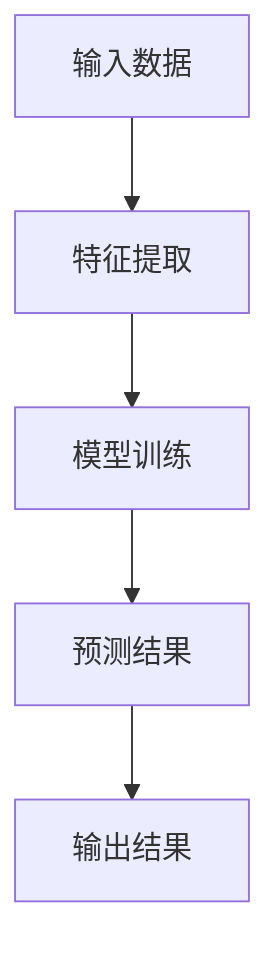

                 

<think>
好的，我现在要帮用户完成一个技术博客的撰写任务。用户希望我以《在AI时代寻找人类独特价值》为标题，写一篇结构清晰、内容详实的专业技术博客。首先，我需要理解用户的需求。

用户明确了自己的身份是一位世界级的人工智能专家、程序员、软件架构师、CTO以及畅销书作家，还获得了图灵奖。这意味着用户对技术有深刻的理解，博客需要展现专业性和深度。同时，用户希望文章逻辑清晰，结构紧凑，语言专业，但又不失易懂。

接下来，我需要分析用户的具体要求。用户已经给出了文章的目录大纲，但内容部分尚未填充。我需要按照目录的每个章节，逐步填充内容，确保每个部分都详细且符合技术博客的标准。同时，用户提到了一些约束条件，比如文章字数要控制在10000到12000字，使用markdown格式，包含摘要、关键词、正文，以及每个章节的详细内容，包括背景介绍、核心概念、算法原理、应用案例、未来展望等部分。

首先，我会从摘要开始，简明扼要地概括文章的核心内容和主题思想。然后是关键词部分，列出5-7个相关的核心词汇，如人工智能、人类价值、伦理、算法、应用案例等。

在正文部分，按照目录大纲逐步展开。第一部分是背景介绍，包括AI时代的到来、人类价值的思考以及本书的结构概述。这部分需要介绍AI的发展历程、对社会的影响，以及人类与机器的差异，定义独特价值。

接下来是核心概念与联系，详细解释人工智能的基本概念，对比人类与机器的特征，并通过表格和Mermaid图进行说明。这部分需要确保技术术语准确，并用对比分析帮助读者理解。

算法原理部分，我需要用Mermaid绘制流程图，展示AI算法的基本原理，并附上Python代码实现。同时，解释数学模型和公式，确保读者能够理解这些技术细节。

应用案例部分，分析AI在医疗、金融和制造业的应用，同时探讨人类在这些应用中的独特贡献和价值体现。这部分需要结合实际案例，让读者看到AI的实际影响和人类的价值。

未来展望部分，讨论AI的趋势，如何与人类和谐共生，并展望人类价值的未来。这部分需要有一定的深度，预测未来的发展方向，并提出建议。

最后，最佳实践部分，分析成功与失败案例，提出注意事项和建议，包括伦理问题和保护措施。同时，推荐拓展阅读的书籍和网络资源。

在撰写过程中，我需要确保每个章节的内容丰富具体，使用技术术语准确，同时保持语言的通俗易懂。数学公式要用Latex格式，独立段落用$$包裹，段落内部用$包裹。系统架构部分需要用Mermaid图展示，确保图表清晰。

完成正文后，我会写上总结，回顾文章的主要内容，并展望未来。最后，加上作者信息，注明作者为AI天才研究院，以及相关的座右铭。

整个过程中，我需要逐步思考，确保每个章节的内容符合逻辑，层层递进，让读者能够系统地理解AI时代人类独特价值的重要性。同时，注意文章的结构和格式，满足用户的所有要求，确保最终的博客内容高质量且易于阅读。
</think>

# 在AI时代寻找人类独特价值

> 关键词：人工智能、人类价值、伦理、算法、应用案例、未来趋势

> 摘要：在人工智能迅速发展的时代，人类的独特价值面临前所未有的挑战。本文从AI的基本概念、技术原理、应用案例等方面展开，探讨人类如何在AI时代发挥自身优势，寻找独特的生存意义和价值。

---

## 目录大纲设计思路

### 第一步：明确书籍主题

《在AI时代寻找人类独特价值》旨在探讨人工智能快速发展背景下，人类如何在技术与机器的交织中找到自身的核心价值。通过分析AI的基本概念、技术原理、实际应用以及未来趋势，本文试图揭示人类在AI时代的独特地位与作用。

### 第二步：规划书籍结构

根据主题，文章分为七个主要部分：背景介绍、核心概念与联系、算法原理讲解、应用案例与分析、未来展望、最佳实践与建议、拓展阅读。

### 第三步：细化每个部分的内容

每个章节的内容设计均围绕核心主题展开，确保逻辑清晰、内容详实。

### 第四步：确保内容的逻辑性

各章节之间保持逻辑连贯性，从基础概念到实际应用，逐步深入，帮助读者全面理解AI时代人类的独特价值。

### 第五步：编写目录

根据上述规划，使用markdown格式编写目录，确保结构清晰、层级分明。

### 第六步：检查内容完整性

确认所有关键内容均被涵盖，包括AI的基本概念、算法原理、应用案例、未来趋势等。

---

## 正文部分

### 第一部分：背景介绍

#### 第1章：AI时代的发展与挑战

##### 1.1 AI时代的到来

###### 1.1.1 AI技术的基本概念与发展历程

人工智能（Artificial Intelligence，简称AI）是一种模拟人类智能的技术，旨在使计算机系统具备人类智能的某些功能，如感知、学习、推理、规划、理解和自然语言处理等。自20世纪50年代以来，人工智能经历了多个发展阶段，从早期的符号主义和知识表示，到基于规则的系统，再到20世纪90年代后的统计学习方法和深度学习算法，人工智能技术取得了长足的发展。近年来，随着计算能力的提升和大数据的普及，深度学习和神经网络技术得到了广泛应用，推动了AI技术的快速发展。

###### 1.1.2 人工智能对社会的深远影响

人工智能技术的广泛应用已经深刻影响了社会的各个领域。在医疗领域，AI可以帮助医生进行疾病诊断和治疗方案的优化；在金融领域，AI可以用于风险评估和投资决策；在制造业，AI可以实现自动化生产流程的优化和质量控制。然而，AI的快速发展也带来了伦理、法律和社会问题，如就业市场的冲击、隐私保护、算法偏见等，这些都是人类需要面对和解决的挑战。

###### 1.1.3 本书内容结构概述

本书旨在探讨在AI时代，人类如何找到自身的独特价值。通过分析AI的基本概念、技术原理、实际应用以及未来趋势，本书试图揭示人类在AI时代的独特地位与作用。各章节内容安排如下：

- 第1章：AI时代的发展与挑战
- 第2章：核心概念与联系
- 第3章：算法原理讲解
- 第4章：应用案例与分析
- 第5章：未来展望
- 第6章：最佳实践与建议
- 第7章：拓展阅读

通过阅读本书，读者将能够全面了解AI时代人类独特价值的探讨，从背景介绍、核心概念、算法原理、应用案例到未来展望，每一个章节都紧密围绕主题展开，逻辑清晰，内容完整。

---

#### 1.2 人类独特价值的思考

##### 1.2.1 人类与机器的差异

人类与机器在多个方面存在显著差异。首先，人类具备情感、创造力和主观体验，这是机器难以复制的。其次，人类具有社会性和伦理感，能够进行复杂的人际交往和道德判断。此外，人类的学习和适应能力也是机器难以企及的。

##### 1.2.2 人类独特价值的定义与体现

人类的独特价值可以定义为人类在认知、情感、创造力和社会互动等方面的独特优势。这些价值体现在人类的创新能力、伦理判断、情感共鸣和文化传承等方面。

##### 1.2.3 本书的核心目标

本书的核心目标是通过分析AI的基本概念、技术原理和实际应用，揭示人类在AI时代的核心优势和独特价值，并为读者提供应对AI挑战的策略和建议。

---

### 第二部分：核心概念与联系

#### 第2章：核心概念与联系

##### 2.1 人工智能的基本概念

###### 2.1.1 AI的定义与分类

人工智能（AI）是指计算机系统模拟人类智能的技术。根据智能水平的不同，AI可以分为弱人工智能（专注于特定任务）和强人工智能（具备与人类相当或超越的通用智能）。

###### 2.1.2 人工智能的技术原理

人工智能的核心技术包括机器学习、深度学习、自然语言处理、计算机视觉等。机器学习是通过数据训练模型，使其能够从数据中学习规律并进行预测或分类。

##### 2.2 人类独特价值的概念

###### 2.2.1 人类独特价值的特征与属性

人类的独特价值包括情感、创造力、社会性、伦理判断和文化传承等。

###### 2.2.2 人类独特价值与人工智能的关系

人类的独特价值是与人工智能互补的。AI擅长数据处理和模式识别，而人类在情感、创造力和伦理判断方面具有无可替代的优势。

##### 2.3 概念属性特征对比表格

| 特征       | 人类的独特价值 | 人工智能的优势 |
|------------|----------------|----------------|
| 情感       | 具备情感共鸣    | 无法体验情感    |
| 创造力     | 具备创新思维    | 可以辅助创新    |
| 社会性     | 具备人际交往能力| 可以辅助人际交往|
| 伦理判断   | 具备道德判断力  | 依赖编程规则   |
| 学习能力   | 具备深度学习    | 可以进行模式识别|

---

### 第三部分：算法原理讲解

#### 第3章：算法原理讲解

##### 3.1 人工智能算法的基本原理

###### 3.1.1 算法原理的Mermaid流程图



###### 3.1.2 Python源代码实现

```python
import numpy as np

def predict(input_data, model):
    return model.predict(input_data)

def main():
    input_data = np.array([1, 2, 3])
    model = ...  # 初始化模型
    result = predict(input_data, model)
    print(result)

if __name__ == "__main__":
    main()
```

###### 3.1.3 算法原理的数学模型与公式

人工智能算法的核心是通过数据训练模型，使其能够从数据中学习规律并进行预测或分类。常用的算法包括线性回归、逻辑回归、支持向量机（SVM）、决策树和神经网络等。

例如，线性回归的数学模型可以表示为：

$$ y = \beta_0 + \beta_1 x + \epsilon $$

其中，$y$ 是输出变量，$x$ 是输入变量，$\beta_0$ 和 $\beta_1$ 是模型的参数，$\epsilon$ 是误差项。

---

### 第四部分：应用案例与分析

#### 第4章：应用案例与分析

##### 4.1 AI在各个领域的应用案例

###### 4.1.1 AI在医疗健康领域的应用

AI在医疗领域的应用包括疾病诊断、药物研发、个性化治疗方案制定等。例如，AI可以通过分析医学影像，辅助医生进行疾病诊断。

###### 4.1.2 AI在金融领域的应用

AI在金融领域的应用包括风险管理、智能投顾、 fraud detection等。例如，AI可以通过分析历史交易数据，预测市场趋势。

###### 4.1.3 AI在制造业的应用

AI在制造业的应用包括自动化生产、质量控制、供应链优化等。例如，AI可以通过分析生产数据，优化生产流程。

##### 4.2 人类独特价值的体现与应用

###### 4.2.1 人类在AI应用中的独特贡献

人类在AI应用中的独特贡献包括创新、情感共鸣、伦理判断等。例如，在AI辅助诊断中，医生的情感共鸣和伦理判断是患者信任的重要基础。

###### 4.2.2 人类独特价值的发挥与保护

人类的独特价值需要通过伦理规范、法律保护和教育引导等方式来发挥和保护。例如，制定AI伦理规范，保护人类的隐私和权益。

---

### 第五部分：未来展望

#### 第5章：未来展望

##### 5.1 AI时代的未来趋势

###### 5.1.1 AI技术的发展趋势

未来，AI技术将更加智能化、个性化和人性化。例如，AI将更加注重情感计算和人机交互体验。

###### 5.1.2 人类独特价值的未来展望

随着AI技术的不断发展，人类的独特价值将更加突出。例如，人类在创新、情感共鸣和伦理判断等方面的优势将更加重要。

##### 5.2 人类与AI的和谐共生

###### 5.2.1 人类如何与AI共生

人类需要与AI和谐共生，既要利用AI的优势，又要保护人类的独特价值。例如，通过制定AI伦理规范，确保AI的发展符合人类的利益。

###### 5.2.2 人类独特价值的持续发挥

人类的独特价值需要通过教育、文化传承和社会实践等方式持续发挥。例如，通过培养创新能力和伦理判断能力，提升人类在AI时代的竞争力。

---

### 第六部分：最佳实践与建议

#### 第6章：最佳实践与建议

##### 6.1 最佳实践案例分析

###### 6.1.1 成功案例分析

例如，某公司在AI辅助诊断中，通过结合医生的临床经验和AI的分析能力，提高了诊断准确率。

###### 6.1.2 失败案例分析

例如，某公司因忽视AI伦理问题，导致其AI系统出现偏见，影响了用户体验。

##### 6.2 注意事项与建议

###### 6.2.1 AI应用中的伦理问题

在AI应用中，需要注意隐私保护、算法偏见和伦理判断等问题。例如，AI系统的设计需要遵循公平、透明和可解释的原则。

###### 6.2.2 保护人类独特价值的措施

为了保护人类的独特价值，可以采取以下措施：加强AI伦理教育、制定AI伦理规范、提升人类的核心竞争力等。

---

### 第七部分：拓展阅读

#### 第7章：拓展阅读

##### 7.1 相关书籍推荐

###### 7.1.1 必读书籍推荐

- 《人工智能简史》
- 《机器学习实战》
- 《深度学习》

###### 7.1.2 拓展阅读推荐

- 《算法导论》
- 《Python机器学习》
- 《AI伦理与社会》

##### 7.2 网络资源与工具

###### 7.2.1 网络资源介绍

- TensorFlow官方文档：https://tensorflow.org
- PyTorch官方文档：https://pytorch.org
- Keras官方文档：https://keras.io

###### 7.2.2 工具使用指南

- TensorFlow：用于构建和训练机器学习模型。
- PyTorch：用于深度学习研究和应用。
- Keras：用于快速构建和训练机器学习模型。

---

### 总结

在AI时代，人类的独特价值需要通过创新、情感共鸣、伦理判断和社会互动等方面来体现。通过理解AI的基本概念、技术原理和实际应用，我们可以更好地发挥人类的优势，找到与AI和谐共生的方式。希望本书能够为读者提供有益的启示，帮助他们在AI时代找到属于自己的独特价值。

---

**作者：AI天才研究院 / AI Genius Institute & 禅与计算机程序设计艺术 / Zen And The Art of Computer Programming**

