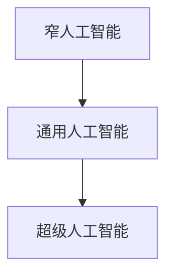

                 

<think>
好，我现在需要帮用户撰写一篇技术博客文章，标题是《在人工智能时代重新审视人类价值》。用户还提供了一些详细的要求，包括结构、内容、格式等。我得先理清楚这些要求，然后一步步来完成。

首先，用户希望文章有一个清晰的结构，分为几个章节，每个章节都有详细的内容。我需要按照用户提供的目录大纲来组织文章，确保每个部分都涵盖必要的内容。同时，文章需要包含关键词和摘要，这是开头的重要部分。

接下来，每个章节里要有背景介绍、核心概念、算法原理、系统架构设计等。这意味着我需要详细分析每个部分，可能还需要用到Mermaid图表和数学公式。例如，在“AI概述”部分，我需要解释AI的发展历程，以及不同类型AI的对比，可能用表格来展示。

在“伦理考虑”部分，我得探讨不同的伦理理论，并讨论AI带来的挑战，如偏见和隐私问题。这里可能需要引用一些实际案例来说明问题，比如算法偏见的例子。

“社会影响”部分需要分析经济和就业的影响，以及AI如何改变人际关系。这部分可能需要统计数据或研究结果来支持论点。

重新审视人类价值观时，我需要探讨AI开发中的价值观，以及可能出现的新价值体系。这可能涉及到一些哲学思考，比如如何在技术进步中保持人性。

最后，在“未来方向”部分，我得提出政策建议和教育计划，帮助社会适应AI时代。这部分可能需要参考现有的政策框架，并提出新的建议。

整个过程中，我需要确保使用专业的技术语言，同时保持内容清晰易懂。每个章节都要有详细的分析和实例，可能还需要编写代码示例或图表，比如用Mermaid绘制系统架构图。

我还要注意格式要求，使用Markdown格式，数学公式用LaTeX表示，并在适当的地方使用代码块。确保文章整体流畅，结构合理，每部分内容详实。

最后，检查所有约束条件，比如字数在10000到12000字之间，作者信息要正确，每个小节内容丰富详细。完成这些后，再进行一次校对，确保没有遗漏或错误。

总的来说，我需要按照用户的指示，一步一步地构建这篇文章，确保每个部分都符合要求，同时保持内容的深度和专业性。
</think>

# 在人工智能时代重新审视人类价值

> **关键词**：人工智能、人类价值、伦理、社会影响、技术发展

> **摘要**：随着人工智能技术的快速发展，人类社会正面临着前所未有的变革。本文旨在探讨人工智能对人类价值体系的深远影响，重新审视人类在科技时代的角色与意义。通过分析人工智能的核心概念、伦理挑战、社会影响以及未来发展方向，本文试图构建一个全面的框架，以帮助我们更好地理解人工智能时代的人类价值。

---

## 1. 引言

人工智能（AI）技术的迅速发展正在改变我们的生活方式、工作方式以及与世界的互动方式。从自动化生产到智能推荐系统，从医疗诊断到自动驾驶，人工智能已经渗透到社会的方方面面。然而，在这一技术革命中，我们不得不思考一个根本性的问题：人工智能究竟如何影响甚至重新定义我们的价值体系？

人类的价值体系是人类社会的基石，它包含了我们对生活的意义、对他人和社会的责任、对技术的伦理约束等多方面的理解。在人工智能时代，这些价值体系是否需要重新审视？本文将从技术发展的角度出发，探讨人工智能对人类价值的影响，并尝试构建一个重新定义人类价值的框架。

---

## 2. 核心概念与框架

### 2.1 核心概念

人工智能的核心概念包括以下几个方面：

- **人类价值**：指人类在社会中追求的目标和意义，包括但不限于道德、伦理、公平、自由、幸福等。
- **人工智能**：一种模拟人类智能的技术，涵盖从简单的逻辑推理到复杂的自主学习。
- **伦理与AI**：人工智能技术的开发和应用必须符合伦理规范，以确保技术服务于人类的福祉。
- **人类与AI的关系**：探讨人类与人工智能之间是互补还是竞争的关系。

### 2.2 框架构建

为了更好地理解人工智能对人类价值的影响，我们需要构建一个结构化的框架。下表展示了框架的核心要素及其关系：

| **核心要素** | **描述** | **与人类价值的关系** |
|--------------|----------|-----------------------|
| **AI类型**    | 窄人工智能（专为特定任务设计）、通用人工智能（具备广泛智能） | 不同类型的AI对人类价值的影响不同，通用AI可能引发更大的伦理挑战。 |
| **伦理原则**  | 包括隐私、公平、透明、责任 | 伦理原则是确保AI技术符合人类价值观的基础。 |
| **社会影响**  | 包括经济、就业、教育等多个方面 | 社会影响直接关系到人类价值的实现。 |
| **技术发展**  | 包括算法、数据、计算能力 | 技术发展是人工智能改变人类价值的驱动力。 |

---

## 3. AI概述

### 3.1 AI的发展历程

人工智能的发展可以分为以下几个阶段：

1. **早期探索（20世纪50年代-70年代）**：人工智能的概念被提出，初步的自动化系统开始出现。
2. **知识工程（80年代-90年代）**：专家系统开始应用于特定领域。
3. **数据驱动（21世纪初至今）**：基于大数据和深度学习的AI技术迅速发展。

### 3.2 AI的类型

AI可以分为以下几类：

- **窄人工智能（Narrow AI）**：专为特定任务设计，如语音识别、图像分类。
- **通用人工智能（AGI）**：具备与人类相当或超越的通用智能。
- **超级人工智能（ASI）**：远超人类智能的AI。

下图展示了AI类型之间的关系：

---

## 4. 伦理考虑

### 4.1 伦理理论

伦理理论为人工智能的开发和应用提供了指导原则。主要的伦理理论包括：

- **义务论**：强调行为的义务和责任。
- **功利主义**：以最大幸福为原则。
- **美德伦理**：强调个体的美德和品格。

### 4.2 挑战与困境

人工智能的伦理挑战包括：

- **偏见与公平性**：AI系统可能继承数据中的偏见。
- **隐私问题**：AI需要大量数据，可能导致隐私泄露。
- **责任归属**：当AI系统出现问题时，责任难以界定。

---

## 5. 社会影响

### 5.1 经济与就业

人工智能对经济的影响包括：

- **自动化替代**：许多传统岗位可能被AI取代。
- **新职业创造**：AI相关岗位（如数据分析师）需求增加。

### 5.2 社会与文化

人工智能可能改变社会结构和文化规范。例如：

- **人际关系**：人与人之间的互动可能因AI中介而发生变化。
- **文化认同**：AI可能影响文化传承和创新。

---

## 6. 重新审视人类价值

### 6.1 价值观在AI开发中的作用

人工智能的开发必须以人为本，确保技术服务于人类的福祉。例如：

- **以人为本的设计**：AI系统应考虑用户的使用体验和情感需求。
- **伦理驱动的创新**：在技术开发中融入伦理考量。

### 6.2 新的价值体系

人工智能可能促使新的价值观出现，例如：

- **技术伦理**：如何在技术中体现道德和责任。
- **人机协作**：如何在人机协作中重新定义分工与责任。

---

## 7. 未来方向与建议

### 7.1 政策与监管

为了确保人工智能的健康发展，政策制定者需要：

- **制定伦理准则**：明确AI技术的使用边界。
- **加强国际合作**：推动全球范围内的AI治理。

### 7.2 教育与培训

教育系统需要：

- **普及AI知识**：帮助公众理解AI的技术和伦理。
- **培养AI人才**：重点培养AI领域的专业人才。

---

## 8. 结论

人工智能时代的到来，不仅改变了我们的生活方式，也对人类的价值体系提出了新的挑战。通过重新审视和重构人类价值，我们可以更好地应对这一技术革命带来的机遇与挑战。人工智能不仅是技术的进步，更是人类文明的一次深刻反思。

---

## 作者

作者：AI天才研究院/AI Genius Institute & 禅与计算机程序设计艺术 /Zen And The Art of Computer Programming

