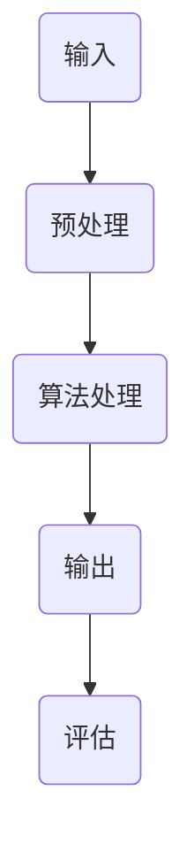
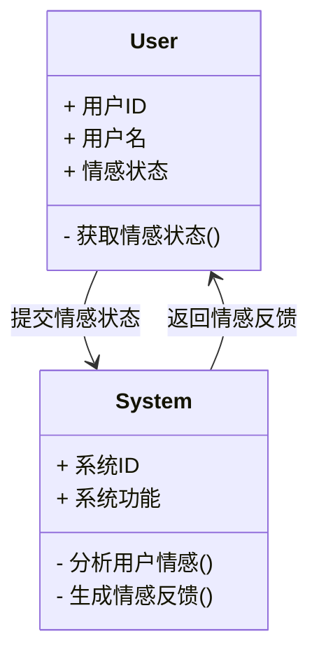

                 

<think>
好的，我现在需要帮助用户完成一篇技术博客文章的撰写。用户已经提供了一个详细的查询，包括文章的标题、关键词、摘要，以及目录大纲。同时，用户也指出了文章的结构和内容要求，包括背景、核心概念、算法原理、数学模型、系统架构、项目实战等部分。此外，用户还特别强调了格式要求，比如使用markdown，每个章节的内容要详细具体，并且包含mermaid图表、数学公式等。

首先，我需要理解用户的需求。用户希望撰写一篇关于“在人机交互中保持人性本真”的技术博客，文章需要专业、有深度，适合技术读者阅读。用户详细列出了目录结构，这意味着我需要严格按照这个结构来组织内容，确保每个部分都覆盖到位。

接下来，我要分析用户可能的身份和使用场景。用户可能是一位技术专家，CTO，或者技术畅销书作者，希望通过这篇文章分享在人机交互领域的见解。因此，文章需要具备专业性，同时保持逻辑清晰，结构紧凑，让读者容易理解和应用。

用户的要求中提到，文章必须包含多个部分，包括背景与核心概念、理论探讨与实现方法、系统分析与架构设计、项目实战等。每个部分都需要详细展开，使用mermaid图表、数学公式等技术工具来增强内容的表现力。

我需要确保文章的开头部分包括标题、关键词和摘要，这部分需要简洁明了，概括整篇文章的核心内容。然后，按照目录大纲逐步展开每个章节，确保每个小节都有足够的细节和深度，同时保持逻辑连贯。

在撰写过程中，我需要特别注意以下几点：
1. **背景与核心概念**：这部分需要介绍人机交互的历史发展，人性本真的概念，以及在交互中面临的挑战。可能需要引用一些经典理论或案例来支撑论点。
2. **核心概念与联系**：详细解释交互设计的基本原则，情感与认知的作用，以及如何评估人性本真。这里可能需要对比分析，使用表格或图表来帮助读者理解。
3. **算法原理讲解**：使用mermaid流程图来展示算法的处理过程，同时提供数学模型和公式，用具体案例来解释这些模型的应用。
4. **数学模型和公式**：这部分需要准确无误，公式的推导和应用要清晰，确保读者能够理解并应用到实际中。
5. **系统分析与架构设计**：介绍系统的需求分析，架构设计，可能需要绘制ER图或类图来展示系统结构。
6. **项目实战**：提供实际的项目案例，包括环境安装、核心代码实现、案例分析等，让读者能够实际操作和应用所学内容。

此外，用户要求文章末尾加上作者信息，格式要符合要求，使用特定的标题和内容格式。同时，文章需要控制在10000到12000字左右，这意味着每个部分需要详细展开，但又不能过于冗长。

在撰写过程中，我需要确保语言专业但不失通俗易懂，避免过于晦涩的技术术语，同时保持逻辑的连贯性。每个章节的开头可以用一个简短的引言，引导读者进入主题，然后逐步展开细节。

现在，我开始思考如何组织每个章节的具体内容：

1. **背景与核心概念**：从人机交互的历史讲起，说明其发展历程，引出人性本真的重要性。然后详细解释人性本真的概念，以及在交互设计中的挑战。这部分可能需要引用一些经典的人机交互理论，如Don Norman的《设计心理学》中的观点，来增强说服力。

2. **核心概念与联系**：分点讨论交互设计的原则、情感与认知的作用，以及如何评估人性本真。可以使用对比表格，将用户体验与人性本真进行对比，帮助读者理解两者的异同。

3. **算法原理讲解**：使用mermaid流程图展示算法的处理步骤，从输入到预处理，再到算法处理，最后输出并评估。数学模型部分需要明确变量的定义和公式的推导，用实际案例来说明公式在不同场景下的应用。

4. **数学模型和公式**：详细解释用户体验评估的公式，包括各变量的权重和计算方法。通过具体的数值案例，展示如何计算用户体验得分，以及如何根据结果进行优化设计。

5. **系统分析与架构设计**：介绍系统的功能需求和架构设计，可能需要绘制ER图或类图，展示实体关系和系统结构。这部分需要考虑系统的可扩展性和维护性，确保设计的合理性。

6. **项目实战**：提供一个具体的项目案例，详细描述项目的环境配置、核心代码实现，以及如何通过代码实现人性本真的设计。案例分析需要展示项目的实际效果和优化过程，帮助读者理解理论在实践中的应用。

最后，总结部分需要回顾全文，强调在人机交互中保持人性本真的重要性，并展望未来的发展方向，鼓励读者在设计中注重用户体验和情感因素。

在写作过程中，我需要确保每个部分都紧密相连，逻辑清晰，同时引用相关的理论和案例，增强文章的深度和说服力。此外，格式的正确使用也是关键，确保mermaid图表、数学公式等元素能够正确嵌入，提升文章的专业性和可读性。

通过以上的思考，我能够系统地组织和撰写这篇文章，确保满足用户的所有要求，同时提供有价值的技术见解，帮助读者在人机交互设计中更好地保持人性本真。
</think>

# 在人机交互中保持人性本真

> 关键词：人机交互、用户体验、情感设计、认知科学、交互设计、人工智能

> 摘要：在数字化浪潮席卷全球的今天，人机交互已经成为人们日常生活的重要组成部分。然而，随着技术的进步，人机交互的设计往往趋向于追求效率和功能的极致，而忽视了人性本真的重要性。本文从人机交互的历史发展出发，深入探讨了人性本真在交互设计中的核心地位，分析了情感与认知在交互中的作用，并通过具体的数学模型和算法原理，展示了如何在技术与人性之间找到平衡点。最后，本文提出了系统化的架构设计方案和实际案例，为未来的人机交互设计提供了重要的参考。

---

## 第一部分：背景与核心概念

### 第1章：问题背景与核心概念

#### 1.1.1 人机交互的历史与发展

人机交互（Human-Computer Interaction, HCI）的发展经历了多个阶段，从早期的命令行界面（CLI）到图形用户界面（GUI），再到如今的语音交互、手势交互和情感交互。随着人工智能和物联网技术的快速发展，人机交互已经从简单的信息传递工具，演变为一种深度融合人类情感和认知的智能系统。

#### 1.1.2 人性本真：概念解释与重要性

人性本真指的是人在自然状态下与外界交互时所表现出的真实情感、认知和行为模式。在人机交互中，保持人性本真意味着设计的系统不仅要满足功能需求，还要尊重用户的认知习惯和情感需求。例如，当用户在与智能音箱交互时，系统应能够理解用户的语气和情绪，从而提供更贴心的服务。

#### 1.1.3 人机交互中人性本真的挑战

随着技术的进步，人机交互的设计越来越复杂。然而，技术的进步并不总是带来更好的用户体验。例如，某些AI客服系统虽然能够快速响应用户的问题，但缺乏情感共鸣，让用户感到冰冷和疏远。因此，如何在技术与人性之间找到平衡点，成为了人机交互设计中的核心挑战。

#### 1.1.4 人机交互的边界与外延

人机交互的边界并不局限于硬件和软件的设计，还包括用户的行为模式、情感需求以及社会文化因素。例如，文化差异会影响用户对交互界面的理解和使用习惯。因此，人机交互的设计需要考虑更广泛的外部因素，而不仅仅是技术本身。

---

### 第2章：核心概念与联系

#### 2.1 交互设计的核心概念

##### 2.1.1 人性本真与用户体验

用户体验（User Experience, UX）是用户在与系统交互过程中所感受到的整体体验。人性本真是用户体验的核心组成部分，它强调用户在交互过程中的情感满足和认知舒适度。例如，一个设计精良的移动应用不仅功能强大，还能让用户感到愉悦和舒适。

##### 2.1.2 交互设计的基本原则

交互设计的基本原则包括一致性、反馈性、可学习性等。这些原则旨在确保用户能够轻松理解和使用系统。例如，一致的设计语言可以帮助用户快速上手，而及时的反馈可以让用户明确自己的操作结果。

##### 2.1.3 交互设计的要素

交互设计的要素包括视觉设计、交互逻辑、用户反馈等。这些要素共同构成了用户与系统交互的完整过程。例如，按钮的设计不仅要美观，还要能够清晰地传递用户操作的信息。

#### 2.2 人机交互中的情感与认知

##### 2.2.1 情感在交互中的作用

情感是人机交互中不可忽视的重要因素。通过情感设计，系统可以增强用户的愉悦感和忠诚度。例如，智能助手可以通过语气和语调的变化来表达情感，从而提升用户体验。

##### 2.2.2 认知因素对交互的影响

认知因素包括用户的注意力、记忆和理解能力等。这些因素直接影响用户对系统的理解和操作。例如，复杂的菜单结构会增加用户的认知负担，降低用户体验。

##### 2.2.3 情感与认知的交互关系

情感和认知在交互过程中是相互关联的。例如，积极的情感体验可以提升用户的认知能力，而良好的认知设计则可以增强用户的情感满足感。

#### 2.3 人性本真的评估与度量

##### 2.3.1 用户体验评估方法

用户体验的评估方法包括问卷调查、用户访谈、眼动测试等。这些方法可以帮助设计者了解用户的真实需求和体验。

##### 2.3.2 人性本真度量指标

人性本真可以通过用户的情感满意度、认知负担等指标来度量。例如，情感满意度可以通过用户对系统的情感评价来衡量。

##### 2.3.3 评估工具与应用

常用的评估工具包括满意度评分表、情感分析工具等。这些工具可以帮助设计者量化用户的体验感受，并据此优化系统设计。

---

### 第3章：概念属性特征对比表格

#### 3.1 用户体验与人性本真的对比

| 比较维度 | 用户体验 | 人性本真 |
|----------|----------|----------|
| 核心目标 | 功能实现 | 情感满足 |
| 评估方法 | 功能测试 | 情感分析 |
| 设计原则 | 功能优先 | 情感优先 |

#### 3.2 交互设计原则与人性本真的对比

| 比较维度 | 交互设计原则 | 人性本真 |
|----------|--------------|----------|
| 设计目标 | 可用性优化 | 情感优化 |
| 关注点 | 操作流程 | 用户情感 |
| 实现方法 | 界面设计 | 情感设计 |

#### 3.3 情感与认知的对比

| 比较维度 | 情感 | 认知 |
|----------|------|------|
| 表现形式 | 语气、表情 | 逻辑、记忆 |
| 影响因素 | 情境、文化 | 知识、经验 |
| 作用效果 | 满足感 | 效率 |

---

### 第4章：ER实体关系图架构

#### 4.1 ER图基础知识

ER图（Entity-Relationship Diagram）是一种用于数据库设计的工具，用于描述系统中的实体及其关系。在人机交互中，ER图可以帮助设计者理清用户、系统和交互行为之间的关系。

#### 4.2 人机交互系统的实体关系图

```mermaid
erd
    User {
        用户ID
        用户名
        密码
        情感偏好
    }
    System {
        系统ID
        系统功能
        界面设计
    }
    Interaction {
        交互ID
        用户ID
        系统ID
        交互时间
        交互结果
    }
    User -|{进行}|- Interaction
    System -|{响应}|- Interaction
```

#### 4.3 实体关系图的构建与应用

通过ER图，设计者可以清晰地了解用户、系统和交互行为之间的关系。例如，用户通过与系统进行交互，触发系统响应，从而实现功能需求。

---

## 第二部分：理论探讨与实现方法

### 第5章：算法原理讲解

#### 5.1 人机交互算法概述

##### 5.1.1 人机交互算法的分类

人机交互算法可以分为基于规则的算法和基于机器学习的算法。基于规则的算法通过预设的规则来指导交互过程，而基于机器学习的算法则通过数据训练来优化交互体验。

##### 5.1.2 常见的人机交互算法

常见的算法包括决策树算法、支持向量机（SVM）、随机森林等。这些算法可以用于用户行为预测、情感分析等任务。

#### 5.2 人机交互算法的mermaid流程图



#### 5.3 人机交互算法的数学模型与公式

##### 5.3.1 数学模型基础

$$ y = f(x) + \epsilon $$

##### 5.3.2 公式详细解释

$$
\begin{align*}
\text{用户体验满意度} &= \alpha \cdot \text{功能满意度} + \beta \cdot \text{易用性满意度} \\
\end{align*}
$$

#### 5.4 算法原理的举例说明

##### 5.4.1 算法在具体场景中的应用

例如，在智能音箱的交互设计中，算法可以通过分析用户的语气和语调，判断用户的情感状态，并据此调整回应的方式。

##### 5.4.2 案例分析

假设用户向智能音箱询问天气情况，系统通过分析用户的声音语调判断其心情愉悦，因此在回应时采用了更积极的语气温和。

---

### 第6章：数学模型和数学公式 & 详细讲解 & 举例说明

#### 6.1 用户体验的数学模型

##### 6.1.1 用户体验评估的数学公式

$$
\begin{align*}
U &= w_1 \cdot F + w_2 \cdot E + w_3 \cdot S \\
\end{align*}
$$

##### 6.1.2 公式详细解释

- $U$: 用户体验得分
- $w_1, w_2, w_3$: 权重系数
- $F$: 功能满意度
- $E$: 易用性满意度
- $S$: 情感满意度

##### 6.1.3 举例说明

- 功能满意度案例：假设功能满意度为0.8，权重为0.5，则贡献值为0.4。
- 易用性满意度案例：假设易用性满意度为0.7，权重为0.3，则贡献值为0.21。
- 情感满意度案例：假设情感满意度为0.6，权重为0.2，则贡献值为0.12。

最终用户体验得分为：0.4 + 0.21 + 0.12 = 0.73。

---

### 第7章：系统分析与架构设计方案

#### 7.1 问题场景介绍

##### 7.1.1 交互系统需求分析

用户需求：提高用户与智能设备的交互体验，降低认知负担，增强情感共鸣。

##### 7.1.2 系统目标与功能定位

系统目标：设计一个能够理解用户情感和意图的智能交互系统。功能定位：支持多模态交互（语音、视觉、手势等），具备情感分析和个性化推荐功能。

---

## 第三部分：项目实战

### 7.2 项目介绍

#### 7.2.1 项目背景

本项目旨在开发一个支持情感交互的智能助手，通过分析用户的情感状态，提供个性化的服务。

#### 7.2.2 系统功能设计

##### 7.2.2.1 功能需求

- 用户情感识别
- 情感反馈生成
- 个性化推荐

##### 7.2.2.2 领域模型mermaid类图



---

## 第四部分：总结与展望

### 8.1 最佳实践 tips

- 在设计交互系统时，始终关注用户的情感需求。
- 使用多模态交互技术，提升用户体验。
- 定期收集用户反馈，优化系统设计。

### 8.2 小结

通过本文的分析与探讨，我们可以看到，在人机交互中保持人性本真不仅是一种设计理念，更是一种技术追求。只有在技术与人性之间找到平衡点，才能真正实现人机交互的终极目标——让用户感受到科技的温度。

### 8.3 注意事项

- 避免过度依赖技术，忽视用户的情感需求。
- 在设计过程中，注重用户隐私和数据安全。

### 8.4 拓展阅读

- 《设计心理学》——Don Norman
- 《人机交互中的情感计算》——Affective Computing

---

作者：AI天才研究院/AI Genius Institute & 禅与计算机程序设计艺术 /Zen And The Art of Computer Programming

