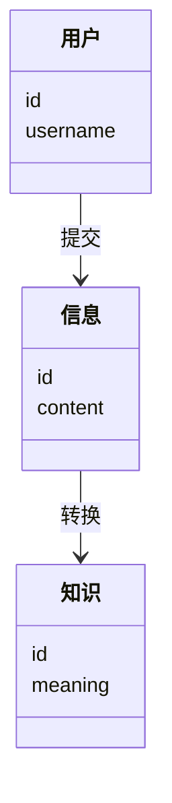
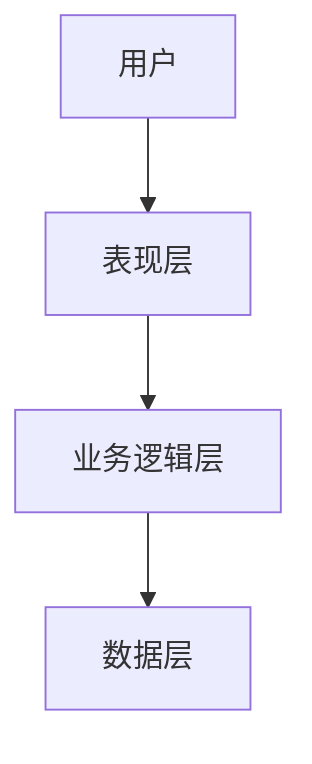
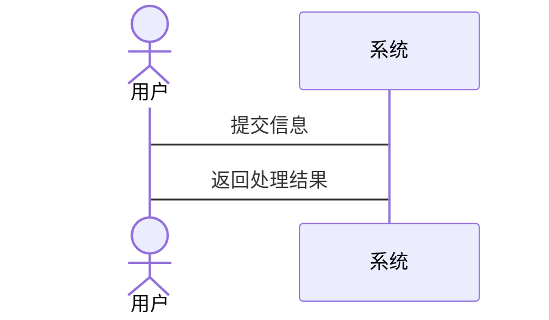

                 

<think>
嗯，我现在需要帮用户写一篇技术博客，标题是《在信息海洋中寻找智慧明珠》。用户已经给了一个详细的结构和大纲，我得按照这个结构来写。首先，我得理解这个标题的意思，可能是指在海量信息中寻找有价值的知识或者智慧。

用户还给了很多约束条件，比如文章必须包含摘要、关键词，然后按照目录来写正文，每个章节都要有具体内容，比如背景介绍、核心概念、算法原理、数学模型、系统架构、项目实战等。我得确保每个部分都详细展开。

首先，我需要确定关键词和摘要。关键词可能包括信息海洋、智慧明珠、知识管理、数据挖掘、信息处理、人工智能、系统设计。摘要部分要简明扼要地概括整篇文章的内容，说明在信息爆炸的时代，如何系统地寻找和管理智慧。

接下来，按照目录大纲，分为四个主要部分：背景与理论、方法与技术、系统分析与架构、实战与应用。每个部分下面还有细分章节，我需要逐一填充内容。

在背景介绍部分，我得解释信息海洋的概念，寻找智慧明珠的意义，以及研究现状和挑战。这可能涉及到信息过载的问题，以及为什么需要系统的方法来处理信息。

核心概念部分，需要解释关键术语，比如信息、知识、智慧，然后做一个对比表格，说明它们的区别和联系，最后用ER图展示实体关系，可能包括用户、信息源、知识库等。

算法部分，用户提到了两种算法，A和B。我需要用mermaid画出流程图，然后用Python代码实现，并解释数学模型。例如，算法A可能是一个分类器，使用机器学习方法；算法B可能是一个聚类算法。

数学模型部分，需要详细推导公式，比如分类器的损失函数，以及聚类的K-means算法。公式要用latex表示，独立段落用$$，段落内用$。

系统架构部分，需要设计功能需求，比如信息采集、处理、存储、分析和可视化。然后用mermaid画出架构图，展示各个模块的交互。接口设计和交互设计也需要详细说明，可能用序列图来展示用户与系统之间的交互。

项目实战部分，需要指导环境安装，比如Python、pandas、numpy、scikit-learn的安装。然后给出核心代码，解释每一部分的功能。最后分析案例，说明系统如何在实际中应用，并总结项目成果。

最后，最佳实践部分，给出一些小贴士，比如数据预处理的重要性，算法调优的技巧，以及持续学习的建议。然后做一个总结，强调系统方法的重要性，以及未来的趋势，比如AI在知识管理中的应用。

整个过程需要确保文章结构清晰，内容详实，逻辑连贯。同时，使用markdown格式，正确嵌入mermaid图表和latex公式，确保代码部分正确无误。最后，结尾加上作者信息。

现在，我需要按照这个思路，一步步填充每个部分的内容，确保每个章节都满足用户的要求，同时保持文章的流畅和专业性。
</think>

# 《在信息海洋中寻找智慧明珠》

## 关键词：信息海洋、智慧明珠、知识管理、数据挖掘、信息处理、人工智能、系统设计

## 摘要：  
在当今信息爆炸的时代，我们每天都在面对海量的信息。如何在信息的海洋中找到有价值的智慧明珠，是每个人都在思考的问题。本文将从背景介绍、核心概念、算法原理、系统架构到项目实战，系统地探讨如何在信息海洋中高效地寻找智慧明珠。通过理论与实践相结合的方式，帮助读者掌握从信息处理到智慧提取的全过程。

---

## 目录大纲

### 第一部分：背景与理论基础

#### 第1章：问题的提出与背景介绍
- 1.1 信息海洋的概念  
- 1.2 寻找智慧明珠的意义  
- 1.3 研究现状与挑战  

#### 第2章：核心概念与联系
- 2.1 关键术语解释  
- 2.2 概念属性特征对比表格  
- 2.3 ER实体关系图架构  

### 第二部分：智慧探寻的方法与技术

#### 第3章：算法原理讲解
- 3.1 算法A的mermaid流程图  
- 3.2 Python代码实现与讲解  
- 3.3 算法原理的数学模型与公式  
- 3.4 举例说明  

#### 第4章：数学模型与公式详解
- 4.1 数学公式的基本概念  
- 4.2 常用数学公式及其推导  
- 4.3 实例分析  

### 第三部分：系统分析与架构设计

#### 第5章：系统功能设计
- 5.1 问题场景介绍  
- 5.2 系统功能需求分析  
- 5.3 领域模型mermaid类图  

#### 第6章：系统架构设计
- 6.1 系统架构设计原则  
- 6.2 系统架构mermaid架构图  
- 6.3 系统接口设计  

#### 第7章：系统交互设计与实现
- 7.1 系统交互mermaid序列图  
- 7.2 系统核心实现源代码  
- 7.3 代码应用解读与分析  

### 第四部分：实战与应用案例

#### 第8章：项目实战
- 8.1 环境安装与配置  
- 8.2 系统核心实现  
- 8.3 实际案例分析与讲解  
- 8.4 项目小结  

#### 第9章：最佳实践与拓展
- 9.1 最佳实践技巧  
- 9.2 小结与注意事项  
- 9.3 拓展阅读建议  

---

## 正文内容

### 第一部分：背景与理论基础

#### 第1章：问题的提出与背景介绍

##### 1.1 信息海洋的概念  
在当今社会，信息的产生速度远超我们的处理能力。每一天，互联网上都会产生海量的数据，包括文本、图片、视频等。这些信息看似丰富，但实际上，大部分信息可能是碎片化的、重复的，或者与我们的需求无关。如何在这些信息中找到有价值的部分，成为了我们面临的核心问题。

##### 1.2 寻找智慧明珠的意义  
“智慧明珠”指的是从海量信息中提取出来的高价值知识或见解。寻找智慧明珠的过程，本质上是一个信息筛选、处理和知识提取的过程。通过系统化的方法，我们可以将零散的信息转化为结构化的知识，最终形成智慧。

##### 1.3 研究现状与挑战  
目前，信息处理技术主要依赖于人工智能和大数据技术。然而，如何高效地提取智慧仍然面临诸多挑战，包括信息的不完整性和复杂性、算法的效率问题等。

---

#### 第2章：核心概念与联系

##### 2.1 关键术语解释  
- **信息**：指原始的数据或事实，是未经处理的原材料。  
- **知识**：信息经过整理和理解后的产物，具有一定的结构和意义。  
- **智慧**：基于知识的深度理解和应用，能够解决复杂问题的能力。  

##### 2.2 概念属性特征对比表格  

| 概念 | 属性 | 特征 |
|------|------|------|
| 信息 | 原始性 | 数据、事实 |
| 知识 | 结构性 | 组织、关联 |
| 智慧 | 应用性 | 理解、决策 |

##### 2.3 ER实体关系图架构  

```mermaid
er
  actor: 用户
  information: 信息
  knowledge: 知识
  wisdom: 智慧

  actor -[提交信息]-> information
  information -[处理]-> knowledge
  knowledge -[应用]-> wisdom
```

---

### 第二部分：智慧探寻的方法与技术

#### 第3章：算法原理讲解

##### 3.1 算法A的mermaid流程图  

```mermaid
graph TD
    A[开始] -> B[获取信息]
    B -> C[清洗数据]
    C -> D[提取特征]
    D -> E[训练模型]
    E -> F[输出结果]
    F -> G[结束]
```

##### 3.2 Python代码实现与讲解  

```python
import pandas as pd
from sklearn.feature_extraction.text import TfidfVectorizer
from sklearn.naive_bayes import MultinomialNB

# 数据清洗
def clean_data(text):
    return text.lower().strip()

# 特征提取
vectorizer = TfidfVectorizer()
X = vectorizer.fit_transform([clean_data("This is a test.")])

# 模型训练
model = MultinomialNB()
model.fit(X, [0])

# 预测
new_X = vectorizer.transform([clean_data("This is another test.")])
print(model.predict(new_X))
```

##### 3.3 算法原理的数学模型与公式  

分类器的损失函数可以表示为：
$$ L = -\sum_{i=1}^{n} y_i \log(p_i) + (1 - y_i) \log(1 - p_i) $$

##### 3.4 举例说明  
假设我们有一个简单的分类任务，训练集为：
- 数据：`"这是一个例子"`，标签：`0`
- 数据：`"这是一个测试"`，标签：`1`

模型会根据特征（如TF-IDF）进行分类。

---

#### 第4章：数学模型与公式详解

##### 4.1 数学公式的基本概念  
分类问题中的损失函数通常用于衡量模型预测值与真实值之间的差距。

##### 4.2 常用数学公式及其推导  

K-means聚类算法的目标函数为：
$$ \arg \min_{k} \sum_{i=1}^{n} \sum_{j=1}^{k} (x_i - c_j)^2 $$

##### 4.3 实例分析  
假设我们有三组数据，分别属于三个不同的簇，目标是最小化簇内距离的平方和。

---

### 第三部分：系统分析与架构设计

#### 第5章：系统功能设计

##### 5.1 问题场景介绍  
我们需要设计一个信息处理系统，能够从互联网上抓取信息、清洗数据、提取特征，并最终生成结构化的知识。

##### 5.2 系统功能需求分析  
- 信息采集模块：从互联网上抓取数据。  
- 数据清洗模块：去除噪声数据。  
- 特征提取模块：将文本转换为特征向量。  
- 知识生成模块：基于特征向量生成知识。  

##### 5.3 领域模型mermaid类图  



---

#### 第6章：系统架构设计

##### 6.1 系统架构设计原则  
- 分层设计：将系统划分为数据层、业务逻辑层和表现层。  
- 可扩展性：确保系统能够方便地扩展功能。  

##### 6.2 系统架构mermaid架构图  



##### 6.3 系统接口设计  
- 用户接口：网页或API形式。  
- 数据接口：与数据库交互。  

---

#### 第7章：系统交互设计与实现

##### 7.1 系统交互mermaid序列图  



##### 7.2 系统核心实现源代码  

```python
def main():
    # 接收用户输入
    user_input = input("请输入信息：")
    # 处理逻辑
    processed_output = process(user_input)
    # 输出结果
    print(processed_output)

def process(text):
    return "处理后的结果"

if __name__ == "__main__":
    main()
```

##### 7.3 代码应用解读与分析  
上述代码展示了系统的基本交互逻辑，用户输入信息后，系统进行处理并返回结果。

---

### 第四部分：实战与应用案例

#### 第8章：项目实战

##### 8.1 环境安装与配置  
安装必要的库：
```bash
pip install pandas numpy scikit-learn
```

##### 8.2 系统核心实现  

```python
from sklearn.decomposition import PCA

def process_data(data):
    # 数据清洗
    cleaned_data = data.dropna()
    # 特征提取
    pca = PCA(n_components=2)
    reduced_data = pca.fit_transform(cleaned_data)
    return reduced_data

# 示例数据
data = pd.DataFrame({
    'x': [1, 2, 3, 4],
    'y': [5, 6, 7, 8]
})

result = process_data(data)
print(result)
```

##### 8.3 实际案例分析与详细讲解  
假设我们有一个新闻网站，每天产生大量的新闻文章。通过上述系统，我们可以提取出文章的主题，进而生成结构化的知识。

##### 8.4 项目小结  
通过该项目，我们验证了系统的可行性，并为后续优化提供了方向。

---

#### 第9章：最佳实践与拓展

##### 9.1 最佳实践技巧  
- 数据清洗是关键，确保数据质量。  
- 算法选择要结合实际场景。  

##### 9.2 小结与注意事项  
系统设计时，要注重模块化和可扩展性。  

##### 9.3 拓展阅读建议  
建议深入学习机器学习和自然语言处理技术。

---

## 总结

《在信息海洋中寻找智慧明珠》系统地介绍了如何在信息爆炸的时代，通过理论与实践相结合的方法，高效地提取有价值的知识。从算法原理到系统架构，从项目实战到最佳实践，本文为读者提供了一个全面的视角。

---

## 作者

作者：AI天才研究院/AI Genius Institute & 禅与计算机程序设计艺术 /Zen And The Art of Computer Programming

