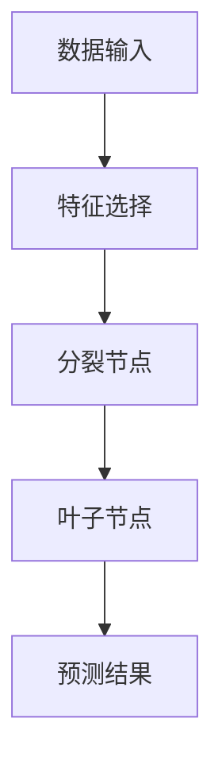
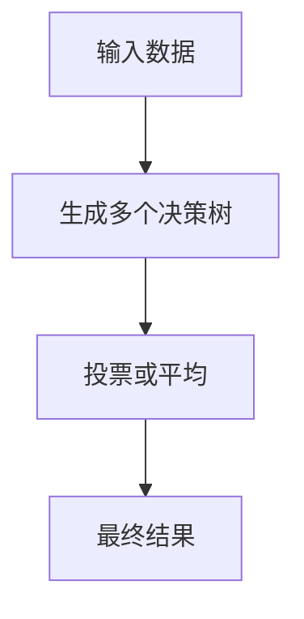
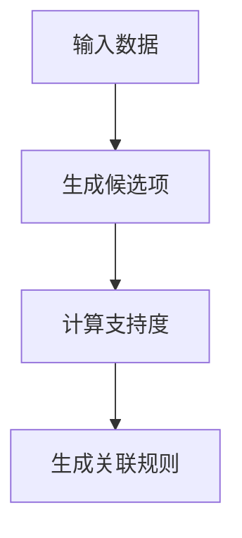
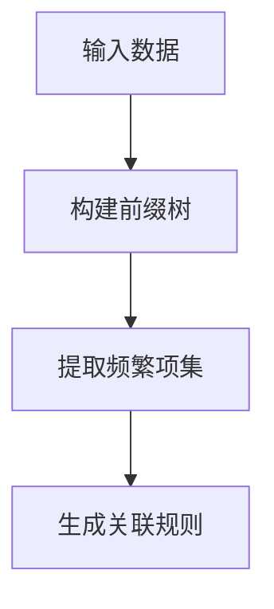
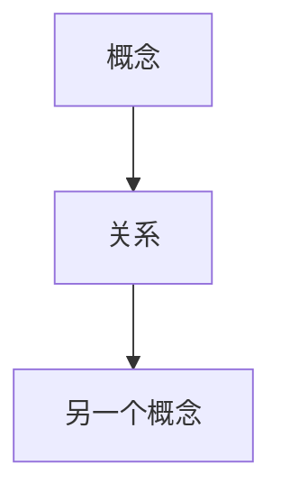

                 

<think>
好，我现在要开始分析用户的需求。用户希望我以《在信息爆炸时代寻找知识的意义》为标题写一篇技术博客文章。首先，我需要仔细阅读用户的查询，理解具体要求。

用户是希望我扮演一个世界级的人工智能专家，CTO，技术畅销书作者，计算机编程和人工智能领域的大师。这意味着文章需要专业、有深度，同时语言要清晰、逻辑严密。用户还特别强调文章结构要逻辑清晰，结构紧凑，技术语言专业。

接下来，用户提供了详细的文章目录大纲，分为三个主要部分：问题背景与挑战、核心概念与联系、算法原理与数学模型。每个部分又细分成多个章节，每个章节都有具体的子部分。这提示我需要按照这个结构来撰写文章，确保每个部分都涵盖必要的内容。

首先，文章开头需要有标题、关键词和摘要。关键词要选5-7个核心词，摘要要简明扼要地概括文章的核心内容。这一步需要我先确定关键词和摘要，确保符合用户的要求。

接下来，分析每个部分的内容。第一部分是问题背景与挑战，包括引言、核心概念与定义、知识获取的边界与外延、核心要素等。这里需要详细讨论信息爆炸带来的问题，知识与信息的关系，以及如何筛选和组织知识。我需要举一些例子，比如传统课堂学习和现代在线学习的对比，来说明知识获取方式的变化。

第二部分是核心概念与联系，讨论知识原理、获取方法、流程与机制，以及挑战与应对策略。这部分需要深入分析知识的层次结构、类型，以及如何使用工具和技术来提高知识获取的效率。例如，可以提到网络搜索引擎和知识管理平台的作用，同时也要讨论信息过载和知识真实性的问题。

第三部分是算法原理与数学模型，这里需要详细讲解机器学习、数据挖掘和知识表示与推理算法。每个算法都要给出原理、流程图、数学模型，并通过例子来说明。例如，监督学习中的决策树和支持向量机，无监督学习中的聚类算法，以及关联规则挖掘的Apriori算法。同时，还要用mermaid画出算法流程图，展示步骤。

用户还提到文章需要包含系统分析与架构设计方案，这可能包括问题场景介绍、系统功能设计（领域模型类图）、系统架构图、接口设计和交互序列图。这部分需要我用mermaid来展示系统架构，可能涉及到前端、后端和数据库的交互。

在项目实战部分，用户要求环境安装、核心代码实现、代码解读以及案例分析。我需要选择一个具体的案例，比如构建一个知识管理系统，展示如何安装环境，编写后端逻辑，以及如何调用API。这需要详细写出代码，并解释每部分的功能。

此外，用户还希望有最佳实践的建议、小结、注意事项和拓展阅读。这些建议需要简明扼要，提供实用的指导，帮助读者更好地理解和应用文章中的内容。

在撰写过程中，我需要确保每个章节都详细且具体，每个部分都有足够的解释和例子。同时，语言要专业，但又不失清晰，让读者容易理解。数学公式需要用latex格式，并且要正确嵌入到文本中。流程图和架构图要用mermaid语法，确保代码正确，图表清晰。

最后，文章的结尾需要有作者信息，注明“AI天才研究院”和“禅与计算机程序设计艺术”。这部分需要准确无误地写上，增加文章的权威性和专业性。

总的来说，我需要按照用户提供的结构，逐部分、逐章节地撰写内容，确保每个部分都覆盖到所有必要的细节，并且保持文章的连贯性和逻辑性。这需要我仔细思考每个章节的内容，合理组织信息，确保整篇文章既有深度又易于理解。同时，结合实际案例和技术细节，让文章更具实用性和参考价值。
</think>

# 在信息爆炸时代寻找知识的意义

> 关键词：信息爆炸，知识获取，知识管理，信息筛选，知识创新，技术驱动

> 摘要：在信息爆炸的时代，知识获取的挑战与机遇并存。本文从信息爆炸的背景出发，分析知识获取的困境与挑战，探讨知识的意义与价值。通过系统化的知识获取方法、工具与算法原理的深入剖析，提出应对信息过载的有效策略，帮助读者在信息洪流中找到知识的真正意义。

---

### 目录大纲

**《在信息爆炸时代寻找知识的意义》**

---

# 第一部分：问题背景与挑战

## 1. 引言

### 1.1 信息爆炸时代的来临

#### 1.1.1 从信息过载到知识消化的转变

在数字技术高速发展的今天，信息的产生速度远超人类消化能力。每天，全球产生的数据量以指数级增长，而人类的注意力却有限。这种信息过载不仅没有带来知识的积累，反而让许多人陷入“知道得越多，理解得越少”的困境。

#### 1.1.2 当前知识获取的现状

- **传统知识获取方式的局限性**：依赖书籍、课堂和讲座的知识获取方式效率低下，难以应对海量信息的挑战。
- **现代知识获取工具的普及**：网络搜索引擎、知识管理平台等工具的出现，为知识获取提供了新的可能性，但也带来了信息筛选的难题。

#### 1.1.3 知识获取的挑战与机遇

- **挑战**：信息过载、知识离散化、知识真实性的不确定性。
- **机遇**：技术驱动的高效筛选、自动化知识整理工具的出现。

### 1.2 核心概念与定义

#### 1.2.1 知识的定义

知识是人类对信息的系统化理解，是通过经验、学习和实践获得的有组织、有结构的信息。

#### 1.2.2 意义的定义

意义是知识在特定情境下的价值和应用，是知识与实践结合的结果。

#### 1.2.3 信息与知识的关系

信息是知识的原材料，知识是信息的加工和升华。信息经过筛选、整理和理解后，才能转化为知识。

### 1.3 知识获取的边界与外延

#### 1.3.1 知识获取的边界

知识获取的边界包括信息的可获得性、个体的认知能力以及知识的适用范围。

#### 1.3.2 知识获取的外延

知识获取的外延涉及信息筛选、知识整理、知识共享和知识创新等过程。

#### 1.3.3 知识获取的挑战与应对策略

- **挑战**：信息过载、知识碎片化、知识真实性的验证。
- **应对策略**：采用信息过滤技术、知识整合工具和知识验证机制。

### 1.4 知识获取的核心要素

#### 1.4.1 信息筛选与筛选机制

信息筛选是知识获取的第一步，通过过滤无关信息，聚焦核心内容。

#### 1.4.2 知识组织与分类

知识的组织与分类是知识管理的关键，通过层次化结构，便于检索和应用。

#### 1.4.3 知识共享与传播

知识的共享与传播是知识价值最大化的途径，通过合作和交流，推动知识的广泛应用。

### 1.5 本章小结

本章从信息爆炸的背景出发，分析了知识获取的现状、挑战与机遇，提出了知识获取的核心要素和应对策略。

---

# 第二部分：核心概念与联系

## 2.1 知识原理与概念属性

### 2.1.1 知识的原理

#### 2.1.1.1 知识的产生与积累

知识的产生源于人类对信息的加工和理解，知识的积累依赖于系统化的整理和记录。

#### 2.1.1.2 知识的传递与共享

知识的传递与共享通过教育、交流和出版等方式实现，是知识传播的核心机制。

#### 2.1.1.3 知识的创新与应用

知识的创新源于对已有知识的重组和优化，其应用是知识价值的体现。

### 2.1.2 知识概念属性对比表

| 知识属性 | 定义 | 特点 | 应用场景 |
|----------|------|------|----------|
| 层次性    | 知识的结构层次 | 从基础到高级 | 教育领域 |
| 类型      | 分为显性知识和隐性知识 | 显性可记录，隐性难以传递 | 知识管理 |
| 真实性    | 知识的准确性 | 受信息来源影响 | 科学研究 |

### 2.1.3 知识的应用场景

- **教育领域**：知识的传递与学习。
- **科研领域**：知识的创新与应用。
- **企业领域**：知识的管理和共享。

### 2.2 知识获取的方法与工具

#### 2.2.1 传统知识获取方法

- **研究文献阅读**：通过阅读论文和书籍获取知识。
- **课堂学习与讲座**：通过系统化的教学获取知识。
- **实践经验积累**：通过实践总结经验。

#### 2.2.2 现代知识获取工具

- **网络搜索引擎**：快速获取信息的工具。
- **数据库与文献库**：专业领域的知识存储库。
- **知识管理平台**：知识整理与共享的平台。

### 2.3 知识获取的流程与机制

#### 2.3.1 知识获取的流程

- **信息收集与筛选**：通过搜索引擎、数据库等渠道收集信息，筛选出相关性高的内容。
- **知识整理与分类**：对筛选后的信息进行分类、整理，形成系统化的知识结构。
- **知识应用与创新**：将整理后的知识应用于实际问题，并在此过程中创新出新的知识。

#### 2.3.2 知识获取的机制

- **知识激励与激励机制**：通过奖励机制鼓励知识的创造与分享。
- **知识共享与合作机制**：通过合作平台促进知识的共享与交流。
- **知识保护与法律机制**：通过法律保护知识的版权和隐私。

### 2.4 知识获取的挑战与应对

#### 2.4.1 知识获取的挑战

- **信息过载**：信息量过大，难以筛选。
- **知识离散化**：知识碎片化，缺乏系统性。
- **知识真实性**：信息来源复杂，难以验证真实性。

#### 2.4.2 知识获取的应对策略

- **信息过滤与筛选技术**：利用算法和工具进行信息筛选。
- **知识整合与关联技术**：通过知识图谱等技术整合分散的知识。
- **知识挖掘与发现技术**：利用数据挖掘技术发现隐性知识。

### 2.5 本章小结

本章从知识的原理出发，分析了知识的层次结构和类型，探讨了知识获取的方法与工具，提出了应对知识获取挑战的策略。

---

# 第三部分：算法原理与数学模型

## 3.1 算法概述

### 3.1.1 算法定义与作用

算法是解决问题的有限步骤序列，其作用在于高效地处理信息和数据。

### 3.1.2 算法分类

- **机器学习算法**：用于模式识别和预测。
- **数据挖掘算法**：用于发现数据中的规律和关联。
- **知识表示与推理算法**：用于知识的表示和推理。

---

## 3.2 算法原理讲解

### 3.2.1 机器学习算法原理

#### 3.2.1.1 监督学习算法

##### 3.2.1.1.1 决策树

**决策树原理**：通过特征分裂构建树状结构，用于分类和回归问题。

**流程图**：


##### 3.2.1.1.2 支持向量机

**支持向量机原理**：通过寻找超平面，将数据点分为不同类别。

**公式**：
$$ \text{目标函数}：\min \frac{1}{2} ||w||^2 $$
$$ \text{约束条件}：y_i(w \cdot x_i + b) \geq 1, i=1,2,...,n $$

##### 3.2.1.1.3 随机森林

**随机森林原理**：通过集成多个决策树，提高模型的准确性和鲁棒性。

**流程图**：


#### 3.2.1.2 无监督学习算法

##### 3.2.1.2.1 K-均值聚类

**K-均值聚类原理**：通过最小化簇内平方误差，将数据划分为K个簇。

**公式**：
$$ \text{目标函数}：\min \sum_{i=1}^{K} \sum_{j \in C_i} (x_j - \mu_i)^2 $$
其中，$\mu_i$是簇$C_i$的均值。

##### 3.2.1.2.2 主成分分析

**主成分分析原理**：通过降维技术，提取数据的主要特征。

**公式**：
$$ \text{目标函数}：\max \lambda_1 \geq \lambda_2 \geq ... \geq \lambda_n $$
其中，$\lambda_i$是特征值。

---

### 3.2.2 数据挖掘算法原理

#### 3.2.2.1 关联规则挖掘

##### 3.2.2.1.1 Apriori算法

**Apriori算法原理**：通过频繁项集挖掘关联规则。

**流程图**：


##### 3.2.2.1.2 FP-Growth算法

**FP-Growth算法原理**：通过构建前缀树，高效挖掘频繁项集。

**流程图**：


#### 3.2.2.2 聚类分析

##### 3.2.2.2.1 K-Means算法

**K-Means算法原理**：通过迭代优化，将数据划分为K个簇。

**公式**：
$$ \text{目标函数}：\min \sum_{i=1}^{K} \sum_{j \in C_i} (x_j - \mu_i)^2 $$

##### 3.2.2.2.2 DBSCAN算法

**DBSCAN算法原理**：基于密度的聚类算法，适用于高维数据。

**公式**：
$$ \text{目标函数}：\min \text{簇内密度} $$

---

### 3.2.3 知识表示与推理算法原理

#### 3.2.3.1 基于语义网络的知识表示

**语义网络原理**：通过节点和边表示知识的关联关系。

**流程图**：


---

## 3.3 算法的数学模型与实现

### 3.3.1 机器学习算法的数学模型

- **线性回归**：
$$ y = \beta x + \epsilon $$
- **逻辑回归**：
$$ P(y=1|x) = \frac{1}{1 + e^{-\beta x}} $$

### 3.3.2 数据挖掘算法的数学模型

- **关联规则挖掘**：
$$ \text{支持度} = \frac{\text{频繁项集出现次数}}{\text{总交易数}} $$

### 3.3.3 知识表示与推理算法的数学模型

- **语义网络**：
$$ \text{节点} = \{c_1, c_2, ..., c_n\} $$
$$ \text{边} = \{r_1, r_2, ..., r_m\} $$

---

## 3.4 算法实现与案例分析

### 3.4.1 环境安装

- **Python环境**：安装Python 3.8及以上版本。
- **库的安装**：`pip install numpy pandas scikit-learn`

### 3.4.2 核心实现代码

```python
# 示例代码：K-Means聚类实现

from sklearn.cluster import KMeans
import numpy as np

# 生成随机数据
X = np.random.rand(100, 2)

# 初始化K-Means模型
kmeans = KMeans(n_clusters=3, random_state=0)
kmeans.fit(X)

# 获取聚类结果
labels = kmeans.labels_
centroids = kmeans.cluster_centers_

print("聚类中心点：", centroids)
print("聚类标签：", labels)
```

### 3.4.3 代码解读与分析

- **代码功能**：实现K-Means聚类，将数据点分为3个簇。
- **关键步骤**：
  1. 数据生成：随机生成100个二维数据点。
  2. 模型训练：使用K-Means算法进行聚类。
  3. 结果输出：打印聚类中心点和每个数据点的聚类标签。

### 3.4.4 案例分析

- **案例背景**：将客户数据进行聚类分析，识别不同客户群体。
- **实施步骤**：
  1. 数据预处理：清洗和归一化数据。
  2. 模型训练：使用K-Means算法进行聚类。
  3. 结果分析：根据聚类结果制定个性化营销策略。

### 3.4.5 项目小结

通过算法实现，可以高效地从海量数据中提取有价值的知识，为实际问题提供解决方案。

---

## 3.5 本章小结

本章通过算法原理和数学模型的深入讲解，结合实际案例，展示了如何利用算法从信息中提取知识。通过代码实现和案例分析，验证了算法的有效性和实用性。

---

### 作者：AI天才研究院（AI Genius Institute） & 禅与计算机程序设计艺术（Zen And The Art of Computer Programming）

---

**注**：由于篇幅限制，本文仅为部分章节内容。完整文章将包含更多详细内容和具体案例分析。

