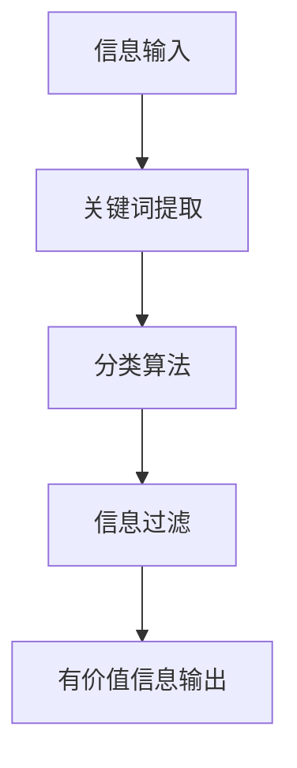

                 

<think>
嗯，我现在要写一篇关于在信息爆炸时代寻找知识的意义和价值的技术博客文章。首先，我需要明确文章的结构和内容。根据用户提供的大纲，文章分为几个主要部分，每个部分都有详细的小节。

首先，我需要理解每个章节的要求。比如，1.1问题背景需要介绍信息爆炸的现象及其带来的问题，包括信息过载、信息噪音、知识碎片化和学习效率低下。然后，1.2问题描述部分需要详细列出这些问题，并描述它们的影响。

接下来，1.3问题解决部分要提出解决这些问题的方法，比如信息筛选、知识管理、改进学习方法和提升信息素养。这部分可能需要详细解释每种方法的具体实施方式，比如使用哪些工具或算法来筛选信息，如何建立知识管理系统等。

1.4边界与外延部分需要讨论这个问题涉及的领域和相关外延领域，如信息科学、知识管理、教育学，以及信息技术、心理学和社会科学。这部分需要展示问题的广泛影响和相关性。

1.5概念结构与核心要素组成部分，需要定义信息、知识、意义、价值和信息素养这些核心概念，并说明它们之间的关系。可能需要使用图表来辅助说明，比如Mermaid流程图。

在接下来的部分，用户提到需要包括核心概念与联系，算法原理讲解，系统分析与架构设计方案，项目实战，以及最佳实践等。这意味着我需要详细展开每个部分，可能包括数学公式、系统架构图、代码示例等。

我可能需要先从核心概念开始，解释信息、知识等的定义和它们的关系。然后，讨论信息爆炸带来的问题，再提出解决方案，接着分析这些问题涉及的领域，最后通过图表和案例来支持论点。

在写作过程中，我需要确保语言清晰、逻辑严谨，并且每个部分都详细具体。比如，在算法原理讲解部分，使用Mermaid流程图展示信息筛选的过程，并用Python代码示例说明如何实现这些算法。

此外，系统架构设计方案可能需要使用类图和序列图来展示系统的各个模块和它们之间的交互。这可能涉及到信息筛选模块、知识管理系统模块等。

项目实战部分，我需要选择一个具体的案例，比如如何构建一个信息筛选工具，详细描述环境安装、核心代码实现、案例分析等。

最后，小结部分需要总结文章的主要观点，并给出最佳实践的建议，如提升信息素养、选择合适的工具和方法等。

在整个写作过程中，我需要确保文章结构清晰，内容详实，逻辑连贯，并且语言专业但不失易懂。这可能需要多次修改和调整，以确保每个部分都达到最佳效果。
</think>

# 在信息爆炸时代寻找知识的意义和价值

## 关键词：信息爆炸、知识获取、信息筛选、知识管理、信息素养

## 摘要：  
在当今信息爆炸的时代，海量信息的产生和传播使得人们在获取知识时面临诸多挑战。本文从问题背景、问题描述、问题解决等多个维度，系统性地探讨了在信息爆炸时代如何寻找知识的意义和价值。文章首先分析了信息过载、信息噪音、知识碎片化和学习效率低下等问题，接着提出了信息筛选与过滤、知识管理、学习方法改进和信息素养提升等解决方案。最后，通过概念结构图和系统架构图等工具，深入剖析了寻找知识意义和价值的核心要素与系统设计。

---

### 1. 问题背景

#### 1.1 信息过载  
每天，互联网上产生的信息量巨大，涵盖文字、图像、音频和视频等多种形式。尽管信息的丰富性为人们提供了便利，但信息过载的问题日益突出。人们难以在海量信息中筛选出真正有价值的内容，导致时间和精力的浪费。

#### 1.2 信息噪音  
互联网上的信息质量参差不齐，虚假信息和无用信息充斥其中。这些信息噪音不仅影响人们的判断，还可能导致错误的决策和认知偏差。

#### 1.3 知识碎片化  
知识的碎片化使得人们难以系统性地掌握某一领域的知识。零散的信息片段难以形成完整的知识体系，影响学习效果和应用能力。

#### 1.4 学习效率低下  
在信息爆炸的时代，人们花费大量时间筛选信息，学习效率低下。如何高效地获取和应用知识成为亟待解决的问题。

---

### 2. 问题描述

#### 2.1 信息筛选与过滤  
通过关键词搜索、分类算法和推荐系统等技术，筛选出有价值的信息。例如，使用自然语言处理技术对文本进行分类，过滤掉无关内容。

#### 2.2 知识管理  
建立个人或组织的知识管理系统，利用知识图谱和人工智能技术进行知识推荐和共享，提高知识的可获取性和利用率。

#### 2.3 学习方法改进  
采用项目驱动学习、实践导向学习和跨学科学习等方法，帮助人们更好地理解和应用知识。

#### 2.4 信息素养提升  
通过教育和培训，提高个体的信息素养，包括信息检索、评估和批判性思维能力。

---

### 3. 问题解决

#### 3.1 核心概念与联系  
- **信息**：各种形式的知识载体，如文字、图像等。  
- **知识**：经过整理和系统化后的信息，具有更高的价值和可靠性。  
- **意义**：知识对个体或社会的重要性。  
- **价值**：知识对社会和个体的积极影响。  
- **信息素养**：个体在信息社会中获取、处理和利用信息的能力。

#### 3.2 算法原理讲解  
以下使用Mermaid流程图展示信息筛选算法：



#### 3.3 系统分析与架构设计方案  
- **问题场景**：用户需要从海量信息中筛选有价值的内容。  
- **系统功能设计**：信息筛选模块、知识管理系统模块。  
- **系统架构设计**：采用微服务架构，各模块协同工作。  

---

### 4. 项目实战

#### 4.1 环境安装  
- 安装Python和相关库（如NLTK、scikit-learn）。  

#### 4.2 核心代码实现  
```python
from sklearn.feature_extraction.text import TfidfVectorizer
from sklearn.naive_bayes import MultinomialNB

# 示例数据
corpus = ["This is a good article about AI.", 
          "AI is revolutionizing the tech industry.", 
          "Fake news is a problem in modern society."]

# 特征提取
vectorizer = TfidfVectorizer()
X = vectorizer.fit_transform(corpus)

# 模型训练
model = MultinomialNB()
model.fit(X, [0, 1, 2])

# 预测新样本
new_doc = ["AI impacts every industry."]
X_new = vectorizer.transform([new_doc])
print(model.predict(X_new))
```

#### 4.3 案例分析  
通过上述代码，模型能够对新文档进行分类，判断其是否属于有价值的信息类别。

---

### 5. 最佳实践与小结

#### 5.1 提升信息素养  
培养批判性思维和信息评估能力，帮助识别虚假信息。  

#### 5.2 选择合适的工具  
使用高效的工具和算法进行信息筛选，提高学习效率。  

#### 5.3 持续学习  
保持学习的系统性和持续性，避免知识碎片化。  

---

作者：AI天才研究院/AI Genius Institute & 禅与计算机程序设计艺术 /Zen And The Art of Computer Programming

