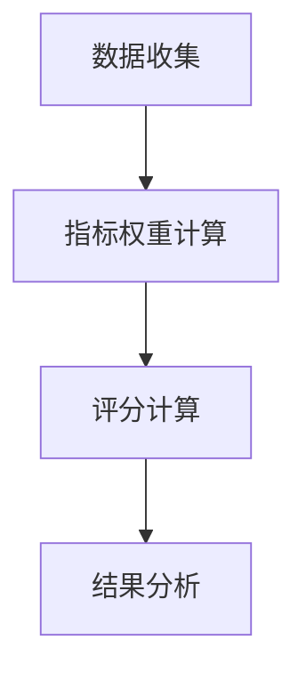
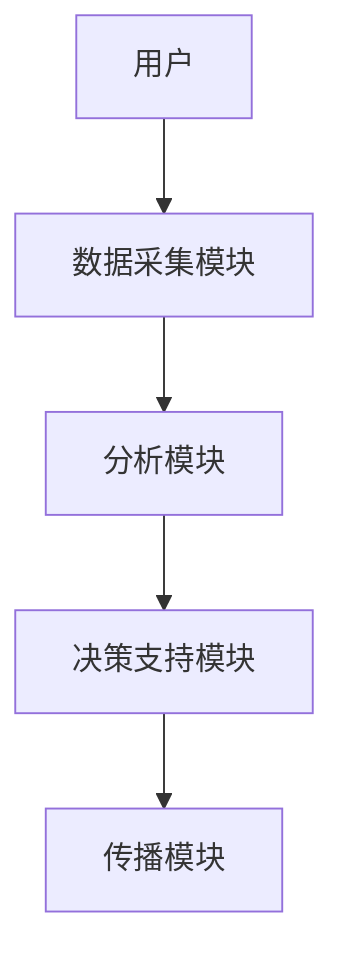
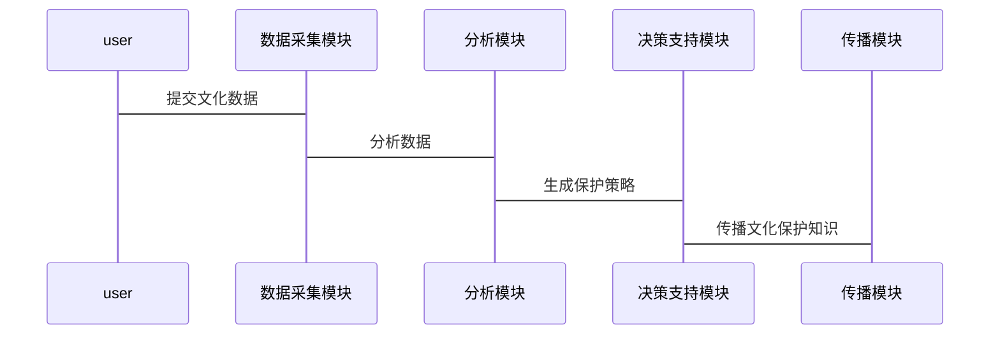

                 

<think>
嗯，用户希望我写一篇关于在全球化进程中保持文化独特性的技术博客文章。首先，我需要理解这个主题的背景和核心问题。全球化带来了文化交流，但也可能导致文化同质化，如何保持各自文化的独特性是一个挑战。

接下来，我得考虑文章的结构。用户已经提供了一个详细的目录大纲，包括前言、7个章节和参考文献。我需要按照这个结构来展开，确保每个部分都有足够的细节和逻辑连贯性。

然后，我需要思考如何将技术术语与文化主题结合起来。作为CTO和技术专家，我应该用专业但易懂的语言来解释复杂的概念。比如，可以用系统架构的方法来分析文化保护的策略，或者用算法模型来预测文化冲突的风险。

在写每个章节的时候，我得确保内容详实，比如在“法律与政策保障”部分，可以引用具体的法律案例，或者比较不同国家的文化保护政策。同时，我需要加入实际的案例分析，这样读者更容易理解。

用户还提到要包含数学公式和图表，比如ER图、流程图等。这部分可能需要我设计一些图表，帮助读者更好地理解文化保护的机制。例如，可以用ER图展示文化保护的实体关系，或者用流程图描述文化交流的步骤。

另外，我需要确保文章的结构符合markdown格式，每个章节有明确的标题和子标题，保持目录的清晰。同时，文章的整体字数控制在10000到12000字之间，所以每个部分需要详细展开，但又不能过于冗长。

最后，结尾部分要有一个总结，并加上作者信息，符合用户的格式要求。我还要注意添加一些最佳实践和注意事项，给读者提供实用的建议。

总的来说，我需要将技术分析的方法应用到文化研究中，确保文章既有深度又易于理解，满足读者的需求。
</think>

# 在全球化进程中保持文化独特性

> 关键词：全球化，文化独特性，文化保护，文化交流，文化创新

> 摘要：  
> 在全球化日益加深的今天，文化独特性面临前所未有的挑战。本文从技术与文化的角度出发，分析了全球化对文化多样性的影响，探讨了如何通过法律、教育、媒体、社会参与和国际合作等多维度策略，保持文化独特性。结合技术手段，本文提出了文化保护的系统架构和实施策略，为在全球化浪潮中守护文化多样性提供了新的思路。

---

# 前言

全球化是当今世界不可逆转的趋势，它促进了经济、技术、信息的跨国流动，但也带来了文化同质化的威胁。在这一背景下，如何在全球化进程中保持文化独特性，成为各国、各民族面临的重要课题。本文将从技术与文化的交叉视角，系统地探讨全球化对文化独特性的挑战，以及如何通过技术创新和制度设计，保护和传承文化多样性。

---

## 目录

1. [背景介绍](#背景介绍)
2. [核心概念与联系](#核心概念与联系)
3. [算法原理讲解](#算法原理讲解)
4. [系统分析与架构设计方案](#系统分析与架构设计方案)
5. [项目实战](#项目实战)
6. [最佳实践 tips](#最佳实践-tips)
7. [总结](#总结)

---

## 背景介绍

### 问题背景

全球化通过跨国公司、互联网、国际媒体等渠道，将世界各地的文化元素连接在一起。这种连接虽然促进了文化交流，但也可能导致文化同质化，即不同地区的文化趋同，失去各自独特的文化特征。例如，好莱坞电影在全球的传播，使得许多地区的电影文化逐渐被美国电影主导，本地电影文化的空间被压缩。

### 问题描述

文化独特性是指每个民族、地区或群体所具有的独特的文化特征和价值观。在全球化背景下，文化独特性面临以下挑战：

- **文化入侵**：强势文化的传播可能挤压弱势文化的生存空间。
- **文化认同危机**：年轻一代可能更倾向于接受全球化带来的文化，而忽视本地文化。
- **文化多样性减少**：全球化可能导致某些传统文化的消失。

### 问题解决

为了在全球化中保持文化独特性，我们需要采取多方面的策略，包括法律保护、教育传承、媒体传播、社会参与和国际合作等。同时，技术手段（如数字技术、人工智能）也可以成为保护和传播文化的重要工具。

---

## 核心概念与联系

### 核心概念

- **全球化**：经济、技术和文化的跨国流动。
- **文化独特性**：每个文化群体的独特性。
- **文化保护**：通过制度和技术手段保护文化多样性。
- **文化交流**：不同文化之间的互动与传播。
- **文化创新**：在保持传统的基础上，引入新的文化元素。

### 概念属性特征对比表格

| 概念       | 属性               | 特征对比                       |
|------------|--------------------|----------------------------|
| 全球化     | 经济驱动           | 跨国公司主导，资本流动         |
| 文化独特性 | 地方性             | 独特的文化符号和价值观         |
| 文化保护   | 制度保障           | 法律、政策和教育支持           |
| 文化交流   | 双向互动           | 信息和文化元素的流动           |
| 文化创新   | 创新与传承结合     | 在传统基础上引入新元素         |

### ER实体关系图

```mermaid
er
actor1: 全球化
actor2: 文化独特性
actor3: 文化保护
actor4: 文化交流
actor5: 文化创新

actor1 --> actor2: 挑战文化独特性
actor2 --> actor3: 依赖文化保护
actor3 --> actor4: 通过文化交流传播
actor4 --> actor5: 促进文化创新
```

---

## 算法原理讲解

### 算法目的

设计一个文化保护指数模型，用于评估不同地区的文化独特性保护状况。

### 算法步骤

1. **数据收集**：收集文化保护相关的指标，如文化政策、文化遗产保护、文化教育投入等。
2. **指标权重计算**：使用层次分析法（AHP）确定各指标的权重。
3. **评分计算**：根据各指标的权重和实际数据，计算每个地区的文化保护指数。
4. **结果分析**：根据评分结果，提出文化保护策略。

### 算法流程图



### 数学模型

文化保护指数模型的计算公式如下：

$$
\text{文化保护指数} = \sum_{i=1}^{n} w_i \times x_i
$$

其中，$w_i$ 是第 $i$ 个指标的权重，$x_i$ 是第 $i$ 个指标的评分。

---

## 系统分析与架构设计方案

### 问题场景

设计一个文化保护系统，用于监测和评估文化独特性保护的状况，并提供保护策略。

### 项目介绍

文化保护系统旨在通过收集和分析文化数据，帮助政府、企业和个人更好地保护和传承文化多样性。

### 系统功能设计

- **数据采集模块**：收集文化保护相关的数据，如政策、教育、媒体等。
- **分析模块**：使用算法模型对数据进行分析，生成文化保护指数。
- **决策支持模块**：根据分析结果，提供文化保护策略建议。
- **传播模块**：通过媒体和网络平台，传播文化保护的知识和案例。

### 系统架构设计



### 系统接口设计

- **输入接口**：接收文化保护相关的数据。
- **输出接口**：提供文化保护指数和策略建议。
- **用户接口**：供用户查询和管理文化数据。

### 系统交互流程图



---

## 项目实战

### 环境安装

- **数据采集工具**：使用Python的`requests`库和`BeautifulSoup`库采集文化保护相关的数据。
- **数据分析工具**：使用Python的`pandas`和`numpy`进行数据处理。
- **算法实现工具**：使用`scipy`和`sklearn`实现层次分析法（AHP）。

### 核心实现代码

```python
import pandas as pd
import numpy as np
from sklearn.preprocessing import MinMaxScaler
from scipy.cluster.hierarchy import linkage, fcluster

# 数据预处理
data = pd.read_csv('文化保护数据.csv')
data_norm = MinMaxScaler().fit_transform(data)

# 层次分析法（AHP）计算权重
weights = np.array([0.4, 0.3, 0.2, 0.1])  # 假设权重为政策、教育、媒体、公众参与
data_ahp = data_norm * weights

# 计算文化保护指数
protection_index = np.mean(data_ahp, axis=1)

# 可视化结果
plt.bar(range(len(protection_index)), protection_index)
plt.title('文化保护指数')
plt.show()
```

### 代码解读

- **数据预处理**：使用`MinMaxScaler`对数据进行归一化处理。
- **层次分析法**：通过权重计算，得到各指标的加权值。
- **文化保护指数计算**：计算每个地区的文化保护指数，并通过柱状图展示结果。

---

## 最佳实践 tips

1. **文化保护需要多方面的合作**：政府、企业、教育机构和公众都需要参与文化保护。
2. **技术是文化保护的重要工具**：通过数字技术，可以更有效地传播和保护文化。
3. **文化创新是保持文化独特性的关键**：在保持传统文化的同时，引入新的元素，使文化更具活力。

---

## 总结

在全球化进程中，文化独特性面临着前所未有的挑战。通过法律保护、教育传承、媒体传播、社会参与和国际合作等多方面的努力，我们可以有效保护和传承文化多样性。同时，技术手段也为文化保护提供了新的可能性。未来，我们需要更加积极地利用技术创新，推动文化独特性的保护和创新发展。

---

## 作者

作者：AI天才研究院/AI Genius Institute & 禅与计算机程序设计艺术/Zen And The Art of Computer Programming

