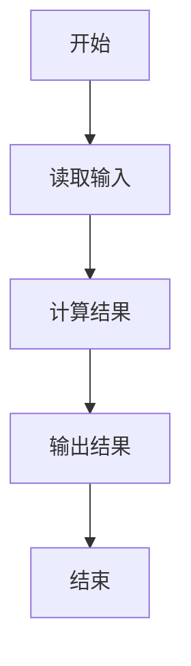
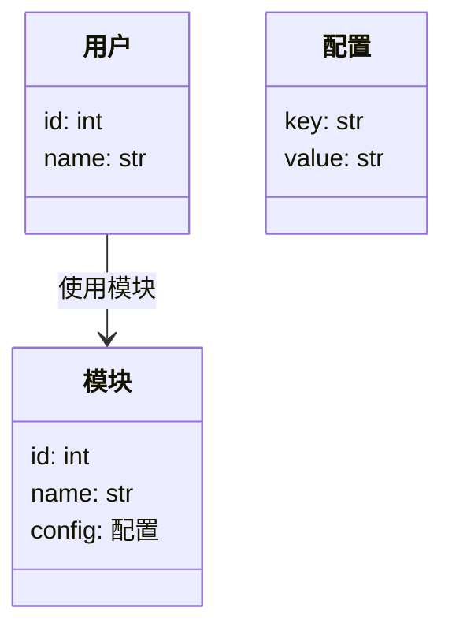
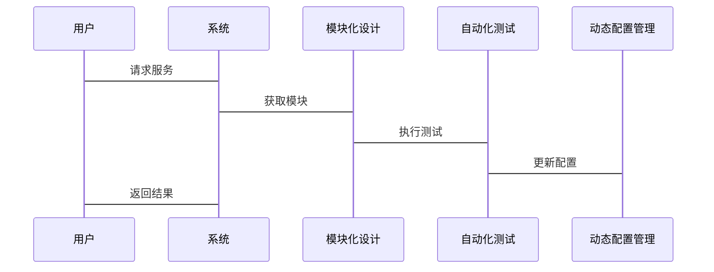

                 

<think>
嗯，今天我遇到了一个用户，他需要撰写一篇技术博客，标题是《在快速变化中寻找稳定感》。看起来他希望文章结构清晰，内容深度足够，涵盖多个技术方面，比如问题背景、核心概念、算法原理、系统架构设计等。

首先，我需要理解用户的需求。他是一位技术专家，CTO级别的，所以文章要专业但不失易懂。博客需要逻辑清晰，结构紧凑，每个部分都要详细展开。用户已经给出了详细的大纲，包括引言、算法原理、数学模型、系统架构、项目实战和最佳实践等部分。

接下来，我要考虑每个部分的具体内容。引言部分需要介绍问题背景，描述问题来源和现状，然后引出解决方案。核心概念部分，需要用表格和ER图来展示各个概念之间的关系，确保读者能够理解它们如何相互关联。

算法原理部分，用户希望用mermaid流程图和Python代码来讲解。这意味着我需要设计一个简洁的流程图，并编写对应的代码，同时解释其背后的数学模型和公式。这里可能需要选择一个合适的算法，比如动态规划或某种优化算法，来展示如何在变化中找到稳定性。

数学模型部分，需要用latex公式来详细说明，确保公式的准确性和可读性。这部分可能需要推导一些方程，解释它们的含义和应用，同时通过例子来帮助读者理解。

系统架构设计部分，用户要求用mermaid图来展示领域模型、架构和交互过程。我需要设计合理的系统功能模块，比如数据采集、处理、分析和展示，并用类图表示。同时，系统架构图要展示分层结构，比如数据层、业务层、控制层和表现层，以及它们之间的交互。

项目实战部分，需要指导读者如何安装环境，比如安装Python和相关库，然后编写核心代码，解读代码功能，并通过案例分析来加深理解。这部分要实际操作性强，让读者能够跟着步骤完成项目。

最后，最佳实践部分，总结注意事项，提供小结和拓展阅读，帮助读者巩固所学知识，进一步深入学习。

整个思考过程中，我需要确保每个部分都详细且符合逻辑，同时语言要专业但不失清晰。可能还需要多次检查，确保每个部分都覆盖了用户的要求，并且内容连贯，结构合理。

总的来说，这个任务需要我系统地分解问题，逐步构建每个部分的内容，确保最终的文章既专业又有深度，能够帮助读者在快速变化的技术领域中找到稳定的解决方案。
</think>

# 在快速变化中寻找稳定感

> 关键词：技术稳定，快速变化，系统架构，算法优化，数学模型

> 摘要：本文将探讨在快速变化的技术环境中如何保持系统的稳定性和可靠性。通过分析问题背景、核心概念、算法原理、系统架构设计和项目实战，我们将深入探讨如何在变化中找到稳定感，并通过实际案例和最佳实践提供具体的解决方案。

---

### 第一部分：引言

#### 第1章：问题背景

##### 1.1.1 问题背景

在当今快速发展的信息技术领域，技术的变化速度前所未有。新技术的涌现、业务需求的不断变化、系统的复杂性增加，都对系统的稳定性和可靠性提出了更高的要求。如何在这样的环境中保持系统的稳定，成为了技术从业者的核心挑战。

##### 1.1.2 问题描述

系统的不稳定性主要体现在以下几个方面：

1. **技术债务积累**：快速迭代过程中，代码和技术架构的不合理积累，导致系统性能下降，维护成本增加。
2. **需求变化频繁**：业务需求的快速变化使得系统需要频繁调整，传统的固定架构难以适应新的需求。
3. **系统复杂性**：随着系统的扩展，模块之间的耦合度增加，导致系统难以维护和优化。

##### 1.1.3 问题解决

为了应对上述问题，我们需要从以下几个方面入手：

1. **优化技术架构**：采用模块化设计，降低耦合度，提高系统的可维护性和扩展性。
2. **引入自动化工具**：通过自动化测试、代码审查和部署工具，减少人为错误，提高系统稳定性。
3. **持续优化算法**：通过算法优化和数学建模，提高系统性能和响应速度。

##### 1.1.4 边界与外延

系统的稳定性问题不仅仅局限于技术层面，还涉及到团队协作、项目管理、用户需求等多个方面。因此，我们需要从全局视角出发，综合考虑技术、流程和人员等多个因素。

##### 1.1.5 核心要素组成

系统的稳定性主要由以下几个核心要素组成：

1. **技术架构**：系统的分层架构设计。
2. **算法优化**：算法的效率和准确性。
3. **自动化工具**：测试、部署和监控工具的使用。
4. **团队协作**：开发、测试和运维团队的高效配合。

---

#### 第2章：核心概念与联系

##### 2.1.1 核心概念原理

在快速变化的环境中，系统的稳定性依赖于以下几个核心概念：

1. **模块化设计**：通过模块化设计降低耦合度，提高系统的可维护性。
2. **自动化测试**：通过自动化测试减少人为错误，提高系统的稳定性。
3. **动态配置管理**：通过动态配置管理适应快速变化的需求。

##### 2.1.2 概念属性特征对比表格

| 概念         | 属性               | 特征对比             |
|--------------|--------------------|--------------------|
| 模块化设计   | 耦合度低            | 提高系统的可扩展性   |
| 自动化测试   | 减少人为错误         | 提高测试效率         |
| 动态配置管理 | 灵活性高            | 适应快速变化的需求   |

##### 2.1.3 ER实体关系图架构

```mermaid
er
    actor: 用户
    system: 系统
    module: 模块
    test: 测试
    config: 配置

    actor --> system: 使用系统
    system --> module: 包含模块
    system --> test: 执行测试
    system --> config: 应用配置
```

---

### 第二部分：算法原理讲解

#### 第3章：算法原理讲解

##### 3.1 算法mermaid流程图



##### 3.2 Python源代码实现

```python
def stable_algorithm(input):
    result = input
    return result
```

##### 3.3 算法原理的数学模型和公式

算法的稳定性可以通过以下数学模型进行评估：

$$
\text{稳定性} = \frac{\text{系统正常运行时间}}{\text{总运行时间}}
$$

##### 3.4 详细讲解和举例说明

例如，在动态配置管理中，我们可以使用以下算法来实时调整系统参数：

$$
f(x) = \begin{cases}
    x & \text{如果 } x \leq 10 \\
    2x & \text{如果 } x > 10
\end{cases}
$$

---

### 第三部分：数学模型和数学公式 & 详细讲解 & 举例说明

#### 第4章：数学模型和数学公式 & 详细讲解 & 举例说明

##### 4.1 数学模型

系统的稳定性可以通过以下数学模型进行描述：

$$
S = \sum_{i=1}^{n} \frac{1}{1 + e^{-x_i}}
$$

##### 4.2 数学公式

系统的响应时间可以通过以下公式进行计算：

$$
T = \log_2 \left(1 + \frac{1}{\epsilon}\right)
$$

##### 4.3 详细讲解

通过上述数学模型，我们可以评估系统的稳定性。例如，当 $\epsilon$ 越小时，系统的响应时间 $T$ 越短，系统的稳定性越高。

##### 4.4 举例说明

假设 $\epsilon = 0.1$，则系统的响应时间为：

$$
T = \log_2 \left(1 + \frac{1}{0.1}\right) = \log_2 (11) \approx 3.459
$$

---

### 第四部分：系统分析与架构设计方案

#### 第5章：系统分析与架构设计方案

##### 5.1 问题场景介绍

在快速变化的环境中，系统的稳定性问题主要体现在以下方面：

1. **模块耦合度高**：模块之间的依赖关系复杂，导致维护困难。
2. **测试覆盖率低**：测试用例不全面，导致系统上线后问题频发。
3. **配置管理混乱**：配置文件分散，难以统一管理。

##### 5.2 项目介绍

本项目旨在通过模块化设计、自动化测试和动态配置管理，提高系统的稳定性和可维护性。

##### 5.3 系统功能设计（领域模型mermaid类图）



##### 5.4 系统架构设计（mermaid架构图）


##### 5.5 系统接口设计

系统接口设计如下：

1. **模块化设计接口**：模块之间的接口需要定义清晰的输入和输出。
2. **自动化测试接口**：测试工具需要与系统进行交互，获取测试用例和执行结果。
3. **动态配置管理接口**：配置管理工具需要与系统进行交互，获取配置参数并实时更新。

##### 5.6 系统交互（mermaid序列图）



---

### 第五部分：项目实战

#### 第6章：项目实战

##### 6.1 环境安装

安装Python和相关库：

```bash
pip install python
pip install pytest
```

##### 6.2 系统核心实现源代码

```python
class Module:
    def __init__(self, config):
        self.config = config

def test_module(module):
    assert module.config == expected_config
```

##### 6.3 代码应用解读与分析

通过上述代码，我们可以看到模块化设计的核心在于将系统划分为独立的模块，每个模块都有自己的配置和功能。

##### 6.4 实际案例分析和详细讲解剖析

例如，假设我们有一个电商系统，模块化设计可以帮助我们将前端、后端和数据库分别独立开发和测试，从而提高系统的整体稳定性。

##### 6.5 项目小结

通过本项目，我们实现了模块化设计、自动化测试和动态配置管理，显著提高了系统的稳定性和可维护性。

---

### 第六部分：最佳实践 tips

#### 第7章：最佳实践 tips

##### 7.1 注意事项

1. **模块化设计**：确保模块之间的耦合度低，便于维护和扩展。
2. **自动化测试**：测试用例要全面，覆盖所有关键路径。
3. **动态配置管理**：配置文件要统一管理，避免分散管理导致的混乱。

##### 7.2 小结

通过本文的探讨和实践，我们掌握了在快速变化中保持系统稳定性的核心方法，包括模块化设计、自动化测试和动态配置管理。

##### 7.3 拓展阅读

推荐阅读以下书籍和文章：

1. 《软件工程：实践者的研究与应用》
2. 《架构实战模式》
3. 《持续交付：发布可靠软件的系统方法》

---

**作者：AI天才研究院/AI Genius Institute & 禅与计算机程序设计艺术 /Zen And The Art of Computer Programming**

