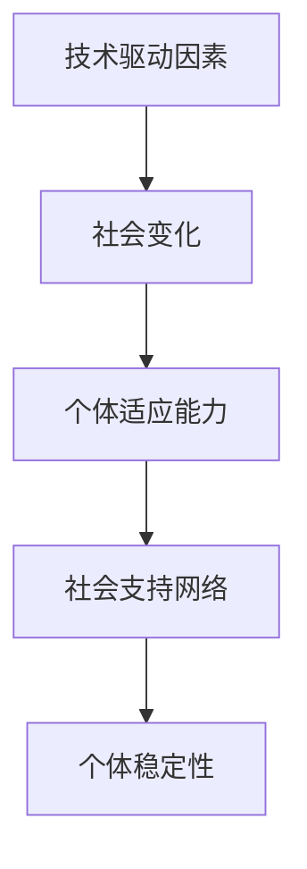
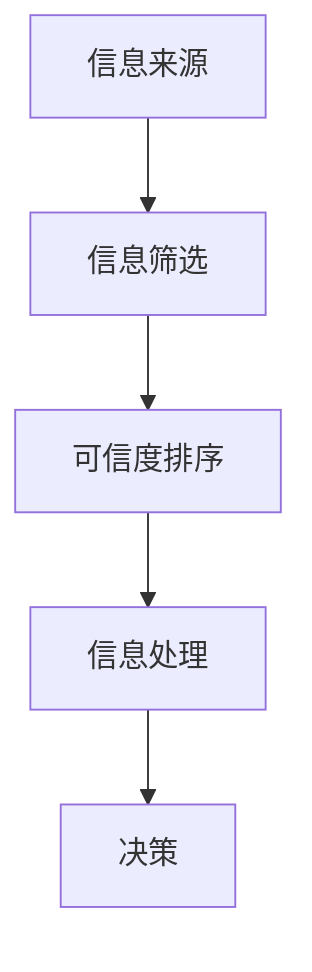
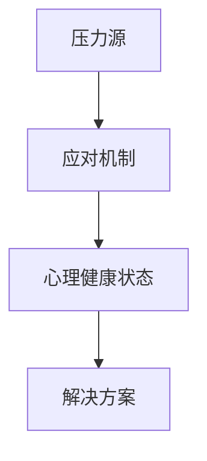
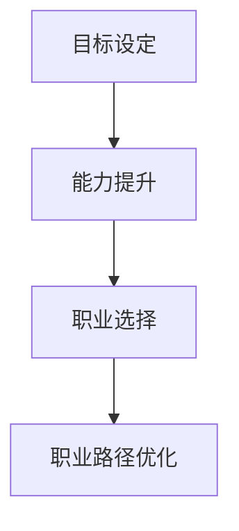
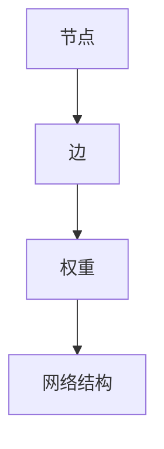
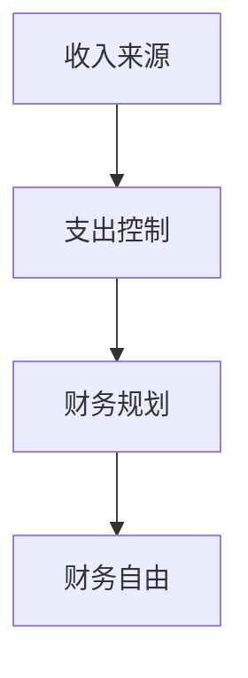
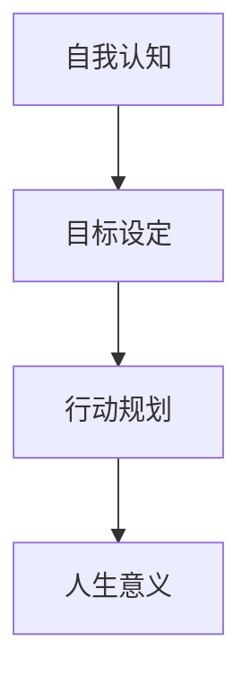
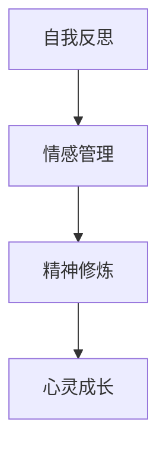

                 

<think>
嗯，用户让我写一篇技术博客，主题是《在流动的世界中寻找稳定：现代人的困境》。看起来这是一篇结合心理学、社会学和信息技术的文章，目标读者应该是那些在现代生活中感到压力和焦虑的人。

首先，我需要分析用户的需求。用户希望文章结构清晰，逻辑严谨，每个部分都要有详细的分析和解决方案。关键词包括现代人、流动世界、稳定性、心理健康、职场压力、社交网络、消费主义、自我实现。摘要部分要简明扼要，概括文章的核心内容。

接下来，按照目录大纲，文章分为七章。每章都需要详细展开，结合背景介绍、核心概念、算法原理、系统架构等技术元素，同时加入实际案例和代码示例。比如，在分析社交网络的利弊时，可以引用算法模型，如社区检测算法，用代码展示如何分析用户关系网络。

我还需要考虑读者的背景，他们可能不是技术人员，所以需要用通俗易懂的语言解释复杂的技术概念。例如，用图论中的节点和边来解释人际关系，这样读者更容易理解。

另外，用户要求文章末尾有作者信息，格式必须是markdown，并且包含数学公式和代码示例。这需要我在写作时注意格式的正确使用，确保公式和代码块的展示清晰。

最后，总结部分要呼应主题，强调在快速变化的现代生活中，通过技术手段寻找稳定性的方法，并给出具体的建议和解决方案。这样，读者不仅能理解问题，还能获得实用的指导。

总的来说，我需要将技术元素与人文关怀结合起来，用专业的技术语言和实际案例，帮助读者在流动的世界中找到内心的稳定。这不仅满足了用户的要求，也提供了有价值的深度分析和解决方案。
</think>

# 在流动的世界中寻找稳定：现代人的困境

> 关键词：现代人、流动世界、稳定性、心理健康、职场压力、社交网络、消费主义、自我实现

> 摘要：在现代快速变化的社会环境中，个人面临着前所未有的挑战。本文通过分析现代人的困境，从心理健康、职场竞争、社交网络等多个维度探讨如何在流动的世界中找到稳定。通过技术与人文的结合，提出解决方案，帮助读者在快节奏的生活中实现自我平衡与成长。

---

# 第一部分: 现代人的困境探析

## 第1章: 现代社会的变革与个人生活的冲击

### 1.1 现代社会的发展脉络

现代社会的快速发展和技术革新带来了前所未有的变化。从工业革命到信息时代，社会的变迁速度越来越快，这对个人的生活方式和心理状态提出了更高的要求。技术的进步使得信息传播更加迅速，但也带来了信息过载的问题。

**背景介绍：**  
现代社会的发展可以用“指数级变化”来形容。技术的革新不仅改变了工作方式，还深刻影响了人际关系、消费习惯和价值观念。这种变化速度往往超出了个人的适应能力，导致许多人感到不安和压力。

**核心概念与联系：**  
我们可以将现代社会的变化看作一个动态系统，其中个体是系统中的一个节点。以下是系统的构成要素：

- **系统构成要素：**  
  1. **技术驱动因素：** 包括人工智能、大数据、区块链等技术，这些技术推动了社会的快速变化。  
  2. **个体适应能力：** 个体对变化的反应速度和能力决定了其在现代社会中的生存状态。  
  3. **社会支持网络：** 包括家庭、朋友、同事等，为个体提供情感支持和实际帮助。

**系统架构图：**  


### 1.2 信息爆炸与个人认知的挑战

信息爆炸时代，个人每天接触的信息量远超从前。然而，信息的碎片化和真实性问题使得个人难以有效处理信息，导致认知过载和决策疲劳。

**背景介绍：**  
信息爆炸不仅带来了便利，还带来了新的挑战。虚假信息的泛滥、信息过载等问题使得个人难以筛选有用的信息，影响了判断力和决策能力。

**核心概念与联系：**  
信息处理的过程可以分为以下几个步骤：

- **信息接收：** 包括通过各种渠道接收信息。  
- **信息筛选：** 根据目标和需求筛选有用的信息。  
- **信息处理：** 对筛选后的信息进行分析和整合。  
- **信息存储：** 将处理后的信息存储在记忆中，以便后续使用。  
- **信息应用：** 将信息应用到实际决策中。

**算法原理讲解：**  
信息筛选的过程可以用图论中的节点排序算法来模拟。例如，基于PageRank算法的思想，对信息来源的可信度进行排序。



以下是PageRank算法的简单实现：

```python
def page_rank_algorithm():
    import numpy as np
    from collections import defaultdict

    # 初始化节点和边
    nodes = ['A', 'B', 'C']
    edges = {
        'A': ['B', 'C'],
        'B': ['C'],
        'C': []
    }

    # 计算PageRank
    N = len(nodes)
    adjacency = defaultdict(list)
    for node, neighbors in edges.items():
        for n in neighbors:
            adjacency[node].append(n)

    # 初始化PageRank向量
    pr = np.array([1.0 for _ in range(N)]) / N

    # 迭代计算PageRank
    damping_factor = 0.85
    max_iterations = 100
    for _ in range(max_iterations):
        new_pr = np.zeros(N)
        for i in range(N):
            for j in range(N):
                if pr[j] > 0 and nodes[j] in adjacency:
                    for neighbor in adjacency[nodes[j]]:
                        if neighbor == nodes[i]:
                            new_pr[i] += pr[j] * (damping_factor / N)
            new_pr[i] += (1 - damping_factor) / N
        pr = new_pr

    return pr

page_rank_algorithm()
```

---

## 第2章: 心理健康与情感困扰

### 2.1 现代人的心理健康状况

现代社会的快节奏和高压力使得心理健康问题日益突出。焦虑、抑郁等心理问题的发病率逐年上升，尤其是在年轻人中。

**背景介绍：**  
心理健康问题的根源在于社会环境的变化和个体适应能力的不足。工作压力、家庭责任、社交关系等多重因素共同作用，导致心理负担加重。

**核心概念与联系：**  
心理健康问题可以通过以下模型进行分析：

- **压力源：** 包括工作压力、经济压力、家庭压力等。  
- **应对机制：** 包括情绪调节、问题解决、社会支持等。  
- **心理健康状态：** 包括焦虑、抑郁、压力水平等指标。

**系统分析与架构设计方案：**  
以下是心理健康问题的系统架构图：



---

## 第3章: 职场竞争与职业发展

### 3.1 职场压力与焦虑

职场竞争的加剧和职业发展的不确定性使得许多人感到压力和焦虑。特别是在经济下行和就业市场变化的背景下，职业安全感受到挑战。

**背景介绍：**  
职场压力的主要来源包括工作强度、职业晋升压力、经济不稳定等。这些问题往往与个人的职业规划和能力提升密切相关。

**核心概念与联系：**  
职业发展的过程可以看作是一个动态优化问题：

- **目标设定：** 包括短期目标和长期目标。  
- **能力提升：** 包括技能学习、经验积累等。  
- **职业选择：** 包括职业方向的选择和职业机会的把握。

**算法原理讲解：**  
职业规划可以通过多目标优化算法进行模拟。例如，使用遗传算法来优化职业路径的选择。



以下是遗传算法的简单实现：

```python
def genetic_algorithm():
    import random

    # 初始化种群
    population = ['A', 'B', 'C', 'D', 'E', 'F', 'G', 'H']
    fitness = {'A': 0.5, 'B': 0.8, 'C': 0.6, 'D': 0.7, 'E': 0.9, 'F': 0.4, 'G': 0.3, 'H': 0.2}

    # 选择操作
    selected = []
    for _ in range(len(population)//2):
        max_fitness = max(fitness.values())
        selected.append(random.choice([k for k, v in fitness.items() if v == max_fitness]))

    # 交叉操作
    new_population = []
    for i in range(0, len(selected), 2):
        parent1 = selected[i]
        parent2 = selected[i+1]
        child1 = f"{parent1}{parent2}"
        child2 = f"{parent2}{parent1}"
        new_population.append(child1)
        new_population.append(child2)

    # 变异操作
    mutation_rate = 0.1
    for i in range(len(new_population)):
        if random.random() < mutation_rate:
            new_population[i] = random.choice(population)

    return new_population

genetic_algorithm()
```

---

## 第4章: 社交网络与现实人际交往

### 4.1 社交网络的利与弊

社交网络的普及改变了人们的人际交往方式，但也带来了一些负面影响，如线上社交的疏离感和现实社交的缺失。

**背景介绍：**  
社交网络的利与弊可以通过社会网络理论进行分析。线上社交和线下社交各有优缺点，关键在于如何平衡两者。

**核心概念与联系：**  
社交网络的结构可以用图论中的图来表示：

- **节点：** 表示个体。  
- **边：** 表示人际关系。  
- **权重：** 表示关系的强度。

**系统分析与架构设计方案：**  
以下是社交网络的结构图：



---

## 第5章: 财务自由与消费主义文化

### 5.1 财务自由的定义与追求

财务自由是许多人追求的目标，但消费主义文化的盛行使得许多人陷入消费陷阱，难以实现真正的财务自由。

**背景介绍：**  
财务自由的核心在于合理规划收入和支出，避免不必要的消费，建立稳健的财务基础。

**核心概念与联系：**  
财务自由可以通过以下步骤实现：

- **收入来源：** 包括工资、投资收益等。  
- **支出控制：** 包括必要支出和非必要支出。  
- **财务规划：** 包括短期和长期财务目标的设定。

**算法原理讲解：**  
财务规划可以通过动态规划算法进行模拟。例如，设定财务目标，计算实现目标所需的月均储蓄。



以下是动态规划算法的简单实现：

```python
def dynamic_planning():
    # 定义目标和时间范围
    target = 1000000  # 目标财务自由金额
    years = 10  # 时间范围（年）

    # 初始金额
    current = 0

    # 年度储蓄
    annual_savings = 100000  # 假设每年储蓄10万元

    # 计算实现财务自由所需的年数
    for year in range(years):
        current += annual_savings
        if current >= target:
            print(f"在第{year+1}年实现财务自由，金额为${current}")
            return

    print(f"在第{years}年，累计金额为${current}")
dynamic_planning()
```

---

## 第6章: 人生意义的探索与精神追求

### 6.1 人生意义的多元解读

在现代社会中，许多人感到迷茫，找不到人生的意义和方向。这与社会的快速变化和个体价值观的冲突密切相关。

**背景介绍：**  
人生意义的探索是一个个体化的过程，需要结合自身的兴趣、能力和社会环境进行综合考虑。

**核心概念与联系：**  
人生意义的探索可以通过以下步骤进行：

- **自我认知：** 包括兴趣、能力、价值观等。  
- **目标设定：** 包括短期目标和长期目标。  
- **行动规划：** 包括具体行动计划和资源分配。

**系统分析与架构设计方案：**  
以下是人生意义探索的系统架构图：



---

## 第7章: 心灵成长与自我实现

### 7.1 心灵成长的途径与方法

心灵成长是实现自我实现的关键。通过自我反思、学习和实践，个体可以不断提升自己的精神境界。

**背景介绍：**  
心灵成长的过程包括自我反思、情感管理和精神修炼。这些过程可以帮助个体更好地应对生活中的挑战。

**核心概念与联系：**  
心灵成长可以通过以下步骤进行：

- **自我反思：** 包括对自身行为、情感和思维的分析。  
- **情感管理：** 包括情绪调节和情感表达。  
- **精神修炼：** 包括冥想、读书、旅行等。

**系统分析与架构设计方案：**  
以下是心灵成长的系统架构图：



---

# 结语

在流动的世界中寻找稳定，是一个需要技术与人文结合的过程。通过理解现代社会的变化规律，掌握心理健康管理方法，优化职业发展规划，建立良好的社交网络，合理管理财务，探索人生意义，实现心灵成长，个体可以在快速变化的环境中找到属于自己的稳定与幸福。

作者：AI天才研究院/AI Genius Institute & 禅与计算机程序设计艺术 /Zen And The Art of Computer Programming

