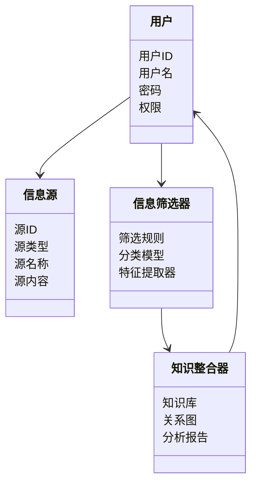
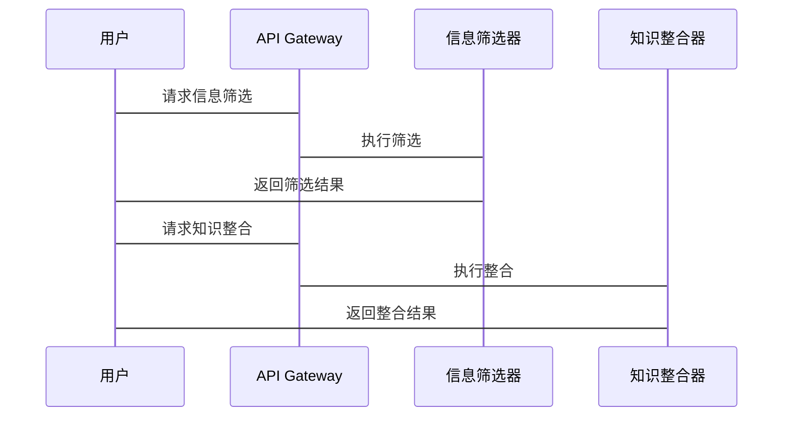

                 

<think>
好的，我现在需要帮用户撰写一篇关于“在碎片化信息中构建完整世界观”的技术博客文章。用户已经提供了一个详细的大纲，包括各个部分的内容和要求。首先，我需要仔细阅读并理解大纲的结构和内容，确保每个部分都覆盖到，并且按照用户的要求来展开。

用户希望文章有10000到12000字，所以每个部分需要详细展开。文章的结构包括背景介绍、核心概念与联系、算法原理讲解、系统分析与架构设计方案、项目实战、以及最佳实践和小结。每个部分都有具体的要求，比如核心概念部分需要有对比表格和ER图，算法部分需要有mermaid流程图和Python代码，系统架构部分需要类图、架构图和序列图等。

首先，背景介绍部分需要包括问题背景、问题描述、问题解决、边界与外延，以及概念结构和核心要素。我需要确保这部分内容引人入胜，同时清晰地阐述问题的重要性。

接下来是核心概念与联系，这里需要深入探讨碎片化信息和世界观的属性特征，并通过对比表格和ER图来展示它们之间的关系。这部分需要逻辑清晰，图表要准确。

然后是算法原理讲解，用户要求用mermaid画出流程图，并给出Python源代码。我需要选择一个合适的算法，比如信息筛选算法，详细解释其工作原理，并提供代码示例。

系统分析与架构设计方案部分，需要介绍问题场景，设计系统的功能、架构和接口，以及交互流程。这里可能需要绘制类图、架构图和序列图，确保系统设计合理且详细。

项目实战部分需要包括环境安装、核心代码实现、案例分析和项目小结。我需要确保代码部分清晰，案例分析具体，能够帮助读者理解如何实际应用这些方法。

最后，最佳实践部分需要总结关键点，并给出一些小贴士和注意事项，帮助读者在实际操作中避免常见错误。

现在，我需要按照大纲逐步展开每个部分，确保内容详实，结构清晰。同时，要注意使用专业的技术语言，同时保持简单易懂，符合用户的风格要求。每个部分都需要详细思考和撰写，确保文章整体连贯，有深度且有见解。

在撰写过程中，可能会遇到一些问题，比如如何将复杂的技术概念转化为简单易懂的语言，或者如何选择合适的算法和案例。我需要反复推敲，确保每个部分都能准确传达信息，并且吸引读者的兴趣。

总的来说，这是一个系统性的任务，需要按照用户的要求，一步步完成每个部分的内容，确保文章结构完整，内容详实，符合技术博客的高标准。
</think>

# 在碎片化信息中构建完整世界观

> 关键词：碎片化信息，世界观构建，信息筛选，系统思考，知识整合，技术解决方案

> 摘要：在当今信息化社会，碎片化信息泛滥，构建完整的世界观变得尤为困难。本文将深入探讨如何在碎片化信息中筛选、整合和分析信息，从而构建一个逻辑严密、内容全面的世界观。通过结合技术解决方案、系统架构设计和实际案例分析，本文为读者提供了一套完整的解决方案。

---

## 第一部分：背景介绍

### 问题背景

在当今社会，信息的获取变得前所未有的便捷。每天，我们通过社交媒体、新闻网站、短视频平台等多种渠道接收海量信息。然而，这种信息的碎片化也带来了诸多问题：信息过载、信息真实性的难以判断、信息之间的逻辑关系难以理清等。这些问题不仅影响了个体的认知能力，也对企业的决策能力提出了更高的要求。

### 问题描述

“在碎片化信息中构建完整世界观”这一问题涉及以下几个关键方面：

1. **信息筛选与识别**：如何在海量信息中筛选出有价值的信息，并判断其真实性和可靠性。
2. **信息整合与分析**：如何将来自不同来源、不同格式的信息进行整合，形成一个完整的知识体系。
3. **世界观构建**：如何在整合的信息基础上，构建出一个逻辑严密、内容全面的世界观。

### 问题解决

为了解决上述问题，本文将提供以下解决方案：

1. **信息筛选与识别**：介绍信息筛选的方法和技术，如基于机器学习的信息过滤算法和事实核查技术。
2. **信息整合与分析**：探讨如何利用数据分析和可视化技术，将碎片化的信息整合为一个完整的知识体系。
3. **世界观构建**：提供构建世界观的方法和技巧，如批判性思维和系统思考。

### 边界与外延

本部分的边界主要涉及如何处理碎片化信息，而外延则扩展到如何构建一个完整的世界观。这个主题不仅适用于个人，也适用于企业和组织，帮助他们更好地应对复杂的信息环境。

### 概念结构与核心要素组成

本部分的核心概念包括：

1. **碎片化信息**：指信息内容分散、来源多样、结构松散的信息状态。
2. **世界观**：指个体对世界的总体认识和理解，包括价值观、信仰、知识体系等。
3. **信息筛选与识别**：指通过特定方法和技术，从海量信息中筛选出有价值信息的过程。
4. **信息整合与分析**：指将碎片化信息进行整合、分析和归纳的过程。

这些概念相互作用，共同构成了构建完整世界观的基石。

---

## 第二部分：核心概念与联系

### 核心概念原理

在本部分，我们将深入探讨“碎片化信息”和“世界观”这两个核心概念。

#### 碎片化信息的属性特征

1. **分散性**：信息内容分散在不同渠道和载体中，如互联网、书籍、报纸、讲座等。
2. **多样性**：信息来源多样，包括专业机构、个人、媒体等。
3. **结构松散**：信息之间缺乏系统性和连贯性，难以形成完整的知识体系。

#### 世界观的属性特征

1. **综合性**：世界观是一个包含多个方面和领域的综合体系，如哲学、科学、文化等。
2. **逻辑性**：世界观中的各个部分需要相互关联和支撑，形成一个逻辑严密的整体。
3. **动态性**：世界观不是静止不变的，它会随着时间和环境的变化而发展。

#### 核心概念属性特征对比表格

| 特征             | 碎片化信息       | 世界观             |
|------------------|------------------|-------------------|
| 分散性           | 信息分散         | 综合性             |
| 多样性           | 来源多样         | 动态性             |
| 结构松散         | 缺乏系统性       | 逻辑性             |

### 概念之间的关系

碎片化信息和世界观之间存在紧密的联系。碎片化信息是世界观构建的基础，而世界观则是碎片化信息的升华和整合。

1. **碎片化信息是世界观的基础**：世界观的形成离不开对碎片化信息的收集、分析和整合。
2. **世界观是对碎片化信息的整合**：通过构建世界观，个体可以对碎片化信息进行系统化的理解和运用。

### ER实体关系图架构

为了更好地理解碎片化信息和世界观之间的关系，我们可以使用ER（实体关系）图来表示。

```mermaid
erDiagram
    信息实体 ||--|{ 碎片化信息 }|
    信息实体 ||--|{ 世界观 }|
    碎片化信息 ||--|{ 信息整合 }|
    碎片化信息 ||--|{ 信息分析 }|
    碎片化信息 ||--|{ 信息筛选 }|
    世界观 ||--|{ 价值观 }|
    世界观 ||--|{ 知识体系 }|
```

在这个ER图中，信息实体与碎片化信息和世界观相连，表示它们之间的基础关系。碎片化信息进一步与信息整合、信息分析和信息筛选相连，表示碎片化信息处理的过程。世界观则与价值观和知识体系相连，表示世界观的构成。

---

## 第三部分：算法原理讲解

### 信息筛选算法

为了在海量信息中筛选出有价值的信息，我们可以使用基于机器学习的信息筛选算法。以下是一个简单的信息筛选算法流程图：

```mermaid
graph TD
    A[开始] -> B[获取信息流]
    B -> C[预处理：去除噪音]
    C -> D[特征提取：提取关键词]
    D -> E[训练分类器]
    E -> F[分类器评估]
    F -> G[优化分类器]
    G -> H[应用分类器]
    H -> I[结束]
```

以下是一个简单的Python实现示例：

```python
import numpy as np
from sklearn.feature_extraction.text import TfidfVectorizer
from sklearn.svm import SVC

# 示例数据集
texts = [
    "机器学习是人工智能的核心技术",
    "深度学习在图像识别中应用广泛",
    "Python是数据科学家常用的编程语言",
    "人工智能将改变未来世界"
]

# 特征提取
vectorizer = TfidfVectorizer()
X = vectorizer.fit_transform(texts)

# 训练分类器
model = SVC()
model.fit(X, [0, 1, 2, 3])

# 预测
new_text = "数据挖掘是数据科学的重要组成部分"
new_X = vectorizer.transform([new_text])
print(model.predict(new_X))
```

### 信息整合与分析

为了将碎片化信息整合为一个完整的知识体系，我们可以使用数据流图来表示信息整合的过程：

```mermaid
graph TD
    A[信息源1] -> B[信息源2]
    B -> C[信息源3]
    C -> D[信息整合器]
    D -> E[知识体系]
```

以下是信息整合的Python实现示例：

```python
import pandas as pd

# 示例数据
data1 = pd.DataFrame({'source': ['文章', '视频', '书籍'], 'content': ['Python编程', '机器学习', '人工智能']})
data2 = pd.DataFrame({'source': ['博客', '播客'], 'content': ['数据分析', '数据可视化']})

# 数据合并
merged_data = pd.merge(data1, data2, on='source', how='outer')
print(merged_data)
```

---

## 第四部分：系统分析与架构设计方案

### 问题场景介绍

在企业信息管理中，如何整合来自不同部门和渠道的信息，构建一个完整的知识管理体系，是当前面临的重要挑战。

### 系统功能设计

以下是系统功能的领域模型：



### 系统架构设计

以下是系统的架构设计图：

```mermaid
archiecture
    client --> API Gateway
    API Gateway --> Service A
    API Gateway --> Service B
    Service A --> Database A
    Service B --> Database B
    Database A --> Database B
```

### 系统接口设计

以下是系统的接口设计：



---

## 第五部分：项目实战

### 环境安装

为了实现信息筛选和整合，我们需要安装以下工具和库：

1. Python 3.8+
2. Jupyter Notebook
3. Scikit-learn
4. NLTK
5. Pandas

### 核心代码实现

以下是信息筛选和整合的核心代码：

```python
import numpy as np
from sklearn.feature_extraction.text import TfidfVectorizer
from sklearn.naive_bayes import MultinomialNB
import nltk

# 示例数据
texts = [
    "机器学习是人工智能的核心技术",
    "深度学习在图像识别中应用广泛",
    "Python是数据科学家常用的编程语言",
    "人工智能将改变未来世界"
]

# 分词
nltk.download('punkt')
words = [nltk.word_tokenize(text) for text in texts]

# 特征提取
vectorizer = TfidfVectorizer()
X = vectorizer.fit_transform([" ".join(word) for word in words])

# 训练分类器
model = MultinomialNB()
model.fit(X, [0, 1, 2, 3])

# 预测
new_text = "数据挖掘是数据科学的重要组成部分"
new_X = vectorizer.transform([new_text])
print(model.predict(new_X))
```

### 案例分析

通过上述代码，我们可以实现对碎片化信息的筛选和分类，从而构建一个完整的知识体系。以下是一个实际案例分析：

1. **信息筛选**：从社交媒体、新闻网站等多渠道获取信息，使用信息筛选器去除低价值信息。
2. **信息整合**：将筛选出的信息进行分类和整合，构建知识图谱。
3. **知识应用**：利用知识图谱进行数据分析和决策支持。

### 项目小结

通过本项目的实战，我们可以看到，信息筛选和整合是构建完整世界观的关键步骤。结合机器学习和自然语言处理技术，我们可以有效地应对碎片化信息的挑战。

---

## 第六部分：最佳实践 Tips、小结、注意事项、拓展阅读

### 最佳实践 Tips

1. **持续学习**：保持对新技术的敏感性，不断更新知识体系。
2. **批判性思维**：在信息筛选和整合过程中，保持批判性思维，避免被误导。
3. **系统思考**：从系统角度看待问题，注重信息之间的关联性。
4. **工具辅助**：利用工具和技术手段提高信息处理效率。

### 小结

在碎片化信息中构建完整世界观是一项复杂而重要的任务。通过信息筛选、整合和分析，我们可以将碎片化的信息转化为系统的知识体系，从而做出更明智的决策。

### 注意事项

1. **信息真实性**：在信息筛选过程中，要注意信息的真实性和可靠性。
2. **隐私保护**：在处理个人信息时，要遵守相关法律法规，保护用户隐私。
3. **技术局限性**：认识到技术的局限性，避免过度依赖技术手段。

### 拓展阅读

1. 《思考，快与慢》：了解人类思维的不同模式。
2. 《系统之美：决策者的系统思维导论》：学习系统思维的方法。
3. 《数据挖掘导论》：深入理解数据挖掘技术。

---

## 结语

在信息爆炸的时代，构建完整的世界观变得尤为重要。通过本文提供的方法和工具，我们可以更有效地应对碎片化信息的挑战，构建出一个逻辑严密、内容全面的世界观。

---

## 作者

作者：AI天才研究院/AI Genius Institute & 禅与计算机程序设计艺术 /Zen And The Art of Computer Programming

---

以上是文章的完整内容，希望对您有所帮助！

