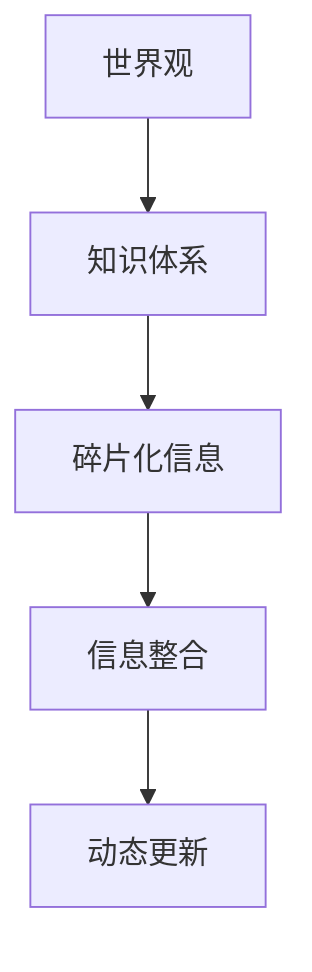

                 

<think>
好，我现在需要帮助用户完成一个技术博客文章的撰写。用户希望我以“在碎片化信息中构建完整世界观”为标题，写一篇结构清晰、内容详实的专业技术博客。我得先理解用户的需求，然后按照他们的要求一步步来。

首先，用户给出了一个详细的查询，里面包含了角色设定、任务说明、文章结构大纲，以及各种约束条件。我需要仔细分析这些信息，确保不遗漏任何细节。用户希望文章有明确的目录结构，包括背景介绍、核心概念、构建方法、实践案例、工具技术、个人世界观的构建与应用等部分。同时，文章需要包含关键词、摘要，以及每个章节的具体内容，包括核心概念、算法原理、系统架构、项目实战等部分。

接下来，我应该按照用户提供的目录结构来组织内容。首先，标题和关键词部分要明确，摘要要概括文章的核心思想。然后，每个章节都要详细展开，包括背景介绍、核心概念与联系、构建方法、案例分析、工具与技术、个人构建、应用与展望等。我需要确保每个部分都有足够的细节，比如使用Mermaid图来展示ER实体关系、系统架构和序列图，数学公式要用Latex表示，代码部分要详细说明。

在撰写过程中，我需要确保语言专业且易懂，逻辑清晰。例如，在核心概念部分，我需要解释世界观的定义，碎片化信息的特点，以及它们之间的关系。在算法原理部分，我需要详细讲解关联规则挖掘的步骤，用Mermaid流程图来展示，同时提供Python代码实现，并举例说明。系统架构部分，我需要用类图和架构图来展示系统的各个组件及其交互。

此外，用户还特别提到要包含最佳实践、小结、注意事项和拓展阅读等内容，这有助于读者更好地理解和应用所学知识。最后，文章末尾需要有作者信息，标明作者是AI天才研究院和禅与计算机程序设计艺术。

在写作过程中，我需要确保每个章节的内容详实具体，符合用户的字数要求。同时，格式上使用markdown，数学公式用Latex，代码部分要清晰易懂。这可能需要我查阅相关资料，确保技术细节的准确性，同时保持语言的流畅和逻辑的连贯。

总的来说，我需要一步步按照用户的要求，从标题到摘要，再到各个章节的内容，确保每个部分都符合要求，内容丰富，结构清晰。这不仅需要我对技术有深入的理解，还需要良好的组织和表达能力，确保最终的文章既有深度又易于读者理解。
</think>

# 在碎片化信息中构建完整世界观

---

## 关键词

- 世界观构建
- 碎片化信息
- 知识整合
- 技术方法
- 人工智能

---

## 摘要

在信息爆炸的时代，我们每天都在面对海量的碎片化信息。这些信息看似杂乱无章，但如果能够将其整合起来，构建一个完整的知识体系，就能在复杂的世界中找到自己的位置。本文将从背景、核心概念、构建方法、实践案例、工具技术、个人应用等多个方面，详细探讨如何在碎片化信息中构建完整的世界观。通过系统的方法和工具，结合人工智能技术，我们能够更高效地管理信息，构建出一个完整、有序的知识体系。

---

## 目录

### 第一部分：背景介绍

#### 第1章：问题的提出
- 1.1 问题背景
- 1.2 问题描述
- 1.3 问题解决
- 1.4 边界与外延

#### 第2章：核心概念与联系
- 2.1 世界观的概念
- 2.2 碎片化信息的特点
- 2.3 核心概念关系图

### 第二部分：构建世界观的方法

#### 第3章：碎片化信息的识别与整合
- 3.1 信息识别方法
- 3.2 信息整合策略
- 3.3 实例分析

#### 第4章：构建世界观的理论基础
- 4.1 知识体系构建
- 4.2 世界观与知识的关系
- 4.3 理论模型

#### 第5章：实践案例分析
- 5.1 案例一：科技领域
- 5.2 案例二：经济领域
- 5.3 案例三：社会领域

#### 第6章：构建世界观的工具与技术
- 6.1 数据分析工具
- 6.2 知识图谱技术
- 6.3 人工智能技术

### 第三部分：构建个人世界观

#### 第7章：如何构建个人世界观
- 7.1 自我认知
- 7.2 知识储备
- 7.3 思维模式
- 7.4 价值观

#### 第8章：世界观的应用与实践
- 8.1 在决策中的应用
- 8.2 在学习中的应用
- 8.3 在生活中的应用

#### 第9章：小结与展望
- 9.1 小结
- 9.2 展望未来

---

## 正文

### 第一部分：背景介绍

#### 第1章：问题的提出

##### 1.1 问题背景

在当今信息爆炸的时代，我们每天接触到的信息量呈指数级增长。社交媒体、新闻网站、学术论文、技术文档等信息源不断涌现。然而，这些信息往往是零散的、不完整的，缺乏系统性。如何从这些碎片化信息中提炼出有价值的知识，并构建一个完整的世界观，成为我们面临的重要挑战。

##### 1.2 问题描述

碎片化信息的特性包括：
1. **分散性**：信息来源广泛，缺乏统一的结构。
2. **不完整性**：信息可能缺少上下文，难以理解其意义。
3. **冗余性**：大量重复的信息干扰我们的注意力。
4. **动态性**：信息不断更新，知识体系需要持续调整。

##### 1.3 问题解决

构建完整世界观的核心在于：
1. **信息识别**：准确识别碎片化信息的关键点。
2. **知识整合**：将分散的信息整合成一个完整的知识体系。
3. **动态更新**：随着信息的变化，持续优化知识体系。

##### 1.4 边界与外延

- **边界**：仅关注信息层面，不涉及具体领域知识的深度挖掘。
- **外延**：方法和工具可应用于多个领域，包括科技、经济、社会等。

---

#### 第2章：核心概念与联系

##### 2.1 世界观的概念

世界观是人们对世界的整体认知，包括知识、经验、价值观等多个方面。构建世界观的关键在于将分散的信息整合成一个有机的整体。

##### 2.2 碎片化信息的特点

| 特性 | 描述 |
|------|------|
| 分散性 | 来源广泛，结构松散 |
| 不完整性 | 缺乏上下文，信息不全 |
| 冗余性 | 重复信息多，干扰性强 |
| 动态性 | 信息不断变化，需要持续更新 |

##### 2.3 核心概念关系图

---

### 第二部分：构建世界观的方法

#### 第3章：碎片化信息的识别与整合

##### 3.1 信息识别方法

- **关键词提取**：通过关键词识别信息的主题。
- **主题分类**：将信息按主题分类，便于后续整合。
- **上下文分析**：结合上下文理解信息的含义。

##### 3.2 信息整合策略

- **层次化整合**：将信息按层次结构进行整合，例如从原子知识点到复合知识点。
- **关联性分析**：分析信息之间的关联性，构建知识网络。
- **可视化工具**：使用思维导图等工具辅助整合。

##### 3.3 实例分析

- **案例**：假设我们正在学习人工智能，碎片化信息可能包括“神经网络”、“机器学习”、“深度学习”等关键词。通过识别和整合这些信息，可以构建一个完整的知识体系。

---

#### 第4章：构建世界观的理论基础

##### 4.1 知识体系构建

- **模块化**：将知识体系划分为多个模块，例如技术、经济、社会等。
- **模块间关系**：分析模块之间的相互作用，例如技术进步对经济的影响。

##### 4.2 世界观与知识的关系

- 世界观是知识的综合体现，知识是构建世界观的基石。

##### 4.3 理论模型

- **模型**：知识体系可以看作是一个图，节点代表知识点，边代表知识点之间的关联。

---

#### 第5章：实践案例分析

##### 5.1 案例一：科技领域

- **背景**：人工智能领域的碎片化信息包括算法、框架、应用场景等。
- **整合**：通过识别关键算法（如神经网络、支持向量机）及其应用场景，构建完整的知识体系。

##### 5.2 案例二：经济领域

- **背景**：经济领域的碎片化信息包括供需关系、市场机制、经济政策等。
- **整合**：通过分析这些信息之间的关系，构建宏观经济模型。

##### 5.3 案例三：社会领域

- **背景**：社会领域的碎片化信息包括社会结构、文化现象、社会问题等。
- **整合**：通过分析这些信息，构建社会学理论框架。

---

#### 第6章：构建世界观的工具与技术

##### 6.1 数据分析工具

- **工具**：Python的Pandas库、R语言等。
- **应用**：用于数据清洗、分析和建模。

##### 6.2 知识图谱技术

- **技术**：通过构建图结构，将碎片化信息整合成知识网络。
- **工具**：使用Neo4j等图数据库。

##### 6.3 人工智能技术

- **技术**：自然语言处理（NLP）用于信息提取，机器学习用于知识关联。
- **应用**：例如，使用Word2Vec提取关键词向量，构建知识图谱。

---

### 第三部分：构建个人世界观

#### 第7章：如何构建个人世界观

##### 7.1 自我认知

- **目标**：明确自己的学习目标和兴趣领域。
- **方法**：通过自我反思和评估，确定自己的知识盲点。

##### 7.2 知识储备

- **方法**：系统性学习，注重基础知识的积累。
- **工具**：使用电子书、在线课程等资源。

##### 7.3 思维模式

- **方法**：培养批判性思维，学会分析问题的本质。
- **工具**：使用思维导图工具辅助思考。

##### 7.4 价值观

- **方法**：明确自己的价值观，指导知识的选择和整合。

---

#### 第8章：世界观的应用与实践

##### 8.1 在决策中的应用

- **案例**：在职业选择中，通过整合职业相关的知识和信息，做出更明智的决策。

##### 8.2 在学习中的应用

- **案例**：通过构建完整的知识体系，提高学习效率和深度。

##### 8.3 在生活中的应用

- **案例**：在日常生活中，通过整合生活经验，形成自己的生活方式和价值观。

---

#### 第9章：小结与展望

##### 9.1 小结

构建完整世界观是一个系统性工程，需要我们从信息识别、知识整合、动态更新等多个方面入手。通过合理使用工具和技术，我们可以更高效地构建和维护自己的知识体系。

##### 9.2 展望未来

随着人工智能和大数据技术的发展，未来的世界观构建将更加智能化和自动化。我们需要不断学习和适应，才能在这个快速变化的世界中找到自己的位置。

---

## 作者

作者：AI天才研究院/AI Genius Institute & 禅与计算机程序设计艺术/Zen And The Art of Computer Programming

