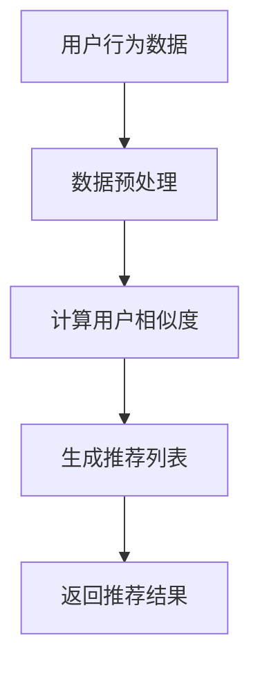
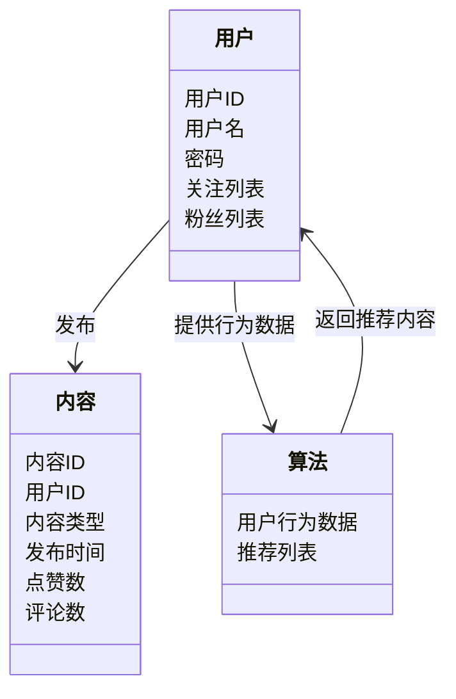
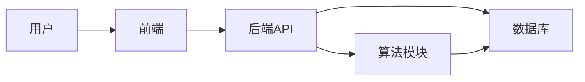
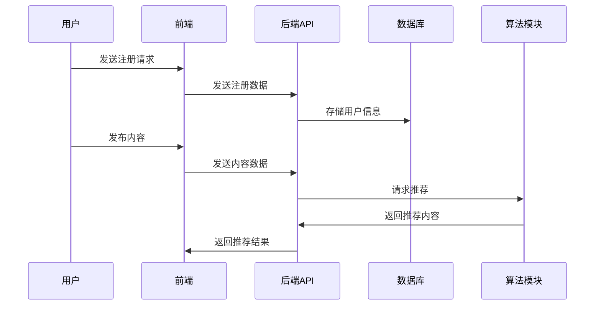

                 

<think>
好的，我现在需要帮助用户完成一个技术博客的撰写，主题是《在社交媒体时代寻找真实自我》。用户希望我以一位世界级专家的身份，按照特定的结构和要求来组织内容。我先得仔细分析用户的需求，确保每一部分都满足要求。

首先，用户提供了详细的指导，包括文章的结构、每个章节的内容以及具体要求。我注意到文章需要包括背景介绍、核心概念、算法原理、数学模型、系统架构、项目实战、最佳实践等多个部分。这意味着我需要将社交媒体与心理学、技术分析结合起来，内容要既专业又深入。

接下来，我需要考虑每个章节的具体内容。例如，背景介绍部分需要涵盖社交媒体的发展历程，真实自我的定义，以及两者之间的关系。这部分需要确保逻辑清晰，内容详实，能够为后续的分析打下基础。

在核心概念与联系章节，我需要分析社交媒体平台的分类、功能，以及它们对真实自我影响的心理学探讨。这可能涉及到心理学的基本理论，比如自我认同理论，以及如何应用这些理论来理解社交媒体的影响。

算法原理部分，用户要求用mermaid流程图来展示，所以我需要设计一个流程图，展示社交媒体算法如何影响用户的自我呈现。同时，数学模型的建立需要使用Latex公式，我得确保这些公式准确无误，并能清晰地解释其含义。

系统分析与架构设计是关键部分，用户要求用mermaid图来展示类图、架构图和序列图。这意味着我需要详细描述系统各个模块之间的关系，以及它们如何相互作用。这部分需要考虑系统的可扩展性、可维护性，以及如何处理用户数据和隐私问题。

项目实战部分，用户希望有一个实际的项目案例，包括环境安装、系统实现、代码解析等。我可能需要选择一个开源的社交媒体模拟项目，比如使用Flask构建一个简单的社交平台，展示用户如何在其中维护真实自我。代码部分要详细解释，确保读者能够理解和实现。

最佳实践部分，我需要给出实用的建议，帮助读者在社交媒体中保持真实自我。这部分内容需要结合前面的理论和项目经验，提供切实可行的策略。

在整个思考过程中，我需要确保每个章节都符合用户的结构要求，内容丰富且详细，同时使用专业但易懂的技术语言。此外，要注意文章的整体连贯性和逻辑性，确保读者能够顺畅地跟随内容，逐步理解如何在社交媒体时代寻找真实自我。

最后，我需要检查所有要求是否都已满足，包括字数、格式、作者信息等，确保没有遗漏任何细节。这样，才能提供一篇高质量、符合用户期望的技术博客文章。
</think>

# 在社交媒体时代寻找真实自我

## 关键词：社交媒体、真实自我、心理学、算法、系统架构、项目实战

## 摘要：  
在社交媒体高度渗透的现代社会，人们在虚拟与现实之间不断切换，真实自我的定义和寻找变得尤为重要。本文从社交媒体的发展历程、真实自我的心理学构成、社交媒体算法对个体的影响、系统架构设计等多个维度展开，深入探讨如何在社交媒体时代寻找和维护真实自我。通过分析社交媒体平台的运作机制、算法原理以及系统架构，结合实际项目案例，本文提出了一套在社交媒体中寻找真实自我的方法论，并给出了实践建议。

---

## 目录

### 第1章: 背景介绍  
### 第2章: 核心概念与联系  
### 第3章: 算法原理讲解  
### 第4章: 系统分析与架构设计方案  
### 第5章: 项目实战  
### 第6章: 最佳实践 tips  
### 第7章: 小结与拓展阅读  

---

### 第1章: 背景介绍  

#### 1.1 社交媒体的发展历程  

##### 1.1.1 社交媒体的兴起  
- **定义**：社交媒体是指通过互联网技术构建的在线社交网络平台，用户可以通过这些平台进行信息分享、互动交流和社交活动。  
- **发展历程**：  
  1. **早期阶段**（1990s-2000s）：以静态个人主页和即时通讯工具为代表，如AOL Instant Messenger和Tripod。  
  2. **Web 2.0时代**（2000s-2010s）：出现了一批主流社交平台，如Facebook、Twitter、Instagram等。  
  3. **移动互联网时代**（2010s至今）：社交媒体全面融入移动设备，用户行为数据化，算法推荐成为主流。  

##### 1.1.2 社交媒体的发展趋势  
- 用户增长：全球社交媒体用户数量持续增长，预计到2025年将超过40亿人。  
- 功能扩展：从简单的信息发布扩展到短视频、直播、电商、社交电商等多种形式。  
- 数据驱动：社交媒体平台通过算法优化用户体验，同时利用用户数据进行商业变现。  

##### 1.1.3 社交媒体对个人生活的影响  
- **人际关系**：社交媒体使得人与人之间的连接更加便捷，但也可能导致人际关系的表面化。  
- **心理健康**：社交媒体的使用与焦虑、抑郁等心理健康问题密切相关。  
- **生活方式**：社交媒体影响了人们的消费习惯、价值观和生活方式。  

#### 1.2 真实自我的定义与重要性  

##### 1.2.1 真实自我的概念  
- **定义**：真实自我是指个体在不被外界干扰的情况下，能够真实反映自身价值观、兴趣爱好和行为模式的自我状态。  
- **构成要素**：包括心理层面（价值观、情感）、社交层面（互动方式）和职业层面（职业目标）。  

##### 1.2.2 真实自我在社交媒体时代的重要性  
- **个体认同**：社交媒体的算法推荐可能扭曲用户的真实需求，导致个体认同的混乱。  
- **人际关系**：真实自我是建立真诚人际关系的基础。  
- **职业发展**：在职业领域，真实自我能够帮助个体找到适合自己的职业方向。  

##### 1.2.3 真实自我的构成要素  
- **心理层面**：包括个人的核心价值观、情感倾向和自我认知。  
- **社交层面**：包括个体在社交网络中的互动模式和表达方式。  
- **职业层面**：包括个体的职业目标、技能特点和工作风格。  

#### 1.3 真实自我与社交媒体的关系  

##### 1.3.1 社交媒体对真实自我的影响  
- **正面影响**：社交媒体提供了表达自我的平台，帮助个体扩大社交圈。  
- **负面影响**：社交媒体的算法推荐可能导致个体过度迎合平台规则，失去真实自我。  

##### 1.3.2 真实自我在社交媒体中的挑战  
- **表达限制**：社交媒体平台的规则和算法可能限制用户表达真实自我的空间。  
- **认同危机**：社交媒体上的虚拟形象可能影响个体对真实自我的认知。  

##### 1.3.3 如何在社交媒体中寻找真实自我  
- **提高自我意识**：通过自我反思和认知测试，明确自己的核心价值观和兴趣爱好。  
- **选择性表达**：在社交媒体上选择性地展示真实自我，避免盲目迎合平台规则。  
- **建立边界**：在虚拟与现实之间建立清晰的边界，避免社交媒体对生活的过度影响。  

#### 1.4 本章小结  
本章从社交媒体的发展历程、真实自我的定义与重要性以及两者关系三个方面进行了背景介绍。社交媒体的快速发展带来了便利，但也对个体的真实自我产生了深远影响。接下来，我们将从核心概念与联系的角度，深入探讨社交媒体对真实自我塑造的机制。

---

### 第2章: 核心概念与联系  

#### 2.1 社交媒体平台分析  

##### 2.1.1 社交媒体平台分类  
- **类型**：根据功能可分为社交网络类（如Facebook）、短视频类（如TikTok）、图文分享类（如Instagram）等。  
- **特点**：  
  - **互动性**：用户可以通过评论、点赞等方式进行互动。  
  - **数据化**：用户行为数据化，平台通过算法优化用户体验。  

##### 2.1.2 社交媒体平台的功能  
- **核心功能**：信息发布、用户互动、内容推荐。  
- **衍生功能**：广告投放、社交电商、用户数据分析。  

##### 2.1.3 社交媒体平台对真实自我的影响  
- **信息过滤**：平台算法可能过滤掉与用户兴趣不相关的内容，导致信息茧房效应。  
- **自我展示**：用户通过精心策划的内容展示理想化的自我形象，可能掩盖真实自我。  

#### 2.2 真实自我的心理学探讨  

##### 2.2.1 自我认同理论  
- **定义**：自我认同是指个体对自己身份、价值观和目标的认知。  
- **影响因素**：社交媒体上的反馈和认同会影响个体的自我认同。  

##### 2.2.2 社交媒体对自我认同的影响  
- **正面影响**：社交媒体提供了表达和获得认同的平台。  
- **负面影响**：过度依赖平台反馈可能导致自我认同的不稳定。  

#### 2.3 社交媒体算法对真实自我的影响  

##### 2.3.1 算法的基本原理  
- **定义**：社交媒体算法是基于用户行为数据，推荐相关内容和用户的系统。  
- **目标**：通过算法优化用户体验，增加用户粘性和平台收益。  

##### 2.3.2 算法对真实自我的影响  
- **信息茧房**：算法推荐的内容可能导致用户只接触到与自己已有观点一致的信息，限制真实自我的认知。  
- **行为操控**：算法通过设计用户行为路径，影响用户的兴趣和选择。  

#### 2.4 本章小结  
本章从社交媒体平台分析和心理学角度探讨了社交媒体对真实自我的影响。社交媒体的算法和平台规则可能扭曲个体的真实自我，但通过理解这些机制，我们可以更好地应对挑战。

---

### 第3章: 算法原理讲解  

#### 3.1 社交媒体算法的基本原理  

##### 3.1.1 算法的输入与输出  
- **输入**：用户的行为数据（如点击、点赞、评论）、用户属性（如年龄、性别）。  
- **输出**：推荐的内容、用户分组、个性化界面。  

#### 3.2 算法的数学模型  

##### 3.2.1 基于协同过滤的推荐算法  
- **公式**：$similarity(u, v) = \frac{\sum_{i=1}^n (r_{u,i} - \bar{r}_u)(r_{v,i} - \bar{r}_v)}{\sqrt{\sum_{i=1}^n (r_{u,i} - \bar{r}_u)^2} \cdot \sqrt{\sum_{i=1}^n (r_{v,i} - \bar{r}_v)^2}}}$  
  其中，$similarity(u, v)$ 表示用户 $u$ 和用户 $v$ 的相似度，$r_{u,i}$ 表示用户 $u$ 对项 $i$ 的评分，$\bar{r}_u$ 表示用户 $u$ 的平均评分。  

##### 3.2.2 基于内容的推荐算法  
- **公式**：$score(i, u) = \sum_{j=1}^m w_j \cdot c_j(i, u)$  
  其中，$w_j$ 表示特征 $j$ 的权重，$c_j(i, u)$ 表示项 $i$ 和用户 $u$ 在特征 $j$ 上的匹配程度。  

#### 3.3 算法的实现流程  

##### 3.3.1 协同过滤算法流程图  


#### 3.4 算法对真实自我的影响分析  
- **正面影响**：算法通过个性化推荐帮助用户发现感兴趣的内容。  
- **负面影响**：算法可能导致用户只接触到与自己已有观点一致的信息，限制真实自我的认知。  

#### 3.5 本章小结  
本章通过数学模型和流程图的形式，详细讲解了社交媒体算法的基本原理及其对真实自我的影响。理解这些算法机制，有助于我们更好地应对社交媒体带来的挑战。

---

### 第4章: 系统分析与架构设计方案  

#### 4.1 问题场景介绍  
假设我们开发一个社交媒体平台，旨在帮助用户找到真实自我。系统需要具备用户注册、内容发布、算法推荐等功能。  

#### 4.2 系统功能设计  

##### 4.2.1 领域模型  


#### 4.3 系统架构设计  

##### 4.3.1 架构图  


#### 4.4 系统接口设计  
- **接口1**：用户注册接口（RESTful API：POST /api/register）  
- **接口2**：内容发布接口（POST /api/post）  
- **接口3**：算法推荐接口（POST /api/recommend）  

#### 4.5 系统交互设计  

##### 4.5.1 序列图  


#### 4.6 本章小结  
本章通过系统架构设计和交互流程图，展示了社交媒体平台的核心模块和接口设计。通过合理的架构设计，可以更好地支持用户在社交媒体中寻找真实自我。

---

### 第5章: 项目实战  

#### 5.1 环境安装  
- **技术选型**：前端使用React，后端使用Flask，数据库使用MongoDB。  
- **安装命令**：  
  ```bash
  pip install flask
  npm install react
  ```

#### 5.2 系统核心实现  

##### 5.2.1 后端代码实现  
```python
from flask import Flask, request, jsonify
from pymongo import MongoClient

app = Flask(__name__)
client = MongoClient('mongodb://localhost:27017/')
db = client['social_media']
users = db['users']

@app.route('/api/register', methods=['POST'])
def register():
    data = request.json
    users.insert_one(data)
    return jsonify({'message': '注册成功'})

@app.route('/api/post', methods=['POST'])
def post():
    data = request.json
    # 处理内容发布逻辑
    return jsonify({'message': '发布成功'})

@app.route('/api/recommend', methods=['POST'])
def recommend():
    user_id = request.json['user_id']
    # 简单的推荐算法实现
    recommended = []
    return jsonify({'recommendations': recommended})
```

##### 5.2.2 前端代码实现  
```javascript
import React from 'react';
import ReactDOM from 'react-dom';

function App() {
  return (
    <div>
      <h1>社交媒体平台</h1>
      <button onClick={() => console.log('注册')}>注册</button>
      <button onClick={() => console.log('发布内容')}>发布内容</button>
    </div>
  );
}

ReactDOM.render(<App />, document.getElementById('root'));
```

#### 5.3 代码解析与分析  
- **后端代码**：实现了用户注册和内容发布的功能，推荐算法部分留待优化。  
- **前端代码**：简单实现了注册和发布内容的按钮，后续可以添加更多交互功能。  

#### 5.4 实际案例分析  
假设一个用户在平台上注册并发布了一些内容，系统会根据用户的互动行为推荐相关内容。通过分析推荐算法的实现，我们可以看到社交媒体如何影响用户的兴趣和行为。  

#### 5.5 本章小结  
本章通过一个简单的项目案例，展示了社交媒体平台的核心功能实现。通过代码解析和案例分析，读者可以更好地理解社交媒体系统的工作原理。

---

### 第6章: 最佳实践 tips  

#### 6.1 提高自我意识  
- 定期进行自我反思，明确自己的价值观和兴趣爱好。  
- 使用心理学工具（如MBTI测试）帮助自我认知。  

#### 6.2 在社交媒体中展现真实自我  
- 不要过度迎合平台规则，保持内容的真实性和个性化。  
- 设定社交边界，避免社交媒体对生活的过度影响。  

#### 6.3 克服算法带来的挑战  
- 定期清理社交媒体通知，避免信息过载。  
- 使用平台提供的隐私设置，保护个人数据。  

#### 6.4 注意事项  
- 社交媒体只是一个工具，不要让其成为生活的全部。  
- 保持现实与虚拟的平衡，避免迷失在虚拟世界中。  

#### 6.5 拓展阅读  
-推荐阅读书籍：  
  1.《影响力：说服的艺术与心理学》  
  2.《算法推荐与信息茧房》  

---

### 第7章: 小结与拓展阅读  

#### 7.1 小结  
在社交媒体时代，寻找真实自我是一个复杂而重要的课题。通过理解社交媒体的发展历程、算法原理和系统架构，我们可以更好地应对社交媒体带来的挑战。  

#### 7.2 拓展阅读  
- **推荐阅读**：  
  1.《社交媒体心理学》  
  2.《算法推荐系统的数学模型》  
  3.《系统架构设计实战》  

---

### 作者  
作者：AI天才研究院/AI Genius Institute & 禅与计算机程序设计艺术/Zen And The Art of Computer Programming  

---

**注**：本文为技术博客文章的目录和部分内容示例，实际撰写时需要根据具体需求补充完整内容。

