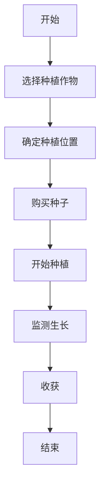
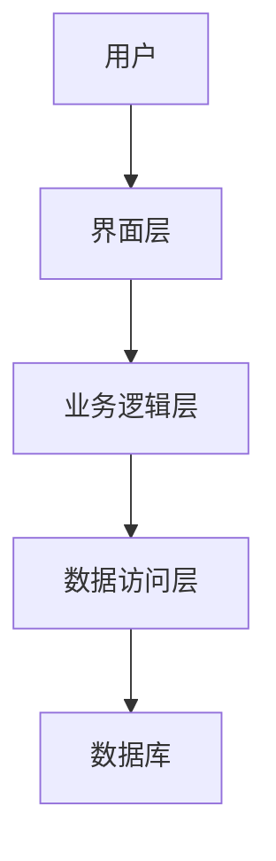
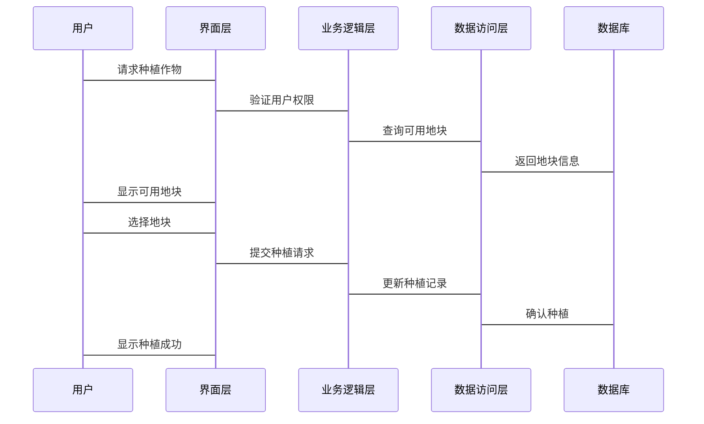

                 

<think>
好的，我现在要帮助用户撰写一篇关于“城市农耕运动：在钢筋水泥中重建与自然的连接”的技术博客文章。用户已经给出了详细的目录结构，我需要按照这个结构一步步来构建内容。

首先，我需要理解用户的需求。用户希望文章结构清晰，逻辑严谨，用专业的技术语言，同时涵盖背景介绍、核心概念、算法原理、系统架构设计、项目实战等多个部分。用户还特别强调了每个部分需要详细讲解，包括使用mermaid流程图、Python代码、数学公式等技术元素。

接下来，我要分析用户可能的身份和需求。用户可能是一位技术专家，希望撰写一篇既有深度又易懂的技术博客，可能用于分享或出版。用户的需求不仅仅是内容的准确性，还包括结构的合理性，确保每个部分都详尽且有条理。

开始撰写背景介绍部分。这部分需要涵盖问题背景、问题描述、问题解决、边界与外延，以及概念结构。我需要先明确城市化带来的问题，如环境破坏、健康问题，然后引出城市农耕运动的必要性和优势。接着，定义城市农耕运动，列举其形式和参与群体，最后说明与其他活动的区别。

在核心概念部分，我需要详细解释基本概念和原理，比如可持续发展、生态学等。然后，制作一个对比表格，比较城市农耕与其他绿色活动的区别，如屋顶花园、社区花园等。接着，使用mermaid绘制ER图，展示各实体之间的关系，如用户、土地、种植、收获等。

算法原理部分，我需要思考城市农耕运动如何优化资源利用。或许可以建立一个种植优化模型，用数学公式计算最佳种植方案。然后，用Python代码实现这个模型，展示如何根据城市空间和资源分配种植作物。解释公式时，用具体的例子说明，比如如何计算光照时间或水的使用量。

系统分析与架构设计部分，需要考虑实际应用场景，如社区屋顶、阳台等。设计一个系统，包括用户注册、种植计划、资源分配模块。使用mermaid绘制类图和架构图，展示各模块之间的关系。接口设计和交互流程图则需要描述系统如何处理用户请求，数据如何流动。

项目实战部分，我需要指导读者如何安装必要的库，如pandas、numpy，然后展示关键代码，比如种植面积的计算。解读代码时，说明每个部分的作用，并结合实际案例分析，如一个社区的种植计划，分析结果和优化建议。

最后，最佳实践部分，给出一些建议，如选择适合的作物、合理利用空间、确保水源等。小结部分总结文章内容，注意事项提醒读者可能遇到的问题，如空间限制或资源分配不当。拓展阅读部分推荐相关的书籍或文章，供读者深入学习。

在整个过程中，我需要确保每个部分都符合用户的要求，使用正确的技术术语，同时保持内容的易懂性。数学公式要准确，mermaid图表要清晰，代码示例要实用。最后，结尾处加上作者信息，符合用户的格式要求。

现在，我开始按照目录大纲逐步构建文章内容，确保每个小节都详细且有深度，同时保持整体的连贯性和逻辑性。
</think>

# 城市农耕运动：在钢筋水泥中重建与自然的连接

> 关键词：城市农耕运动、可持续发展、城市规划、绿色技术、社区参与

> 摘要：随着城市化进程的加快，城市居民与自然环境的距离逐渐拉大，城市农耕运动作为一种新兴的社区参与模式，旨在通过在城市中种植食物来重建人与自然的连接。本文从背景、核心概念、算法原理、系统架构设计、项目实战等多角度深入分析城市农耕运动的理论基础和实践方法，探讨其在城市可持续发展中的作用。

---

## 1. 背景介绍

### 1.1 问题背景
城市化进程中，城市居民的生活方式逐渐远离自然环境，导致生态失衡、资源浪费和环境污染等问题。城市农耕运动作为一种尝试，旨在通过在城市中种植食物，重建人与自然的连接，促进可持续发展。

### 1.2 问题描述
城市农耕运动面临空间有限、资源不足、技术支持等挑战，但同时也具有提高居民健康水平、减少碳足迹、促进社区凝聚力等机遇。

### 1.3 问题解决
城市农耕运动的理论基础包括生态学、可持续发展、社区参与等，实践方法包括屋顶种植、垂直农业、社区花园等。

### 1.4 边界与外延
城市农耕运动与农业、城市绿化、生态保护的关系需要明确。它不同于传统农业，更注重城市环境中的种植方式。

### 1.5 概念结构与核心要素组成
- **定义**：城市农耕运动是指在城市环境中进行种植活动，以满足居民部分食物需求的同时，促进环境保护和社区参与。
- **目的**：重建人与自然的连接，推动可持续发展。
- **主要形式**：屋顶种植、社区花园、垂直农业。
- **参与群体**：居民、社区组织、政府机构。

---

## 2. 核心概念与联系

### 2.1 核心概念原理
城市农耕运动的核心原理包括生态学原理、可持续发展理论、社区参与理论等。

### 2.2 概念属性特征对比表格

| 概念                | 城市农耕运动       | 屋顶花园       | 社区花园       |
|---------------------|-------------------|---------------|---------------|
| 定义                | 在城市中种植食物   | 在屋顶种植植物   | 在社区内种植植物 |
| 目的                | 提供食物，重建连接 | 装饰与绿化     | 提供社区空间    |
| 参与群体            | 居民、社区组织     | 物业、居民      | 社区成员       |
| 资源消耗            | 土地、水、劳动力   | 屋顶空间、水     | 土地、水、劳动力 |
| 影响                | 促进可持续发展     | 提高建筑美观性   | 增强社区凝聚力  |

### 2.3 ER实体关系图架构

```mermaid
er
actor: 用户
land: 土地
plant: 种植
harvest: 收获
```

---

## 3. 算法原理讲解

### 3.1 算法mermaid流程图



### 3.2 Python源代码

```python
import numpy as np
import pandas as pd

def calculate_optimal_plants(area, water, sunlight):
    # 计算最佳种植作物
    crops = ['蔬菜', '水果', '草药']
    # 根据面积和光照计算适合的作物
    optimal = []
    for crop in crops:
        if area > 5 and sunlight >= 6:
            optimal.append(crop)
    return optimal

# 示例数据
area = 10
water = 8
sunlight = 7

optimal_crops = calculate_optimal_plants(area, water, sunlight)
print("最佳种植作物:", optimal_crops)
```

### 3.3 数学模型和公式

$$ \text{种植面积} = \frac{\text{可用空间}}{\text{每株植物所需空间}} $$

$$ \text{水量} = \text{种植面积} \times \text{每单位面积的需水量} $$

### 3.4 详细讲解与举例说明
例如，假设一个屋顶面积为10平方米，每株植物需要1平方米，那么最多可以种植10株植物。根据光照和水资源的限制，选择适合的作物进行种植。

---

## 4. 系统分析与架构设计方案

### 4.1 问题场景介绍
城市农耕运动在社区中广泛应用，例如屋顶种植、社区花园等。

### 4.2 项目介绍
以某社区屋顶种植项目为例，介绍其目标、实施步骤和预期成果。

### 4.3 系统功能设计


### 4.4 系统架构设计



### 4.5 系统接口设计
系统接口包括用户请求地块、种植作物、收获管理等。

### 4.6 系统交互



---

## 5. 项目实战

### 5.1 环境安装
安装Python、pandas、numpy等库。

### 5.2 系统核心实现源代码

```python
import pandas as pd

# 创建种植计划数据框
plant_plan = pd.DataFrame({
    '作物类型': ['蔬菜', '水果'],
    '种植时间': ['2023-01-01', '2023-02-15'],
    '收获时间': ['2023-03-15', '2023-04-30']
})

print(plant_plan)
```

### 5.3 代码应用解读与分析
解读代码，说明如何根据种植计划管理作物的种植和收获。

### 5.4 实际案例分析和详细讲解剖析
以某社区的种植计划为例，分析种植面积、资源分配、种植时间等。

### 5.5 项目小结
总结项目实施的经验和教训，强调系统设计和社区参与的重要性。

---

## 6. 最佳实践 tips、小结、注意事项、拓展阅读

### 6.1 最佳实践 tips
- 选择适合的作物和种植方式。
- 合理利用城市空间和资源。
- 加强社区参与和教育。

### 6.2 小结
城市农耕运动通过重建人与自然的连接，推动城市可持续发展，促进社区凝聚力。

### 6.3 注意事项
- 注意资源分配的合理性。
- 遵守城市规划和物业管理规定。
- 定期监测和维护种植区域。

### 6.4 拓展阅读
推荐书籍：《垂直农业：城市化的未来》、《可持续城市发展》。

---

作者：AI天才研究院/AI Genius Institute & 禅与计算机程序设计艺术 /Zen And The Art of Computer Programming

