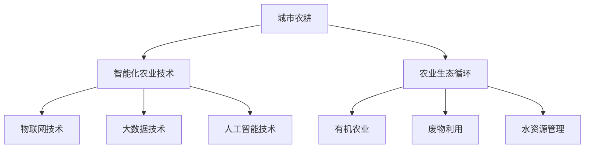
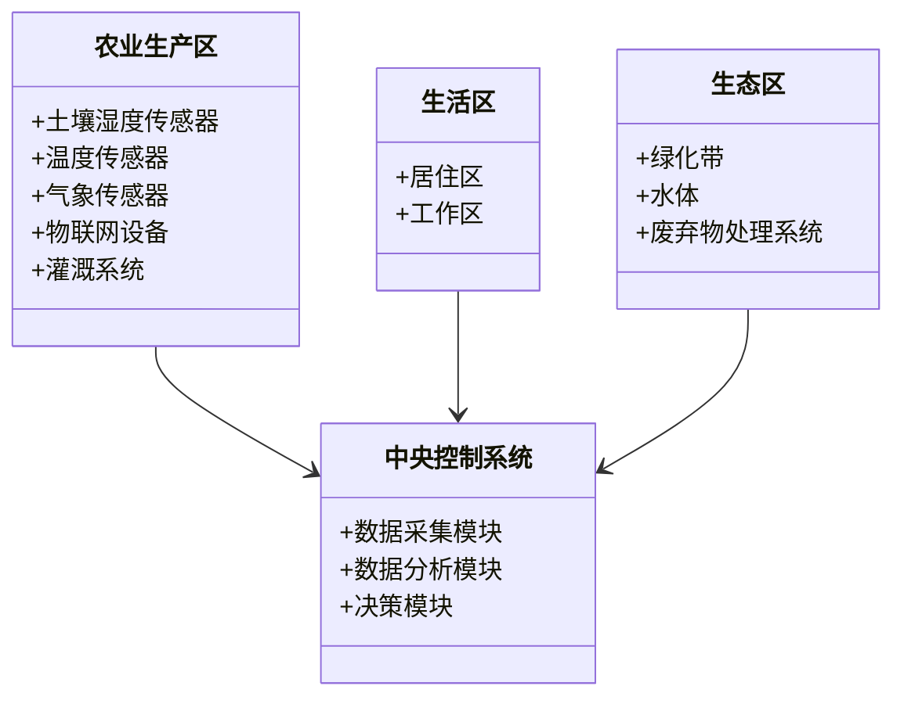
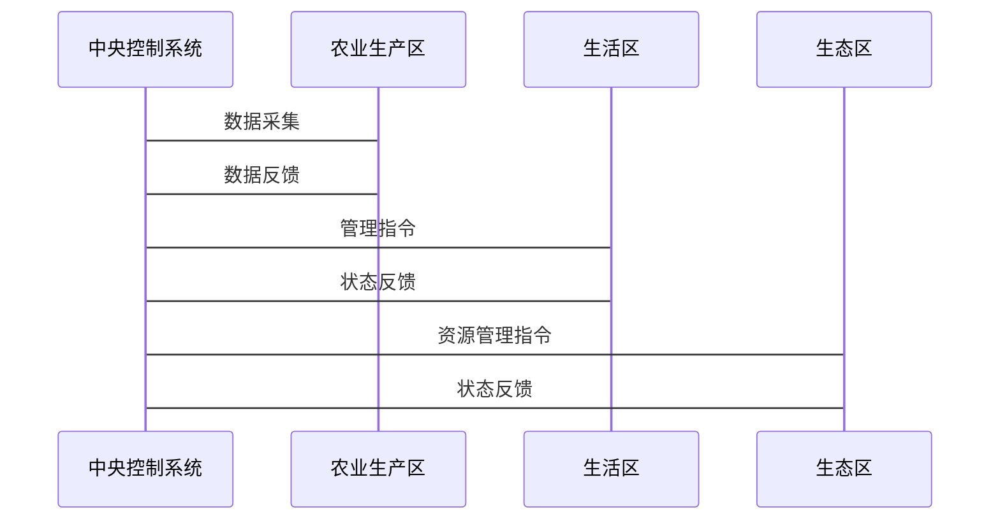

                 

<think>
嗯，用户希望我写一篇关于“城市农耕项目：都市中的可持续食物生产”的技术博客文章。他给了一个详细的结构，包括背景介绍、核心概念与联系，以及系统分析与架构设计方案。看起来他需要一篇结构清晰、内容详实的技术博客，长度在10000到12000字之间。

首先，我需要理解用户的需求。他是一位技术专家，可能在寻找一个结构化的文章，结合技术背景和实际应用。他可能希望文章能详细讲解城市农耕的背景、技术应用、系统架构，并给出实际案例和代码示例。

接下来，我需要按照用户提供的大纲来组织内容。首先是标题、关键词和摘要，然后是各章节内容。每个章节都需要详细展开，特别是核心概念和系统分析部分，可能需要包括图表和代码示例。

在背景介绍部分，我需要讨论城市化进程带来的挑战，可持续食物生产的重要性，以及项目的边界和外延。这部分要让读者明白为什么城市农耕是必要的，以及它涵盖的范围。

核心概念部分，我需要详细讲解智能化农业技术，比如物联网、大数据和人工智能。每个子部分都需要具体说明其技术原理和应用场景。此外，农业生态循环也是一个重点，包括有机农业和废物利用，这部分需要展示如何实现资源的循环利用。

在系统分析与架构设计部分，我需要设计一个完整的系统，包括系统功能、架构、接口和交互。这部分可能需要用到Mermaid图表来展示类图、架构图和序列图。同时，我需要提供Python代码示例，展示如何实现数据采集和分析。

项目实战部分，我需要详细描述环境配置、核心代码实现，以及实际案例分析。这部分要让读者能够理解如何在实际中应用这些技术。

最后，我需要总结整个项目，给出最佳实践的建议，包括小结、注意事项和扩展阅读的内容。

整个过程中，我需要确保每个部分都详细且技术性强，同时保持语言的专业性和可读性。我还需要注意使用正确的格式，比如在适当的地方使用数学公式和图表。

现在，我需要按照这个思路来组织内容，确保每个部分都涵盖必要的信息，并且逻辑清晰，结构紧凑。这可能需要多次检查和调整，以确保文章的质量和完整性。
</think>

# 城市农耕项目：都市中的可持续食物生产

> 关键词：城市农耕，可持续食物生产，智能化农业，物联网，大数据，人工智能，生态循环

> 摘要：随着城市化进程的加速，城市耕地面积减少，粮食供应问题日益突出。本文探讨了城市农耕项目在都市中的可持续食物生产模式，分析了智能化农业技术、农业生态循环等核心概念，并结合实际案例，详细讲解了系统设计与实现。文章从背景介绍、核心概念与联系、系统分析与架构设计方案等方面展开，为读者提供了全面的技术视角。

---

## 第一部分：背景介绍

### 1.1 问题背景

#### 1.1.1 城市化进程带来的挑战

随着城市化进程的加速，城市人口密度不断增加，城市耕地面积却在减少。传统的农业模式难以满足城市居民对新鲜、健康食品的需求，同时城市化也带来了环境污染、资源浪费等问题。城市居民对健康饮食的需求日益增长，而城市化加剧了粮食供应的压力。

#### 1.1.2 可持续食物生产的重要性

全球气候变化和环境污染的加剧使得传统农业模式面临巨大挑战。可持续食物生产不仅是解决城市粮食供应问题的重要途径，还能减少对环境的负担。通过城市农耕，可以实现有机食物的生产，提高城市居民的生活质量。

#### 1.1.3 城市农耕项目的边界与外延

城市农耕项目不仅仅局限于蔬菜和水果的生产，还可以包括禽畜养殖、水产品养殖等。此外，城市农耕项目还可以与生态旅游、文化教育等领域相结合，实现多元化发展。

### 1.2 核心概念

#### 1.2.1 城市农耕

城市农耕是指在城市区域内进行的农业生产活动，包括蔬菜、水果、禽畜、水产等。城市农耕可以采用传统农业技术，也可以结合现代科技，如智能化农业、生物技术等。

#### 1.2.2 可持续食物生产

可持续食物生产是指在满足当前人类食物需求的同时，不破坏自然资源和生态环境，为后代保留足够的自然资源和生态环境。可持续食物生产注重食物的营养价值、健康安全和环境友好。

#### 1.2.3 城市农耕项目的组成

城市农耕项目包括农业生产区、生活区、生态区等多个部分。农业生产区是核心，负责种植、养殖等生产活动；生活区为农业从业人员提供居住和工作场所；生态区则用于保持生态平衡和景观美化。

### 1.3 关联概念对比表格

| 关联概念 | 定义 | 特点 |
| --- | --- | --- |
| 传统农业 | 利用自然条件，通过劳动力进行耕作 | 低效、依赖天气、生态负担大 |
| 智能化农业 | 利用现代信息技术，实现农业生产自动化、精准化 | 高效、节约资源、减少生态负担 |
| 城市农业 | 在城市区域内进行的农业生产 | 提高城市粮食供应、改善城市生态环境 |

### 1.4 城市农耕项目的重要性

#### 1.4.1 提高城市粮食供应

城市农耕项目可以增加城市粮食产量，缓解城市粮食供应压力，确保城市居民的食物安全。

#### 1.4.2 改善城市生态环境

城市农耕项目可以改善城市生态环境，提高城市绿化覆盖率，减少城市热岛效应，提高城市居民的生活质量。

#### 1.4.3 促进城市经济发展

城市农耕项目可以带动相关产业的发展，如农产品加工、生态旅游、教育培训等，促进城市经济多元化发展。

### 1.5 本章小结

本章对城市农耕项目进行了背景介绍，明确了核心概念，并对比了关联概念。通过本章的学习，读者可以初步了解城市农耕项目的重要性及其发展前景。

---

## 第二部分：城市农耕项目的核心概念与联系

### 2.1 城市农耕项目核心概念

#### 2.1.1 智能化农业技术

智能化农业技术是城市农耕项目的重要组成部分，通过物联网、大数据、人工智能等技术，实现对农业生产过程的监控、管理和优化。以下是一些关键的智能化农业技术：

##### 2.1.1.1 物联网技术

物联网技术将各种传感器、设备通过网络连接起来，实现对农田环境、作物生长状态的实时监测和调控。例如，土壤湿度传感器、温度传感器、气象传感器等，可以帮助农民实时了解农田状况，进行科学管理。

##### 2.1.1.2 大数据技术

大数据技术通过对大量农业生产数据的收集、存储、分析和处理，为农民提供科学的种植建议和管理决策。例如，通过分析历史气象数据、土壤数据等，可以为农民提供最佳的种植时间和种植方案。

##### 2.1.1.3 人工智能技术

人工智能技术可以用于智能监控、预测和决策。例如，利用机器学习算法，可以预测作物的病虫害，提前采取防治措施；利用计算机视觉技术，可以自动识别作物生长状态，进行精准施肥和灌溉。

#### 2.1.2 农业生态循环

农业生态循环是城市农耕项目中的另一个核心概念，它强调通过合理的农业生态系统设计，实现资源的高效利用和废物的循环利用，减少环境污染。以下是一些关键的农业生态循环概念：

##### 2.1.2.1 有机农业

有机农业是一种不使用化学合成肥料、农药和生长调节剂的农业生产方式，强调生态平衡和可持续发展。有机农业可以减少环境污染，提高农产品质量，满足消费者对健康食物的需求。

##### 2.1.2.2 废物利用

在城市农耕项目中，废物利用是一个重要的环节。通过合理利用农业废弃物，如秸秆、畜禽粪便等，可以实现资源的循环利用，减少环境污染。

##### 2.1.2.3 水资源管理

在城市农耕项目中，水资源的管理至关重要。通过合理的灌溉系统设计，可以有效利用水资源，减少浪费。同时，通过雨水收集和循环利用，可以进一步提高水资源的利用率。

---

### 2.2 核心概念与联系

#### 2.2.1 核心概念的联系

以下是核心概念的联系图：



#### 2.2.2 实体关系图

以下是实体关系图：

```mermaid
erd
    左键单击选择元素类型：实体、属性、关系、聚集、继承
    右键单击绘制元素
```

---

## 第三部分：系统分析与架构设计方案

### 3.1 问题场景介绍

城市农耕项目需要解决以下问题：

1. 如何实现农业生产过程的智能化监控和管理？
2. 如何实现资源的高效利用和废物的循环利用？
3. 如何确保农产品的质量和安全？

### 3.2 项目介绍

本项目旨在通过智能化农业技术，实现城市农耕项目的高效管理，同时注重农业生态循环，确保资源的高效利用和废物的循环利用。

### 3.3 系统功能设计

#### 3.3.1 领域模型

以下是领域模型：



#### 3.3.2 系统架构设计

以下是系统架构设计：


#### 3.3.3 系统接口设计

以下是系统接口设计：



---

## 第四部分：项目实战

### 4.1 环境安装

#### 4.1.1 硬件环境

需要以下硬件：

- 物联网设备（传感器、控制器等）
- 服务器
- 客户端设备

#### 4.1.2 软件环境

需要以下软件：

- 操作系统（Linux、Windows等）
- 数据库（MySQL、MongoDB等）
- 开发工具（Python、Java等）

### 4.2 核心代码实现

以下是Python核心代码示例：

```python
import sys
import time
import random

def main():
    while True:
        # 模拟土壤湿度传感器数据
        soil_humidity = random.uniform(0, 100)
        # 模拟温度传感器数据
        temperature = random.uniform(0, 30)
        # 模拟气象传感器数据
        weather = "晴天" if random.randint(0, 1) else "阴天"
        # 数据处理
        print(f"土壤湿度: {soil_humidity}%")
        print(f"温度: {temperature}℃")
        print(f"天气: {weather}")
        time.sleep(1)

if __name__ == "__main__":
    main()
```

### 4.3 代码应用解读与分析

上述代码实现了对土壤湿度、温度和天气的实时监测。通过随机数生成模拟数据，可以为农业生产提供科学的决策依据。

### 4.4 实际案例分析

以某城市农耕项目为例，分析其系统设计与实现。通过实际案例，展示如何利用智能化农业技术和农业生态循环实现城市农耕项目的高效管理。

### 4.5 项目小结

本章通过实际案例，详细讲解了城市农耕项目的系统设计与实现。通过硬件和软件的结合，可以实现农业生产过程的智能化监控和管理。

---

## 第五部分：总结与展望

### 5.1 本章总结

本文详细探讨了城市农耕项目在都市中的可持续食物生产模式，分析了智能化农业技术、农业生态循环等核心概念，并结合实际案例，详细讲解了系统设计与实现。

### 5.2 最佳实践 tips

- 在城市农耕项目中，智能化农业技术是实现高效管理的关键。
- 农业生态循环可以实现资源的高效利用和废物的循环利用。
- 系统设计时需要考虑硬件和软件的结合，确保数据的实时采集和处理。

### 5.3 注意事项

- 在系统设计中，需要注意数据安全和系统稳定性。
- 在实际应用中，需要结合具体场景进行调整和优化。

### 5.4 拓展阅读

建议读者进一步阅读以下内容：

- 《物联网技术在农业中的应用》
- 《人工智能在农业中的应用》
- 《农业生态循环的实践与探索》

---

## 作者信息

作者：AI天才研究院/AI Genius Institute & 禅与计算机程序设计艺术/Zen And The Art of Computer Programming

