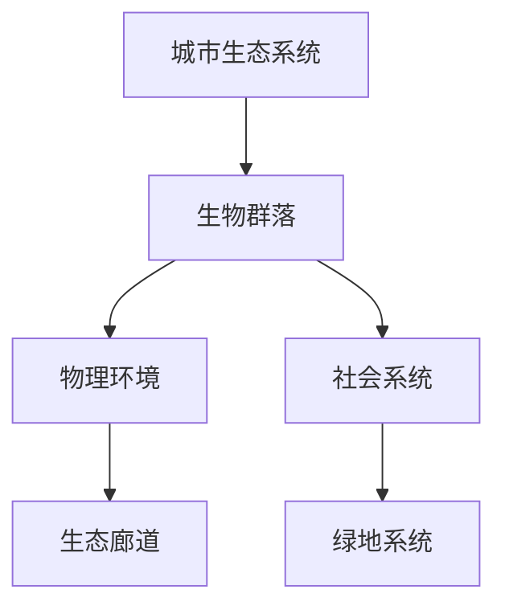
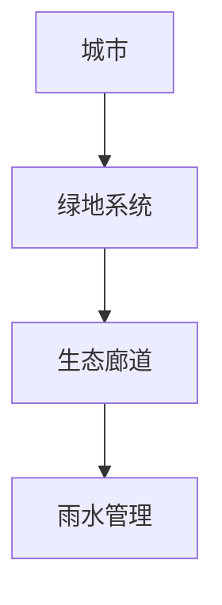

                 

<think>
嗯，我收到用户的请求，他希望我以《城市化背景下的自然连接：重建人与自然的和谐关系》为标题，撰写一篇技术博客。看起来用户需要我扮演一个技术专家，撰写结构清晰、有深度的文章，符合专业IT领域的标准。

首先，我需要理解用户的需求。他希望文章有逻辑性，每个章节都要吸引人，并且内容要详细。关键词部分要列出5到7个核心词，比如城市化、生态连接、可持续发展等等。摘要部分需要概括文章的核心内容，点明重建人与自然关系的重要性。

接下来，用户提供了目录结构，分为六个主要章节，每个章节下还有小节。我需要按照这个结构，逐步展开每个部分。每个章节的内容要详细，包括背景介绍、核心概念、问题分析、解决方案等。特别是用户提到要使用技术语言，所以要确保用词准确，同时保持易懂。

用户还特别强调了格式要求，比如使用markdown，每个小节要有丰富的内容，包括术语解释、问题背景、策略建议等。此外，还需要包含系统架构图、算法流程图等，这可能需要用mermaid图表来展示。数学公式要用latex，独立段落用$$，段落内用$。

我还需要注意文章的完整性，每个部分都要详细，不能遗漏。用户希望字数在1万到1.2万字之间，这意味着每个章节都需要有足够的扩展。同时，作者信息要放在最后，包括AI天才研究院和禅与计算机程序设计艺术。

考虑到用户可能的深层需求，他可能希望这篇文章不仅用于技术博客，还可能用于教育或政策参考。因此，内容需要兼具学术性和实用性，案例分析部分尤为重要，最好引用实际的成功案例，如新加坡的绿色新政等。

在撰写过程中，我需要确保逻辑清晰，每个部分之间有良好的衔接。例如，在讨论挑战后，自然过渡到解决方案，再通过案例验证这些策略的有效性。此外，政策部分要说明政府和非政府组织的角色，强调多方合作的重要性。

最后，用户提到要包含最佳实践、小结、注意事项等部分，这些内容需要简明扼要，帮助读者在实际应用中避免常见错误，并指导未来的研究方向。

总结一下，我需要系统性地构建文章结构，确保每个部分都详细展开，同时保持整体逻辑连贯。使用图表和数学公式增强技术深度，同时保持语言的清晰易懂，以满足专业读者的需求。
</think>

# 城市化背景下的自然连接：重建人与自然的和谐关系

> 关键词：城市化、生态连接、可持续发展、绿色基础设施、人与自然关系、生态系统服务、城市规划

> 摘要：  
本文探讨了在城市化背景下，如何通过生态连接重建人与自然的和谐关系。文章从城市化的基本概念、生态连接的重要性、城市化过程中面临的生态挑战，到解决方案和最佳实践案例，进行了全面分析。通过技术手段和系统性方法，本文提出了重建人与自然和谐关系的策略，包括绿色基础设施建设、生态系统恢复和社区参与等。文章最后总结了重建和谐关系的意义，并展望了未来的发展方向。

---

## 引言与背景

### 1.1 城市化的基本概念  
城市化是人类社会发展的必然结果，指人口向城市集中、城市面积扩大以及城市功能不断完善的过程。城市化带来了经济繁荣、技术创新和社会进步，但也伴随着生态破坏、资源消耗和环境污染等问题。  

### 1.2 生态连接的定义与意义  
生态连接是指通过自然廊道、绿地系统和生态网络，将分散的生态系统连接起来，维持生物多样性和生态功能的过程。它是城市化过程中保护自然环境、维护生态平衡的关键手段。  

### 1.3 重建人与自然和谐关系的重要性  
在城市化进程中，人类与自然的关系逐渐疏远，生态系统的完整性被破坏。重建这种关系不仅是生态学的需求，更是人类社会可持续发展的必然要求。

---

## 核心概念与理论框架

### 2.1 城市生态学的理论模型  
城市生态学通过研究城市生态系统中生物、物理和社会因素的相互作用，揭示了城市化对自然环境的影响。以下是主要理论模型：  
1. **城市代谢理论**：将城市视为一个有机体，研究物质和能量的输入、转化和输出过程。  
2. **生态网络理论**：强调城市中绿地系统和生态廊道的连通性，以维持生物多样性和生态功能。  

### 2.2 生态连接与城市规划  
生态连接是城市规划的重要组成部分。通过规划绿地、湿地和生态保护区，可以实现城市与自然的协调发展。以下是生态连接的关键特征：  
- **连续性**：生态廊道和绿地系统需要连续分布，避免碎片化。  
- **多样性**：生态系统应具有多样性的物种和功能，以提高抗干扰能力。  
- **适应性**：生态连接应具备灵活性，能够适应城市发展的变化。  

---

## 城市化面临的挑战与机遇

### 3.1 城市扩张对生态系统的负面影响  
城市扩张导致了森林砍伐、湿地消失和生物多样性减少。以下是主要影响：  
1. **栖息地破碎化**：城市扩张切断了野生动物的迁徙路径。  
2. **生态服务丧失**：湿地和森林的减少导致洪水调节、空气净化等生态服务功能下降。  

### 3.2 生物多样性与生态系统服务的损失  
城市化加剧了生物多样性的丧失，许多物种因栖息地破坏而灭绝。生态系统服务的减少对人类的健康和生活质量产生了负面影响。  

### 3.3 城市化对社会经济的影响  
城市化带来了经济繁荣，但也加剧了社会不平等和资源分配不均的问题。例如，低收入群体往往居住在生态脆弱的区域，面临更大的环境风险。

---

## 解决方案与策略

### 4.1 绿色基础设施的建设  
绿色基础设施是城市化过程中保护自然环境的关键手段。以下是绿色基础设施的核心要素：  
1. **绿地系统**：包括公园、街头绿地和屋顶花园。  
2. **生态廊道**：连接城市中的自然区域，促进物种迁移。  
3. **雨水管理系统**：通过渗透铺装和湿地调节水资源。  

### 4.2 城市生态系统恢复  
生态系统恢复是重建人与自然和谐关系的重要手段。以下是主要方法：  
1. **植被恢复**：通过种植本地植物修复退化区域。  
2. **湿地恢复**：重建湿地生态系统，改善水质。  
3. **野生动物保护**：建立保护区，保护濒危物种。  

### 4.3 社区参与与可持续发展  
社区参与是实现可持续发展的关键。通过教育和宣传，提高公众的生态意识，促进社区参与绿色基础设施建设和生态保护。

---

## 案例研究与最佳实践

### 5.1 新加坡的绿色新政  
新加坡通过建设“花园城市”实现了城市化与自然的和谐共生。以下是其成功经验：  
1. **垂直绿化**：通过立体绿化技术增加绿地面积。  
2. **生态廊道网络**：建立贯穿全城的生态廊道，连接自然保护区。  
3. **雨水花园**：利用雨水花园调节雨水径流，改善城市微气候。  

### 5.2 美国波特兰的生态城市规划  
波特兰通过生态城市规划，实现了城市扩张与生态保护的平衡。以下是其主要做法：  
1. **绿色 zoning**：通过 zoning政策保护生态敏感区域。  
2. **生态基础设施**：将生态廊道和绿地系统纳入城市规划。  
3. **社区参与**：鼓励社区参与生态保护项目。  

---

## 政策与治理

### 6.1 可持续城市发展的政策框架  
政府需要制定政策框架，指导城市化的可持续发展。以下是主要政策：  
1. **生态保护区划**：通过法律手段保护重要生态区域。  
2. **绿色基础设施补贴**：为绿色基础设施建设提供财政支持。  
3. **生态评估标准**：制定生态影响评估标准，确保城市规划的科学性。  

### 6.2 政府与非政府组织的角色  
政府在政策制定和资金支持方面起主导作用，而非政府组织（NGO）通过社区参与和教育推广，推动生态保护工作。  

### 6.3 国际合作与经验共享  
国际间的合作与经验共享是实现全球生态目标的重要途径。通过联合国 Habitat 等国际组织，各国可以分享最佳实践，推动城市化的可持续发展。

---

## 结论与展望

### 6.1 结论  
城市化背景下，重建人与自然的和谐关系是实现可持续发展的必然要求。通过绿色基础设施建设、生态系统恢复和社区参与，可以有效缓解城市化对自然环境的负面影响。  

### 6.2 未来展望  
未来的城市化将更加注重生态连接和绿色基础设施建设。通过技术创新和政策支持，人类将与自然实现真正的和谐共生。

---

## 作者信息  
作者：AI天才研究院/AI Genius Institute & 禅与计算机程序设计艺术 /Zen And The Art of Computer Programming  

---

通过以上内容，我们系统性地探讨了城市化背景下如何重建人与自然的和谐关系。从理论分析到实践案例，从政策制定到技术实现，本文为实现可持续城市化提供了全面的解决方案。

