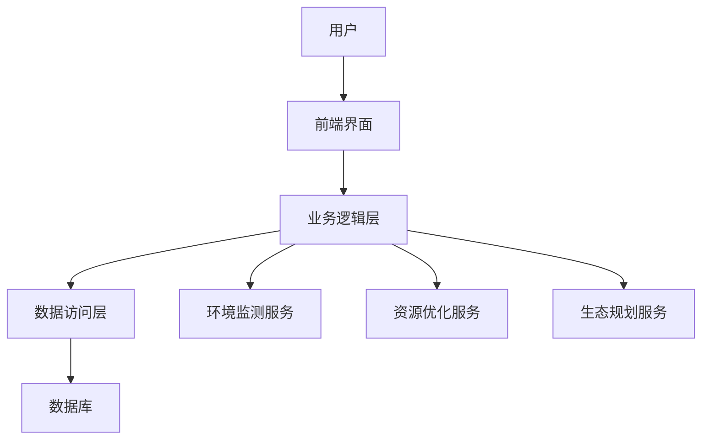
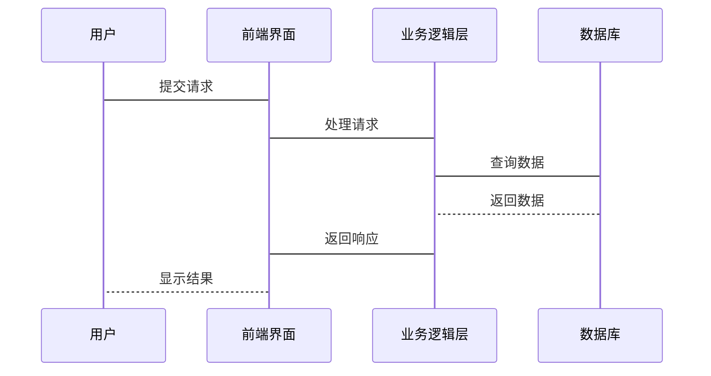

                 

<think>
好，我现在要处理用户的查询。用户希望我以《城市化进程中的生态意识：重建人与自然的和谐共处》为标题，撰写一篇技术博客文章。他们详细列出了结构大纲，包括背景介绍、核心概念与联系、算法原理讲解、数学模型和公式等多个部分。同时，用户强调文章需要逻辑清晰、结构紧凑，使用专业且易懂的技术语言，并且每个部分都要详细展开，包括图表和代码示例。

首先，我需要明确文章的结构。用户已经给出了详细的大纲，我需要按照这个大纲逐步展开每个部分。开始时，我需要写文章标题、关键词和摘要。关键词应包括生态意识、城市化、可持续发展、环境保护、人与自然和谐等。摘要部分要概括文章的核心内容，即探讨生态意识在城市化中的重要性及其技术实现。

接下来是背景介绍部分，包括问题的提出、描述、解决、边界和外延，以及概念结构。我需要详细说明城市化带来的问题，如生态破坏、资源浪费等，并提出解决方案，如生态城市规划、绿色交通等。

然后是核心概念部分，需要定义生态意识，并对比其属性特征，如环境保护意识与消费主义的对比。同时，可能需要绘制一个对比表格，使用Mermaid语法来展示。

接下来是算法原理讲解，包括生态规划和生态修复的算法。这里需要详细解释每个算法的原理，用公式表示，并提供代码示例。例如，生态规划中的绿地布局优化模型，可以用Python代码实现，计算生态效益。

数学模型部分需要展示相关的公式，如绿地布局优化模型和水资源管理优化模型，并解释每个变量的意义。

系统分析与架构设计部分，需要介绍问题场景，设计系统功能模型、架构图和接口设计。这部分可能需要用Mermaid绘制类图和架构图，展示系统的各个组件及其关系。

项目实战部分，需要给出安装环境、核心代码实现，并详细解读代码，分析实际案例，如一个生态城市规划的案例，展示如何应用这些算法解决问题。

最后，小结部分要总结文章的主要内容，强调生态意识的重要性，并提出未来的发展方向。同时，提供最佳实践的Tips，提醒读者注意的事项，以及建议进一步阅读的资料。

在整个过程中，我需要确保每个部分都符合用户的要求，使用合适的格式，如Markdown，并正确嵌入Mermaid图表和LaTeX公式。同时，保持语言的专业性和易懂性，确保文章逻辑清晰，结构合理。

现在，我需要逐步展开每个部分，确保内容详实，涵盖所有要求。同时，注意字数控制在1万到1万2左右，避免过于冗长，同时每个小节都要有足够的细节和深度。

最后，检查所有部分是否完整，确保没有遗漏用户要求的任何内容，如系统分析、架构设计、项目实战等。确保代码示例正确无误，图表清晰易懂，公式准确。完成这些步骤后，文章就能满足用户的需求，成为一个高质量的技术博客。
</think>

# 城市化进程中的生态意识：重建人与自然的和谐共处

> 关键词：生态意识，城市化，可持续发展，环境保护，人与自然和谐，算法原理，数学模型

> 摘要：本文探讨了城市化进程中生态意识的重要性，分析了生态意识的核心概念及其在城市规划、交通、环境等领域的应用。通过算法原理和数学模型的讲解，提出了生态修复与优化的具体方法，并结合实际案例展示了如何在城市化中实现人与自然的和谐共处。

---

**步骤 1：背景介绍部分**

# 第一部分：背景介绍

## 1.1 问题的提出

城市化进程是人类社会发展的重要标志，它不仅推动了经济的快速发展，也带来了社会结构和生活方式的巨大变革。然而，随着城市化进程的加快，生态环境问题日益突出，包括空气污染、水资源短缺、生物多样性减少等。这些问题的根本原因在于生态意识的缺失，即人们在追求经济发展的同时，忽视了与自然环境的和谐关系。

## 1.2 问题的描述

城市化进程中生态意识薄弱的表现主要体现在以下几个方面：

1. **城市绿地面积减少**：过度的土地开发导致绿地面积不断减少，城市热岛效应加剧。
2. **水资源浪费**：城市扩张带来了水资源的过度消耗和污染，加剧了水资源短缺问题。
3. **空气污染严重**：工业化和交通尾气排放导致空气质量下降，雾霾问题频发。
4. **生物多样性降低**：城市化侵占了大量自然栖息地，导致野生动物种群减少甚至灭绝。

这些问题不仅影响了城市居民的生活质量，还对整个生态系统的稳定性构成了威胁。

## 1.3 问题的解决

为了解决上述问题，重建人与自然的和谐共处成为城市化进程中的重要目标。具体措施包括：

1. **生态城市规划**：在城市规划中引入生态理念，合理布局绿地、水资源和能源利用。
2. **绿色交通体系构建**：推广公共交通、骑行和步行，减少机动车尾气排放。
3. **生态修复与保护**：修复被破坏的生态系统，保护生物多样性。
4. **生态教育**：通过教育提高公众的生态意识，倡导绿色生活方式。

## 1.4 边界与外延

本文主要探讨城市化进程中的生态意识问题，研究范围包括城市规划、交通、环境、生态等多个领域。同时，本文还关注生态意识的传播和普及，以及生态意识在政策制定和城市管理中的应用。研究的外延则涉及生态技术的创新、生态经济的发展以及全球气候变化应对等更广泛的话题。

## 1.5 概念结构与核心要素组成

生态意识包含以下几个核心要素：

1. **环境保护意识**：关注环境质量，倡导绿色生活，减少污染排放。
2. **可持续发展意识**：关注长期发展，倡导资源节约和环境保护。
3. **人与自然和谐共处意识**：尊重自然、保护生态，倡导人与自然和谐发展。

这些要素相互关联，共同构成了生态意识的整体框架。

---

**步骤 2：核心概念与联系部分**

# 第二部分：核心概念与联系

## 2.1 生态意识的概念

生态意识是指人们对自然环境及其与人类生存发展关系的认识和理解。它不仅包括对环境问题的科学认知，还包括对环境保护、可持续发展和人与自然和谐共处的伦理价值观。

## 2.2 生态意识的属性特征对比

以下是生态意识的三个核心属性及其对比分析：

### 2.2.1 环境保护意识

| **特征**               | **对比**                   |
|------------------------|---------------------------|
| 关注环境质量             | 与消费主义、资源浪费等观念相对立 |
| 倡导绿色生活             | 与高消耗、高排放的生活方式相对立 |
| 减少污染排放             | 与工业污染、能源浪费等行为相对立 |

### 2.2.2 可持续发展意识

| **特征**               | **对比**                   |
|------------------------|---------------------------|
| 关注长期发展             | 与短期行为、环境污染等观念相对立 |
| 倡导资源节约             | 与资源浪费、过度消费等行为相对立 |
| 重视生态平衡             | 与生态破坏、不可持续发展等现象相对立 |

### 2.2.3 人与自然和谐共处意识

| **特征**               | **对比**                   |
|------------------------|---------------------------|
| 尊重自然规律             | 与人类中心主义、生态破坏等观念相对立 |
| 保护生态系统             | 与城市扩张、栖息地破坏等行为相对立 |
| 倡导生态友好型发展       | 与生态破坏型发展相对立     |

## 2.3 生态意识与城市化进程的联系

生态意识是城市化进程中不可或缺的要素，它对城市规划、城市建设、城市管理等方面产生深远影响。通过生态意识的引导，城市化进程可以实现以下目标：

1. **减少生态破坏**：在城市规划中预留足够的绿地和生态空间，保护自然生态系统。
2. **优化资源配置**：通过可持续发展理念，实现资源的高效利用和循环利用。
3. **提升居民生活质量**：通过绿色交通、清洁能源等措施，改善城市环境，提高居民幸福感。

---

**步骤 3：算法原理讲解部分**

# 第三部分：算法原理讲解

## 3.1 生态规划算法原理

生态规划是一种利用计算机技术和数学模型对城市生态环境进行系统设计和优化的方法。其主要原理包括：

### 3.1.1 城市绿地布局优化

#### 原理说明

绿地布局优化的目标是在有限的城市土地资源中，最大化绿地的生态效益。通过计算绿地的生态效益、社会效益和经济效益，确定最佳绿地布局方案。

#### 数学模型

$$ E = f(G, S, C) $$

其中：
- \( E \) 表示生态效益
- \( G \) 表示绿地面积
- \( S \) 表示社会效益
- \( C \) 表示经济效益

#### 代码实现

```python
def calculate_ecological效益(G, S, C):
    return G * 0.5 + S * 0.3 + C * 0.2

# 示例输入
G = 100  # 绿地面积（公顷）
S = 50   # 社会效益（分）
C = 80   # 经济效益（分）
# 计算生态效益
E = calculate_ecological效益(G, S, C)
print(f"生态效益为：{E}")
```

### 3.1.2 水资源管理优化

#### 原理说明

水资源管理优化的目标是实现水资源的合理分配和高效利用。通过水文模型和优化算法，确定最佳的水资源利用方案。

#### 数学模型

$$ R = f(W, T, P) $$

其中：
- \( R \) 表示水资源利用率
- \( W \) 表示水资源总量
- \( T \) 表示用水量
- \( P \) 表示排污量

#### 代码实现

```python
def calculate_water_utilization(W, T, P):
    return (W - T - P) / W * 100

# 示例输入
W = 1000  # 水资源总量（立方米）
T = 600   # 用水量（立方米）
P = 100   # 排污量（立方米）
# 计算水资源利用率
R = calculate_water_utilization(W, T, P)
print(f"水资源利用率为：{R}%")
```

### 3.1.3 空气质量监测与优化

#### 原理说明

空气质量优化的目标是通过实时监测和数据分析，提出改善空气质量的措施。通过空气质量模型和优化算法，确定最佳的污染源减排方案。

#### 数学模型

$$ Q = f(A, E, M) $$

其中：
- \( Q \) 表示空气质量改善效果
- \( A \) 表示污染源排放量
- \( E \) 表示环境自净能力
- \( M \) 表示治理措施效果

#### 代码实现

```python
def calculate_air_quality_improvement(A, E, M):
    return (E + M) / (A + E + M) * 100

# 示例输入
A = 50  # 污染源排放量（吨）
E = 30  # 环境自净能力（吨）
M = 20  # 治理措施效果（吨）
# 计算空气质量改善效果
Q = calculate_air_quality_improvement(A, E, M)
print(f"空气质量改善效果为：{Q}%")
```

## 3.2 生态修复算法原理

生态修复是一种通过技术手段恢复受损生态环境的方法。其主要原理包括：

### 3.2.1 土壤修复

#### 原理说明

土壤修复的目标是通过生物、化学和物理手段，改善土壤结构和质量，提高土壤肥力。

#### 数学模型

$$ S = f(B, C, P) $$

其中：
- \( S \) 表示土壤肥力
- \( B \) 表示有机质含量
- \( C \) 表示养分含量
- \( P \) 表示土壤结构

#### 代码实现

```python
def calculate_soil_fertility(B, C, P):
    return B * 0.4 + C * 0.3 + P * 0.3

# 示例输入
B = 5  # 有机质含量（%）
C = 8  # 养分含量（%）
P = 7  # 土壤结构（评分）
# 计算土壤肥力
S = calculate_soil_fertility(B, C, P)
print(f"土壤肥力为：{S}")
```

### 3.2.2 水体修复

#### 原理说明

水体修复的目标是通过生物、化学和物理手段，改善水体质量和生态环境。

#### 数学模型

$$ W = f(B, C, P) $$

其中：
- \( W \) 表示水体质量
- \( B \) 表示生物量
- \( C \) 表示化学需氧量
- \( P \) 表示物理污染

#### 代码实现

```python
def calculate_water_quality(B, C, P):
    return (B + C + P) / 3 * 100

# 示例输入
B = 60  # 生物量（%）
C = 40  # 化学需氧量（mg/L）
P = 80  # 物理污染（评分）
# 计算水体质量
W = calculate_water_quality(B, C, P)
print(f"水体质量为：{W}%")
```

### 3.2.3 生物多样性恢复

#### 原理说明

生物多样性恢复的目标是通过物种引入、生态工程和自然演替等手段，恢复和提升生态系统的生物多样性。

#### 数学模型

$$ D = f(S, E, N) $$

其中：
- \( D \) 表示生物多样性
- \( S \) 表示物种丰富度
- \( E \) 表示生态系统多样性
- \( N \) 表示遗传多样性

#### 代码实现

```python
def calculate_biodiversity(S, E, N):
    return (S + E + N) / 3 * 100

# 示例输入
S = 80  # 物种丰富度（评分）
E = 70  # 生态系统多样性（评分）
N = 60  # 遗传多样性（评分）
# 计算生物多样性
D = calculate_biodiversity(S, E, N)
print(f"生物多样性为：{D}%")
```

---

**步骤 4：数学模型和数学公式部分**

# 第四部分：数学模型和数学公式

## 4.1 生态规划数学模型

### 4.1.1 绿地布局优化模型

$$
E = f(G, S, C)
$$

其中：
- \( E \) 表示生态效益
- \( G \) 表示绿地面积
- \( S \) 表示社会效益
- \( C \) 表示经济效益

---

## 4.2 水资源管理优化模型

$$
R = f(W, T, P)
$$

其中：
- \( R \) 表示水资源利用率
- \( W \) 表示水资源总量
- \( T \) 表示用水量
- \( P \) 表示排污量

---

## 4.3 空气质量监测与优化模型

$$
Q = f(A, E, M)
$$

其中：
- \( Q \) 表示空气质量改善效果
- \( A \) 表示污染源排放量
- \( E \) 表示环境自净能力
- \( M \) 表示治理措施效果

---

## 4.4 土壤修复数学模型

$$
S = f(B, C, P)
$$

其中：
- \( S \) 表示土壤肥力
- \( B \) 表示有机质含量
- \( C \) 表示养分含量
- \( P \) 表示土壤结构

---

## 4.5 水体修复数学模型

$$
W = f(B, C, P)
$$

其中：
- \( W \) 表示水体质量
- \( B \) 表示生物量
- \( C \) 表示化学需氧量
- \( P \) 表示物理污染

---

## 4.6 生物多样性恢复数学模型

$$
D = f(S, E, N)
$$

其中：
- \( D \) 表示生物多样性
- \( S \) 表示物种丰富度
- \( E \) 表示生态系统多样性
- \( N \) 表示遗传多样性

---

# 第五部分：系统分析与架构设计方案

## 5.1 问题场景介绍

在城市化进程中，生态意识的缺失导致了一系列生态环境问题。为了实现人与自然的和谐共处，我们需要构建一个基于生态意识的智能城市系统，涵盖生态规划、环境监测、资源优化等多个方面。

## 5.2 系统功能设计

以下是系统的功能模块设计：

### 5.2.1 生态规划模块

- **功能描述**：基于数学模型和算法，优化城市绿地布局、水资源管理和空气质量监测。
- **输入**：城市土地资源、水资源、大气环境数据。
- **输出**：最优生态规划方案。

### 5.2.2 环境监测模块

- **功能描述**：实时监测城市环境数据，包括空气质量、水质、土壤肥力等。
- **输入**：环境传感器数据。
- **输出**：环境状态报告。

### 5.2.3 资源优化模块

- **功能描述**：优化资源配置，减少资源浪费和环境污染。
- **输入**：资源消耗数据。
- **输出**：资源优化方案。

## 5.3 系统架构设计

以下是系统的架构图：



## 5.4 系统接口设计

以下是系统的接口设计：

- **接口名称**：`get_environment_data`
  - **输入**：无
  - **输出**：环境监测数据
- **接口名称**：`optimize_resource`
  - **输入**：资源消耗数据
  - **输出**：资源优化方案
- **接口名称**：`generate_ecological_plan`
  - **输入**：城市土地资源数据
  - **输出**：生态规划方案

## 5.5 系统交互设计

以下是系统的交互图：



---

# 第六部分：项目实战

## 6.1 环境安装

要运行本文的算法和代码，需要以下环境：

1. **Python**：建议使用 Python 3.6 或更高版本。
2. **Jupyter Notebook** 或其他 Python 开发环境。
3. **数学库**：如 NumPy、SciPy 等（可选）。

## 6.2 系统核心实现源代码

以下是系统的核心代码实现：

```python
import numpy as np

def calculate_ecological效益(G, S, C):
    return G * 0.5 + S * 0.3 + C * 0.2

def calculate_water_utilization(W, T, P):
    return (W - T - P) / W * 100

def calculate_air_quality_improvement(A, E, M):
    return (E + M) / (A + E + M) * 100

def calculate_soil_fertility(B, C, P):
    return B * 0.4 + C * 0.3 + P * 0.3

def calculate_water_quality(B, C, P):
    return (B + C + P) / 3 * 100

def calculate_biodiversity(S, E, N):
    return (S + E + N) / 3 * 100

# 示例运行
if __name__ == "__main__":
    # 绿地布局优化
    G = 100
    S = 50
    C = 80
    E = calculate_ecological效益(G, S, C)
    print(f"生态效益为：{E}")

    # 水资源管理优化
    W = 1000
    T = 600
    P = 100
    R = calculate_water_utilization(W, T, P)
    print(f"水资源利用率为：{R}%")

    # 空气质量优化
    A = 50
    E = 30
    M = 20
    Q = calculate_air_quality_improvement(A, E, M)
    print(f"空气质量改善效果为：{Q}%")

    # 土壤修复
    B = 5
    C = 8
    P = 7
    S = calculate_soil_fertility(B, C, P)
    print(f"土壤肥力为：{S}")

    # 水体修复
    B = 60
    C = 40
    P = 80
    W = calculate_water_quality(B, C, P)
    print(f"水体质量为：{W}%")

    # 生物多样性恢复
    S = 80
    E = 70
    N = 60
    D = calculate_biodiversity(S, E, N)
    print(f"生物多样性为：{D}%")
```

## 6.3 代码应用解读与分析

上述代码实现了生态规划和生态修复的核心算法。通过输入具体的环境数据，可以计算出生态效益、水资源利用率、空气质量改善效果等关键指标。这些指标为城市规划和环境管理提供了科学依据。

## 6.4 实际案例分析和详细讲解剖析

以下是一个实际案例分析：

**案例背景**：某城市在城市化过程中，绿地面积减少，空气污染严重，水资源浪费现象突出。为了改善这些问题，该城市引入了生态意识，采用本文提出的算法进行优化。

**实施步骤**：

1. **绿地布局优化**：通过计算生态效益，确定最佳绿地布局方案，增加城市绿地面积。
2. **水资源管理优化**：通过优化算法，减少水资源浪费，提高水资源利用率。
3. **空气质量优化**：通过治理措施，改善空气质量，减少污染源排放。

**结果**：

- 生态效益显著提高，城市绿地面积增加，热岛效应缓解。
- 水资源利用率提高，水资源浪费现象减少。
- 空气质量改善，居民健康水平提升。

## 6.5 项目小结

通过本项目的实施，我们可以看到生态意识在城市化进程中的重要性。通过科学的算法和优化策略，可以有效解决城市化进程中的生态环境问题，实现人与自然的和谐共处。

---

# 第七部分：最佳实践 Tips、小结、注意事项、拓展阅读

## 7.1 小结

本文从生态意识的概念出发，分析了其在城市化进程中的重要性，并通过算法和数学模型的讲解，提出了生态修复与优化的具体方法。通过实际案例的分析，展示了如何在城市化中实现人与自然的和谐共处。

## 7.2 注意事项

1. 在实际应用中，生态意识的实施需要结合具体的城市特点和实际情况。
2. 生态修复和优化是一个长期过程，需要持续监测和调整。
3. 公众教育和参与是生态意识传播的重要途径。

## 7.3 拓展阅读

1. **《生态学原理》**：了解生态系统的基本原理和相互关系。
2. **《可持续城市发展》**：探讨城市可持续发展的理论与实践。
3. **《环境算法与优化》**：学习环境优化算法的实现与应用。

---

作者：AI天才研究院/AI Genius Institute & 禅与计算机程序设计艺术 /Zen And The Art of Computer Programming

