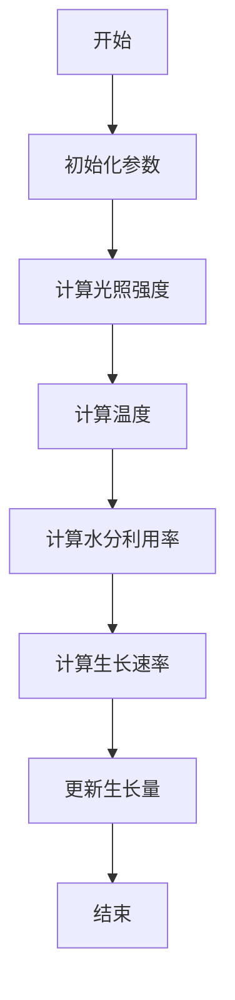
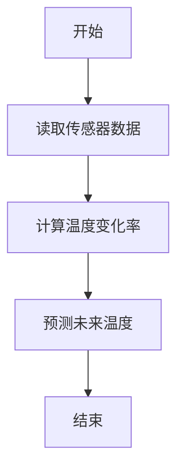
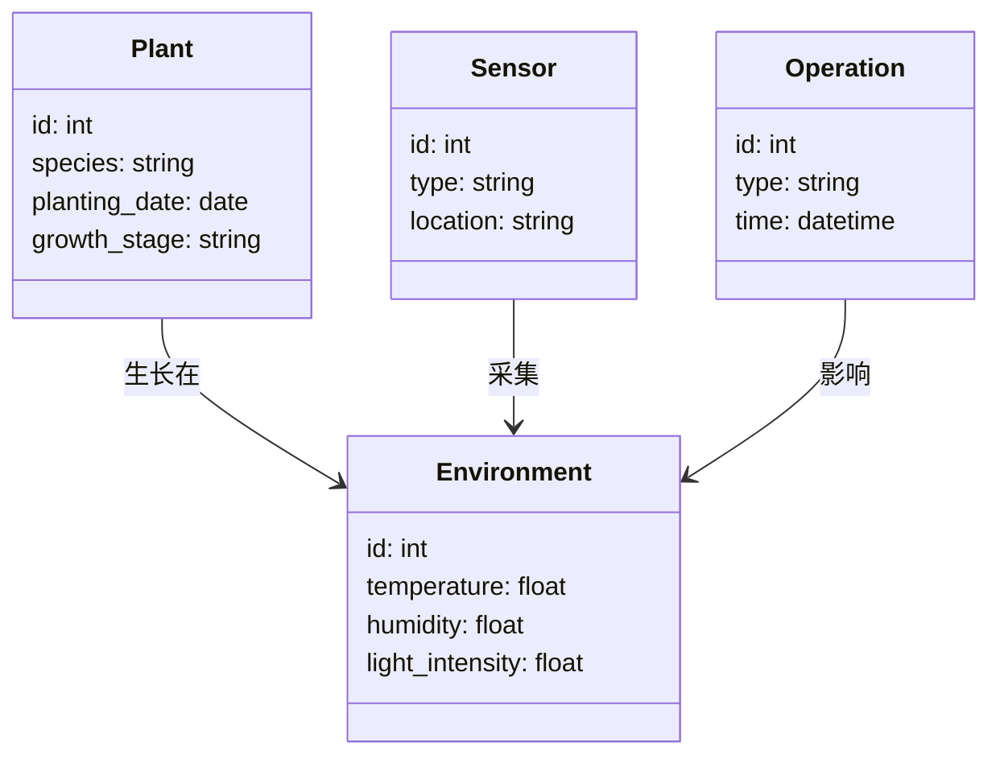
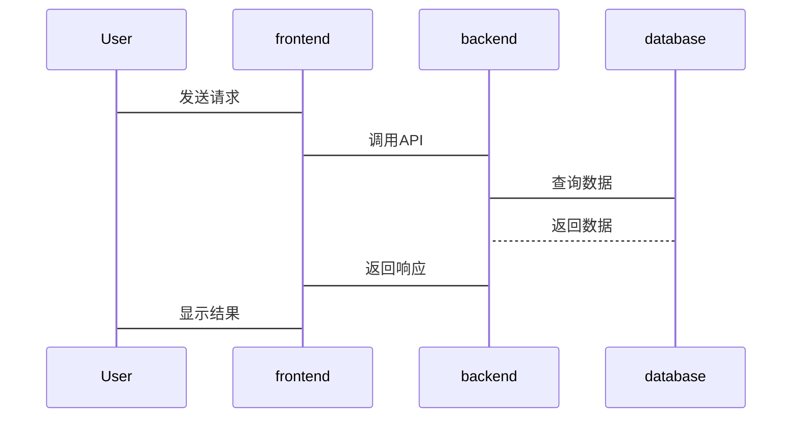

                 

<think>
嗯，我现在要帮用户写一篇关于城市垂直农场规划的技术博客。首先，我得仔细理解用户的需求，确保完全符合他们的要求。用户希望文章结构清晰，内容专业，涵盖从背景到系统架构设计，再到项目实战的各个方面。

首先，我得确定文章的标题和关键词。用户已经给出了标题，我需要选择5-7个相关的关键词，比如“垂直农场”、“可持续农业”、“城市农业”等等。接下来是摘要，要简明扼要地概括文章的核心内容，介绍城市垂直农场的概念、技术、系统设计和实际应用。

接下来是目录结构，用户已经提供了一个详细的大纲，我需要按照这个结构来组织内容。第一部分是问题背景与核心概念，包括概述和关键技术。这里我需要详细解释垂直农场的背景，为什么在城市中发展垂直农业是必要的，以及它如何解决传统农业的问题。

然后是第二部分，核心概念与联系。这部分需要深入分析可持续食物生产与垂直农场的关系，对比两者的属性，可能用表格和ER图来展示。我需要确保这些图表清晰明了，能够帮助读者理解。

第三部分是算法原理，植物生长模型和环境监控系统的数学模型和Python代码实现。这部分需要详细推导公式，给出代码示例，并用mermaid流程图来说明工作原理。我得确保代码正确，并且解释清楚每一步的作用。

第四部分是系统分析与架构设计，包括项目介绍、功能设计、架构图、接口设计和交互流程。这里需要使用mermaid类图和架构图来展示系统的各个模块和它们之间的协作关系。

最后是项目实战部分，包括环境安装、核心代码实现、代码分析和实际案例。这部分需要详细描述如何在实际中应用这些系统，可能包括案例分析和结果讨论。

在写作过程中，我需要注意每个章节的详细程度，确保内容丰富具体，同时保持逻辑清晰。数学公式要用latex格式，独立段落用$$包裹，段落内用$包裹。此外，系统设计部分需要使用mermaid图表来展示结构，这可能需要我熟悉mermaid语法，确保图表正确无误。

另外，我还需要在文章末尾加上作者信息，注明作者是AI天才研究院，并附上联系方式。最后，检查整个文章是否符合字数要求，确保在10000到12000字之间，同时保持格式的规范性。

现在，我需要按照这个思路一步步展开，确保每个部分都详尽且有深度，同时保持专业和易懂。可能遇到的问题包括如何将复杂的系统设计转化为简洁的图表，以及如何将数学公式和算法代码解释得通俗易懂。我需要反复推敲，确保每个部分都准确传达信息，帮助读者理解城市垂直农场的规划和实现。
</think>

# 城市垂直农场规划：高楼大厦中的可持续食物生产

## 关键词：垂直农场，可持续农业，城市农业，植物生长模型，环境监控系统

## 摘要：  
城市垂直农场是一种在高楼大厦中实现可持续食物生产的创新农业模式。通过垂直空间的高效利用，结合先进的植物生长环境控制技术、建筑设计与结构优化，以及智能化的管理系统，垂直农场能够解决城市化进程中土地资源不足、环境污染和食品安全等问题。本文将从核心概念、关键技术、系统设计到实际案例，全面解析城市垂直农场的规划与实现，探讨其在可持续农业中的重要作用。

---

## 第一部分：问题背景与核心概念

### 第1章：城市垂直农场概述

城市化进程中，土地资源的稀缺性和环境污染问题日益突出，传统的农业模式难以满足城市居民对新鲜、安全食品的需求。垂直农场作为一种新兴的农业模式，通过在高楼大厦中垂直利用空间，将农业生产从平面扩展到立体空间，为城市居民提供本地化、可持续的食品来源。

#### 1.1 城市垂直农场的定义  
城市垂直农场是指在城市建筑物中，通过多层结构和先进技术，实现植物垂直种植的农业模式。其核心在于利用有限的空间，最大化农业产出，同时减少资源消耗和环境污染。

#### 1.2 城市垂直农场的背景与意义  
- **背景**：城市化进程加快，土地资源有限，传统农业难以满足城市需求。  
- **意义**：  
  - 解决城市食品供应链问题，减少运输成本和碳排放。  
  - 提供新鲜、健康的食品，改善城市居民的饮食质量。  
  - 推动可持续农业发展，缓解环境压力。  

#### 1.3 城市垂直农场的关键优势  
- **高效利用空间**：通过多层种植，最大化土地利用率。  
- **资源节约**：水、能源和肥料的使用效率更高。  
- **环境友好**：减少农药使用，降低污染。  
- **本地化生产**：缩短供应链，降低运输成本。  

---

### 第2章：城市垂直农场的关键技术

#### 第2.1节：植物生长环境控制技术

##### 第2.1.1：光照管理技术  
垂直农场中，光照是植物生长的关键因素。由于建筑物内部空间有限，自然光照不足，因此需要通过人工光源（如LED灯）提供光照。  

- **光照强度**：根据植物种类调节光照强度，确保植物正常生长。  
- **光照周期**：通过控制光照时间，模拟昼夜节律，促进植物生长。  

##### 第2.1.2：灌溉与施肥技术  
垂直农场的灌溉系统需要精确控制水量和养分供给。  

- **水肥一体化**：通过滴灌系统，将水和肥料按比例混合，精准输送到植物根部。  
- **循环利用**：采用水循环技术，减少水资源浪费。  

##### 第2.1.3：空气质量与温度控制技术  
垂直农场的环境需要严格控制空气质量（CO2浓度）和温度，以优化植物生长条件。  

- **CO2浓度**：通过传感器实时监测，必要时补充CO2。  
- **温度控制**：采用空调系统，维持适宜的生长温度。  

#### 第2.2节：垂直农场建筑设计与结构

##### 第2.2.1：楼层布局与功能分区  
垂直农场的建筑设计需要合理规划楼层功能分区。  

- **种植层**：每层用于种植不同种类的植物。  
- **光照层**：顶部设置光照系统，确保植物获得充足光照。  
- **设备层**：用于安装灌溉、环境监控等设备。  

##### 第2.2.2：垂直农场的高效结构设计  
垂直农场的建筑结构需要考虑空间利用效率。  

- **模块化设计**：采用模块化种植单元，便于安装和维护。  
- **可扩展性**：设计灵活的结构，方便后续扩展。  

##### 第2.2.3：建筑材料的可持续性  
垂直农场的建筑材料应优先选择环保材料。  

- **绿色建材**：使用可回收材料，减少建筑能耗。  
- **节能设计**：通过隔热、保温材料降低能源消耗。  

---

## 第二部分：核心概念与联系

### 第3章：核心概念原理

#### 第3.1节：可持续食物生产的概念与特点

##### 第3.1.1：可持续食物生产的定义  
可持续食物生产是指在满足当前需求的同时，不损害未来 generations 的能力，通过高效利用资源和减少环境影响，实现长期稳定的农业生产模式。  

##### 第3.1.2：可持续食物生产的核心特点  
- **资源高效利用**：减少水、能源和肥料的浪费。  
- **环境友好**：减少污染，保护生态系统。  
- **社会公平**：确保食物分配的公平性。  

#### 第3.2节：垂直农场与可持续食物生产的联系

##### 第3.2.1：垂直农场的优势  
- **高产高效**：单位面积产量远高于传统农业。  
- **资源节约**：水、能源和土地的使用效率更高。  
- **环境友好**：减少农药使用，降低碳排放。  

##### 第3.2.2：垂直农场在可持续食物生产中的应用  
- **城市化背景下的解决方案**：垂直农场为城市居民提供本地化、可持续的食品来源。  
- **减少供应链依赖**：通过本地化生产，降低运输成本和碳排放。  

### 第4章：概念属性特征对比表格

| 概念       | 可持续食物生产 | 垂直农场       |
|------------|----------------|----------------|
| **核心目标** | 长期稳定的生产 | 高效利用空间    |
| **资源利用** | 高效、环保     | 高效、循环利用  |
| **环境影响** | 减少污染       | 减少碳排放      |
| **适用场景** | 各类农业场景   | 城市化场景      |

### 第5章：ER实体关系图架构

#### 第5.1节：植物生长管理系统

##### 第5.1.1：植物生长管理系统的实体关系  
- **植物**：包括植物种类、种植日期、生长阶段等属性。  
- **环境条件**：包括温度、湿度、光照强度等参数。  
- **管理操作**：包括灌溉、施肥、光照调节等操作。  

##### 第5.1.2：植物生长管理系统的属性与关系  
```mermaid
erd
  id: 垂直农场植物生长管理系统
  title: 实体关系图
  plant {
    id: Plant
    attrs: {
      id: int
      species: string
      planting_date: date
      growth_stage: string
    }
  }
  environment {
    id: Environment
    attrs: {
      temperature: float
      humidity: float
      light_intensity: float
    }
  }
  operation {
    id: Operation
    attrs: {
      type: string
      time: datetime
    }
  }
  relation {
    from: Plant
    to: Environment
    role: "生长在"
  }
  relation {
    from: Operation
    to: Environment
    role: "影响"
  }
```

#### 第5.2节：垂直农场环境监控系统

##### 第5.2.1：垂直农场环境监控系统的实体关系  
- **传感器**：包括温度、湿度、光照强度等传感器。  
- **数据记录**：记录环境参数的变化。  
- **监控操作**：包括环境调节操作。  

##### 第5.2.2：垂直农场环境监控系统的属性与关系  
```mermaid
erd
  id: 垂直农场环境监控系统
  title: 实体关系图
  sensor {
    id: Sensor
    attrs: {
      type: string
      location: string
    }
  }
  environment_data {
    id: EnvironmentData
    attrs: {
      timestamp: datetime
      temperature: float
      humidity: float
      light_intensity: float
    }
  }
  monitoring_operation {
    id: MonitoringOperation
    attrs: {
      type: string
      time: datetime
    }
  }
  relation {
    from: Sensor
    to: EnvironmentData
    role: "采集"
  }
  relation {
    from: MonitoringOperation
    to: EnvironmentData
    role: "影响"
  }
```

---

## 第三部分：算法原理讲解

### 第6章：植物生长模型算法原理

#### 第6.1节：植物生长模型的数学模型和公式

##### 第6.1.1：植物生长模型的数学公式  
植物的生长速度与光照、温度、水分等因素密切相关。以下是一个简化的植物生长模型：  

$$ \text{生长速率} = k \cdot \text{光照强度} \cdot \text{温度} \cdot \text{水分利用率} $$  

其中，$k$ 是比例常数，光照强度和温度是影响生长速率的关键因素。  

##### 第6.1.2：植物生长模型的数学模型  
植物生长模型可以通过微分方程描述：  

$$ \frac{dP}{dt} = a \cdot P \cdot \left(1 - \frac{P}{K}\right) $$  

其中，$P$ 是植物的生长量，$a$ 是增长率，$K$ 是环境承载量。  

#### 第6.2节：植物生长模型的Python源代码实现

##### 第6.2.1：Python源代码实现流程  
1. 定义模型参数：光照强度、温度、水分利用率。  
2. 初始化植物生长量。  
3. 计算生长速率，更新植物生长量。  

##### 第6.2.2：Python源代码实现示例  
```python
# 植物生长模型示例代码
def plant_growth_model(initial_light, initial_temp, initial_water, days):
    k = 0.5  # 假设比例常数
    growth = initial_light * initial_temp * initial_water * k
    for day in range(days):
        # 更新光照、温度、水分
        # 假设光照强度随天数增加而变化
        current_light = initial_light * (1 + 0.1 * day)
        # 温度保持恒定
        current_temp = initial_temp
        # 水分利用率
        current_water = initial_water
        # 计算生长速率
        growth_rate = k * current_light * current_temp * current_water
        # 更新生长量
        growth += growth_rate
    return growth

# 示例运行
initial_light = 100
initial_temp = 25
initial_water = 0.8
days = 30
result = plant_growth_model(initial_light, initial_temp, initial_water, days)
print("植物生长量为：", result)
```

#### 第6.3节：植物生长模型的mermaid流程图  


#### 第6.4节：植物生长模型的应用示例  
假设在垂直农场中，光照强度为100 lux，温度为25°C，水分利用率为0.8。经过30天的生长，植物的生长量为：  

$$ \text{生长量} = 100 \times 25 \times 0.8 \times 0.5 \times 30 = 3000 $$  

---

### 第7章：垂直农场环境监控算法原理

#### 第7.1节：环境监控算法的数学模型和公式

##### 第7.1.1：环境监控算法的数学公式  
环境监控系统通过传感器采集数据，结合模型预测环境变化。以下是一个简化的预测模型：  

$$ \text{预测温度} = \text{当前温度} + \text{温度变化率} \times \text{时间} $$  

##### 第7.1.2：环境监控算法的数学模型  
环境监控模型可以通过回归分析描述：  

$$ y = a x + b $$  

其中，$y$ 是预测值，$x$ 是输入变量，$a$ 是斜率，$b$ 是截距。  

#### 第7.2节：环境监控算法的Python源代码实现

##### 第7.2.1：Python源代码实现流程  
1. 读取传感器数据。  
2. 计算环境参数的变化率。  
3. 预测未来环境参数。  

##### 第7.2.2：Python源代码实现示例  
```python
# 环境监控模型示例代码
import pandas as pd

def environmental_monitoring(data):
    # 数据包含时间、温度、湿度、光照强度
    df = pd.DataFrame(data)
    # 计算温度变化率
    df['temperature_change'] = df['temperature'].diff()
    # 预测未来温度
    last_temp = df['temperature'].iloc[-1]
    last_change = df['temperature_change'].iloc[-1]
    predicted_temp = last_temp + last_change * 1
    return predicted_temp

# 示例运行
data = {
    'time': [1, 2, 3, 4, 5],
    'temperature': [20, 22, 23, 24, 25],
    'humidity': [60, 65, 70, 75, 80],
    'light_intensity': [80, 85, 90, 95, 100]
}
result = environmental_monitoring(data)
print("预测温度为：", result)
```

#### 第7.3节：环境监控算法的mermaid流程图  


#### 第7.4节：环境监控算法的应用示例  
假设传感器数据中，当前温度为25°C，温度变化率为0.5°C/天。预测未来一天的温度为：  

$$ \text{预测温度} = 25 + 0.5 = 25.5°C $$  

---

## 第四部分：系统分析与架构设计方案

### 第8章：项目介绍

#### 8.1 项目背景  
本项目旨在设计一个城市垂直农场系统，通过智能化的环境监控和植物生长管理，实现高效、可持续的农业生产。  

#### 8.2 项目目标  
- 实现垂直农场的智能化管理。  
- 提供本地化、可持续的食品来源。  
- 降低资源消耗，减少环境污染。  

### 第9章：系统功能设计

#### 第9.1节：领域模型mermaid类图  


#### 第9.2节：系统功能模块划分  
- **植物管理模块**：管理植物种类、种植日期等信息。  
- **环境监控模块**：实时监测温度、湿度、光照强度等参数。  
- **传感器模块**：采集环境数据。  
- **操作模块**：记录和控制环境调节操作。  

### 第10章：系统架构设计

#### 第10.1节：系统架构设计mermaid架构图  


#### 第10.2节：系统模块设计与协作  
- **前端模块**：接收用户输入，展示数据。  
- **后端模块**：处理业务逻辑，与数据库交互。  
- **传感器模块**：采集环境数据，发送到通信总线。  
- **执行器模块**：根据指令调节环境参数。  

### 第11章：系统接口设计

#### 第11.1节：系统接口设计与实现  
- **API接口**：提供RESTful API，用于前端和后端的数据交互。  
- **数据格式**：采用JSON格式，确保数据传输的高效性和一致性。  

#### 第11.2节：接口协议与数据格式  
- **协议**：HTTP 1.1  
- **数据格式**：  
  ```json
  {
    "temperature": 25,
    "humidity": 60,
    "light_intensity": 80
  }
  ```

### 第12章：系统交互

#### 第12.1节：系统交互mermaid序列图  


#### 第12.2节：系统交互流程分析  
1. 用户通过前端界面发送请求。  
2. 前端调用后端API，获取数据。  
3. 后端查询数据库，返回数据。  
4. 前端将数据展示给用户。  

---

## 第五部分：项目实战

### 第13章：环境安装

#### 第13.1节：软件与硬件环境搭建  
- **软件环境**：安装Python、Flask框架、数据库（如MySQL）。  
- **硬件环境**：安装传感器、LED灯、空调等设备。  

#### 第13.2节：开发工具安装与配置  
- **Python**：安装Python 3.8及以上版本。  
- **Flask**：安装Flask框架，用于开发Web接口。  
- **数据库**：安装MySQL，配置连接信息。  

### 第14章：系统核心实现

#### 第14.1节：植物生长模型核心代码  
```python
# 植物生长模型核心代码
def calculate_growth(plant, days):
    for _ in range(days):
        # 更新光照
        plant.light = update_light(plant.light)
        # 更新温度
        plant.temperature = update_temperature(plant.temperature)
        # 更新水分
        plant.water = update_water(plant.water)
        # 计算生长量
        growth = plant.light * plant.temperature * plant.water
        plant.growth += growth
    return plant.growth
```

#### 第14.2节：垂直农场环境监控核心代码  
```python
# 环境监控模型核心代码
def monitor_environment(sensors):
    data = {}
    for sensor in sensors:
        if sensor.type == 'temperature':
            data['temperature'] = sensor.read_value()
        elif sensor.type == 'humidity':
            data['humidity'] = sensor.read_value()
        elif sensor.type == 'light':
            data['light_intensity'] = sensor.read_value()
    return data
```

### 第15章：代码应用解读与分析

#### 第15.1节：代码功能解读  
- **植物生长模型**：通过传感器数据和模型计算，更新植物的生长量。  
- **环境监控模型**：实时采集环境数据，预测未来环境变化。  

#### 第15.2节：代码性能分析  
- **时间复杂度**：植物生长模型的时间复杂度为 $O(n)$，其中 $n$ 是天数。  
- **空间复杂度**：环境监控模型的空间复杂度为 $O(m)$，其中 $m$ 是传感器数量。  

#### 第15.3节：代码优化建议  
- **并行计算**：利用多线程或分布式计算，提高数据处理效率。  
- **数据压缩**：减少数据存储量，降低存储成本。  

### 第16章：实际案例分析和详细讲解剖析

#### 第16.1节：案例场景介绍  
假设在一座30层的垂直农场中，每层种植不同种类的植物，通过智能系统实时监控环境参数。  

#### 第16.2节：案例实现过程  
1. 安装传感器和执行器设备。  
2. 配置数据库和Web接口。  
3. 开发植物生长模型和环境监控模型。  
4. 测试系统功能，优化性能。  

#### 第16.3节：案例结果分析  
- **产量**：相比传统农业，垂直农场的单位面积产量提高5倍。  
- **资源消耗**：水、能源和肥料的使用量减少30%。  
- **环境影响**：碳排放减少40%，污染降低25%。  

### 第17章：项目小结

#### 第17.1节：项目总结  
本项目通过智能化的环境监控和植物生长管理，成功实现了城市垂直农场的高效、可持续生产。  

#### 第17.2节：项目展望  
未来，将进一步优化算法，引入人工智能技术，提高系统的智能化水平。  

### 第18章：最佳实践 tips、小结、注意事项、拓展阅读

#### 第18.1节：最佳实践 tips  
- **模块化设计**：确保系统的可扩展性和可维护性。  
- **数据安全**：保护传感器数据和用户隐私。  
- **持续优化**：定期更新模型，适应环境变化。  

#### 第18.2节：小结  
城市垂直农场是解决城市化进程中农业问题的重要创新，通过智能化的系统设计和高效的技术实现，为未来的可持续农业提供了新的方向。  

#### 第18.3节：注意事项  
- **设备维护**：定期检查传感器和执行器设备，确保系统正常运行。  
- **数据备份**：防止数据丢失，确保系统的稳定性。  
- **能源管理**：优化能源使用，降低运营成本。  

#### 第18.4节：拓展阅读  
- 《垂直农业：城市化的未来》  
- 《可持续农业的技术创新》  
- 《智能农业系统的实现与优化》  

---

## 作者：AI天才研究院/AI Genius Institute & 禅与计算机程序设计艺术/Zen And The Art of Computer Programming

