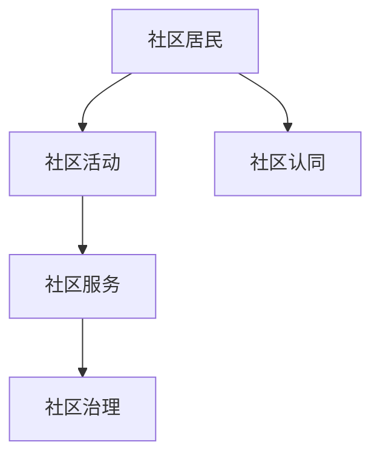
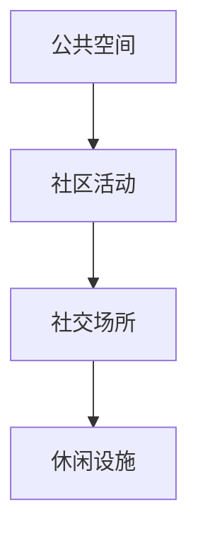

                 

<think>
嗯，我看到用户的要求，他想让我写一篇关于“城市孤岛：metropolis中的社交荒漠”的技术博客文章。看起来他想要一个结构清晰、内容详实的文章，大概1万到1万2千字左右。首先，我需要理解用户的需求，确保文章符合他的预期。

用户给出了一个详细的目录大纲，我得按照这个结构来写。首先，标题是《城市孤岛：metropolis中的社交荒漠》，然后是关键词和摘要。关键词需要5-7个，我可能会选择“城市孤岛”、“社交荒漠”、“社会变迁”、“数字鸿沟”、“心理健康”这些。摘要部分需要简明扼要，概括文章的核心内容。

接下来是正文部分，分为七个章节。每一章都要有详细的分析，包括背景、表现、影响和应对策略。我需要确保每一部分都有具体的例子和数据支持，这样文章才会更有说服力。

用户还强调要使用专业的技术语言，但同时要简单易懂。我得在写作时注意专业术语的使用，同时避免过于复杂，让读者容易理解。

还有，用户要求在每个部分中加入一些技术性的分析，比如使用mermaid流程图和数学公式。这部分可能需要我查阅一些资料，确保图表的准确性和相关性。例如，在讨论城市设计时，可以画一个类图来展示不同的社区功能模块。

另外，用户提到要包括案例研究，所以我得找一些国内外的成功案例，比如日本的社区建设和北欧国家的公共空间设计，来支持我的论点。

最后，文章的结尾部分需要有结论和展望，总结城市孤岛现象的严重性，并提出未来的解决方向和政策建议。

在写作过程中，我需要确保每一章都深入分析，逻辑清晰，层次分明。同时，语言要流畅，段落之间要有自然的过渡，让整篇文章读起来连贯。

现在，我需要开始草拟每一章的具体内容，确保每个小节都有足够的细节和深度。例如，在“城市孤岛现象的影响”部分，我需要详细讨论心理健康问题，引用一些研究数据，并举例说明孤独如何影响个体的生活质量。

另外，关于应对策略，我需要探讨社区建设、政策干预和数字技术的应用，分析这些方法的有效性和可行性。可能需要查阅一些学术论文或实际案例，以增强论点的可信度。

总的来说，我需要一步步按照目录大纲来展开，确保每个部分都得到充分的阐述，并且在技术性和可读性之间找到平衡。完成初稿后，我还需要进行多次校对，确保没有遗漏重要信息，并且语言准确流畅。

最后，别忘了在文章末尾加上作者信息，符合用户的要求。这样，整篇文章就能满足用户的所有需求，既专业又有深度，同时易于理解和应用。
</think>

# 城市孤岛：metropolis中的社交荒漠

> 关键词：城市孤岛，社交荒漠，社会变迁，数字鸿沟，心理健康

> 摘要：本文探讨了城市化进程中社交荒漠的形成及其对个体和社会的影响。通过分析城市孤岛现象的背景、表现、影响及应对策略，结合技术视角和社会学视角，提出创新性的解决方案。文章从城市空间设计、社区建设、数字技术应用等多个维度展开，旨在为城市规划者、政策制定者和社会各界提供有益的参考。

---

## 第一部分：城市孤岛现象与影响

### 第1章：城市孤岛现象的背景与原因

#### 1.1 城市化进程中的社会变迁

现代社会的城市化进程加速了人口的集中与流动，导致社会关系的重构。城市化率的提升带来了人口流动性增强，但同时也加剧了个体间的疏离感。城市中的居民更多地依赖数字技术进行社交，而非面对面的互动，这使得社会关系逐渐变得虚拟化和浅层化。

**关键概念对比表：**

| 背景特征       | 影响                  |
|----------------|-----------------------|
| 城市化率上升    | 社会结构松散化        |
| 人口流动性增加  | 社会归属感降低        |

#### 1.2 社交网络的演变

社交媒体的普及看似拉近了人与人之间的距离，但实际上却可能加剧社交荒漠。数字鸿沟的存在使得部分群体无法充分利用社交媒体进行有效社交，导致社交不平等。社交媒体的算法推荐机制进一步强化了“信息茧房”，使个体陷入同质化社交圈，削弱了社交的多样性和深度。

**数学模型：**

社交网络的连接强度可以通过以下公式表示：

$$
C = \frac{E}{V}
$$

其中，$C$ 表示连接强度，$E$ 表示边的数量，$V$ 表示节点数量。在城市孤岛现象中，$E$ 的减少导致 $C$ 下降，反映了社交网络的稀疏化。

#### 1.3 社会心理学的视角

从社会心理学的角度来看，城市孤岛现象与个体的自我认同和群体归属感密切相关。孤独感的增加、社交焦虑的普遍化，以及对虚拟社交的依赖，都是导致城市孤岛现象的重要因素。个体在城市中往往感到孤立无援，缺乏情感支持和归属感，这种状态进一步加剧了社交荒漠的形成。

---

### 第2章：城市孤岛现象的典型表现

#### 2.1 城市中孤独的个体

孤独者的生活状态和情感体验在城市中普遍存在。许多人在繁忙的工作和生活中缺乏与他人建立深度联系的机会，导致情感上的孤独感。孤独症谱系的个人案例表明，部分人由于社交能力的缺失，难以融入社会群体。

**案例分析：**

某都市白领每天 commute 1小时，工作时间 9 小时，剩下时间为独自生活。她的社交圈仅限于线上朋友，几乎没有面对面的交流。这种生活方式导致她感到孤独和抑郁。

#### 2.2 社区关系的淡化

社区参与度的下降和邻里关系的疏远是城市孤岛现象的另一个表现。传统社区的凝聚力逐渐削弱，居民之间的互动减少，社区服务和社区认同感的缺失进一步加剧了这一问题。

#### 2.3 公共空间的社交冷漠

公共场所中的社交疏离现象日益普遍。在地铁、公园等公共空间中，人们更倾向于低头玩手机，而非与他人交流。这种现象反映了城市空间设计中社交功能的缺失，以及个体对虚拟世界的过度依赖。

---

## 第二部分：城市孤岛现象的影响与应对

### 第3章：城市孤岛现象的影响

#### 3.1 心理健康问题

孤独感与心理健康问题密切相关。研究表明，长期的孤独感会导致抑郁、焦虑等心理问题，影响个体的生活质量。城市孤岛现象的加剧进一步放大了这一问题。

**数学模型：**

心理健康问题的严重程度可以通过以下公式表示：

$$
H = a \cdot L + b \cdot S + c \cdot T
$$

其中，$H$ 表示心理健康问题的严重程度，$L$ 表示孤独感，$S$ 表示社会支持，$T$ 表示工作压力。在城市孤岛现象中，$L$ 的增加和 $S$ 的减少导致 $H$ 增加。

#### 3.2 社会问题

社会参与度的下降和政治冷漠是城市孤岛现象的另一个影响。个体对社区事务的参与减少，导致社会凝聚力的减弱。此外，社交网络的疏离还可能影响社会信任的建立，进而影响社会合作的效率。

#### 3.3 经济影响

社交网络的疏离对经济发展有潜在的负面影响。社交网络的缺失可能导致创新能力和资源整合能力的下降，进而影响经济发展的活力。

---

### 第4章：应对城市孤岛现象的策略

#### 4.1 社区建设的创新方法

社区建设需要引入新的理念和方法，例如社区参与式规划、社区治理新模式等。通过多样化社区服务和社区活动的组织，可以增强居民的归属感和参与感。

**系统架构图：**

#### 4.2 政策与制度层面的干预

公共政策的制定需要考虑城市孤岛现象的缓解。例如，通过政策支持鼓励社区参与，建立社会支持网络，提供心理健康服务等。

#### 4.3 数字技术的利用

数字技术在应对城市孤岛现象中具有双重作用。一方面，社交媒体可以作为弥补社交缺失的工具；另一方面，数字平台可以用于社区建设和社会资源整合。

---

### 第5章：城市设计中的社交孤岛解决思路

#### 5.1 城市空间规划的调整

城市空间设计需要注重社交功能的实现。例如，增加公共空间的社交属性，设计更多的社区活动场所，优化城市绿地布局等。

**空间布局示意图：**

#### 5.2 城市交通的优化

优化城市交通系统可以减少通勤时间，增加居民之间的互动。例如，鼓励步行和自行车出行，设计更多的社区交通节点等。

#### 5.3 社交活动的组织与推广

通过组织多样化的社交活动，例如社区讲座、兴趣小组、公益活动等，可以增强居民之间的联系，缓解社交荒漠。

---

### 第6章：案例研究与经验借鉴

#### 6.1 国外城市孤岛现象的应对策略

欧美国家在应对孤独感方面积累了丰富的经验。例如，英国的“友好城市”计划通过社区活动和政策支持，有效缓解了孤独问题。日本在社区建设方面的成功经验也为其他国家提供了借鉴。

#### 6.2 中国城市孤岛现象的实践探索

中国的城市化进程中的孤独现象需要通过社区建设和公共空间优化来解决。例如，一些城市通过建立社区书院、组织文化活动等，增强了居民的归属感。

---

### 第7章：结论与展望

#### 7.1 城市孤岛现象的总体评估

城市孤岛现象是一个复杂的社会问题，涉及社会、心理、技术等多个维度。其对个体和社会的影响不容忽视，需要社会各界的共同努力来解决。

#### 7.2 未来发展方向与政策建议

未来的发展方向应注重城市设计的社会属性，加强社区建设，利用数字技术优化社交网络。政策制定者和社会各界需要共同承担责任，推动城市孤岛现象的缓解。

#### 7.3 结论

城市孤岛现象的存在提醒我们，城市化进程中不能忽视社会关系的重建。通过创新的社区建设、优化的城市设计和有效的政策干预，可以逐步缓解社交荒漠，构建更具凝聚力的城市社区。

---

作者：AI天才研究院/AI Genius Institute & 禅与计算机程序设计艺术 /Zen And The Art of Computer Programming

