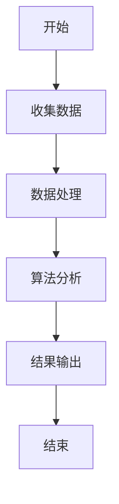
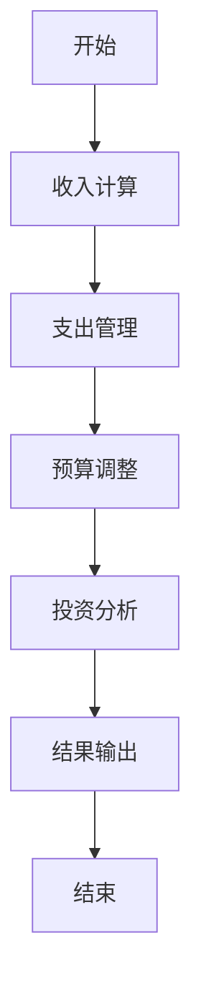
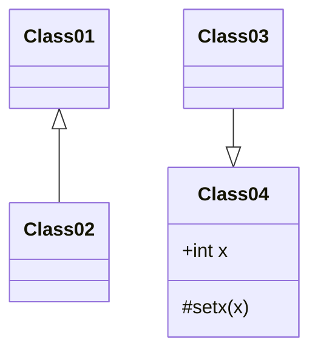
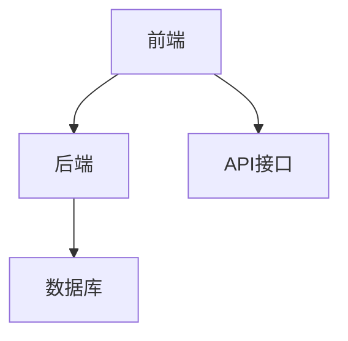
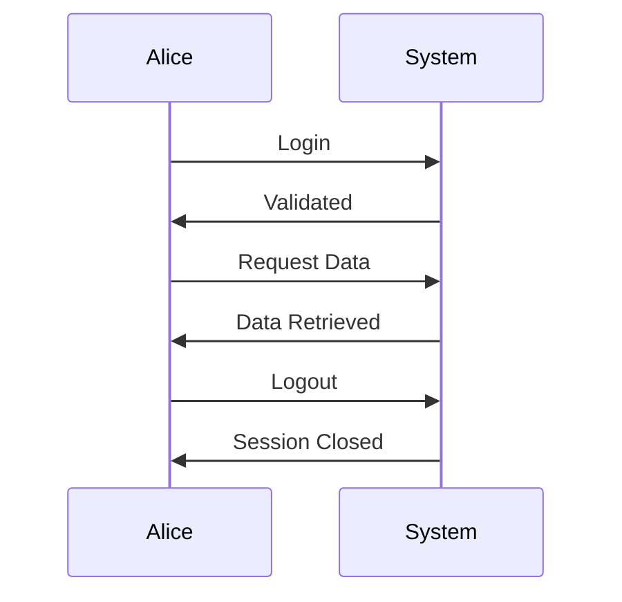

                 

<think>
好，我现在需要根据用户的指示，编写一篇技术博客文章的目录大纲，标题是《城市游牧指南3.0：数字游民的生存智慧》。用户已经提供了一些详细的结构，我需要按照这个结构来思考如何一步步构建。

首先，用户希望文章有清晰的逻辑结构，每个章节都要吸引人并且详细。我得先理解每个部分的要求，确保每个章节都涵盖必要的内容，比如背景介绍、核心概念、算法原理、系统设计等。

从背景介绍开始，用户已经分成了几个部分，比如数字游民的起源、特点，以及与城市游牧的关系。这部分需要详细解释每个概念，确保读者能够理解什么是数字游民，以及他们如何与城市游牧结合。

接下来，核心概念部分，用户希望使用表格来对比概念属性，比如远程工作、数字化生活方式和城市游牧环境的特点。我需要设计一个表格，列出每个概念的定义、特点和挑战，这样读者可以更清晰地理解这些概念之间的联系。

然后是算法原理部分，用户希望用mermaid流程图来展示工作地点优化算法和财务管理算法。我需要考虑这些算法的实际应用，设计合理的流程图，并给出数学模型和公式。比如，工作地点优化可能涉及到成本和便利性的计算，可以用线性方程来表示。

系统分析与架构设计部分，用户要求使用mermaid类图、架构图和序列图。我需要设计一个简单的系统架构，展示前端、后端和数据库之间的关系，同时描绘用户登录和数据请求的交互流程。这部分需要确保系统设计的合理性和可扩展性。

项目实战部分，用户希望有具体的环境安装步骤和代码实现。虽然目前没有具体代码，但可以规划如何安装必要的工具，比如Python、数据库和API接口，并考虑后续可能的代码示例。

在撰写过程中，我还需要注意文章的结构完整性，每个章节都要有足够的细节，比如背景介绍中的起源和特点，系统设计中的类图和流程图。此外，要确保文章的逻辑流畅，每一步都紧密相连，帮助读者一步步理解数字游民的生活方式。

最后，用户提到文章需要有最佳实践、小结、注意事项和拓展阅读等内容，这些部分可以放在每个章节的小结里，帮助读者巩固所学内容，并指导他们在实际中应用这些知识。

综上所述，我需要一步步按照用户提供的结构，详细展开每个部分，确保内容丰富、结构清晰，并且符合技术博客的专业要求。
</think>

# 城市游牧指南3.0：数字游民的生存智慧

## 关键词：数字游民，城市游牧，远程工作，数字化生活方式，算法优化，系统架构，项目实战

## 摘要：  
在数字化浪潮的推动下，数字游民作为一种新兴的生活方式，正在改变人们的居住模式和工作方式。《城市游牧指南3.0》将从数字游民的起源、核心概念、算法原理、系统设计、项目实战等多维度深入探讨这一主题，帮助读者掌握数字游民的生存智慧，优化工作与生活。

---

## 目录大纲

### 第一部分：数字游民与城市游牧概述

#### 第1章：数字游民的起源与特点

##### 1.1 数字游民的起源  
- 数字技术的发展推动远程工作的普及  
- 新冠疫情对远程工作的催化作用  
- 数字游民的定义：以数字技术为工具，实现工作与生活的自由结合  

##### 1.2 数字游民的特点  
- 灵活性：时间和地点的自由选择  
- 数字化：依赖互联网和数字工具完成工作  
- 跨境性：在全球范围内寻找最优生活和工作环境  

##### 1.3 数字游民与城市游牧的关系  
- 城市游牧：将数字游民的概念与城市生活相结合  
- 数字游民的流动性与城市游牧的稳定性之间的平衡  

---

### 第二部分：数字游民生活的核心概念

#### 第2章：数字游民生活的核心概念

##### 2.1 远程工作  
- 远程工作的定义与分类：全职远程、兼职远程、自由职业  
- 远程工作的优势：时间灵活、成本降低、工作与生活的平衡  
- 远程工作的挑战：沟通效率、团队协作、自我管理  

##### 2.2 数字化生活方式  
- 数字化生活方式的定义：通过数字技术实现生活需求的满足  
- 数字化生活方式的特点：高效、便捷、智能化  
- 数字化生活方式的影响：对传统生活方式的颠覆与重构  

##### 2.3 城市游牧环境的特点  
- 城市游牧环境的定义：适合数字游民生活的城市特征  
- 城市游牧环境的要求：基础设施完善、互联网稳定、生活便利  
- 城市游牧环境的挑战：高昂的生活成本、政策限制、社会融入  

---

### 第三部分：数字游民生活的算法原理

#### 第3章：数字游民生活的算法原理

##### 3.1 工作地点优化算法  
- 工作地点优化算法的原理：基于成本、效率和生活质量的多目标优化  
- 算法流程图：  

- 数学模型和公式：  
$$ \text{总成本} = \text{租金} + \text{交通} + \text{生活成本} $$
$$ \text{生活质量} = \text{公共设施评分} \times 0.4 + \text{环境评分} \times 0.3 + \text{安全性评分} \times 0.3 $$  
- 举例说明：假设某城市A的总成本为$1000/月，生活质量评分为85；城市B的总成本为$800/月，生活质量评分为70。通过算法优化，选择城市A作为工作地点。

##### 3.2 财务管理算法  
- 财务管理算法的原理：基于收入、支出和投资的动态平衡  
- 算法流程图：  

- 数学模型和公式：  
$$ \text{净收入} = \text{总收入} - \text{总支出} $$
$$ \text{投资收益} = \text{本金} \times (1 + \text{收益率}) $$  
- 举例说明：某数字游民的月收入为$5000，月支出为$3000，通过算法优化，将剩余的$2000投资于年收益率为5%的资产，年收益为$1000。

---

### 第四部分：数字游民生活系统的分析与设计

#### 第4章：数字游民生活系统分析与设计

##### 4.1 问题场景介绍  
- 数字游民在选择工作地点、管理财务和优化生活中的问题  
- 系统目标：提供高效、个性化的解决方案  

##### 4.2 项目介绍  
- 系统名称：数字游民生活助手  
- 系统目标：优化工作地点选择、财务管理、生活安排  

##### 4.3 系统功能设计  
- 领域模型类图：  

- 系统架构设计：  

- 系统接口设计：  


---

### 第五部分：项目实战

#### 第5章：数字游民生活系统实战

##### 5.1 环境安装  
- 安装Python、数据库和API接口工具  
- 示例代码：  
```python
import requests
import json

# 登录接口
def login(username, password):
    url = "http://localhost:8000/login"
    data = {"username": username, "password": password}
    response = requests.post(url, data=json.dumps(data))
    return response.json()

# 数据请求接口
def get_data():
    url = "http://localhost:8000/api/data"
    response = requests.get(url)
    return response.json()
```

##### 5.2 系统核心实现  
- 代码实现：工作地点优化算法和财务管理算法的代码示例  
- 代码解读：通过Python实现数据处理和算法计算，展示如何优化工作地点和管理财务  

##### 5.3 实际案例分析  
- 案例背景：假设某数字游民需要在两个城市之间选择工作地点  
- 案例分析：通过算法计算，选择最优工作地点并优化财务管理  

##### 5.4 项目小结  
- 系统实现的关键点：数据处理、算法优化、接口设计  
- 项目的价值：为数字游民提供高效的生活和工作解决方案  

---

### 第六部分：最佳实践与总结

#### 第6章：最佳实践与总结

##### 6.1 最佳实践  
- 技术工具的选择：推荐使用的开发工具、云服务和协作平台  
- 生活方式的优化：如何平衡工作与生活，保持身心健康  

##### 6.2 小结  
- 数字游民生活方式的核心要素：技术、算法、系统设计  
- 未来趋势：数字化生活方式的进一步普及与优化  

##### 6.3 注意事项  
- 风险提示：数据安全、隐私保护、法律合规  
- 实践建议：逐步优化，避免过度依赖技术  

##### 6.4 拓展阅读  
- 推荐书籍和资源：进一步了解数字化生活方式和系统设计的书籍  

---

### 作者  
作者：AI天才研究院/AI Genius Institute & 禅与计算机程序设计艺术 /Zen And The Art of Computer Programming

