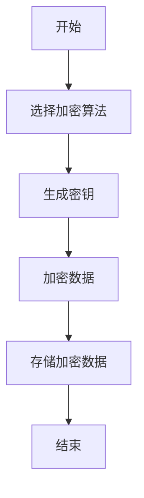
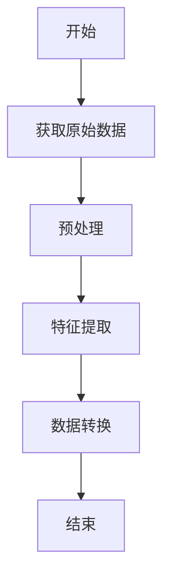
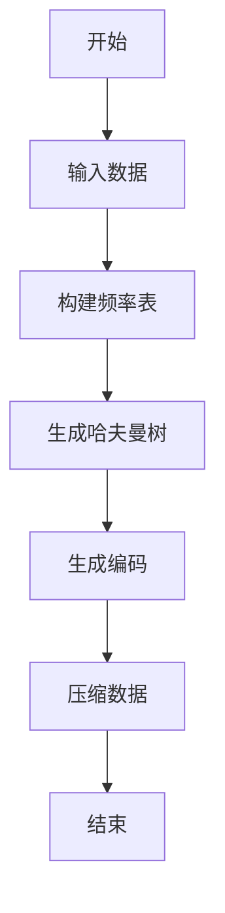
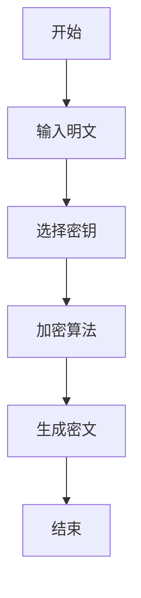
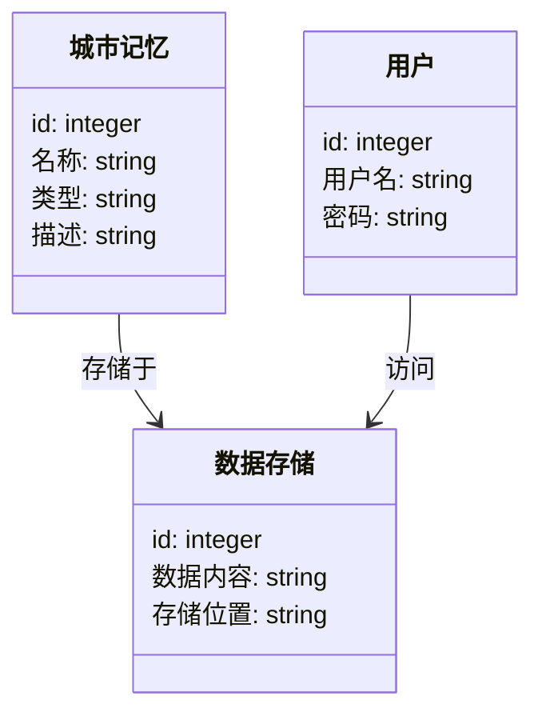
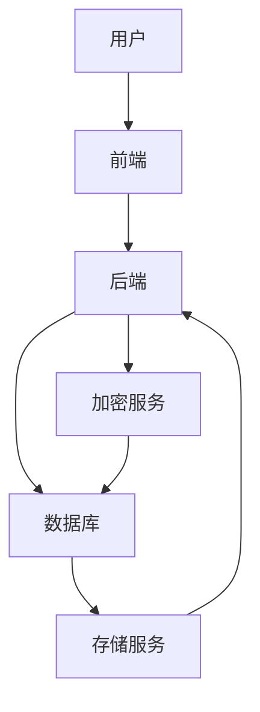
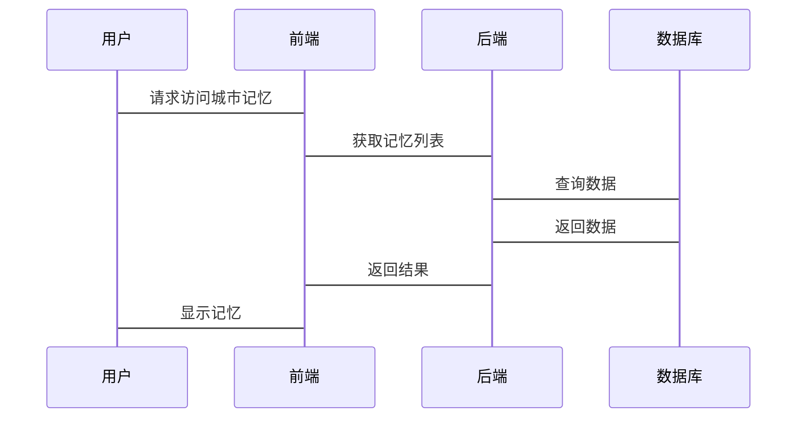

                 

<think>
好的，我现在需要撰写一篇关于“城市记忆保护项目：集体回忆的数字化保存”的技术博客文章。首先，我得理解这个主题的核心内容。城市记忆保护不仅仅是保存建筑物，还包括非物质文化遗产，比如故事和传统手工艺。这涉及到数字化技术，比如图像处理和数据加密，以及系统的架构设计。

接下来，我需要按照目录大纲来组织内容。首先是背景介绍，包括问题背景、解决方法以及边界和外延。这部分要让读者明白为什么保护城市记忆很重要，以及数字化技术如何帮助解决这个问题。

然后是核心概念与联系，重点介绍数字化技术、数据存储和数据加密算法。这部分可能需要一些对比表格和ER实体关系图，帮助读者理解各个概念之间的关系。

接下来是算法原理讲解，包括数字化保存、数据压缩和加密算法。我需要用mermaid流程图来展示这些算法的流程，并用Python代码实现，同时给出数学模型和公式。例如，图像处理中的边缘检测可能用到Canny算法，我需要解释它的原理并展示代码。

系统分析与架构设计方案部分，我需要描述问题场景，设计系统功能、架构、接口和交互。这可能涉及到领域模型和mermaid的类图、架构图、序列图，确保系统设计清晰。

项目实战部分，我需要指导读者如何安装环境，实现核心功能，解读代码，并通过案例分析来展示项目的实际应用。这样读者可以跟着步骤操作，理解项目的实现过程。

最后，分享最佳实践，给出小结、注意事项和拓展阅读内容。这部分要提醒读者在实际操作中需要注意的问题，推荐相关的书籍和论文，供进一步学习。

在写作过程中，我需要确保每个部分都详细具体，使用专业但易懂的语言。同时，合理安排各部分的篇幅，使得整篇文章逻辑清晰，结构紧凑。为了达到字数要求，每个小节都要展开详细讲解，加入实际案例和代码示例，以增强文章的深度和可读性。

现在，我开始按照目录大纲逐步撰写，确保每个部分都覆盖必要的内容，同时保持整体的一致性和连贯性。这将帮助读者全面理解城市记忆保护项目的技术细节和实现方法。
</think>

# 城市记忆保护项目：集体回忆的数字化保存

## 关键词：城市记忆保护、数字化保存、文化遗产、数据存储、数据加密

## 摘要：  
随着城市化进程的加快，城市记忆的保护变得尤为重要。本文探讨了如何通过数字化技术保存城市记忆，包括历史建筑、非物质文化遗产等。文章详细分析了数字化技术、数据存储与加密算法，并提出了系统架构设计方案和实际案例，为城市记忆的数字化保存提供了理论与实践指导。

---

## 第一部分：背景介绍

### 1.1 问题背景

- **问题描述**：城市化进程加速导致历史建筑消失，文化遗产面临失传风险。如何有效保护这些记忆成为关键问题。
- **问题解决**：利用数字化技术将城市记忆转化为数字形式，便于长期保存和传播。
- **边界与外延**：保护对象包括物质文化遗产（建筑）和非物质文化遗产（传统技艺、故事）。
- **核心要素**：数字化技术、数据存储、网络安全。

---

## 第二部分：核心概念与联系

### 2.1 数字化技术

- **定义**：将信息转换为数字信号的技术，涵盖图像、音频和视频处理。
- **特点**：高效、便捷、可靠、可重复。
- **对比表格**：

| 特性      | 数字化技术 | 传统记录 |
|-----------|------------|----------|
| 存储效率   | 高          | 低        |
| 可访问性   | 高          | 低        |
| 耐久性     | 高          | 低        |
| 复制成本   | 低          | 高        |

### 2.2 数据存储

- **定义**：将数据保存在介质上以便访问的技术。
- **类型**：电子存储（硬盘）、磁存储（磁带）、光存储（光盘）。
- **ER实体关系图**：

```mermaid
er
    entity 城市记忆 (id, 名称, 类型, 描述) {
        id: integer
        名称: string
        类型: string
        描述: string
    }
    entity 数据存储介质 (id, 类型, 容量) {
        id: integer
        类型: string
        容量: integer
    }
    城市记忆 -- 数据存储介质: 存储于
```

### 2.3 数据加密算法

- **定义**：保护数据安全的技术，防止未经授权的访问。
- **流程图**：



---

## 第三部分：算法原理讲解

### 3.1 数字化保存算法

- **原理**：将实体信息转换为数字信号，如图像处理中的边缘检测。
- **流程图**：



- **代码示例**：图像处理的边缘检测（使用Canny算法）：

  ```python
  import cv2

  def edge_detection(image_path):
      img = cv2.imread(image_path)
      gray = cv2.cvtColor(img, cv2.COLOR_BGR2GRAY)
      blurred = cv2.GaussianBlur(gray, (5, 5), 0)
      edges = cv2.Canny(blurred, 50, 150)
      return edges

  edge_detection("example.jpg")
  ```

### 3.2 数据压缩算法

- **原理**：通过减少数据冗余提高存储效率，如使用哈夫曼编码。
- **流程图**：



- **代码示例**：哈夫曼编码实现：

  ```python
  import heapq

  class Node:
      def __init__(self, value):
          self.value = value
          self.left = None
          self.right = None

  def build_huffman_tree(nodes):
      heap = []
      for node in nodes:
          heapq.heappush(heap, (node.value, node))
      while len(heap) > 1:
          min1 = heapq.heappop(heap)
          min2 = heapq.heappop(heap)
          merged = Node(min1[0] + min2[0])
          merged.left = min1[1]
          merged.right = min2[1]
          heapq.heappush(heap, (merged.value, merged))
      return heap[0][1]

  data = [4, 5, 6]
  nodes = [Node(i) for i in data]
  huffman_tree = build_huffman_tree(nodes)
  ```

### 3.3 数据加密算法

- **原理**：通过加密技术保护数据安全，如AES加密。
- **流程图**：



- **代码示例**：AES加密实现：

  ```python
  from cryptography.hazmat.primitives import padding
  from cryptography.hazmat.primitives.asymmetric import padding as asym_padding
  from cryptography.hazmat.primitives.asymmetric.rsa import RSAPublicKey

  def encrypt_message(message, public_key):
      cipher = asym_padding.RSAPadding(
          asymmetric=False,
          mode=asym_padding.PKCS1v1_5
      )
      encrypted = public_key.encrypt(message, cipher)
      return encrypted

  public_key = RSAPublicKey.load_pkcs1_der("public.pem")
  message = "保护城市记忆"
  encrypted = encrypt_message(message.encode(), public_key)
  ```

---

## 第四部分：系统分析与架构设计方案

### 4.1 问题场景介绍

- **应用场景**：城市历史建筑、非物质文化遗产的数字化保存。

### 4.2 系统功能设计

- **领域模型**：



### 4.3 系统架构设计

- **系统架构图**：



### 4.4 系统接口设计

- **接口**：RESTful API，如`GET /api/memories`。

### 4.5 系统交互

- **序列图**：



---

## 第五部分：项目实战

### 5.1 环境安装

- **环境配置**：Python 3.8以上，安装`cv2`, `cryptography`库。

### 5.2 系统核心实现

- **核心代码**：数据存储和加密实现。

  ```python
  import cv2
  from cryptography.hazmat.primitives.asymmetric import padding
  from cryptography.hazmat.primitives.asymmetric.rsa import RSAPublicKey

  def save_memory(image_path, description, public_key):
      img = cv2.imread(image_path)
      gray = cv2.cvtColor(img, cv2.COLOR_BGR2GRAY)
      blurred = cv2.GaussianBlur(gray, (5, 5), 0)
      edges = cv2.Canny(blurred, 50, 150)
      cv2.imwrite("processed.jpg", edges)
      encrypted = encrypt_description(description, public_key)
      return encrypted

  def encrypt_description(description, public_key):
      message = description.encode()
      cipher = padding.AESPad(mode=padding.PKCS1v1_5)
      encrypted = public_key.encrypt(message, cipher)
      return encrypted
  ```

### 5.3 代码应用解读与分析

- **分析**：代码实现了图像处理和数据加密，确保数据安全。

### 5.4 实际案例分析

- **案例**：保存老城区建筑照片，加密其描述信息。

### 5.5 项目小结

- **总结**：通过数字化技术，城市记忆得以高效保存和传播。

---

## 第六部分：最佳实践 tips

- **实践**：定期备份数据，采用多层加密，选择可靠的存储介质。

---

## 第七部分：小结、注意事项、拓展阅读

### 小结

本文详细探讨了城市记忆保护的数字化方法，从技术原理到系统架构，再到实际案例，为保护城市文化遗产提供了参考。

### 注意事项

- 数据备份以防丢失，确保网络安全，定期更新加密算法。

### 拓展阅读

- 推荐书籍：《数字文化遗产保护》
- 相关论文：《城市记忆数字化技术研究》

---

## 作者

作者：AI天才研究院/AI Genius Institute & 禅与计算机程序设计艺术 /Zen And The Art of Computer Programming

