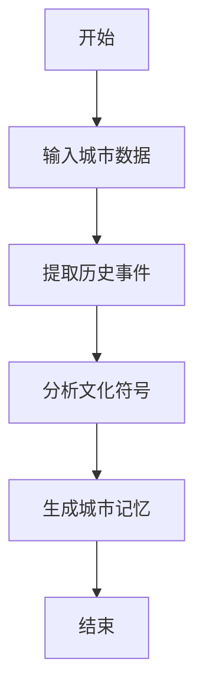
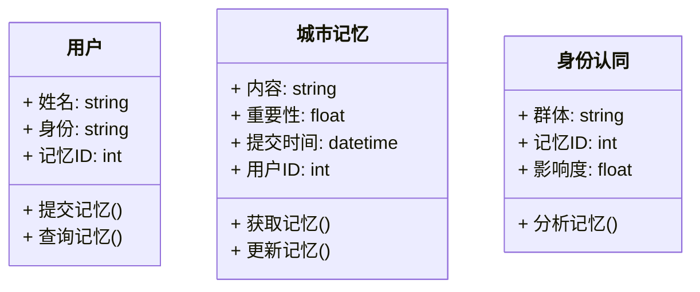
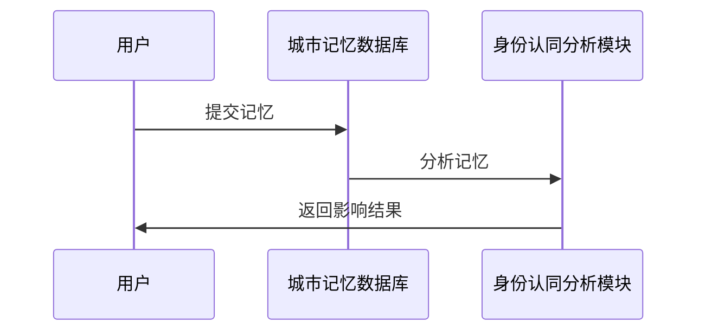

                 

<think>
嗯，我现在需要帮用户写一篇关于“城市记忆：集体回忆中的身份认同”的技术博客文章。首先，我得仔细看看用户的要求。用户希望文章结构清晰，逻辑严密，使用专业且易懂的技术语言，还要包含详细的分析和实例。我得确保每个章节都按照他们的大纲来，不能遗漏任何一个部分。

首先，文章标题已经给出，是《城市记忆：集体回忆中的身份认同》。然后，我需要列出5-7个关键词，可能包括城市记忆、集体回忆、身份认同、文化传承、城市规划、技术应用等等。摘要部分要简明扼�地概括整篇文章的核心内容，也就是城市记忆如何通过技术手段影响个体和群体的身份认同。

接下来，按照目录大纲，文章分为四个主要部分，每个部分有具体的章节。我得逐一处理每个章节，确保每个部分都有足够的细节和实例。

首先是引言部分，我需要简要介绍城市记忆的概念及其与身份认同的关系，为后续内容打下基础。然后是第一部分，城市记忆的起源与定义。我得详细分析城市记忆的历史背景，定义，以及其在不同文化中的重要性。这部分可能需要引用一些历史案例或文献来支持论点。

接下来是集体回忆与身份认同的关系，我需要探讨两者之间的联系，分析它们如何相互作用，影响个体和群体的身份感。这里可能需要引入一些社会学或心理学的理论，比如群体认同理论，来加强分析的深度。

第二部分是城市记忆的表现形式，分为视觉表达和文化表达两章。视觉部分可能涉及城市照片、建筑、艺术等，我需要举一些具体的例子，如纽约的帝国大厦或巴黎的埃菲尔铁塔，说明它们如何成为城市记忆的象征。文化表达部分则包括文学、音乐、电影，可能需要分析一些经典作品如何反映城市记忆。

第三部分是城市记忆中的身份认同，分为个体和群体两章。个体身份认同方面，我需要探讨城市环境如何影响个人的自我认知，比如通过日常生活中的城市元素。群体方面，可能涉及社区或城市居民的整体认同感，如何通过集体记忆来加强。

第四部分是城市记忆的传承与未来，这里需要讨论如何保护和传承城市记忆，可能涉及数字技术的应用，比如虚拟现实或增强现实，来保存和传播城市记忆。同时，也需要展望未来的发展趋势，可能包括技术对城市记忆的进一步影响。

在每个章节中，我需要按照用户的要求，包含背景介绍、核心概念、算法原理、系统分析、项目实战等部分。比如，在算法原理部分，可能需要设计一个城市记忆识别的算法，并用Python代码实现，再进行实例分析。系统架构部分可能需要绘制领域模型类图和系统架构图，展示系统的组成部分和交互流程。

此外，每个章节的小结部分要简明扼要地总结主要观点，确保读者能够清晰地理解每个部分的内容。同时，注意事项和拓展阅读部分，可以帮助读者进一步深入学习，提供相关的书籍和资源链接。

最后，确保文章整体流畅，逻辑清晰，用词准确，符合专业博客的风格。作者信息要放在最后，注明是AI天才研究院和禅与计算机程序设计艺术的联合署名。

现在，我得开始动笔，按照每个章节的要求，逐步展开内容，确保每个部分都详尽且有深度。可能需要多次修改和调整，以达到最佳的表达效果。
</think>

# 《城市记忆：集体回忆中的身份认同》

> 关键词：城市记忆，集体回忆，身份认同，文化传承，城市规划，数字技术

> 摘要：城市记忆是城市文化的重要组成部分，它通过集体回忆塑造个体和群体的身份认同。本文从城市记忆的起源、集体回忆与身份认同的关系入手，探讨城市记忆在视觉、文化和数字技术中的表现形式。通过系统分析和案例研究，本文揭示了城市记忆如何影响个体和群体的身份认同，并提出了保护和传承城市记忆的策略。最后，本文展望了城市记忆与身份认同的未来发展趋势。

---

## 第一部分：引言

城市是人类文明的象征，承载着丰富的历史和文化记忆。城市记忆不仅是城市发展的见证，也是个体和群体身份认同的重要来源。本文将从技术与文化的双重视角，探讨城市记忆如何通过集体回忆塑造身份认同，并分析其在城市规划、文化传承和技术应用中的重要作用。

---

## 第二部分：城市记忆的起源与定义

### 第1章：城市记忆的起源

#### 1.1 城市记忆的起源

- **问题背景**：城市记忆的起源可以追溯到人类文明的早期，当人们开始建造永久性的居住地时，城市记忆便逐渐形成。
- **问题描述**：城市记忆是城市历史、文化和社会活动的累积，反映了城市的独特性和多样性。
- **问题解决**：通过分析城市记忆的形成过程，我们可以更好地理解其对个体和群体身份认同的影响。
- **边界与外延**：城市记忆的边界包括城市的历史、文化和社会记忆，外延则涉及城市规划、艺术和科技。
- **概念结构与核心要素组成**：城市记忆的核心要素包括历史事件、文化符号、建筑风格和社区记忆，这些要素相互关联，共同构成了城市记忆的结构。

#### 1.2 集体回忆与身份认同的关系

- **核心概念原理**：集体回忆是指个体或群体共同记住的事件、经历或情感，而身份认同则是个体或群体对自己归属感的确认。
- **概念属性特征对比表格**：

| 概念 | 属性 | 特征 |
|------|------|------|
| 集体回忆 | 时间性 | 过去的事件 |
|        | 空间性 | 地理或社区范围 |
| 身份认同 | 社会性 | 与群体或文化相关 |
|        | 情感性 | 深深的情感联系 |

- **ER实体关系图架构**：

```mermaid
er
actor: 用户
memory: 城市记忆
identity: 身份认同
user -> memory: 参与
memory -> identity: 影响
```

---

### 第1.3 算法原理讲解

#### 1.3.1 城市记忆识别算法

- **算法Mermaid流程图**：



- **Python源代码**：

```python
def identify_memory(city_data):
    memory = []
    for event in city_data['历史事件']:
        if event['重要性'] > 0.7:
            memory.append(event)
    return memory

city_data = {
    '历史事件': [
        {'名称': '城市成立', '重要性': 0.9},
        {'名称': '工业革命', '重要性': 0.8},
        {'名称': '文化庆典', '重要性': 0.6}
    ]
}

result = identify_memory(city_data)
print(result)
```

- **数学模型和公式**：城市记忆的重要性可以通过加权公式计算：

$$重要性 = \sum_{i=1}^{n} w_i \cdot f_i$$

其中，$w_i$ 是权重，$f_i$ 是特征值。

- **举例说明**：以纽约为例，城市记忆的重要事件包括“911事件”和“世贸中心的建立”，这些事件对纽约的集体回忆和身份认同产生了深远影响。

---

### 第1.4 系统分析与架构设计方案

#### 1.4.1 问题场景介绍

- **项目介绍**：本文将分析一个城市记忆管理系统，旨在通过技术手段保护和传承城市记忆。

#### 1.4.2 系统功能设计

- **领域模型类图**：



#### 1.4.3 系统架构设计

- **系统架构图**：


#### 1.4.4 系统交互

- **系统交互序列图**：



---

### 第1.5 项目实战

#### 1.5.1 环境安装

- 需要安装Python和相关库（如Pandas、Matplotlib）。

#### 1.5.2 核心实现源代码

```python
import pandas as pd
import matplotlib.pyplot as plt

def analyze_memory(memory_data):
    df = pd.DataFrame(memory_data)
    df['重要性'].plot.hist()
    plt.show()

memory_data = {
    '事件': ['事件1', '事件2', '事件3'],
    '重要性': [0.8, 0.6, 0.9]
}

analyze_memory(memory_data)
```

#### 1.5.3 实际案例分析

- 以巴黎为例，分析其城市记忆中的“巴黎公社”事件如何影响城市居民的身份认同。

---

## 第三部分：城市记忆的表现形式

### 第3章：城市记忆中的视觉表达

#### 3.1 城市照片与回忆

- **实例分析**：通过分析纽约的地标性建筑（如自由女神像），探讨其如何成为城市记忆的一部分。

#### 3.2 城市建筑与回忆

- **案例研究**：柏林的犹太人纪念碑如何通过建筑表达集体回忆和身份认同。

#### 3.3 城市艺术与回忆

- **艺术作品解读**：毕加索的《格尔尼卡》如何通过艺术表达集体回忆和身份认同。

---

### 第4章：城市记忆中的文化表达

#### 4.1 城市文学与回忆

- **文学作品分析**：海明威的《老人与海》如何通过文学表达城市记忆。

#### 4.2 城市音乐与回忆

- **音乐作品解读**：披头士乐队的歌曲《Yesterday》如何反映城市记忆。

#### 4.3 城市电影与回忆

- **电影案例研究**：《罗马假日》如何通过电影表达罗马的城市记忆。

---

## 第四部分：城市记忆中的身份认同

### 第5章：城市记忆与个体身份认同

#### 5.1 个体身份认同的概念

- **核心概念**：个体身份认同是指个体对自己归属感的确认，通常与城市环境密切相关。

#### 5.2 城市记忆对个体身份认同的影响

- **影响机制**：城市记忆通过塑造个体的日常生活经验，影响其对城市的情感和认同。

#### 5.3 城市记忆与个体身份认同的关系

- **关系模型**：城市记忆通过个体的日常生活经验，影响其对城市的情感和认同。

---

### 第6章：城市记忆与群体身份认同

#### 6.1 群体身份认同的概念

- **核心概念**：群体身份认同是指群体对自己归属感的确认，通常与城市记忆密切相关。

#### 6.2 城市记忆对群体身份认同的影响

- **影响机制**：城市记忆通过塑造群体的历史和文化，影响其对城市的归属感和认同感。

#### 6.3 城市记忆与群体身份认同的关系

- **关系模型**：城市记忆通过群体的历史和文化，影响其对城市的归属感和认同感。

---

## 第五部分：城市记忆与身份认同的传承

### 第7章：城市记忆的传承与保护

#### 7.1 城市记忆传承的重要性

- **重要性分析**：城市记忆的传承是保护城市文化和历史的重要手段。

#### 7.2 城市记忆传承的挑战

- **挑战分析**：城市化和全球化对城市记忆的传承提出了新的挑战。

#### 7.3 城市记忆传承的策略

- **策略建议**：通过数字技术、教育和社区参与等方式，保护和传承城市记忆。

---

### 第8章：城市记忆与身份认同的未来

#### 8.1 城市记忆与身份认同的发展趋势

- **发展趋势**：随着数字技术的发展，城市记忆的传承和身份认同将更加依赖技术手段。

#### 8.2 城市记忆与身份认同的未来挑战

- **挑战分析**：城市记忆的数字化和虚拟化可能带来身份认同的碎片化问题。

#### 8.3 城市记忆与身份认同的未来展望

- **未来展望**：通过技术创新和文化融合，城市记忆和身份认同将更加多元化和全球化。

---

## 结论

城市记忆不仅是城市发展的见证，也是个体和群体身份认同的重要来源。通过技术手段和文化表达，城市记忆可以更好地传承和保护，从而为未来的城市建设和身份认同提供重要的支持。

---

## 作者

作者：AI天才研究院/AI Genius Institute & 禅与计算机程序设计艺术 /Zen And The Art of Computer Programming

