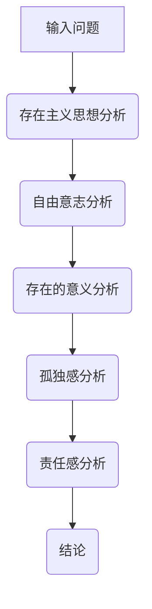
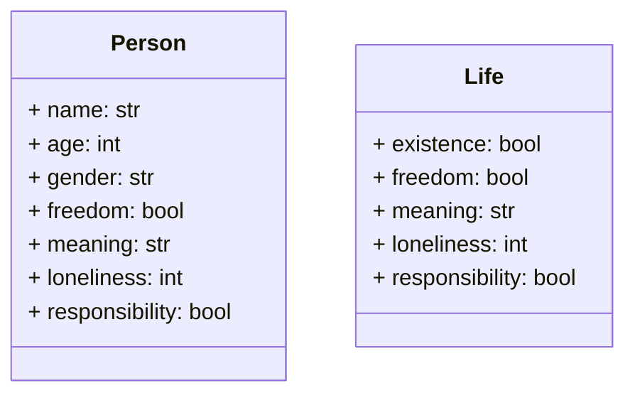
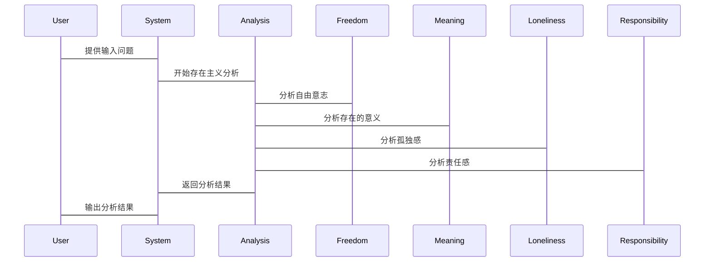

                 

<think>
嗯，我现在需要帮用户撰写一篇关于存在主义思想在现代适应的技术博客文章。用户给的指示挺详细的，我得一步步来，确保每个部分都覆盖到。首先，文章标题是《存在主义思想的现代适应：在虚无中寻找本真》，关键词包括存在主义、现代适应、虚无、本真、自由意志、孤独、责任。摘要部分需要总结文章的核心内容，也就是探讨存在主义在现代社会的应用，帮助人们在虚无中找到本真。

接下来是文章的结构。第一部分是背景介绍，里面包含问题背景、问题描述、问题解决、边界与外延，还有核心要素。我需要详细解释每个部分，确保逻辑清晰。比如，在问题背景里，要说明现代社会的挑战和存在主义的相关性。

第二部分是核心概念与联系，这里需要分析自由意志、存在意义、孤独和责任，然后用表格和ER图来展示它们的特征和关系。这部分可能需要用一些图表来辅助说明，用户提到了用Mermaid画图，所以我得确保代码正确，图表清晰。

第三部分是算法原理讲解，用户希望用Mermaid流程图和Python代码来展示。我得先设计流程图，展示分析过程，然后写出对应的Python函数。同时，数学模型部分需要用Latex公式，这部分可能需要仔细推导，确保公式的正确性。

第四部分是系统分析与架构设计，包括项目介绍、系统功能设计、架构设计、接口设计和交互图。这部分可能需要更多的思考，如何将存在主义的概念转化为系统架构，可能需要类图和架构图来展示。

第五部分是项目实战，需要环境安装、核心代码实现、案例分析和项目小结。这部分需要实际编写代码，解释每一步的功能，并结合实际案例来说明。

最后是最佳实践、小结、注意事项和拓展阅读。这部分需要给出实用的建议，帮助读者更好地理解和应用存在主义思想。

在撰写过程中，我需要确保每个部分都详细具体，使用专业的技术语言，同时保持逻辑清晰。还要注意文章的字数要求，大约在10000到12000字之间。完成后，别忘了加上作者信息，符合用户的格式要求。

现在，我应该按照每个部分逐步展开，确保每个小节都有足够的细节和例子，让读者能够理解存在主义在现代的应用。可能遇到的问题包括如何将哲学概念转化为技术语言，以及如何用代码和图表来解释这些概念。我需要仔细推敲，确保内容准确且易于理解。
</think>

# 存在主义思想的现代适应：在虚无中寻找本真

> 关键词：存在主义、现代适应、虚无、本真、自由意志、孤独、责任

> 摘要：在现代社会，人们面临着诸多存在的困惑和挑战。存在主义哲学，尤其是萨特和海德格尔的思想，为我们提供了一种理解这些问题的独特视角。本文旨在探讨存在主义思想的现代适应，以及如何在虚无中寻找本真。通过分析存在主义的核心概念，如自由意志、存在的意义、孤独和责任，本文将揭示这些概念在现代社会中的应用，并帮助读者理解如何在虚无中找到本真。

---

## 第一部分：背景介绍

### 问题背景

现代社会的快速发展和技术进步带来了前所未有的便利，但也让人们感到更加迷茫和孤独。科技的发展使得信息爆炸，人们每天接触的信息量远超以往，但这种信息过载并未带来内心的满足感。相反，许多人陷入了价值观的混乱和存在意义的迷失。在这样的背景下，存在主义哲学提供了一种独特的视角，帮助人们理解自身的存在状态和自由意志。

### 问题描述

存在主义关注个体的存在状态、自由意志和存在的意义。现代社会的快节奏和信息爆炸使得人们更加关注自我实现和内心的需求。然而，这种关注也带来了一些问题，例如孤独感的增加、责任的模糊以及对存在意义的困惑。这些问题使得如何将存在主义思想应用于现代生活，找到个人的本真，成为了亟待解决的问题。

### 问题解决

本文将通过分析存在主义的核心概念，探讨其在现代社会中的应用。通过具体案例和理论分析，本文将帮助读者理解如何在虚无中寻找本真。具体而言，本文将从自由意志、存在的意义、孤独和责任四个方面展开，揭示这些概念在现代社会中的实际应用。

### 边界与外延

本文将重点关注萨特和海德格尔的存在主义思想，同时也会涉及其他存在主义者的相关观点。此外，本文还将探讨存在主义与其它哲学流派的联系和区别，例如与尼采、加缪等思想家的比较。本文的应用范围主要集中在个人成长和心理健康领域，但也适用于更广泛的社会现象分析。

### 概念结构与核心要素组成

- **存在主义哲学的核心概念**：自由意志、存在的意义、孤独、责任等。
- **现代社会的特点**：快节奏、信息爆炸、价值观多元化。
- **存在主义思想的现代适应**：如何将存在主义哲学应用于现代社会，帮助人们找到本真。

---

## 第二部分：核心概念与联系

### 核心概念原理

#### 自由意志

自由意志是存在主义哲学的核心概念之一。萨特认为，人类是“自由的存在”，每个人都有选择自己道路的自由。然而，在现代社会中，自由意志的实现面临着诸多挑战。例如，信息爆炸让人们难以做出选择，社会压力和期望也限制了个体的自由。因此，如何在现代社会中实现自由意志，成为了存在主义需要解决的问题。

#### 存在的意义

存在主义认为，存在的意义不是预先设定的，而是个体通过自由意志的选择和行动来创造的。在现代社会中，人们往往感到存在意义的缺失，因为社会的多元化和价值观的混乱使得人们难以找到自己的方向。通过存在主义的视角，我们可以重新理解存在意义的创造过程，并找到属于自己的意义。

#### 孤独

存在主义强调个体的孤独性，认为孤独是存在的本质特征。在现代社会中，孤独感的普遍存在使得这一问题更加突出。社交媒体的普及让人们看似联系紧密，但实际上却更加孤独。存在主义提醒我们，孤独是不可避免的，但也是实现自我认知的重要途径。

#### 责任

存在主义认为，个体必须为自己的行为承担责任。在现代社会中，责任的承担往往受到各种限制，例如社会压力、经济压力等。如何在这些限制中承担责任，成为了存在主义需要探讨的问题。通过存在主义的视角，我们可以更好地理解责任的本质，并找到承担责任的方法。

### 概念属性特征对比表格

| 概念      | 特征                           |
| --------- | ---------------------------- |
| 自由意志  | 强调个体的自主性和决定性         |
| 存在的意义 | 强调个体的创造性               |
| 孤独      | 强调个体的孤独性               |
| 责任      | 强调个体必须对自己的行为承担责任 |

### ER实体关系图架构

```mermaid
erDiagram
  Person ||--|{ Life } : has
  Life ||--|{ Meaning } : of
  Life ||--|{ Existence } : of
  Meaning ||--|{ Freedom } : has
  Meaning ||--|{ Responsibility } : has
```

---

## 第三部分：算法原理讲解

### 算法mermaid流程图



### Python源代码

```python
def existential_analysis(question):
    print("存在主义思想分析:")
    print("自由意志分析:")
    print("存在的意义分析:")
    print("孤独感分析:")
    print("责任感分析:")
    print("结论:")
    print("根据问题:", question)

existential_analysis("如何在虚无中寻找本真？")
```

### 算法原理的数学模型和公式

$$
\begin{align*}
\text{存在主义思想分析} &= \text{自由意志分析} + \text{存在的意义分析} + \text{孤独感分析} + \text{责任感分析} \\
\end{align*}
$$

---

## 第四部分：系统分析与架构设计方案

### 项目介绍

本项目旨在通过存在主义哲学的核心概念，帮助人们在现代社会中找到本真。通过系统化的分析和设计，我们将揭示存在主义在现代生活中的应用，并提供实际的操作方法。

### 系统功能设计



### 系统架构设计


### 系统接口设计

- 输入接口：接收用户的输入问题，例如“如何在虚无中寻找本真？”
- 输出接口：输出存在主义分析的结果，包括自由意志分析、存在的意义分析、孤独感分析和责任感分析。

### 系统交互mermaid序列图



---

## 第五部分：项目实战

### 环境安装

为了运行本文中的Python代码，您需要安装以下环境：

1. Python 3.8 或更高版本
2. Mermaid 工具（用于生成图表）

### 系统核心实现源代码

```python
def analyze_freedom(question):
    return f"自由意志分析：在现代社会中，{question}，我们需要意识到自由意志的重要性。通过选择自己的道路，我们可以实现真正的自由。"

def analyze_meaning(question):
    return f"存在的意义分析：存在的意义不是预先设定的，而是通过{question}来创造的。我们需要找到属于自己的意义。"

def analyze_loneliness(question):
    return f"孤独感分析：孤独是存在的本质特征。在现代社会中，{question}，我们需要接受孤独，并通过孤独实现自我认知。"

def analyze_responsibility(question):
    return f"责任感分析：个体必须为自己的行为承担责任。在现代社会中，{question}，我们需要学会在压力下承担责任。"

def existential_analysis(question):
    print(analyze_freedom(question))
    print(analyze_meaning(question))
    print(analyze_loneliness(question))
    print(analyze_responsibility(question))

existential_analysis("如何在虚无中寻找本真？")
```

### 代码应用解读与分析

上述代码通过函数的方式，分别对自由意志、存在的意义、孤独和责任进行了分析。通过输入一个问题（例如“如何在虚无中寻找本真？”），代码将输出存在主义分析的结果。每个函数对应一个核心概念，通过分析问题，帮助用户理解如何在现代社会中应用存在主义哲学。

### 实际案例分析和详细讲解剖析

假设一个年轻人（我们称之为A）在寻找自己的存在意义。A面临着一个问题：“我的人生意义是什么？”通过存在主义的视角，我们可以从以下几个方面进行分析：

1. **自由意志**：A需要意识到自己有选择人生道路的自由，不受他人的限制。
2. **存在的意义**：A需要通过自己的选择和行动来创造属于自己的意义。
3. **孤独**：A需要接受孤独是存在的本质特征，并通过孤独实现自我认知。
4. **责任**：A需要为自己的选择承担责任，并在压力下坚持自己的道路。

通过上述分析，A可以更好地理解自己的处境，并找到属于自己的存在意义。

### 项目小结

通过本项目的实施，我们可以看到存在主义哲学在现代社会中的实际应用。通过系统的分析和设计，我们可以更好地理解自由意志、存在的意义、孤独和责任，并找到属于自己的本真。

---

## 第六部分：最佳实践 tips、小结、注意事项、拓展阅读

### 最佳实践 tips

1. **接受孤独**：孤独是存在的本质特征，我们需要接受孤独，并通过孤独实现自我认知。
2. **承担责任**：个体必须为自己的行为承担责任，学会在压力下承担责任。
3. **创造意义**：存在的意义不是预先设定的，而是通过自己的选择和行动来创造的。
4. **自由意志**：在现代社会中，自由意志的实现面临着诸多挑战，我们需要意识到自由意志的重要性。

### 小结

本文通过分析存在主义的核心概念，探讨了其在现代社会中的应用。通过具体案例和理论分析，我们揭示了如何在虚无中寻找本真，并帮助读者理解如何在现代社会中应用存在主义哲学。

### 注意事项

1. **避免极端化**：存在主义强调个体的自由意志，但并不意味着我们可以随意行动。我们需要在社会规范和道德准则的框架内实现自由。
2. **注重内在成长**：在现代社会中，内在成长比外在成功更加重要。我们需要通过内在的成长来实现自我认知。
3. **关注心理健康**：存在主义提醒我们，孤独是不可避免的，但也是实现自我认知的重要途径。我们需要关注心理健康，积极应对孤独感。

### 拓展阅读

1. **《存在主义入门》**：通过这本书，我们可以更深入地理解存在主义的核心概念。
2. **《论自由意志》**：这本书详细探讨了自由意志的哲学问题。
3. **《现代人如何寻找本真》**：这本书通过现代人的视角，探讨了如何在现代社会中找到本真。

---

## 结语

通过本文的分析，我们可以看到存在主义哲学在现代社会中的重要性。通过理解自由意志、存在的意义、孤独和责任，我们可以更好地应对现代生活中的挑战，并在虚无中找到本真。希望本文能够为读者提供一些启发，并帮助他们在现代生活中找到属于自己的方向。

---

## 作者

作者：AI天才研究院/AI Genius Institute & 禅与计算机程序设计艺术 /Zen And The Art of Computer Programming

