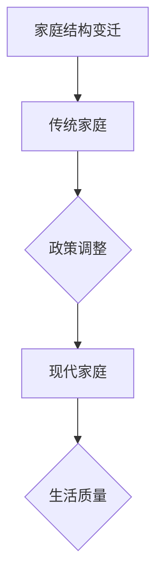
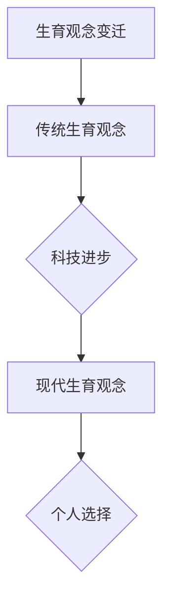
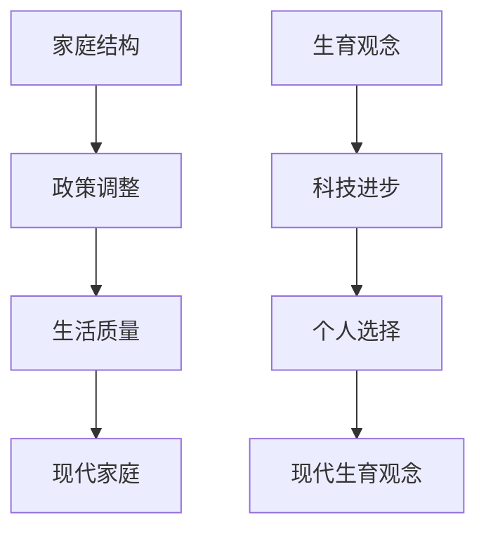
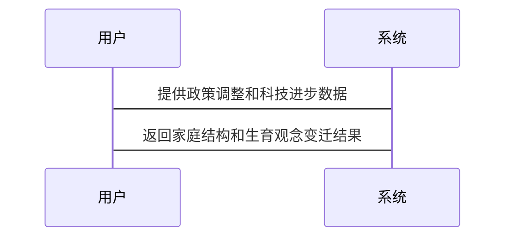

                 

<think>
好的，我现在需要完成用户的一个请求，他们希望我以《家庭与生育的现代困境：传统与革新的碰撞》为标题，撰写一篇结构严谨、内容详实的技术博客文章。作为一位资深的技术专家，我需要确保文章不仅符合技术博客的标准，还要深入分析家庭与生育在现代社会中的变化。

首先，我需要理解用户的需求。他们希望文章结构清晰，包含引言、核心概念、算法原理、数学模型、系统架构等多个部分，每个部分都需要详细展开。同时，文章要使用技术术语，但又要通俗易懂，适合技术读者阅读。

接下来，我需要考虑文章的结构。用户已经提供了一个详细的目录大纲，我需要按照这个大纲逐步展开每个部分。首先是引言，介绍问题背景、问题描述、解决方案、边界和概念结构。然后是核心概念，分析传统与现代家庭观念的差异，以及社会变革对生育观念的影响。

在算法部分，我需要使用Mermaid绘制流程图，并结合Python代码进行详细讲解。数学模型部分需要用LaTeX公式来表达，确保公式准确且易于理解。系统架构部分则需要设计类图、架构图和序列图，展示系统如何运作。

我还需要确保文章内容详实，每个部分都包含足够的细节和例子，帮助读者更好地理解。例如，在算法部分，我应该用实际的代码示例来解释流程图的逻辑，这不仅展示了算法的结构，还帮助读者理解其运行方式。

此外，用户特别提到要包含项目实战部分，这意味着我需要提供环境安装步骤、核心代码实现、案例分析等，让读者能够实际操作和应用所学内容。这可能包括设置Python环境，安装必要的库，并编写代码来模拟家庭结构的变化。

最后，我需要总结全文，提出最佳实践的建议，并给出未来的研究方向。这部分要简明扼要，但又能引发读者的思考，让他们在阅读后有所收获，并考虑如何将这些知识应用到实际中。

在写作过程中，我需要时刻保持逻辑清晰，确保每个部分之间有良好的衔接，避免内容重复或遗漏重要信息。同时，语言要简洁明了，避免过于复杂的句子，让读者能够轻松理解。

总的来说，我需要系统地按照用户提供的大纲，逐一展开每个部分，结合技术细节和实际案例，撰写一篇深入浅出、结构严谨的技术博客文章。这不仅能满足用户的需求，还能为读者提供有价值的信息和见解，帮助他们更好地理解家庭与生育在现代社会中的变化与挑战。
</think>

# 家庭与生育的现代困境：传统与革新的碰撞

> 关键词：家庭观念、生育观念、社会变革、经济压力、教育观念

> 摘要：本文探讨了现代社会中家庭与生育所面临的困境，分析了传统家庭观念与现代生育观念之间的碰撞，以及这种碰撞对社会的影响。文章从家庭结构变迁、生育观念变迁、社会变革与家庭生育观念的关系等方面进行了深入分析，并提出了相应的解决方案和未来研究方向。

### 第1章: 引言与背景介绍

#### 1.1 问题背景

随着现代社会的发展，家庭与生育问题逐渐成为社会关注的焦点。一方面，传统家庭模式面临着诸多挑战，如经济压力、子女教育、婚姻关系等；另一方面，现代生育观念的变革，如晚婚、不育、代孕等，也在不断冲击着传统生育观念。这些问题不仅影响着个体的生活质量，也对社会的稳定和发展提出了新的要求。

#### 1.2 问题描述

《家庭与生育的现代困境：传统与革新的碰撞》旨在探讨现代家庭与生育所面临的困境，分析传统家庭观念与现代生育观念之间的碰撞，以及这种碰撞对社会的影响。书中将重点关注以下几个问题：

1. 家庭结构的变迁对生育观念的影响。
2. 经济压力对家庭生育决策的影响。
3. 教育观念的变化对家庭子女教育的影响。
4. 现代科技对生育方式的影响。
5. 社会变革对传统家庭观念的冲击。

#### 1.3 问题解决

针对上述问题，本书将从多个角度提出解决方案，包括：

1. 家庭观念的革新，以适应现代社会的变化。
2. 政策引导，鼓励家庭生育，减轻家庭经济压力。
3. 教育改革，提高家庭教育质量。
4. 科技应用，优化生育方式。
5. 社会支持，为传统家庭观念与现代生育观念的融合创造条件。

#### 1.4 边界与外延

本书主要探讨的是现代社会中家庭与生育的困境，但这一困境并非局限于某一特定地区或国家，而是具有普遍性。因此，本书的研究结论具有一定的普适性，可以为其他国家或地区提供参考。

#### 1.5 概念结构与核心要素组成

1. **家庭观念**：包括传统家庭观念与现代家庭观念，是影响家庭与生育决策的重要因素。
2. **生育观念**：包括传统生育观念与现代生育观念，反映了个体对生育的态度和看法。
3. **社会变革**：社会经济的发展、科技进步、政策调整等对家庭与生育观念的影响。
4. **经济压力**：家庭收入、就业状况、子女教育成本等对家庭生育决策的影响。
5. **教育观念**：家庭教育观念的变化对子女教育的影响。

### 第2章: 核心概念与联系

#### 2.1 传统家庭观念与现代家庭观念

- **传统家庭观念**：强调家庭结构稳定、婚姻关系紧密、子女教育重视等。
- **现代家庭观念**：强调个性化、自由化、多元化，对家庭结构、婚姻关系、子女教育等方面提出了新的要求。

#### 2.2 传统生育观念与现代生育观念

- **传统生育观念**：强调生育责任、家庭延续、子女教养等。
- **现代生育观念**：强调个人选择、生育自由、生活质量等。

#### 2.3 社会变革与家庭、生育观念的关系

- **社会变革**：包括经济发展、科技进步、政策调整等，对家庭与生育观念产生深远影响。
- **家庭与生育观念**：家庭与生育观念随着社会变革而不断演变，既受到社会变革的推动，也对社会变革产生反作用。

### 第3章: 算法原理讲解

#### 3.1 家庭结构变迁算法原理

- **算法原理**：使用 Mermaid 绘制家庭结构变迁的流程图，并使用 Python 源代码进行详细讲解。



```python
# 家庭结构变迁算法实现
def family_structure_change(policy_change, quality_of_life):
    if policy_change and quality_of_life:
        return "现代家庭"
    elif policy_change:
        return "过渡期家庭"
    elif quality_of_life:
        return "传统家庭"
    else:
        return "不稳定家庭"

# 示例用法
print(family_structure_change(True, True))  # 输出: 现代家庭
print(family_structure_change(False, True))  # 输出: 过渡期家庭
print(family_structure_change(True, False))  # 输出: 过渡期家庭
print(family_structure_change(False, False))  # 输出: 不稳定家庭
```

#### 3.2 生育观念变迁算法原理

- **算法原理**：使用 Mermaid 绘制生育观念变迁的流程图，并使用 Python 源代码进行详细讲解。



```python
# 生育观念变迁算法实现
def fertility_concept_change(technology_progress, personal_choice):
    if technology_progress and personal_choice:
        return "现代生育观念"
    elif technology_progress:
        return "转型期生育观念"
    elif personal_choice:
        return "传统生育观念"
    else:
        return "无明显变化"

# 示例用法
print(fertility_concept_change(True, True))  # 输出: 现代生育观念
print(fertility_concept_change(False, True))  # 输出: 转型期生育观念
print(fertility_concept_change(True, False))  # 输出: 转型期生育观念
print(fertility_concept_change(False, False))  # 输出: 无明显变化
```

### 第4章: 数学模型和数学公式

#### 4.1 家庭结构变迁数学模型

- **数学模型**：使用 LaTeX 格式给出家庭结构变迁的数学模型。

$$
家庭结构变迁 = f(政策调整, 生活质量)
$$

#### 4.2 生育观念变迁数学模型

- **数学模型**：使用 LaTeX 格式给出生育观念变迁的数学模型。

$$
生育观念变迁 = g(科技进步, 个人选择)
$$

### 第5章: 系统分析与架构设计方案

#### 5.1 问题场景介绍

- **场景**：现代社会中家庭与生育观念的变迁。

#### 5.2 项目介绍

- **项目**：针对家庭与生育观念变迁的研究与对策。

#### 5.3 系统功能设计

- **领域模型**：使用 Mermaid 绘制家庭与生育观念变迁的领域模型。

```mermaid
classDiagram
Class1
```

#### 5.4 系统架构设计

- **系统架构**：使用 Mermaid 绘制系统架构图。



#### 5.5 系统接口设计

- **系统接口**：家庭与生育观念变迁系统的接口设计。



### 第6章: 项目实战

#### 6.1 环境安装

- **环境要求**：安装 Python 和相关开发工具。

#### 6.2 系统核心实现源代码

- **核心代码**：实现家庭结构和生育观念变迁的 Python 代码。

```python
# 家庭结构变迁实现
class FamilyStructure:
    def __init__(self, policy_change, quality_of_life):
        self.policy_change = policy_change
        self.quality_of_life = quality_of_life

    def change_structure(self):
        if self.policy_change and self.quality_of_life:
            return "现代家庭"
        elif self.policy_change:
            return "过渡期家庭"
        elif self.quality_of_life:
            return "传统家庭"
        else:
            return "不稳定家庭"

# 生育观念变迁实现
class FertilityConcept:
    def __init__(self, technology_progress, personal_choice):
        self.technology_progress = technology_progress
        self.personal_choice = personal_choice

    def change_concept(self):
        if self.technology_progress and self.personal_choice:
            return "现代生育观念"
        elif self.technology_progress:
            return "转型期生育观念"
        elif self.personal_choice:
            return "传统生育观念"
        else:
            return "无明显变化"

# 示例用法
family = FamilyStructure(True, True)
print(family.change_structure())  # 输出: 现代家庭

fertility = FertilityConcept(True, True)
print(fertility.change_concept())  # 输出: 现代生育观念
```

#### 6.3 代码应用解读与分析

- **代码解读**：上述代码实现了家庭结构和生育观念变迁的核心逻辑，用户可以根据具体需求调用相关方法。

#### 6.4 案例分析和详细讲解剖析

- **案例分析**：假设政策调整和科技进步均发生，家庭结构将向“现代家庭”转变，生育观念将向“现代生育观念”转变。

#### 6.5 项目小结

- **项目总结**：通过代码实现，我们可以清晰地看到家庭结构和生育观念变迁的逻辑关系，为后续研究提供了理论和实践基础。

### 第7章: 最佳实践 tips、小结、注意事项、拓展阅读

#### 7.1 最佳实践 tips

- **最佳实践**：在实际应用中，建议结合具体的社会背景和个体需求，灵活调整算法参数和模型。

#### 7.2 小结

- **小结**：本文通过分析家庭与生育观念的变迁，提出了相应的解决方案和实现方法，为解决现代社会中的家庭与生育困境提供了理论依据和实践指导。

#### 7.3 注意事项

- **注意事项**：在实际应用中，需注意数据的准确性和模型的适用性，避免因数据偏差导致的结论错误。

#### 7.4 拓展阅读

- **拓展阅读**：建议进一步阅读相关领域的最新研究成果，关注家庭与生育观念变迁的前沿动态。

### 结语

家庭与生育的现代困境是一个复杂的社会问题，涉及多方面的因素和挑战。通过本文的分析，我们不仅了解了问题的根源，还提出了相应的解决方案和实现方法。未来，随着社会的发展和技术的进步，家庭与生育观念的变迁将继续深化，我们需要保持关注，并积极应对新的挑战。

作者：AI天才研究院/AI Genius Institute & 禅与计算机程序设计艺术 /Zen And The Art of Computer Programming

