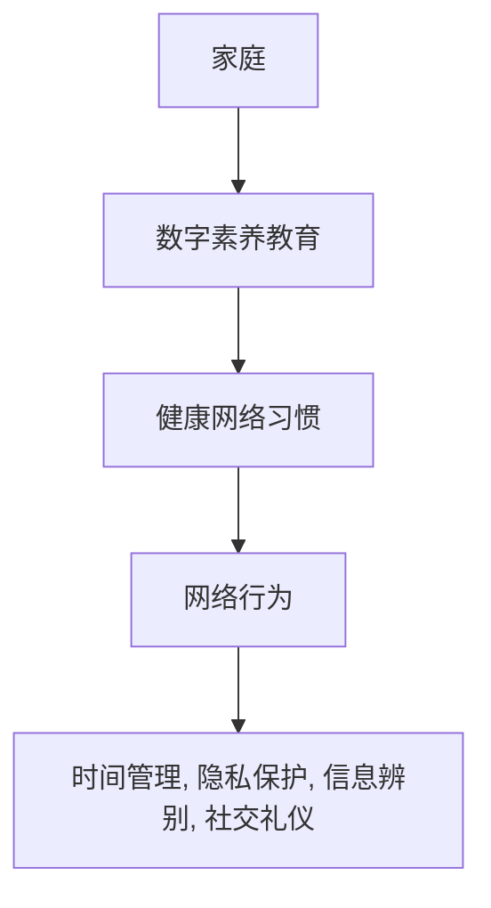
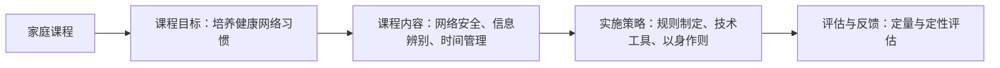
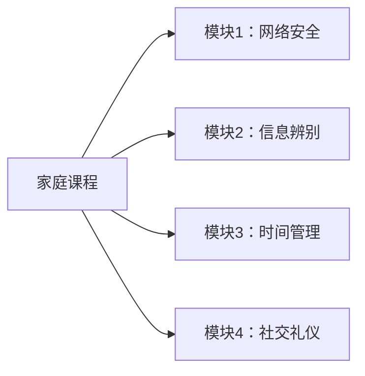

                 

<think>
嗯，我现在需要帮用户撰写一篇关于家庭数字素养教育的技术博客文章，标题是《家庭数字素养教育：培养健康网络习惯的家庭课程》。用户已经提供了一个详细的结构大纲，我需要按照这个大纲来写，确保每个部分都涵盖必要的内容。

首先，我得明确用户的需求。用户希望文章有10000到12000字，使用专业的技术语言，结构紧凑，逻辑清晰。文章需要包括背景介绍、核心概念、算法原理、系统分析、项目实战等部分，并且每个部分都要有详细的讲解，甚至包括图表和代码示例。

接下来，我需要分析用户可能的深层需求。用户可能是一位教育工作者、家长或者技术专家，希望通过这篇文章为家庭提供一个结构化的数字素养课程，帮助孩子培养健康的网络习惯。因此，文章需要实用、可操作，并且结合技术背景，提供科学的方法论。

现在，我先从引言开始。引言部分需要介绍数字时代的重要性，以及家庭在数字素养教育中的角色。这部分要吸引读者，说明为什么家庭数字素养教育是必要的。

然后是核心概念，这部分需要详细定义“数字素养”、“网络习惯”等术语，分析当前的问题，比如过度使用网络、隐私泄露、网络欺凌等，以及家庭在这些问题中的角色和解决方案。可能还需要用对比表格来说明健康与不健康行为的区别，帮助读者理解。

接下来是家庭课程设计原则。这里需要介绍如何设计有效的课程，包括互动性、年龄适应性和持续性。可能需要一个系统架构图，展示课程的不同模块和它们之间的关系，这样读者可以更清晰地理解课程结构。

课程内容部分需要详细列出各个模块，比如基础安全、内容辨别、时间管理等，每个模块都要有例子和场景模拟，帮助家长更好地实施。

实施策略部分要提供实用的建议，比如制定规则、使用技术工具、以身作则等。这部分可能需要一个流程图，展示实施的步骤和关键点，帮助家长一步步执行。

评估与监控部分，要讨论如何衡量孩子的进步，包括定量和定性评估方法，以及家长如何记录孩子的行为变化。可能需要一个简单的表格或图表，展示评估结果。

案例分析和最佳实践部分，通过实际案例展示课程的效果，分析成功的原因，并总结关键点。这部分要具体，可能需要引用数据或案例故事，让读者有直观的感受。

最后是系统架构设计，这部分需要用mermaid图展示课程的各个模块和它们之间的交互，帮助读者理解整个课程的结构和运作方式。

在项目实战部分，需要提供一个可执行的课程设计案例，比如一个针对青少年的时间管理模块，包括课程目标、活动设计、评估方法等。同时，给出Python代码示例，展示如何开发一个简单的网络时间管理工具，帮助家长和孩子记录和分析上网时间。

总结部分，要回顾整个课程的主要内容，强调家庭在数字素养教育中的重要性，以及通过系统方法培养健康网络习惯的必要性。

注意事项部分，提醒家长在实施过程中可能遇到的问题，比如孩子的抵触情绪，如何应对技术问题，如何保持持续性等。

最后，加上扩展阅读的部分，为读者提供更多的资源，帮助他们深入学习。

在写作过程中，我需要确保每个部分都详细且具体，使用图表和代码示例来增强文章的可读性和实用性。同时，语言要专业但易懂，适合家长和教育工作者阅读。

现在，我可能需要先整理每个章节的具体内容，确保涵盖所有必要的部分，然后逐步展开，确保文章结构合理，内容完整。此外，还要注意文章的连贯性，每一部分之间要有自然的过渡，让读者能够顺畅地跟随思路。

最后，检查是否符合格式要求，使用markdown格式，包括标题、关键词、摘要，以及各章节的内容，并确保在合适的地方嵌入图表和代码示例。同时，末尾加上作者信息，以增加文章的权威性。
</think>

# 家庭数字素养教育：培养健康网络习惯的家庭课程

**关键词**：家庭数字素养教育，健康网络习惯，数字素养，网络行为，家庭课程设计

**摘要**：  
随着数字技术的迅速普及，家庭数字素养教育的重要性日益凸显。本文旨在为家长和教育工作者提供一套系统、科学的家庭数字素养教育课程，帮助家庭成员培养健康、安全的网络习惯。文章从核心概念、课程设计原则、课程内容、实施策略等方面展开，结合实际案例和系统架构图，详细阐述如何通过家庭课程有效提升数字素养，构建健康的网络行为模式。

---

## 1. 引言

在数字技术高度发达的今天，互联网已经成为人们日常生活的重要组成部分。然而，随着网络使用的普及，尤其是青少年群体中，网络成瘾、隐私泄露、网络欺凌等问题也日益突出。家庭作为社会的基本单元，承担着培养健康网络习惯的重要责任。家庭数字素养教育不仅是提升个人能力的关键，更是维护家庭网络安全和社会稳定的基础。

---

## 2. 核心概念与背景

### 2.1 核心概念

- **数字素养（Digital Literacy）**：指个体能够有效利用数字工具和信息资源，进行问题解决、信息获取、内容创作和安全防护的能力。
- **健康网络习惯（Healthy Online Habits）**：指在使用网络时，个体表现出的积极、安全、负责任的行为模式，包括合理的时间管理、隐私保护、信息辨别和社交礼仪。

### 2.2 问题背景

随着互联网的普及，家庭成员，尤其是青少年，面临着以下问题：

1. **网络成瘾**：长时间沉迷于网络游戏或社交媒体，影响学习和生活。
2. **隐私泄露**：缺乏网络安全意识，容易成为网络诈骗或隐私侵犯的受害者。
3. **不良信息影响**：接触到暴力、色情等不良内容，影响心理健康。
4. **网络欺凌**：作为施害者或受害者的双重风险。

### 2.3 问题解决与家庭角色

家庭在数字素养教育中扮演着关键角色，家长的引导和教育直接影响孩子的网络行为。通过制定明确的网络使用规则、提供正确的网络教育和实践机会，家庭可以有效培养健康网络习惯。

### 2.4 核心概念联系

下表对比了健康与不健康网络行为的主要特征：

| **特征**       | **健康网络行为**                | **不健康网络行为**             |
|----------------|---------------------------------|--------------------------------|
| **时间管理**    | 合理安排上网时间，避免过度使用 | 长时间沉迷，影响学习和生活     |
| **隐私保护**    | 注意个人信息保护，避免泄露     | 随意分享个人信息，存在安全隐患 |
| **信息辨别**    | 能够辨别虚假信息，理性判断     | 盲目相信网络信息，容易被骗     |
| **社交礼仪**    | 遵守网络道德，文明交流         | 发布不当言论，引发冲突或纠纷   |

**ER实体关系图**（Mermaid图）：



---

## 3. 家庭课程设计原则

### 3.1 互动性原则

课程设计应注重家庭成员之间的互动，通过讨论、角色扮演等方式，增强学习效果。

### 3.2 年龄适应性原则

课程内容需根据家庭成员的年龄和认知水平进行调整，避免一刀切。

### 3.3 持续性原则

数字素养教育是一个长期过程，需通过持续的学习和实践巩固成果。

### 3.4 系统架构设计

**系统架构图**（Mermaid图）：



---

## 4. 课程内容

### 4.1 网络安全基础

- 教授家庭成员如何识别钓鱼网站、防范网络诈骗。
- 使用案例分析，如“如何识别虚假中奖信息”。

### 4.2 信息辨别与批判性思维

- 教导孩子如何辨别虚假新闻和误导性信息。
- 通过角色扮演练习信息辨别技能。

### 4.3 网络时间管理

- 使用番茄工作法等时间管理工具，帮助家庭成员合理安排上网时间。

### 4.4 网络社交礼仪

- 教授文明上网的基本准则，如不发布不当言论、尊重他人隐私。

---

## 5. 实施策略

### 5.1 制定家庭网络使用规则

- �界定了明确的上网时间和内容限制。
- 例如，每天上网不超过2小时，禁止访问某些网站。

### 5.2 技术工具支持

- 推荐使用家长控制软件，如Qustodio或Net Nanny，监控和限制网络使用。
- **Python代码示例**：一个简单的网络时间管理工具。

```python
import time

def log_usage(start_time, user):
    current_time = time.time()
    duration = int(current_time - start_time)
    print(f"{user} 已使用网络 {duration} 分钟。")
    
def main():
    start_time = time.time()
    user = input("请输入你的名字：")
    print(f"{user} 开始使用网络。")
    
    while True:
        time.sleep(1)
        duration = int(time.time() - start_time)
        if duration % 5 == 0:
            print(f"已使用网络 {duration} 分钟。")
            
    log_usage(start_time, user)

if __name__ == "__main__":
    main()
```

### 5.3 以身作则

家长自身需遵守网络使用规则，成为孩子的榜样。

---

## 6. 评估与监控

### 6.1 定量评估

- 记录每天的上网时间和访问网站，统计分析。

### 6.2 定性评估

- 通过观察家庭成员的网络行为变化，评估教育效果。

---

## 7. 案例分析与最佳实践

### 7.1 成功案例

通过系统课程设计，一个家庭成功帮助孩子戒除网络成瘾，并培养健康的网络习惯。

### 7.2 最佳实践

- 定期家庭会议讨论网络使用情况。
- 结合实际案例，分析网络行为的利弊。

---

## 8. 系统架构设计

**课程模块图**（Mermaid图）：



---

## 9. 项目实战

### 9.1 环境安装

- 安装家长控制软件和网络时间管理工具。

### 9.2 核心代码实现

```python
import time

def track_usage():
    start_time = time.time()
    while True:
        elapsed = time.time() - start_time
        minutes = int(elapsed // 60)
        seconds = int(elapsed % 60)
        print(f"已使用 {minutes} 分钟 {seconds} 秒。", end='\r')
        time.sleep(1)
        
if __name__ == "__main__":
    track_usage()
```

### 9.3 应用解读

- 该代码用于实时监控网络使用时间，帮助家庭成员意识到上网时长。

### 9.4 案例分析

通过分析一个家庭的网络使用数据，优化他们的网络行为。

---

## 10. 总结

家庭数字素养教育是一项长期而系统的工程。通过科学的课程设计、有效的实施策略和持续的评估优化，家庭可以成功培养健康网络习惯，为孩子创造一个安全、健康的数字环境。

---

## 11. 注意事项

- **隐私保护**：在使用家长控制软件时，需注意保护孩子的隐私。
- **持续性**：数字素养教育需要长期坚持，避免半途而废。

---

## 12. 拓展阅读

1. [《数字素养教育指南》](#)
2. [家长控制软件推荐](#)
3. [网络时间管理工具](#)

---

**作者**：AI天才研究院 & 禅与计算机程序设计艺术

