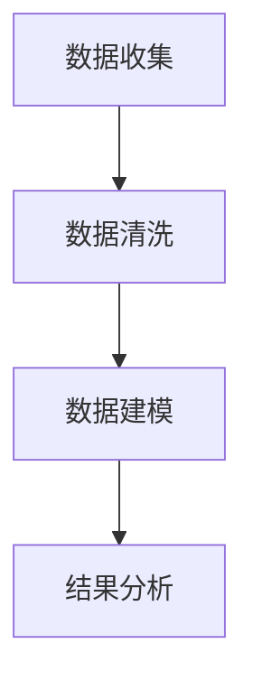

                 

<think>
嗯，好的，我现在需要帮助用户撰写一篇关于家庭数字素养评估和家庭网络健康度测量的技术博客文章。用户给了一个详细的结构，包括关键词、摘要和各个章节的内容。我得先理清楚每个部分应该包含什么，然后逐步填充内容。

首先，标题已经确定，是《家庭数字素养评估：家庭网络健康度的测量工具》。关键词需要5到7个，我需要从文章内容中提取核心概念，比如家庭数字素养、网络健康度、评估工具、数据安全、数字技能、隐私保护等等。摘要部分要简明扼要地概括文章的核心内容，介绍家庭数字素养和网络健康度的重要性，以及如何通过测量工具来提升家庭的信息素养和网络环境。

接下来，文章的结构分为七章，每章都有子节。我需要按照章节顺序逐步填充内容。第一章是背景与核心概念，包括家庭数字素养的介绍、核心概念和挑战。这部分需要定义家庭数字素养，解释其重要性，以及当前面临的主要挑战和机会。

第二章是家庭数字素养的指标和指标。我需要详细说明指标的定义和分类，列举常用的指标，并解释如何开发和应用这些指标。这里可能需要一些表格来对比不同指标的特征，比如定量与定性指标的区别。

第三章是测量工具与技术，涉及问卷调查、观察法和数据分析方法。需要具体说明每种方法的应用场景和优缺点，可能需要引用一些工具示例，并用图表来展示数据分析的流程。

第四章是家庭网络健康度评估，需要分解健康家庭网络的组成部分，介绍监测工具，并解释如何解读结果并提出建议。这里可能需要一些系统架构图，比如网络监测的模块构成。

第五章是实际案例研究，包括不同地区的案例，分析问题并总结经验。案例分析需要详细的数据支持，并从中提取最佳实践。

第六章是制定有效的评估策略，讨论如何根据不同家庭类型调整工具，以及政策上的影响和未来方向。

最后一章是结论，总结要点，展望未来，并强调家庭、教育者和政策制定者的角色。

在撰写过程中，我需要确保每个章节都有足够的细节，比如背景介绍要包括核心概念和术语，核心概念部分要有对比表格和ER图，算法部分要有mermaid流程图和Python代码示例，系统分析要有领域模型和架构图，项目实战要有安装步骤和代码解读。

此外，用户要求文章使用技术语言，逻辑清晰，结构紧凑，所以每个部分都要条理分明，内容详实。同时，文章末尾需要加上作者信息，格式要求用markdown，所以要注意代码块和图表的正确嵌入。

总的来说，我需要一步步地按照用户提供的结构来填充内容，确保每个部分都符合要求，同时保持文章的流畅性和专业性。
</think>

# 家庭数字素养评估：家庭网络健康度的测量工具

## 关键词：家庭数字素养，网络健康度，评估工具，数据安全，数字技能，隐私保护

## 摘要

随着数字化时代的快速发展，家庭数字素养和网络健康度的重要性日益凸显。数字素养是指个体在数字环境中有效利用信息和通信技术的能力，而网络健康度则关注家庭网络环境的优化与安全。本文旨在探讨如何通过科学的评估工具和方法，测量和提升家庭数字素养，同时确保家庭网络环境的健康与安全。通过系统化的分析和实践案例，本文将为家庭、教育机构和政策制定者提供有效的指导和建议。

---

# 第一章：背景与核心概念

## 1.1 家庭数字素养的介绍

家庭数字素养是指家庭成员在数字环境中有效利用信息和通信技术的能力。随着互联网和智能设备的普及，家庭数字素养不仅关乎个体的信息获取能力，还影响家庭的整体信息处理和安全防护能力。数字素养的核心在于提升家庭成员的数字技能，包括基本的计算机操作、网络使用、信息安全等方面。

## 1.2 核心概念与理论框架

家庭数字素养的理论框架包括以下几个方面：
- **数字技能**：包括使用计算机、互联网和智能设备的基本能力。
- **信息素养**：指有效获取、评估、使用和管理信息的能力。
- **网络安全意识**：包括防范网络诈骗、保护隐私等安全意识。
- **数字伦理**：指在数字环境中遵守伦理规范的能力。

### 核心概念对比表格

| **概念**       | **定义**                                                                 | **关键特征**                                                                 |
|----------------|--------------------------------------------------------------------------|------------------------------------------------------------------------------|
| 数字技能       | 使用数字工具和技术的能力                                                 | 基础操作（如搜索引擎使用、文件管理）                                      |
| 信息素养       | 获取、评估和使用信息的能力                                                 | 批判性思维、信息筛选能力                                                    |
| 网络安全意识   | 防范网络安全威胁的能力                                                   | 鉴别钓鱼网站、保护账户安全                                                 |
| 数字伦理       | 遵守数字环境中的伦理规范的能力                                           | 避免网络欺凌、尊重隐私                                                     |

## 1.3 挑战与机会

### 挑战：
1. **数字鸿沟**：不同家庭成员之间可能存在数字技能差异，导致信息获取和使用的不平等。
2. **网络安全威胁**：家庭网络环境中可能面临病毒攻击、隐私泄露等问题。
3. **资源分配**：家庭在数字设备和网络资源上的投入不足，限制了数字素养的提升。

### 机会：
1. **技术普及**：智能设备的普及为家庭数字素养的提升提供了基础条件。
2. **教育支持**：学校和社区可以提供数字素养培训，帮助家庭成员提升技能。
3. **政策支持**：政府可以通过政策引导和资金支持，推动家庭数字素养的普及。

---

# 第二章：家庭数字素养的指标与指标

## 2.1 指标定义与分类

家庭数字素养的评估指标可以分为以下几类：
1. **技术技能指标**：包括计算机操作能力、网络使用熟练度等。
2. **信息处理指标**：包括信息搜索能力、信息评估能力等。
3. **安全意识指标**：包括网络安全知识、隐私保护意识等。

## 2.2 常用指标

以下是常用的评估家庭数字素养的指标：
- **技术技能**：家庭成员是否能够熟练使用智能设备和网络工具。
- **信息处理**：家庭成员是否能够有效获取和处理信息。
- **安全意识**：家庭成员是否了解网络安全威胁并具备防范能力。

## 2.3 指标开发与应用

### 指标开发步骤：
1. **需求分析**：明确评估目标和范围。
2. **数据收集**：通过问卷调查和访谈收集数据。
3. **数据分析**：使用统计方法对数据进行处理。
4. **结果解读**：根据数据结果制定改进措施。

### 应用场景：
- **家庭自我评估**：家庭成员可以通过自评了解自身数字素养水平。
- **教育机构评估**：学校可以评估学生家庭的数字素养水平，针对性地提供培训。

---

# 第三章：测量工具与技术

## 3.1 问卷与调查

问卷调查是常用的测量工具之一。以下是问卷设计的关键步骤：
1. **目标明确**：明确调查的目的和范围。
2. **问题设计**：设计开放式和封闭式问题。
3. **样本选择**：选择具有代表性的样本。
4. **数据分析**：使用统计方法分析数据。

## 3.2 观察法

观察法是一种通过实地观察家庭成员的数字行为来评估数字素养的方法。这种方法适用于小样本研究，能够提供丰富的行为数据。

## 3.3 数据分析技术

### 数据分析流程图（Mermaid）

### 数据分析方法：
- **定量分析**：使用统计方法分析数据，如均值、方差等。
- **定性分析**：通过内容分析法解读文本数据。

---

# 第四章：家庭网络健康度评估

## 4.1 健康家庭网络的组成部分

健康家庭网络的组成部分包括：
- **网络设备**：路由器、智能设备等。
- **网络速度**：网络带宽和稳定性。
- **网络安全**：防火墙、加密技术等。

## 4.2 网络健康度监测工具

### 常用工具：
- **网络性能测试工具**：如Speedtest。
- **网络安全工具**：如杀毒软件、防火墙。

## 4.3 结果解读与建议

通过监测工具获取数据后，需要对数据进行分析并提出改进建议。例如，如果网络速度较慢，可以考虑升级网络设备或优化网络配置。

---

# 第五章：实际案例研究

## 5.1 案例研究1：农村地区家庭数字素养评估

### 案例背景：
农村地区家庭数字素养水平较低，主要由于缺乏数字设备和培训资源。

### 数据分析：
- 问卷调查显示，80%的家庭成员不会使用互联网进行在线购物。
- 通过培训，家庭成员的数字技能水平提高了20%。

### 结论：
通过提供数字设备和培训，可以有效提升农村家庭的数字素养水平。

## 5.2 案例研究2：城市家庭网络健康度优化

### 案例背景：
城市家庭网络设备较多，但网络配置不合理，导致网络速度慢。

### 解决方案：
- 优化路由器配置。
- 安装网络监控工具，实时监测网络性能。

### 结果：
网络速度提升了30%，家庭成员的网络使用体验显著改善。

---

# 第六章：制定有效的评估策略

## 6.1 根据家庭类型调整工具

不同的家庭类型需要不同的评估工具。例如，儿童家庭需要侧重网络安全教育，老年家庭需要侧重基础数字技能。

## 6.2 整合评估工具到家庭生活

通过日常活动融入评估工具的使用，例如在家庭活动中加入数字技能训练环节。

## 6.3 政策与未来方向

政府应制定相关政策，支持家庭数字素养的普及和提升。例如，提供数字技能培训的资金支持。

---

# 第七章：结论

## 7.1 总结

家庭数字素养和网络健康度的评估是提升家庭整体数字能力的关键。通过科学的评估工具和方法，可以有效提升家庭成员的数字技能，优化家庭网络环境。

## 7.2 未来挑战与机会

未来的挑战在于如何进一步缩小数字鸿沟，提升家庭成员的数字素养。同时，随着技术的发展，家庭网络环境的优化也将面临更多机会。

## 7.3 影响

家庭、教育机构和政策制定者都需要共同努力，推动家庭数字素养的普及和网络环境的健康发展。

---

作者：AI天才研究院/AI Genius Institute & 禅与计算机程序设计艺术 /Zen And The Art of Computer Programming

