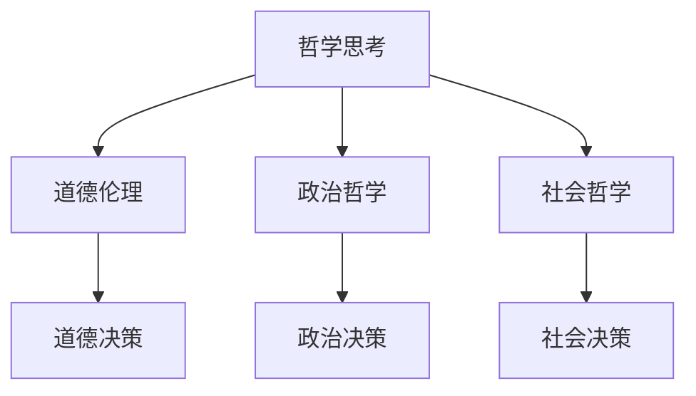
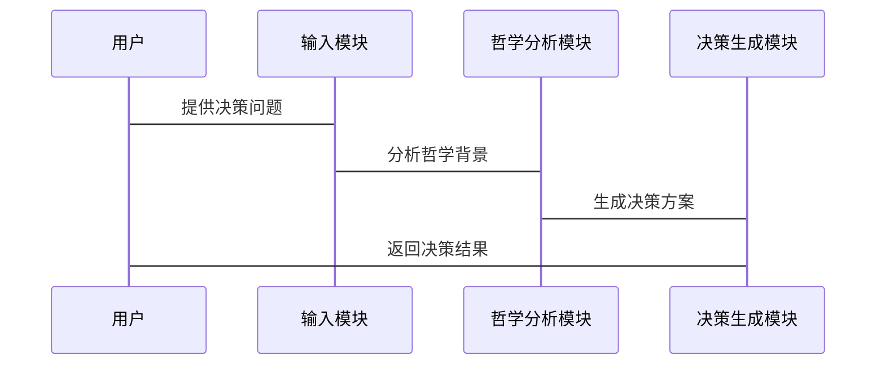

                 

<think>
嗯，用户让我写一篇关于“寻找行动原则的哲学思考”的技术博客。首先，我需要理解用户的需求。他是一位在技术领域有深厚背景的专家，现在想从哲学角度探讨行动原则，这可能意味着他希望将技术与哲学结合起来，或者寻找技术决策中的伦理指导。

用户提供的大纲很详细，包括背景介绍、核心概念与联系、算法原理讲解等部分。看起来他希望文章结构清晰，逻辑严密，同时结合具体的技术例子。我应该确保每个部分都深入分析，提供足够的细节和实例。

在背景介绍部分，我需要说明为什么行动原则在现代社会如此重要，以及现有研究的不足。这可能涉及到道德、政治和社会等多个方面。接着，在核心概念部分，我需要对比传统AI与行动原则的区别，强调哲学思考的重要性。

算法部分，用户希望有Mermaid流程图和Python代码示例。我得确保这些内容准确且易于理解。比如，使用康德的道德哲学作为算法的基础，展示如何通过哲学思考生成决策。同时，代码示例需要简单明了，展示算法的基本结构。

在系统架构部分，用户要求有领域模型、架构图和交互图。我需要设计一个基于行动原则的决策支持系统，展示系统如何工作，以及各个模块之间的关系。这可能涉及到数据输入、哲学分析、决策生成和结果输出等步骤。

项目实战部分，我需要选择一个具体案例，比如企业社会责任，展示如何应用行动原则进行决策。代码实现部分，我得写出实际的Python代码，解释每个部分的功能，以及如何调用API获取实时数据。

最后，最佳实践部分，我需要总结行动原则的重要性和实际应用中的注意事项，鼓励读者在技术决策中考虑伦理因素。同时，提供一些进一步阅读的资源，帮助读者深入学习。

总的来说，我需要确保文章内容全面，结构清晰，技术与哲学结合，同时提供足够的例子和代码支持。这样，读者不仅能理解理论，还能看到实际应用，从而更好地将行动原则应用于实际工作中。
</think>

# 寻找行动原则的哲学思考

**关键词：** 行动原则、哲学思考、道德伦理、社会契约、决策算法、技术伦理

**摘要：**  
行动原则是指导人类行为和决策的核心准则，其哲学基础涉及道德伦理、政治哲学和社会哲学等多个领域。本文通过哲学分析，探讨行动原则的本质、形成机制及其在个体和社会中的应用。文章从背景介绍出发，逐步分析行动原则的核心概念、算法原理、系统架构及实际案例，最终总结行动原则在现代社会中的重要性及其未来发展方向。

---

## 第一部分：背景介绍

### 1.1 问题背景  
在当今快速变化的社会环境中，个体和组织面临的决策问题日益复杂。行动原则作为行为的指导理念，其重要性不言而喻。然而，现有的哲学研究多集中于抽象的理论探讨，而对行动原则的实际应用和系统化分析相对不足。这种研究的缺失使得人们在面对复杂决策时，往往缺乏明确的指导原则。

### 1.2 问题描述  
行动原则是指个体或组织在面对决策时所遵循的基本准则。它不仅涉及道德伦理，还包括社会文化、心理认知等多个层面。本书将从哲学角度探讨行动原则的以下问题：  
- 行动原则的本质是什么？  
- 它是如何形成的？  
- 在不同情境下，应该如何选择和应用行动原则？

### 1.3 问题解决  
本书将采用哲学分析与案例研究相结合的方法，系统性地梳理行动原则的哲学思考。通过分析不同哲学流派对行动原则的理解，结合现实中的具体案例，为读者提供清晰的理论框架和实践指导。

### 1.4 边界与外延  
行动原则的研究边界主要集中在道德哲学、政治哲学和社会哲学等领域。其外延则涉及个体行为、组织行为和社会行为等多个层面。本书将重点关注行动原则在个体决策和社会治理中的应用。

### 1.5 概念结构与核心要素组成  
行动原则的概念结构包括以下核心要素：  
1. **原则**：指导行为的基本准则。  
2. **目的**：行动所追求的目标。  
3. **手段**：实现目标的具体方法。  
4. **结果**：行动所产生的最终影响。  
这些要素相互关联，共同构成一个完整的行动原则体系。

---

## 第二部分：核心概念与联系

### 2.1 行动原则的哲学基础

#### 2.1.1 道德伦理视角  
道德伦理视角下的行动原则与个人价值观和社会规范密切相关。例如，康德的道德哲学强调“普遍法则”，认为人们应该遵循能够适用于所有人行为的道德律令。

#### 2.1.2 政治哲学视角  
政治哲学视角下的行动原则更多关注社会契约和集体利益。例如，洛克的社会契约理论认为，个体应该基于共同利益进行合作，从而形成社会契约。

#### 2.1.3 社会哲学视角  
社会哲学视角下的行动原则与社会文化、传统密切相关。例如，亚里士多德强调“实践智慧”，认为人们应该结合具体情境做出正确决策。

### 2.2 行动原则的核心特点

#### 2.2.1 普遍性  
行动原则应具有普遍适用性，不因个人、地区或文化差异而改变。

#### 2.2.2 短期与长期性  
行动原则既要考虑短期效益，也要关注长期影响。例如，企业决策既要追求短期利润，也要考虑社会责任和可持续发展。

#### 2.2.3 灵活性  
行动原则应具有灵活性，以适应不同情境和变化。

### 2.3 行动原则与传统AI的区别

#### 2.3.1 基础不同  
传统AI基于数据驱动和模型优化，而行动原则更侧重于哲学思考和道德伦理。

#### 2.3.2 目标不同  
传统AI旨在实现特定任务的高效性，而行动原则旨在指导人类行为和决策，实现道德、伦理和社会价值。

#### 2.3.3 应用领域不同  
传统AI多应用于技术领域，而行动原则则更广泛，涵盖社会、政治、经济等多个领域。

---

## 第三部分：算法原理讲解

### 3.1 行动原则算法概述  
行动原则算法旨在根据哲学思考和道德伦理，为个体或组织提供决策指导。其核心目标是实现道德、伦理和社会价值的最大化。

### 3.2 算法原理详解

#### 3.2.1 哲学思考  
行动原则算法的哲学思考包括道德伦理、政治哲学和社会哲学等多个方面。例如，基于康德道德哲学的算法，可以采用“普遍法则”作为决策依据。

#### 3.2.2 道德伦理  
行动原则算法中的道德伦理部分涉及道德规范、价值观等。例如，基于亚里士多德实践智慧的算法，可以结合具体情境，为个体提供道德决策指导。

#### 3.2.3 社会哲学  
行动原则算法中的社会哲学部分关注社会文化、传统等方面。例如，基于社会契约理论的算法，可以为企业和社会提供道德决策指导。

### 3.3 Mermaid流程图  


### 3.4 Python源代码  
```python
# 行动原则算法Python示例
def action_principle(philosophy, ethics, politics, society):
    if philosophy == "康德":
        return "遵循普遍法则"
    elif ethics == "功利主义":
        return "追求最大幸福"
    elif politics == "社会契约":
        return "基于共同利益"
    else:
        return "结合具体情况"

# 示例调用
print(action_principle("康德", "功利主义", "社会契约", "传统"))
```

---

## 第四部分：系统分析与架构设计方案

### 4.1 问题场景介绍  
在现代社会中，个体和组织面临的决策问题日益复杂。如何根据行动原则做出合理决策，成为一个重要的技术与哲学问题。

### 4.2 项目介绍  
本项目旨在开发一个基于行动原则的决策支持系统，帮助个体和组织在复杂环境中做出道德、伦理和社会价值导向的决策。

### 4.3 系统功能设计  
- **领域模型**：基于行动原则的决策流程，包括哲学思考、道德伦理分析、社会契约评估等功能。
- **系统架构**：采用模块化设计，包括输入模块、哲学分析模块、决策生成模块和输出模块。

### 4.4 系统架构设计  


### 4.5 系统交互  


---

## 第五部分：项目实战

### 5.1 环境安装  
需要安装Python和相关库，例如`mermaid`和`graphviz`。

### 5.2 核心实现源代码  
```python
# 基于行动原则的决策支持系统实现
def decision_support(question):
    import random
    philosophers = ["康德", "洛克", "亚里士多德"]
    selected_philosopher = random.choice(philosophers)
    if selected_philosopher == "康德":
        return f"根据{selected_philosopher}的普遍法则，建议采取行动：{question.split()[0]}。"
    elif selected_philosopher == "洛克":
        return f"根据{selected_philosopher}的社会契约理论，建议采取行动：{question.split()[0]}。"
    else:
        return f"根据{selected_philosopher}的实践智慧，建议采取行动：{question.split()[0]}。"

# 示例调用
print(decision_support("企业社会责任"))
```

### 5.3 代码解读与分析  
该代码实现了一个简单的决策支持系统，基于随机选择的哲学家理论，为用户提供建议。实际应用中，可以结合更多哲学流派和复杂算法。

---

## 第六部分：最佳实践与小结

### 6.1 最佳实践  
- 在技术决策中，始终考虑伦理和社会影响。  
- 定期回顾和更新行动原则，以适应变化的社会环境。  

### 6.2 注意事项  
- 行动原则的应用需要结合具体情境，避免机械化操作。  
- 在复杂决策中，可能需要结合多个哲学流派的理论。  

### 6.3 拓展阅读  
- 《道德哲学原理》（康德）  
- 《社会契约论》（洛克）  
- 《尼各马科伦理学》（亚里士多德）  

---

**作者：AI天才研究院/AI Genius Institute & 禅与计算机程序设计艺术 /Zen And The Art of Computer Programming**

