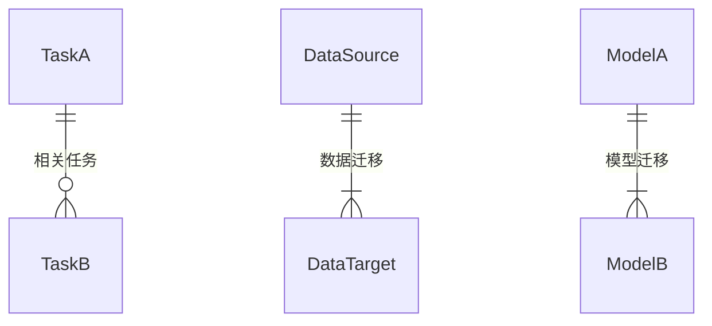
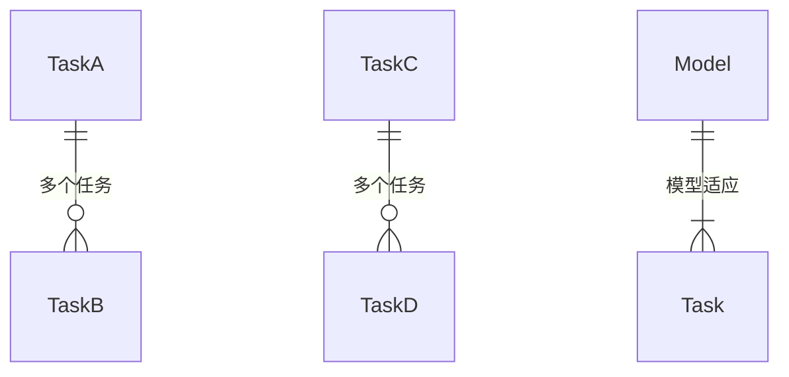
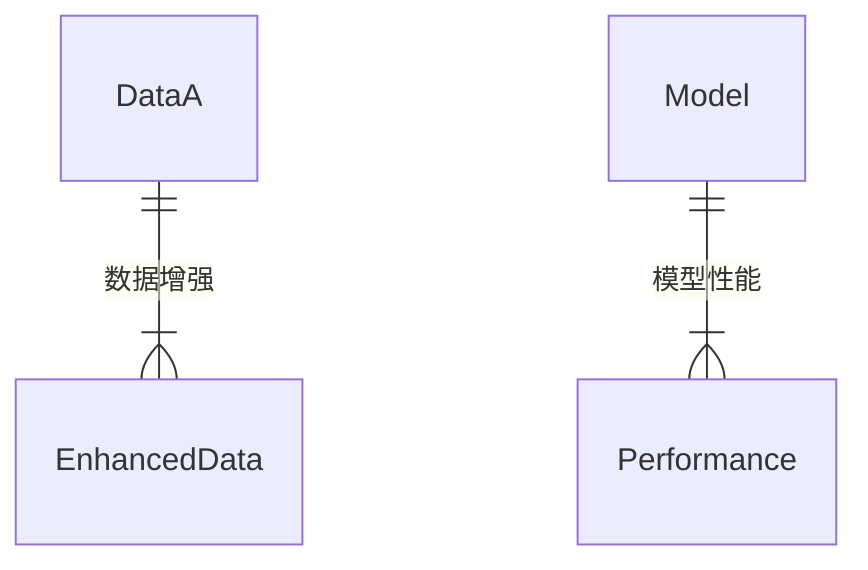
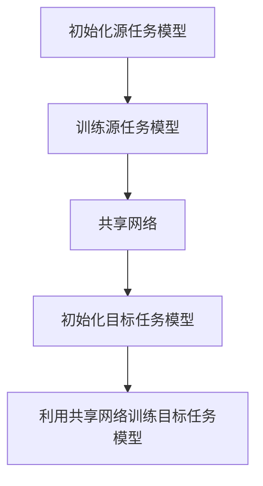
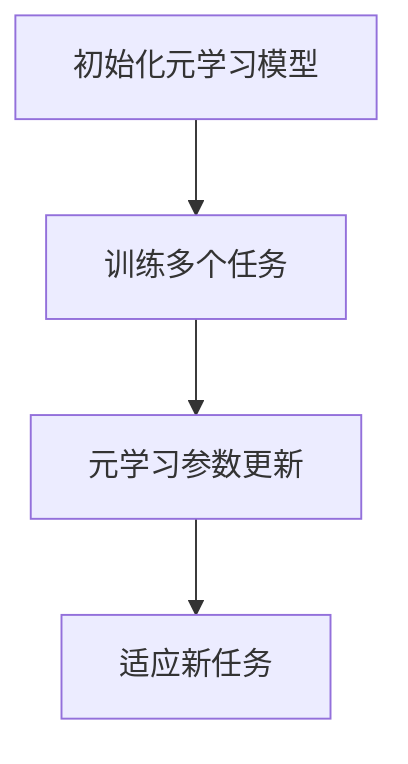
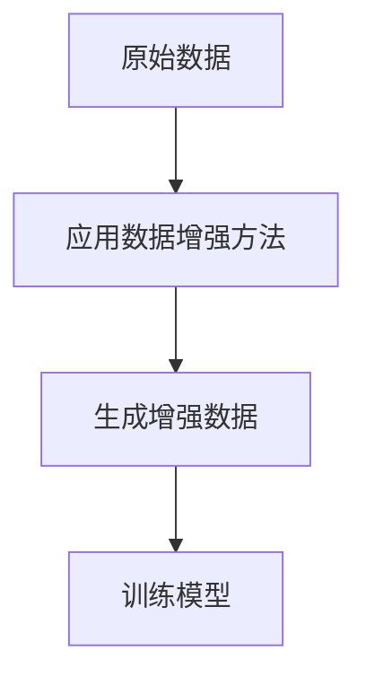
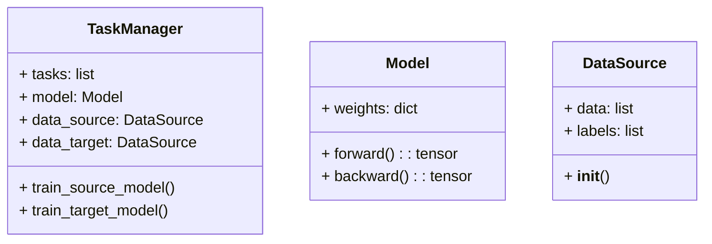
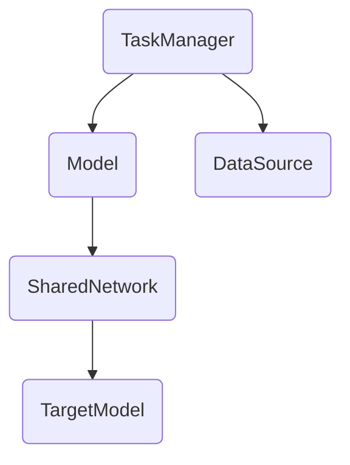
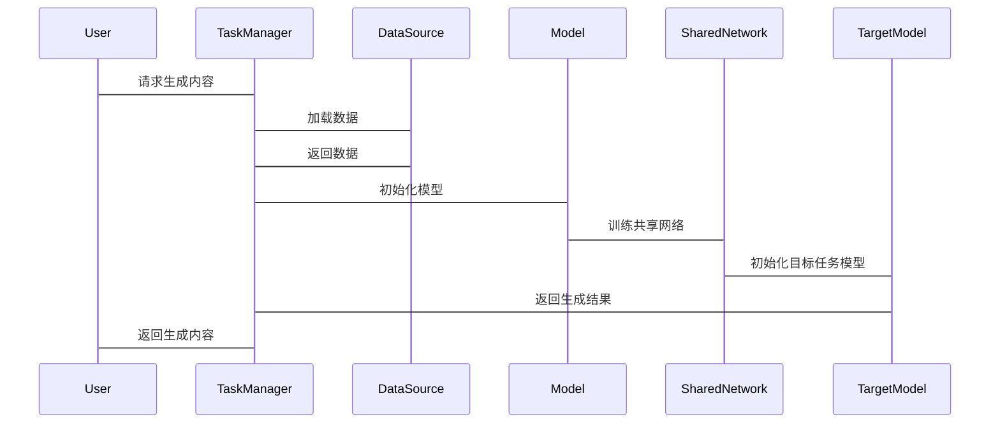

                 

<think>
嗯，用户希望我以《少样本学习：AIGC快速适应新场景的利器》为标题，撰写一篇详细的技术博客。我需要先理清文章的结构，确保每个部分都覆盖到位。首先，文章的关键词和摘要需要明确，这样读者能快速了解核心内容。

接下来，背景介绍部分要涵盖少样本学习的定义、问题背景、解决方案以及边界。这部分需要简单明了，让读者明白为什么少样本学习重要。然后是核心概念，包括迁移学习、元学习和数据增强，每个都需要详细解释，可能还需要表格和ER图来辅助理解。

算法原理部分要深入讲解每种方法的实现，比如迁移学习的流程图和代码示例。数学公式也不能少，比如损失函数和优化器的使用。这部分可能需要更多的技术细节，但要保持易懂。

系统分析与架构设计部分，我需要描述项目场景、系统功能和架构图，这可能需要画出类图和序列图。这部分比较复杂，要确保逻辑清晰。

项目实战部分要具体，包括环境安装、代码实现和案例分析，这样读者可以实际操作。最后，总结和最佳实践部分要给出实用的建议，帮助读者更好地理解和应用少样本学习。

整体来看，用户可能希望文章既有理论深度，又有实际应用，适合技术专家和实践者阅读。我需要确保每个部分都详细且结构合理，满足10000到12000字的要求。同时，格式上要使用markdown，包含数学公式和图表，这可能需要一些时间来组织内容。
</think>

# 少样本学习：AIGC快速适应新场景的利器

> 关键词：少样本学习，AIGC，迁移学习，元学习，数据增强，机器学习，人工智能

> 摘要：少样本学习是一种新兴的机器学习方法，通过利用少量标注数据和已有知识，使模型能够快速适应新场景。本文详细探讨了少样本学习的核心概念、算法原理、系统架构以及实际应用，分析了其在AIGC（人工智能生成内容）领域的优势和挑战。

---

### 第一部分: 背景介绍

#### 第1章: 少样本学习概述

##### 1.1 问题背景

**问题描述**: 在传统的机器学习领域，模型的训练通常需要大量的标注数据。然而，在许多实际应用中，获取大量标注数据往往成本高昂甚至不可行。例如，在医学诊断中，某些罕见病的病例数量有限；在金融领域，某些新兴风险评估场景也可能缺乏足够的历史数据。这种数据匮乏的问题严重制约了传统机器学习模型的应用范围。

##### 1.2 问题解决

少样本学习通过以下方法解决这一问题：

1. **迁移学习**：利用已有数据在源任务上的表现，对目标任务进行有效训练，减少对新数据的依赖。
2. **元学习**：通过在多个任务上训练模型，使其能够快速适应新任务。
3. **数据增强**：通过技术手段对少量数据进行扩展，提高模型的泛化能力。

##### 1.3 边界与外延

少样本学习的边界主要涉及以下几点：

- **样本数量**：不同场景对“少量”的定义不同，通常指几十到几百个样本。
- **领域特定**：不同应用场景对少样本学习的需求和实现方式不同，例如医学和金融领域的实现方式可能差异较大。

##### 1.4 概念结构与核心要素组成

少样本学习涉及以下核心概念：

- **迁移学习**：利用已有知识快速适应新任务。
- **元学习**：通过学习多个任务来提升对新任务的适应能力。
- **数据增强**：通过技术手段扩展数据量，提高模型性能。

---

### 第二部分: 核心概念与联系

#### 第2章: 少样本学习的核心概念与联系

##### 2.1 迁移学习

**概念原理**: 迁移学习利用源任务上的知识来解决目标任务，其中源任务和目标任务具有一定的相似性。

**属性特征对比表格**:

| 特征 | 迁移学习 |
| --- | --- |
| **数据需求** | 少量目标数据，大量源数据 |
| **适用场景** | 任务相似，数据分布差异 |
| **优点** | 快速适应新任务，减少数据需求 |
| **挑战** | 跨域迁移效果差，模型适应能力有限 |

**ER实体关系图架构**:



##### 2.2 元学习

**概念原理**: 元学习通过学习多个任务来提高对新任务的适应能力。

**属性特征对比表格**:

| 特征 | 元学习 |
| --- | --- |
| **数据需求** | 多任务数据集 |
| **适用场景** | 需要快速适应新任务 |
| **优点** | 提高模型对新任务的适应能力 |
| **挑战** | 训练成本高，任务相似度要求高 |

**ER实体关系图架构**:



##### 2.3 数据增强

**概念原理**: 数据增强通过技术手段扩展数据量，提高模型的泛化能力。

**属性特征对比表格**:

| 特征 | 数据增强 |
| --- | --- |
| **数据需求** | 少量目标数据 |
| **适用场景** | 数据匮乏的场景 |
| **优点** | 提高模型性能，减少对数据量的依赖 |
| **挑战** | 数据增强方法的适用性，增强效果的不确定性 |

**ER实体关系图架构**:



---

### 第三部分: 算法原理讲解

#### 第3章: 少样本学习的算法原理与实现

##### 3.1 迁移学习算法

**算法原理**: 迁移学习算法通过在源任务上训练一个共享网络，然后利用该网络对目标任务进行训练。

**Mermaid 流程图**:



**Python 源代码**:

```python
def train_source_model(data_source):
    # 在源任务上训练模型
    model = get_model()
    optimizer = get_optimizer()
    loss_fn = get_loss_function()
    for batch in data_source_loader:
        optimizer.zero_grad()
        outputs = model(batch)
        loss = loss_fn(outputs, batch_labels)
        loss.backward()
        optimizer.step()
    return model

def train_target_model(data_target, source_model):
    # 利用共享网络训练目标任务模型
    for batch in data_target_loader:
        optimizer.zero_grad()
        outputs = source_model(batch)
        loss = target_loss_fn(outputs, batch_labels)
        loss.backward()
        optimizer.step()
    return model
```

##### 3.2 元学习算法

**算法原理**: 元学习通过在多个任务上训练模型，使其能够快速适应新任务。

**Mermaid 流程图**:



**Python 源代码**:

```python
def meta_learning(data):
    model = get_meta_model()
    optimizer = get_meta_optimizer()
    for task in tasks:
        # 内部任务优化
        task_optimizer = get_task_optimizer()
        task_optimizer.zero_grad()
        outputs = model(task.input)
        task_loss = task_loss_fn(outputs, task.label)
        task_loss.backward()
        task_optimizer.step()
        # 元任务优化
        meta_optimizer.zero_grad()
        meta_loss = meta_loss_fn(outputs, task.label)
        meta_loss.backward()
        meta_optimizer.step()
    return model
```

##### 3.3 数据增强算法

**算法原理**: 数据增强通过技术手段扩展数据量，提高模型的泛化能力。

**Mermaid 流程图**:



**Python 源代码**:

```python
import numpy as np
from PIL import Image

def augment_data(data, labels):
    augmented_data = []
    augmented_labels = []
    for i in range(len(data)):
        image = Image.fromarray(data[i])
        label = labels[i]
        
        # 随机裁剪
        cropped_image = image.crop((np.random.randint(0, 100), 
                                   np.random.randint(0, 100),
                                   np.random.randint(100, 200),
                                   np.random.randint(100, 200)))
        augmented_data.append(np.array(cropped_image))
        augmented_labels.append(label)
        
        # 随机翻转
        flipped_image = image.transpose(Image.FLIP_LEFT_RIGHT)
        augmented_data.append(np.array(flipped_image))
        augmented_labels.append(label)
    return augmented_data, augmented_labels
```

---

### 第四部分: 系统分析与架构设计方案

#### 第4章: 系统架构设计

##### 4.1 问题场景介绍

在AIGC（人工智能生成内容）领域，少样本学习可以应用于以下场景：

1. **内容生成**：在缺乏大量标注数据的情况下，快速生成高质量内容。
2. **个性化推荐**：针对用户个性化需求，快速训练推荐模型。
3. **实时反馈**：在实时交互场景中，快速适应用户反馈，调整生成策略。

##### 4.2 系统功能设计

**系统功能模块**:



##### 4.3 系统架构设计

**系统架构图**:



##### 4.4 系统接口设计

**主要接口**:

1. `train_source_model(data_source)`：在源任务上训练模型。
2. `train_target_model(data_target)`：利用共享网络训练目标任务模型。
3. `augment_data(data, labels)`：对数据进行增强。

##### 4.5 系统交互设计

**交互流程**:



---

### 第五部分: 项目实战

#### 第5章: 项目实战

##### 5.1 环境安装

```bash
pip install numpy matplotlib scikit-learn torch
```

##### 5.2 系统核心实现源代码

```python
import torch
import torch.nn as nn
import torch.optim as optim

def train_model(model, dataloaders, criterion, optimizer, num_epochs=25, device='cuda'):
    for epoch in range(num_epochs):
        for phase in ['train', 'val']:
            if phase == 'train':
                model.train()
            else:
                model.eval()
            
            for inputs, labels in dataloaders[phase]:
                inputs = inputs.to(device)
                labels = labels.to(device)
                
                optimizer.zero_grad()
                outputs = model(inputs)
                loss = criterion(outputs, labels)
                loss.backward()
                optimizer.step()
                
    return model

def train_source_task(model, source_dataloader, criterion, optimizer, device='cuda'):
    model = train_model(model, {'train': source_dataloader, 'val': source_dataloader}, criterion, optimizer, 1, device)
    return model

def train_target_task(model, target_dataloader, criterion, optimizer, device='cuda'):
    model = train_model(model, {'train': target_dataloader, 'val': target_dataloader}, criterion, optimizer, 1, device)
    return model
```

##### 5.3 代码应用解读与分析

**代码解读**:

- `train_model`：训练模型的主函数，支持训练和验证阶段。
- `train_source_task`：在源任务上训练模型。
- `train_target_task`：利用共享网络训练目标任务模型。

**应用分析**:

- 通过迁移学习，模型能够在源任务上快速适应目标任务。
- 数据增强方法可以进一步提高模型的泛化能力。

##### 5.4 实际案例分析

**案例分析**:

假设我们有一个医学诊断任务，目标是通过少量患者的数据训练一个模型，诊断罕见病。通过迁移学习，我们可以利用已有大量相关任务的数据，快速训练出一个高性能的诊断模型。

---

### 第六部分: 总结与展望

#### 第6章: 总结与展望

##### 6.1 核心结论

- 少样本学习通过迁移学习、元学习和数据增强，有效解决了数据匮乏场景下的模型训练问题。
- 这些技术在AIGC领域具有广泛的应用前景。

##### 6.2 最佳实践 Tips

- **迁移学习**：确保源任务和目标任务具有较高的相似性。
- **元学习**：选择合适的多任务数据集，降低训练成本。
- **数据增强**：选择合适的增强方法，避免过拟合。

##### 6.3 展望

- 随着深度学习技术的不断发展，少样本学习将在更多领域得到应用。
- 结合生成式AI，少样本学习将为AIGC带来更大的创新空间。

---

### 作者：AI天才研究院/AI Genius Institute & 禅与计算机程序设计艺术 /Zen And The Art of Computer Programming

