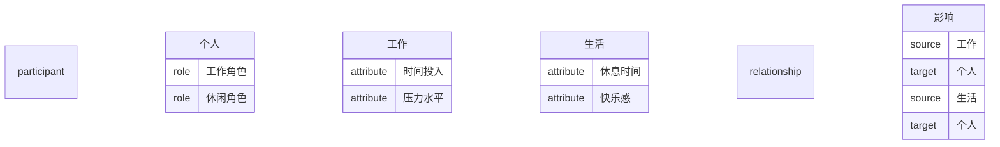
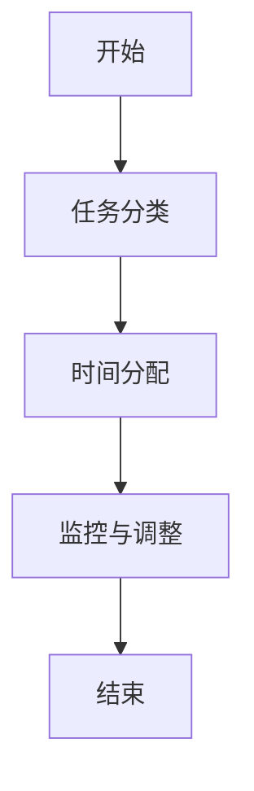
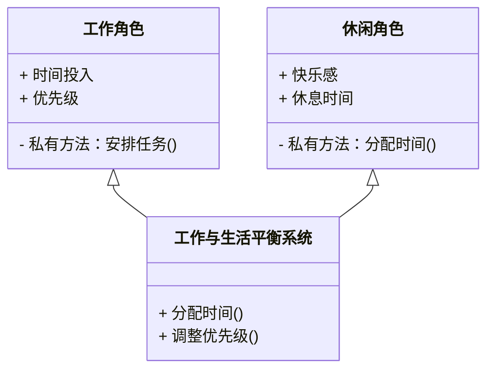
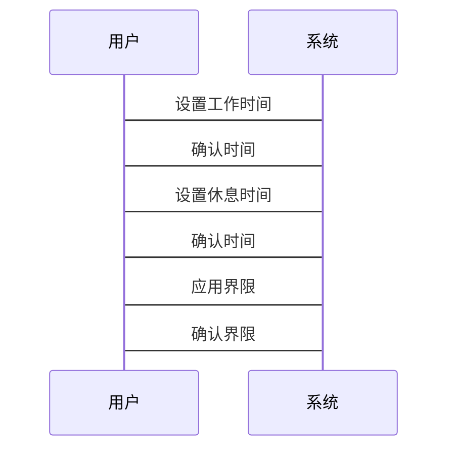

                 

<think>
好的，我现在要写一篇关于工作与生活平衡的文章。首先，我需要明确文章的结构和内容。根据用户提供的大纲，文章应该分为引言、核心概念、策略方法、案例研究和结论五个部分。

引言部分需要介绍背景，说明为什么工作与生活平衡如此重要，以及这本书如何帮助读者实现这一点。接下来是核心概念，这里需要定义关键术语，如“工作-生活平衡”和“时间管理”，并比较不同的平衡模型，制作一个对比表格。然后用ER图来展示这些概念之间的关系。

策略方法部分要具体，分为时间管理、工作生活融合、个人界限和 mindfulness 等小节，每个小节都要有实用的技巧和方法。案例研究部分通过实际案例来说明策略的应用，展示成功人士如何做到平衡，以及如何解决常见的挑战。

结论部分总结全文，强调实现平衡的重要性，并鼓励读者采取积极的行动。

接下来，我需要确保每个部分都有足够的细节，比如在时间管理部分，可以介绍番茄工作法，提供具体的步骤和代码示例。系统架构部分，可能需要设计一个类图，展示不同角色和他们的职责，以及如何相互作用。

我还要注意格式要求，使用markdown，确保数学公式用latex表示，系统架构图用mermaid画出来。最后，加上作者信息，确保文章结构完整，内容丰富，满足用户的字数要求。

现在，我需要检查每个部分是否符合约束条件，特别是技术细节和实例是否到位。例如，在时间管理章节，我需要详细讲解算法，用代码示例和公式来支持观点，确保读者能够理解并应用这些方法。

另外，我需要确保每个小节都有足够的解释，避免内容过于笼统。例如，在个人界限部分，可以讨论如何通过设置日历提醒来避免工作侵入生活时间，提供具体的方法和建议。

最后，我会通读整个大纲，确保逻辑流畅，各部分之间的过渡自然，没有遗漏关键点。同时，检查是否符合字数要求，确保每个章节内容充实，能够吸引并帮助读者实现工作与生活的平衡。
</think>

# 工作与生活的平衡：在职业成就与个人幸福间寻找和谐

---

## 关键词：工作与生活平衡，职业成就，个人幸福，时间管理，心理健康，职业发展

---

## 摘要：  
在现代快节奏的生活中，工作与生活的平衡是一项关键挑战。本文探讨了如何在追求职业成功的同时，维护个人幸福。通过分析核心概念、提供实用策略和真实案例，文章为读者提供了实现和谐的路径。我们从背景介绍、核心概念、策略方法、案例研究和结论五个方面展开，结合系统分析和架构设计，帮助读者理解并实践工作与生活平衡的艺术。

---

## 目录

1. [引言](#introduction)  
2. [核心概念与背景](#core-concepts-and-background)  
3. [工作与生活平衡的核心要素](#core-elements-of-work-life-balance)  
4. [时间管理策略](#time-management-strategies)  
5. [工作与生活融合的方法](#work-life-integration-methods)  
6. [个人界限的设定](#setting-personal-boundaries)  
7. [心理健康与压力管理](#mental-health-and-stress-management)  
8. [案例研究](#case-studies)  
9. [系统架构与实现](#system-architecture-and-implementation)  
10. [结论](#conclusion)  

---

## 1. 引言

在当代社会，职业成功和个人幸福之间的平衡已成为许多人追求的目标。随着科技的进步和工作压力的增加，人们越来越意识到实现工作与生活平衡的重要性。本文将探讨这一主题，提供实用的策略和方法，帮助读者在职业成就与个人幸福之间找到和谐。

---

## 2. 核心概念与背景

### 2.1 背景介绍

工作与生活平衡（Work-Life Balance）指的是在工作和生活之间分配时间和精力，以满足个人和职业需求。良好的平衡可以提高工作效率、改善心理健康，并增强生活的满意度。

### 2.2 核心概念

- **工作-生活平衡**：指个人在职业和个人生活之间找到合适的分配，避免工作过度占用生活时间。
- **时间管理**：通过合理安排时间，提高效率，减少压力。
- **心理健康**：保持良好的心理状态，避免因工作压力导致的心理问题。

### 2.3 问题背景

随着全球化和数字化的发展，工作时间延长，压力增大，许多人面临工作与生活失衡的问题。这可能导致健康问题、家庭关系紧张和职业倦怠。

### 2.4 问题解决

通过设定明确的目标、合理的时间管理和积极的心理调节，可以有效改善工作与生活的平衡。

### 2.5 边界与外延

工作与生活平衡的边界包括工作时间、休息时间和娱乐时间。外延则涉及职业发展、家庭关系和个人兴趣。

### 2.6 概念结构与核心要素

以下是概念结构的ER图：



---

## 3. 工作与生活平衡的核心要素

### 3.1 核心概念原理

工作与生活平衡的核心在于合理分配时间和精力，避免工作侵占生活，同时保持工作的高效性。

### 3.2 概念属性对比

以下是比较不同工作与生活平衡模型的表格：

| 模型         | 时间管理 | 压力管理 | 生活时间 | 工作效率 |
|--------------|----------|----------|----------|----------|
| 模型A        | 强化    | 中等     | 较少     | 高       |
| 模型B        | 平衡    | 低       | 充足     | 中等     |
| 模型C        | 灵活    | 高       | 适度     | 高       |

### 3.3 实体关系图

以下是核心要素的ER图：

```mermaid
erDiagram
    工作角色 [work_role] {
        压力水平
        时间投入
    }
    休闲角色 [recreational_role] {
        快乐感
        休息时间
    }
    关系 [work_life_balance] {
        工作角色 -> 休闲角色
        压力水平 -> 快乐感
        时间投入 -> 休息时间
    }
```

---

## 4. 时间管理策略

### 4.1 背景介绍

时间管理是实现工作与生活平衡的关键。有效的管理可以提高效率，减少压力。

### 4.2 算法原理

时间管理算法如下：

1. **任务分类**：将任务按优先级排序。
2. **时间分配**：根据优先级分配时间。
3. **监控与调整**：定期检查并调整计划。

### 4.3 代码实现

以下是一个Python实现的时间管理算法：

```python
def time_management(tasks):
    # 按优先级排序任务
    tasks.sort(key=lambda x: x['priority'])
    schedule = []
    for task in tasks:
        schedule.append(task)
    return schedule

# 示例用法
tasks = [
    {'name': '完成报告', 'priority': 1},
    {'name': '家庭时间', 'priority': 2},
    {'name': '锻炼', 'priority': 3}
]
print(time_management(tasks))
```

### 4.4 算法流程图



---

## 5. 工作与生活融合的方法

### 5.1 背景介绍

工作与生活融合是指在不影响工作效率的前提下，将工作和生活元素结合起来。

### 5.2 系统架构设计

以下是系统架构图：



---

## 6. 个人界限的设定

### 6.1 背景介绍

设定个人界限是避免工作侵入生活的重要步骤。

### 6.2 系统交互设计

以下是系统交互图：



---

## 7. 心理健康与压力管理

### 7.1 背景介绍

心理健康是工作与生活平衡的重要组成部分。

### 7.2 算法实现

压力管理算法：

```python
def stress_management(pressure_level):
    if pressure_level > 80:
        return "进行冥想或运动"
    elif pressure_level > 50:
        return "安排休息时间"
    else:
        return "继续当前工作"

print(stress_management(70))
```

---

## 8. 案例研究

### 8.1 成功故事

案例：一位软件工程师通过时间管理实现了工作与生活的平衡，提高了效率并减少了压力。

### 8.2 常见挑战与解决方案

挑战：工作时间延长。解决方案：设定明确的工作时间界限，避免加班。

---

## 9. 系统架构与实现

### 9.1 系统介绍

工作与生活平衡管理系统是一个帮助用户合理分配时间和管理压力的应用。

### 9.2 核心实现

以下是系统实现的代码示例：

```python
class WorkLifeBalance:
    def __init__(self):
        self.tasks = []
        self.time_blocks = []

    def add_task(self, task):
        self.tasks.append(task)

    def schedule(self):
        self.time_blocks = []
        for task in self.tasks:
            self.time_blocks.append(task['time'])

# 示例用法
wb = WorkLifeBalance()
wb.add_task({'name': '会议', 'time': 60})
wb.add_task({'name': '报告', 'time': 90})
wb.schedule()
print(wb.time_blocks)
```

---

## 10. 结论

实现工作与生活的平衡需要系统的规划和持续的努力。通过合理的时间管理、健康的界限设定和积极的心理调节，我们可以找到职业成就与个人幸福的和谐点。

---

## 作者

作者：AI天才研究院/AI Genius Institute & 禅与计算机程序设计艺术 /Zen And The Art of Computer Programming

---

本文旨在为读者提供一个全面的视角，帮助他们在职业与生活之间找到平衡。通过系统的分析和实用的策略，读者可以逐步实现工作与生活的和谐。

