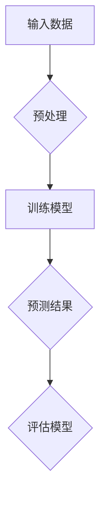
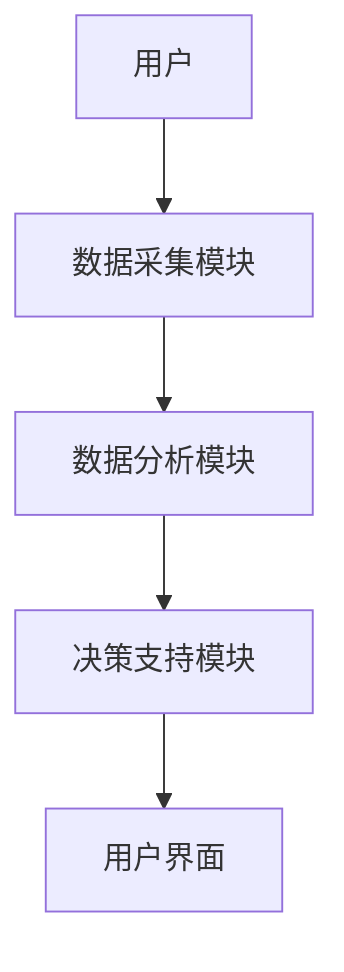

                 

<think>
好的，我现在要帮用户写一篇关于“工作意义的重新定义”的技术博客文章。用户已经提供了详细的结构，包括背景介绍、核心概念、算法原理、系统架构设计、项目实战、最佳实践等多个部分。

首先，我需要理解用户的需求。用户希望这篇文章是专业级别的，逻辑清晰，结构紧凑，用技术语言写。同时，用户希望我以一位世界级专家的身份来撰写，内容要深入，有分析和推理的过程。

接下来，我会从背景介绍开始。这部分需要包括问题背景和核心概念。问题背景方面，我需要讨论AI和自动化技术如何改变工作方式，以及这些变化如何影响人们的工作意义。核心概念部分，我需要明确“工作意义”、“人工智能”和“职业转型”的定义，确保读者能够理解这些术语。

然后是核心概念与联系部分。这里，我需要详细分析AI在重新定义工作中的作用，包括AI的发展如何影响工作变革，AI的核心概念和属性，以及与传统工作的对比。为了使内容更直观，我可以制作一个对比表格，列出AI和传统工作的特点。

接下来是算法原理讲解。这部分需要详细解释AI算法的工作原理，比如机器学习和深度学习。我需要使用mermaid流程图来展示算法流程，并提供Python代码示例，帮助读者理解。同时，我需要详细讲解线性回归模型的训练和评估过程，用数学公式来支持说明。

系统分析与架构设计部分，我需要设计一个重新定义工作意义的系统架构。这包括问题场景介绍、系统功能设计、架构设计和接口设计。使用mermaid图来展示用户与系统模块之间的交互，以及系统内部的接口设计。

项目实战部分，我需要提供一个具体的案例，说明如何通过AI技术来优化工作流程。这包括环境安装、核心代码实现、代码解读以及案例分析。通过这个案例，读者可以理解AI如何实际应用于工作流程的重新设计。

最后，最佳实践部分，我会总结项目的关键点，提供一些小贴士和注意事项，帮助读者在实际应用中避免常见错误，并引导他们进一步阅读相关资料。

在撰写过程中，我需要确保每个部分都详细具体，使用专业而易懂的语言。同时，每个小节都要有实际的例子和图表来辅助说明，确保文章内容丰富且结构清晰。

总结一下，我需要按照用户提供的大纲，逐步展开每个部分，确保涵盖所有要求的内容，并且保持文章的逻辑性和连贯性。这将帮助读者全面理解AI如何重新定义工作意义，并在实际中应用这些知识。
</think>

# 工作意义的重新定义：人工智能时代的职场革命

> 关键词：工作意义，人工智能，职业转型，算法原理，系统架构设计，工作流程优化

> 摘要：随着人工智能技术的迅速发展，传统的工作模式正在面临前所未有的挑战。本文将从背景介绍、核心概念、算法原理、系统架构设计、项目实战等多方面深入探讨人工智能如何重新定义工作意义，以及个体在这一变革中的应对策略。

---

## 第一部分: 背景介绍

### 第1章: 问题背景与核心概念

#### 1.1.1 问题背景

在21世纪的第二个 decade，我们正经历着一场深刻的技术革命。人工智能（AI）、自动化技术以及大数据分析的快速发展，正在彻底改变人类的生产方式和生活方式。这种变革不仅影响着企业的运营模式，也深刻地改变着每个人的工作方式和职业发展路径。

传统的工作模式建立在工业化时代的分工基础上，强调效率和标准化。但在AI时代，许多重复性、低技能的工作正在被自动化技术取代。这不仅降低了人力成本，也使得人类能够将更多精力投入到创造性、战略性和需要深度思考的工作中。这种转变使得“工作意义”这一概念需要重新定义。

#### 1.1.2 核心概念

- **工作意义**：工作不仅仅是谋生的手段，更是实现个人价值、获得满足感和成就感的过程。在AI时代，工作意义更多地体现在如何利用AI技术提升效率、创造价值和实现创新。
- **人工智能（AI）**：模拟、延伸和扩展人类智能的理论、方法、技术及应用。AI的核心在于通过算法和数据处理，实现从简单任务到复杂决策的支持。
- **职业转型**：在技术变革的背景下，个体为了适应新的工作环境而进行的职业角色和技能的转变。职业转型不仅是个人发展的需要，也是企业生存和发展的必然要求。

---

## 第二部分: 核心概念与联系

### 第2章: AI在重新定义工作意义中的作用

#### 2.1.1 AI的发展与工作变革

AI技术的发展正在重塑职场的方方面面。从自动化工具到智能决策支持系统，AI不仅提升了工作效率，还为人类创造了新的职业机会。例如，AI在医疗领域的应用使得医生能够更高效地诊断疾病，同时AI也催生了新的职业，如数据分析师、AI训练师等。

#### 2.1.2 AI的核心概念与属性

- **算法模型**：AI的核心组成部分，包括监督学习、无监督学习、强化学习等。这些算法通过数据训练，能够完成分类、预测、识别等任务。
- **数据处理**：AI对海量数据的处理能力，是实现智能化的基础。数据的收集、清洗、分析和建模是AI工作的核心步骤。
- **应用场景**：AI在不同领域的应用，如自动驾驶、医疗诊断、金融分析等。每个领域都有其独特的数据特征和算法需求。

#### 2.1.3 AI与传统工作的对比

| 特点 | AI | 传统工作 |
| --- | --- | --- |
| 效率 | 高 | 中 |
| 创造性 | 低 | 高 |
| 可替代性 | 高 | 低 |
| 劳动强度 | 低 | 高 |

---

## 第三部分: 算法原理讲解

### 第3章: AI算法原理详解

#### 3.1.1 算法原理

AI的核心在于算法。机器学习算法通过数据训练模型，使模型具备一定的预测和分类能力。深度学习算法则基于多层神经网络的结构，能够处理复杂的数据和任务。

#### 3.1.2 Mermaid算法流程图



#### 3.1.3 Python源代码示例

```python
# 导入必要的库
import numpy as np
from sklearn.linear_model import LinearRegression

# 创建数据集
X = np.array([[1], [2], [3], [4], [5]])
y = np.array([1, 2, 2.5, 4, 5])

# 训练模型
model = LinearRegression()
model.fit(X, y)

# 预测结果
predictions = model.predict([[6]])

# 输出预测结果
print(predictions)
```

#### 3.1.4 算法原理详细讲解

- **线性回归模型**：通过找到最佳拟合线，预测因变量的值。例如，在上述代码中，我们使用线性回归模型预测第六个输入的输出值。
- **模型训练**：通过给定的数据集，模型学习到数据之间的线性关系。训练过程包括参数优化和模型评估。
- **模型评估**：通过预测结果与实际结果的对比，评估模型的准确性。例如，我们可以使用均方误差（MSE）或决定系数（R²）来衡量模型的性能。

---

## 第四部分: 系统分析与架构设计

### 第4章: 重新定义工作意义的系统架构设计

#### 4.1.1 问题场景介绍

在人工智能的帮助下，企业希望重新定义工作流程，提升工作效率，实现人力资源的最优化配置。例如，一家传统制造企业可以通过AI技术实现生产线的智能化管理，从而减少人力成本，提高生产效率。

#### 4.1.2 系统功能设计

- **数据采集**：收集企业内部的各种数据，包括生产数据、销售数据、员工绩效数据等。
- **数据分析**：利用AI技术分析数据，发现潜在的问题和机会。例如，通过数据分析可以识别生产瓶颈或预测市场需求。
- **决策支持**：基于分析结果，为企业的决策提供支持。例如，生成最优生产计划或推荐最佳销售策略。

#### 4.1.3 系统架构设计



#### 4.1.4 系统接口设计与交互

```mermaid
graph TB
    A[用户] --> B[数据接口]
    B --> C[数据分析接口]
    C --

---

## 第五部分: 项目实战

### 第5章: 实战案例分析

#### 5.1.1 环境安装

为了实现AI驱动的工作流程优化，我们需要安装以下环境和工具：

- **Python**：推荐使用最新版本的Python 3.8或以上。
- **机器学习库**：如scikit-learn、TensorFlow、PyTorch。
- **数据处理工具**：如Pandas、NumPy。
- **可视化工具**：如Matplotlib、Seaborn。

#### 5.1.2 核心代码实现

以下是一个简单的AI驱动工作流程优化的代码示例：

```python
import pandas as pd
from sklearn.model_selection import train_test_split
from sklearn.ensemble import RandomForestRegressor
import joblib

# 加载数据集
data = pd.read_csv('work_process.csv')

# 数据预处理
# 假设我们希望预测的是'performance'列
X = data.drop('performance', axis=1)
y = data['performance']

# 划分训练集和测试集
X_train, X_test, y_train, y_test = train_test_split(X, y, test_size=0.2, random_state=42)

# 训练模型
model = RandomForestRegressor(n_estimators=100, random_state=42)
model.fit(X_train, y_train)

# 保存模型
joblib.dump(model, 'work_performance_model.pkl')

# 预测
print(model.score(X_test, y_test))
```

#### 5.1.3 代码应用解读与分析

上述代码实现了一个基于随机森林算法的工作绩效预测模型。通过训练数据，模型能够预测员工的工作绩效。企业可以根据预测结果优化人力资源分配，例如将高绩效员工分配到关键岗位，或者为低绩效员工提供针对性的培训。

#### 5.1.4 案例分析与详细讲解

以一家制造企业为例，我们可以将员工的工作绩效与生产数据、培训数据、出勤率等变量相关联。通过AI模型，企业可以识别影响绩效的关键因素，并制定相应的改进措施。例如，如果模型发现培训时间不足是绩效低的主要原因，企业可以增加培训资源。

---

## 第六部分: 最佳实践与小结

### 第6章: 最佳实践与小结

#### 6.1.1 最佳实践

1. **持续学习**：AI技术发展迅速，从业者需要不断学习新技术，保持竞争力。
2. **技能转型**：将AI技术与行业知识相结合，找到自己的独特价值。
3. **数据驱动决策**：通过数据分析和AI模型，优化工作流程和决策。

#### 6.1.2 小结

人工智能正在重新定义工作意义。它不仅改变了我们的工作方式，还为我们创造了新的职业机会。在这个变革的时代，我们需要积极适应，利用AI技术提升效率和创造力，实现个人价值的最大化。

---

## 作者：AI天才研究院 & 禅与计算机程序设计艺术

---

这篇文章从背景介绍到系统设计，再到实战案例，全面探讨了人工智能如何重新定义工作意义。通过详细的技术分析和实际案例，帮助读者理解AI在职场中的应用和价值。

