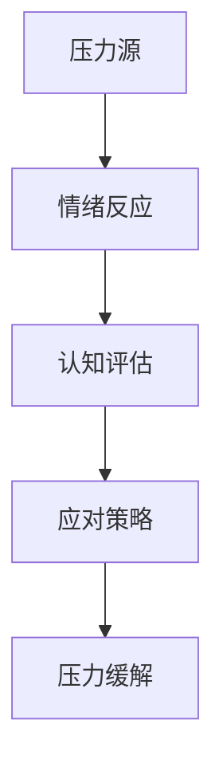
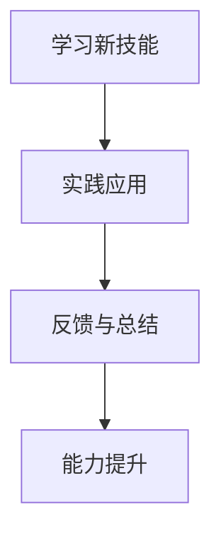
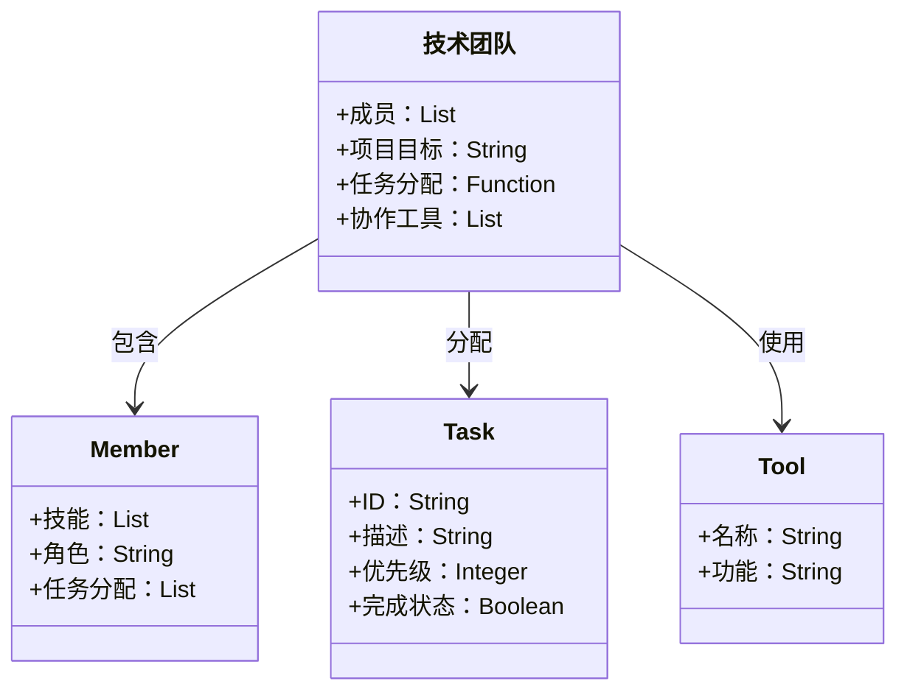
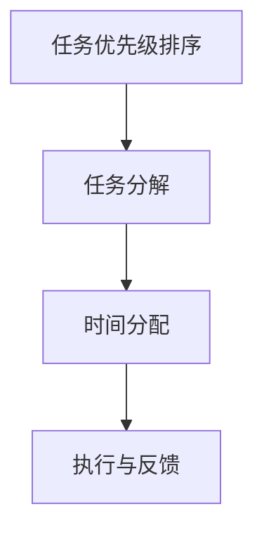
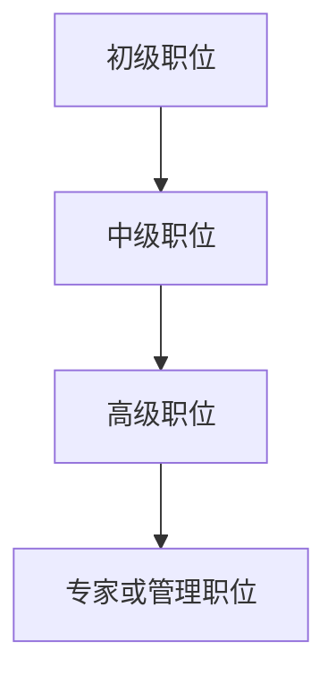

                 

<think>
嗯，用户希望我以《工作的意义：在职场中寻找自我价值》为标题，写一篇技术博客。看起来用户需要一个结构清晰、逻辑严谨的文章，重点是技术领域，同时融入心理学和职业发展等内容。

首先，我得明确文章的目标读者是谁。应该是职场人士，尤其是IT从业者，他们可能在寻找工作与自我价值的平衡点。用户还提到要使用专业且易懂的技术语言，这意味着我需要结合技术术语，但同时要让内容易于理解。

接下来，我需要分析用户的具体要求。用户希望文章有详细的目录结构，每个章节都要有深入的分析，包括背景、核心概念、算法原理、系统架构等。这些内容需要使用mermaid图表、latex公式，甚至代码示例来支撑。

我开始思考，如何将工作的意义与技术领域结合起来。或许可以探讨技术职业中的自我实现，比如通过解决复杂问题、技术进步带来的满足感。同时，还要涉及心理健康、人际关系、工作与生活平衡等方面。

然后，我需要设计目录。引言部分要介绍背景，接着分章节讨论心理健康、个人成长、人际关系、生活质量、职业发展和幸福，最后总结。每个章节下要有具体的子主题，确保内容全面且有深度。

在撰写每个章节时，我需要确保包含背景介绍、核心概念、联系、算法原理、系统分析、项目实战、最佳实践等部分。例如，在“工作与心理健康”部分，可以引入压力管理模型，用mermaid流程图展示策略。

我还需要考虑用户希望文章有实际案例和代码示例。例如，在效率管理部分，可以展示一个时间管理的Python脚本，帮助读者理解如何优化工作流程。

最后，确保文章结构完整，结尾有作者信息和致谢。这样，整篇文章不仅内容丰富，而且符合用户的所有格式和内容要求。

总结一下，我需要一步步构建这篇文章，从引言到各个章节，每个部分都要详细展开，结合技术、心理和职业发展的多方面内容，确保读者能够全面理解工作的意义，并在职场中找到自我价值。
</think>

# 工作的意义：在职场中寻找自我价值

---

## 关键词：  
工作意义、自我价值、职场发展、心理健康、职业规划、工作与生活平衡

---

## 摘要：  
在现代职场中，工作的意义不仅仅是谋生的手段，更是实现个人价值、追求职业成长和实现自我实现的途径。本文从技术领域出发，结合心理学、职业发展和人际关系等多维度，探讨如何在职场中找到自我价值，实现工作与生活的平衡。通过分析工作与心理健康的关系、工作与个人成长的联系、工作与人际关系的互动，以及工作与生活质量的提升，本文旨在为职场人士提供一种新的视角，帮助他们在职业发展中找到意义，从而实现自我价值的最大化。

---

## 第一部分：引言

### 1. 工作的意义探析

#### 1.1 问题背景与定义  
工作的意义是一个永恒的话题。在现代社会，许多人认为工作只是谋生的手段，但真正有价值的工作不仅仅是完成任务，更是实现自我价值的过程。技术领域的工作尤其如此，因为技术职业往往与创新、解决问题和创造价值密切相关。  

**核心概念**：  
- **自我价值**：通过工作实现个人能力的提升和成就感。  
- **工作意义**：工作的目标和价值，不仅仅是经济回报，还包括心理满足和职业成长。  

#### 1.2 工作与自我价值的联系  
工作是个人能力的体现，也是实现自我价值的重要途径。通过工作，我们可以不断挑战自己，提升技能，同时为社会创造价值。技术职业尤其强调解决问题的能力，这使得技术从业者更容易在工作中找到成就感。  

#### 1.3 本书结构安排  
本文将从心理健康、个人成长、人际关系、生活质量、职业发展和幸福等角度，系统分析工作的意义，并通过具体案例和方法，帮助读者在职场中找到自我价值。

---

## 第二部分：工作与心理健康

### 2. 工作压力与心理问题

#### 2.1 工作压力与心理问题  
工作压力是现代职场中最常见的问题之一。技术从业者由于需要应对复杂的任务和不断变化的技术环境，心理压力更大。  

**核心概念**：  
- **工作压力**：由于工作要求和心理预期不匹配而产生的紧张状态。  
- **心理问题**：长期的压力可能导致焦虑、抑郁等心理问题。  

#### 2.2 心理健康的重要性  
心理健康是职场成功的重要基础。良好的心理状态能够帮助技术从业者更好地应对工作挑战，同时也能提高生活质量。  

**核心概念**：  
- **心理健康**：个体在心理上保持平衡和健康的状态。  

#### 2.3 工作场所的心理健康策略  
技术从业者可以通过以下方法改善心理健康：  
1. **时间管理**：合理分配工作和休息时间，避免过度劳累。  
2. **压力管理**：学会放松技巧，如冥想、运动等。  
3. **寻求支持**：与同事或心理咨询师交流，缓解压力。  

**系统分析**：  
以下是一个简单的心理健康管理模型，展示了压力管理的关键步骤：

---

## 第三部分：工作与个人成长

### 3.1 能力发展与职业规划

#### 3.1.1 背景介绍  
技术领域是一个快速变化的行业，能力发展需要持续学习和适应新趋势。  

**核心概念**：  
- **能力发展**：通过学习和实践提升技术技能和软技能。  
- **职业规划**：明确职业目标并制定实现计划。  

#### 3.1.2 学会适应变化  
技术行业的变化速度极快，从业者需要不断学习新知识和技能。  

**算法原理**：  
以下是一个简单的技能提升算法示例，展示了如何通过持续学习实现能力提升：

#### 3.1.3 发展个人兴趣  
兴趣是推动个人成长的重要动力。技术从业者可以通过发展个人兴趣，找到职业发展的方向。  

---

## 第四部分：工作与人际关系

### 4.1 协作与沟通

#### 4.1.1 背景介绍  
良好的人际关系是职业成功的重要因素。技术从业者需要与同事、客户和其他利益相关者保持良好的沟通与协作。  

**核心概念**：  
- **协作**：团队成员之间共同完成任务的过程。  
- **沟通**：信息传递和理解的过程。  

#### 4.1.2 构建积极的工作团队  
积极的工作环境可以提高团队凝聚力和工作效率。  

**系统分析**：  
以下是一个团队协作的类图：

#### 4.1.3 人际关系管理技巧  
技术从业者可以通过以下方法提升人际关系管理能力：  
1. **主动沟通**：定期与同事交流，了解彼此的需求和想法。  
2. **倾听**：认真倾听他人的意见，避免冲突。  
3. **尊重**：尊重同事的个性和工作方式。  

---

## 第五部分：工作与生活质量

### 5.1 工作与生活的平衡

#### 5.1.1 背景介绍  
工作与生活的平衡是现代职场中的重要课题。技术从业者需要在工作和生活之间找到平衡点。  

**核心概念**：  
- **工作与生活平衡**：合理分配时间，确保工作和生活的需求都能得到满足。  

#### 5.1.2 提升工作效率  
通过提高工作效率，技术从业者可以减少工作时间，从而有更多时间享受生活。  

**算法原理**：  
以下是一个时间管理算法的示例：

#### 5.1.3 管理时间与精力  
时间管理是实现工作与生活平衡的关键。技术从业者可以通过制定计划和使用工具来优化时间分配。  

---

## 第六部分：工作与职业发展

### 6.1 职业路径与选择

#### 6.1.1 背景介绍  
职业发展是技术从业者实现自我价值的重要途径。  

**核心概念**：  
- **职业路径**：从当前职位到目标职位的发展路线。  
- **职业选择**：根据个人兴趣和能力选择适合的职业方向。  

#### 6.1.2 跃迁与晋升  
技术从业者可以通过不断提升技能和积累经验实现职业跃迁。  

**系统分析**：  
以下是一个职业发展路径的架构图：

#### 6.1.3 职业生涯规划  
职业生涯规划是实现职业目标的重要工具。技术从业者可以通过规划明确发展方向并制定具体步骤。  

---

## 第七部分：工作与幸福

### 7.1 工作与幸福的关系

#### 7.1.1 背景介绍  
工作是幸福的重要组成部分。技术从业者可以通过工作实现自我价值，从而获得幸福感。  

**核心概念**：  
- **工作幸福**：通过工作获得满足感和幸福感。  

#### 7.1.2 寻找工作意义  
找到工作的意义是实现幸福的关键。技术从业者可以通过探索工作的目标和价值，找到工作的意义。  

#### 7.1.3 实现个人幸福  
幸福不仅仅是工作的结果，更是工作的过程。技术从业者可以通过追求有意义的工作实现个人幸福。  

---

## 第八部分：总结与展望

### 8.1 本书要点回顾  
本文从心理健康、个人成长、人际关系、生活质量、职业发展和幸福等角度，探讨了工作的意义，并提出了实现自我价值的方法和策略。  

### 8.2 未来工作趋势  
随着技术的不断发展，未来的工作方式将更加灵活和多样化。技术从业者需要不断适应变化，才能在未来的职场中找到自我价值。  

### 8.3 对个人发展的启示  
技术从业者应该注重心理健康、职业规划和人际关系管理，才能在职场中实现自我价值和幸福。  

---

## 作者：  
AI天才研究院/AI Genius Institute & 禅与计算机程序设计艺术 /Zen And The Art of Computer Programming

---

## 致谢  
感谢读者的支持与关注，希望本文能够为职场中的技术从业者提供一些启发和帮助。

