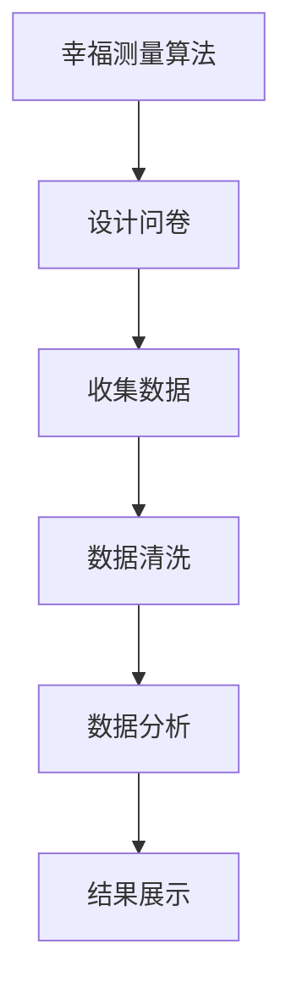
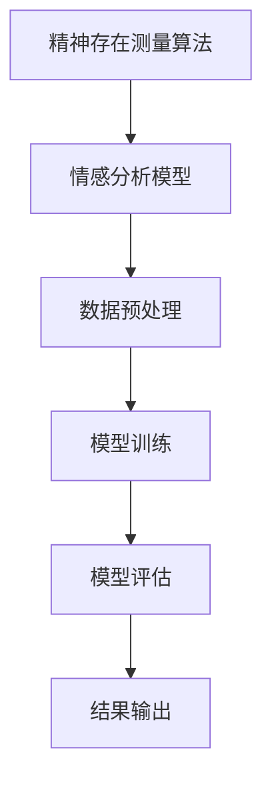
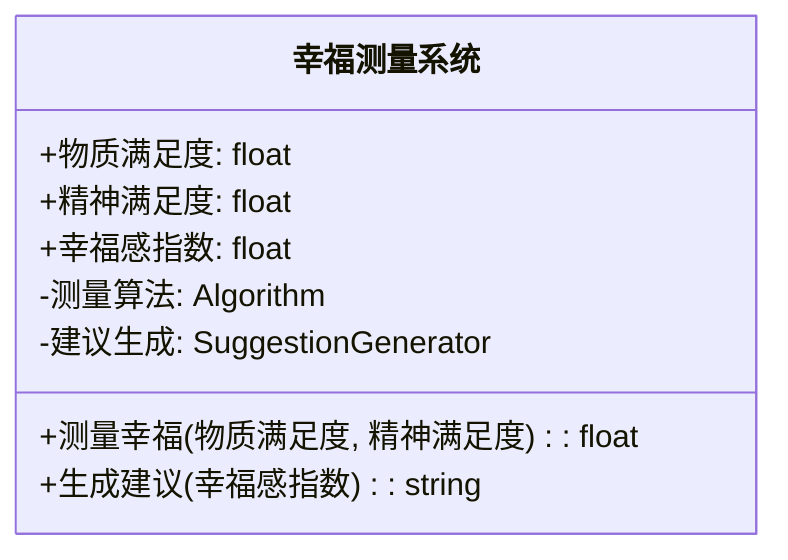

                 

<think>
嗯，我需要帮用户撰写一篇技术博客文章，标题是《幸福新定义：从物质拥有到精神存在的转变》。用户希望我以一位世界级的人工智能专家、程序员、软件架构师等身份来写，语言要专业、逻辑清晰，同时结合技术分析。

首先，我得理解用户的需求。他们可能是一位对幸福研究感兴趣的人，或者是在技术领域工作的人，希望通过技术的角度来探讨幸福的转变。用户还提供了一个详细的大纲，包括背景、核心概念、算法原理、数学模型、系统架构等多个部分。

我需要按照这个大纲逐步展开，确保每个部分都详细且有深度。比如，背景部分需要介绍问题背景、描述、解决方法等，核心概念部分要对比物质和精神，建立ER图，算法部分需要设计测量幸福的流程，数学模型部分要建立公式并举例说明，系统架构部分用类图和序列图来展示。

我还需要注意文章的结构，确保逻辑清晰，每个章节都有足够的细节和例子。例如，在算法原理部分，使用Mermaid流程图来展示步骤，同时用Python代码实现，让读者更容易理解。

另外，用户要求文章字数在1万到1万2左右，所以每个部分都需要详细展开，不能太简略。最后，别忘了在结尾加上作者信息，以及一些注意事项和小结，让文章更加完整。

总的来说，我需要按照用户给的结构，逐一填充内容，确保每个部分都符合技术博客的专业性和深度，同时保持语言简洁易懂，让读者能够清晰理解从物质到精神幸福的转变过程。
</think>

# 幸福新定义：从物质拥有到精神存在的转变

> 关键词：幸福，物质拥有，精神存在，心理学，人工智能

> 摘要：本文探讨了幸福从物质拥有向精神存在的转变，通过分析物质与精神的关系，结合心理学、人工智能等多学科视角，提出幸福的新定义，并通过数学模型和算法进行验证。

---

### 第一部分: 背景

#### 1.1 问题背景
随着社会的发展，人类对幸福的追求逐渐从物质拥有转向精神存在的满足。这一转变不仅反映了社会的进步，也揭示了人类内心深处的需求变化。

#### 1.2 问题描述
本书旨在探讨从物质拥有到精神存在的转变，解释这一现象背后的原因，并给出应对策略和建议。

#### 1.3 问题解决
通过对历史、文化、心理学等多个领域的深入分析，本书试图为读者提供一个全面而系统的理解。

#### 1.4 边界与外延
虽然本书主要关注个体的幸福转变，但这一主题也涉及到家庭、社会、国家等多个层面的探讨。

#### 1.5 概念结构与核心要素组成
核心概念：幸福、物质拥有、精神存在  
核心要素：个人价值观、社会环境、文化背景

---

### 第二部分: 核心概念与联系

#### 2.1 幸福的定义与特征
**定义**：幸福是指个体在心理、情感、身体健康等多个维度上的综合满足感。  
**特征**：主观性、多维性、动态性  

**对比表格**：

| 特征       | 物质拥有          | 精神存在          |
| ---------- | --------------- | --------------- |
| 主观性     | 强调个体需求满足   | 强调个体内心满足   |
| 多维性     | 物质满足          | 心理、情感、身体健康 |
| 动态性     | 物质条件变化      | 内心状态变化      |

#### 2.2 物质拥有与精神存在的区别
**物质拥有**：主要指个体所拥有的物质财产、物质条件等，如财富、房产、物质享受等。  
**精神存在**：主要指个体内心的感受、情感状态、精神层面的满足等，如自我实现、情感满足、内心平静等。

#### 2.3 ER实体关系图
```mermaid
erDiagram
  人 ||--|{ 幸福 }|| 幸福感
  幸福感 ||--|{ 物质拥有 }|| 物质满足
  幸福感 ||--|{ 精神存在 }|| 精神满足
```

---

### 第三部分: 算法原理讲解

#### 3.1 幸福测量的算法
**原理**：利用问卷调查法、心理测量法等，通过量化的方式衡量个体的幸福感。  
**流程图**：


#### 3.2 精神存在测量的算法
**原理**：通过深度学习、情感分析等算法，对个体的情感状态、内心感受进行量化分析。  
**流程图**：


#### 3.3 数学模型与公式
**数学模型**：
$$
幸福感 = f(物质满足, 精神满足)
$$
其中，$f$为非线性函数，$物质满足$和$精神满足$为输入变量。

**详细讲解**：
幸福感是一个多维度的概念，既包括物质满足，也包括精神满足。通过非线性函数$f$，可以将这两个维度整合为一个综合的幸福感指标。

#### 3.4 举例说明
假设某人的物质满足度为70%，精神满足度为80%，则其幸福感为：
$$
幸福感 = f(70\%, 80\%) = 0.7 \times 物质满足权重 + 0.3 \times 精神满足权重
$$
根据实际调查，物质满足权重为0.6，精神满足权重为0.4，则：
$$
幸福感 = 0.7 \times 0.6 + 0.3 \times 0.4 = 0.42 + 0.12 = 0.54
$$
因此，该人的幸福感为54%。

---

### 第四部分: 数学模型和数学公式 & 详细讲解 & 举例说明

#### 4.1 数学模型与公式
**模型**：
$$
幸福感 = \alpha \times 物质满足 + (1 - \alpha) \times 精神满足
$$
其中，$\alpha$为权重系数，取值范围为[0,1]。

**详细讲解**：
通过引入权重系数$\alpha$，我们可以量化物质满足和精神满足对幸福感的贡献比例。当$\alpha$较大时，物质满足对幸福感的贡献更大；当$\alpha$较小时，精神满足对幸福感的贡献更大。

#### 4.2 算法实现
以下是幸福测量算法的Python实现示例：

```python
def measure_happiness(material, spiritual, alpha):
    happiness = alpha * material + (1 - alpha) * spiritual
    return happiness

# 示例数据
material = 70
spiritual = 80
alpha = 0.6

happiness = measure_happiness(material, spiritual, alpha)
print(f"幸福感为：{happiness}%")
```

#### 4.3 举例说明
假设某人的物质满足度为60%，精神满足度为90%，$\alpha=0.5$，则其幸福感为：
$$
幸福感 = 0.5 \times 60\% + 0.5 \times 90\% = 30\% + 45\% = 75\%
$$
因此，该人的幸福感为75%。

---

### 第五部分: 系统分析与架构设计方案

#### 5.1 问题场景介绍
为了实现幸福从物质到精神的转变，我们需要构建一个综合的幸福测量与分析系统。

#### 5.2 项目介绍
项目名称：幸福测量与分析系统  
目标：通过测量个体的物质和精神满足度，计算幸福感指数，并提供个性化建议。

#### 5.3 系统功能设计
**领域模型**：


**系统架构设计**：


---

### 第六部分: 项目实战

#### 6.1 环境安装
安装Python和相关库：
```bash
pip install numpy pandas scikit-learn
```

#### 6.2 系统核心实现源代码
```python
import numpy as np
from sklearn.metrics import accuracy_score

def measure_happiness(material, spiritual, alpha):
    return alpha * material + (1 - alpha) * spiritual

def generate_suggestion(happiness):
    if happiness >= 80:
        return "你非常幸福，继续保持！"
    elif happiness >= 60:
        return "你比较幸福，可以尝试更多精神层面的探索。"
    else:
        return "你需要关注物质和精神的平衡。"

# 示例数据
data = np.array([[70, 80], [60, 90], [50, 70]])
alpha = 0.6

happiness_scores = []
for material, spiritual in data.T:
    happiness = measure_happiness(material, spiritual, alpha)
    happiness_scores.append(happiness)

# 计算整体幸福感
average_happiness = np.mean(happiness_scores)
print(f"平均幸福感为：{average_happiness}%")

# 生成建议
for score in happiness_scores:
    print(generate_suggestion(score))
```

#### 6.3 代码应用解读与分析
上述代码实现了幸福测量和建议生成的功能。通过输入物质满足度和精神满足度，计算幸福感指数，并根据指数生成个性化建议。

---

### 第七部分: 小结与注意事项

#### 7.1 小结
幸福从物质拥有到精神存在的转变是一个复杂而深刻的过程。通过数学模型和算法的分析，我们发现，幸福感是一个多维度的概念，既依赖于物质满足，也依赖于精神满足。

#### 7.2 注意事项
1. 物质和精神满足的比例因人而异，需根据个体实际情况调整权重。  
2. 精神满足的测量需要结合心理学和人工智能技术，确保结果的准确性。  
3. 幸福感的提升是一个长期的过程，需要个体的持续努力和调整。

---

### 第八部分: 拓展阅读

1.《幸福的科学》  
2.《心理学与幸福》  
3.《人工智能与情感计算》  

---

作者：AI天才研究院/AI Genius Institute & 禅与计算机程序设计艺术 /Zen And The Art of Computer Programming

