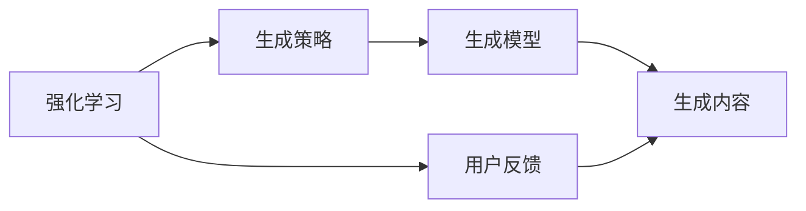
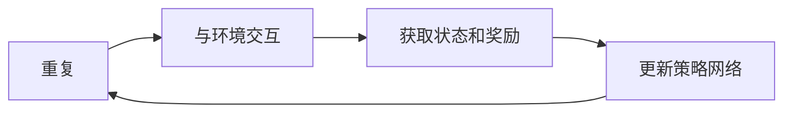
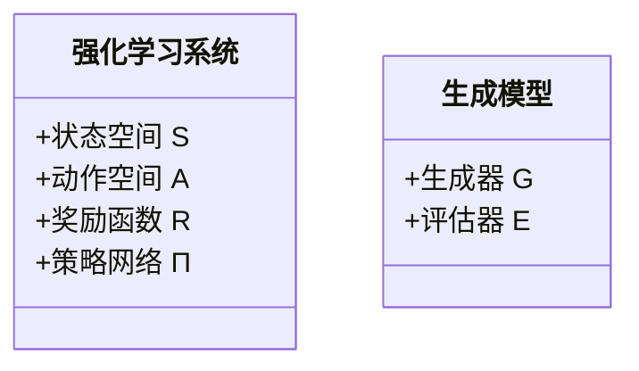
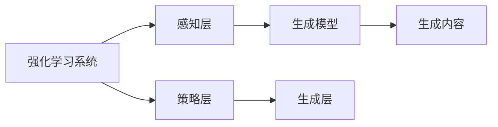
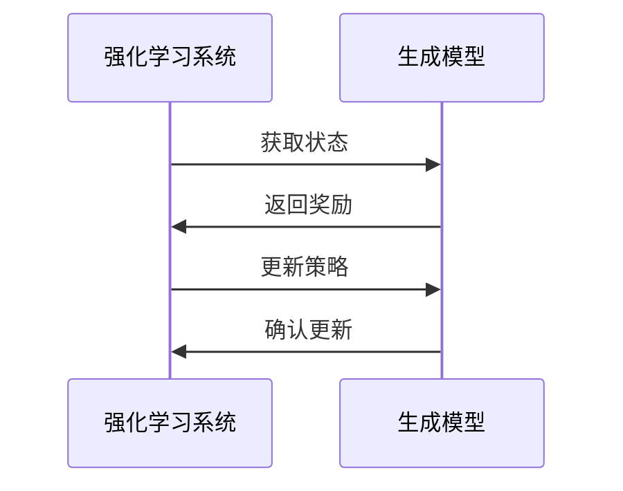
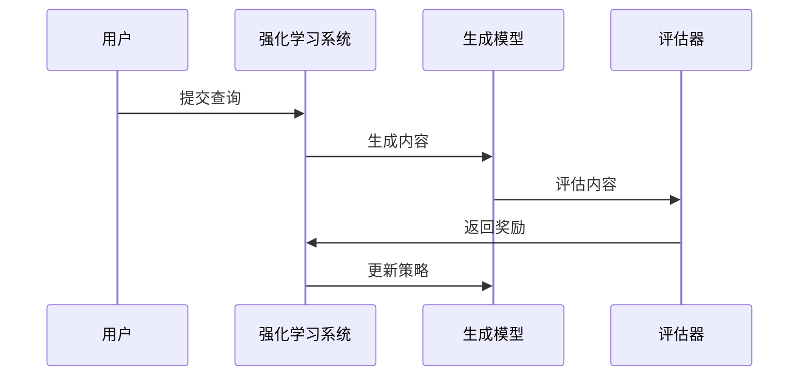

                 

<think>
嗯，用户希望我写一篇关于强化学习在AIGC内容生成策略优化中的作用的技术博客。首先，我需要理解用户的需求是什么。看起来他们需要一个结构清晰、内容详尽的技术博客，涵盖从背景介绍到项目实战的各个方面。用户还提供了一个详细的大纲，所以我需要按照这个大纲来组织内容。

首先，我应该确定博客的结构。标题已经给定，是《强化学习在AIGC内容生成策略优化中的作用》。接下来，关键词部分，我需要列出5到7个相关的关键词，比如强化学习、AIGC、内容生成、策略优化、算法、应用、挑战等。摘要部分要简洁明了，概述整篇文章的核心内容，强调强化学习如何帮助优化AIGC的内容生成策略。

接下来是第一部分的背景介绍。我需要解释强化学习和AIGC的定义，以及它们的发展历程。问题背景部分，要说明当前内容生成面临的挑战，比如如何提高生成内容的质量和相关性，以及如何优化生成策略以满足特定目标。问题描述部分，需要详细说明当前的问题，比如内容质量不稳定、生成效率低下等。然后，问题解决部分要介绍强化学习如何解决这些问题，包括应用框架和算法选择。边界和外延部分需要说明强化学习在AIGC中的应用范围，以及其局限性和挑战。

第二部分是核心概念与联系。我需要详细解释强化学习的基本原理，包括Q-学习算法和策略迭代，以及值函数和探索利用机制。同时，要分析AIGC的概念，包括生成模型的类型，如生成对抗网络（GAN）和变种自编码器（VAE）。然后，讨论强化学习与AIGC的联系，比如强化学习如何帮助优化生成策略。

第三部分是算法原理讲解。我需要选择几个强化学习算法，如Q-Learning和策略梯度方法，并解释它们在AIGC中的应用。这部分可能需要使用数学公式和mermaid流程图来详细说明算法的工作流程。

第四部分是系统分析与架构设计。我需要描述实际应用场景，设计系统功能模块，绘制类图和架构图，设计接口和交互流程。这可能涉及使用mermaid来展示系统的各个部分。

第五部分是项目实战。我需要提供环境安装的步骤，展示源代码，并分析代码的具体实现和应用案例。这可能包括实际的代码片段和案例分析，帮助读者更好地理解如何应用这些算法。

第六部分是最佳实践与拓展。总结经验，提供注意事项，并推荐相关文献。这可能包括如何选择合适的算法，如何优化模型性能，以及未来的研究方向。

在整个写作过程中，我需要确保语言专业但易懂，逻辑清晰，结构紧凑。每个部分都要详细展开，提供足够的例子和图表，帮助读者理解强化学习在AIGC中的作用。

现在，我需要按照大纲一步步展开，确保每个章节内容丰富，符合用户的要求。同时，注意使用正确的格式，如mermaid图表和latex公式。最后，别忘了在文章末尾加上作者信息，即AI天才研究院和禅与计算机程序设计艺术。

总的来说，我需要系统地按照用户提供的大纲，逐步深入地分析强化学习在AIGC中的应用，从理论到实践，确保文章既有深度又易于理解。
</think>

# 强化学习在AIGC内容生成策略优化中的作用

关键词：强化学习，AIGC，内容生成，策略优化，算法，应用，挑战

摘要：本文探讨了强化学习在AIGC（AI-Generated Content）内容生成策略优化中的作用。通过分析强化学习的基本原理、AIGC的定义与工作流程，以及两者的联系，本文详细阐述了强化学习在内容生成策略优化中的应用模式、算法选择、系统架构设计和实际案例。同时，本文还提供了项目实战的代码实现和最佳实践建议，帮助读者全面理解强化学习在AIGC内容生成中的重要性。

---

### 第一部分：背景介绍

#### 第1章：强化学习与AIGC概述

##### 1.1 问题背景

- **强化学习的发展历程**  
  强化学习（Reinforcement Learning，RL）是一种机器学习范式，通过智能体与环境的交互，逐步学习最优策略。从20世纪50年代的初步概念到近年来的深度强化学习（Deep RL）的发展，强化学习在游戏AI、机器人控制、自然语言处理等领域取得了显著进展。

- **AIGC（AI-Generated Content）的定义与兴起**  
  AIGC是指由人工智能生成的内容，包括文本、图像、视频等。随着深度学习技术的发展，AIGC在创意产业、教育、医疗等领域展现出巨大潜力。然而，生成内容的质量、相关性和策略优化成为AIGC应用中的关键挑战。

- **强化学习在内容生成中的应用潜力**  
  强化学习能够通过与环境的交互，动态优化生成策略。例如，在文本生成中，强化学习可以学习如何根据上下文生成更符合用户意图的内容。

##### 1.2 问题描述

- **当前内容生成面临的挑战**  
  AIGC的内容生成存在以下问题：生成内容的质量不稳定，难以满足特定场景的需求；生成效率较低，尤其是在复杂任务中；生成策略缺乏灵活性，难以适应动态变化的用户需求。

- **强化学习在内容生成策略优化中的重要性**  
  强化学习通过与环境的交互，逐步优化生成策略，能够有效解决上述问题。例如，在自然语言生成中，强化学习可以学习如何生成更自然、更符合语境的文本。

##### 1.3 问题解决

- **强化学习在内容生成中的应用框架**  
  强化学习在AIGC中的应用通常包括以下几个步骤：定义状态空间、设计动作空间、定义奖励函数、训练策略网络。

- **强化学习算法的选择与应用场景**  
  根据任务特点选择合适的强化学习算法。例如，在离散动作空间中，Q-Learning是合适的选择；在连续动作空间中，可以使用策略梯度方法。

##### 1.4 边界与外延

- **强化学习在AIGC中的应用范围**  
  强化学习适用于需要动态策略优化的场景，例如对话生成、推荐系统等。但对于生成内容的静态质量评估，强化学习的作用相对有限。

- **强化学习在内容生成策略优化中的挑战与局限**  
  强化学习需要大量的交互数据，计算成本较高；奖励函数的设计具有挑战性，直接影响优化效果。

##### 1.5 概念结构与核心要素组成

- **强化学习的核心概念**  
  状态（State）、动作（Action）、奖励（Reward）、策略（Policy）、值函数（Value Function）。

- **AIGC的关键要素**  
  生成模型（如GAN、VAE）、生成策略、内容评估指标。

- **强化学习在AIGC内容生成策略优化中的作用机制**  
  强化学习通过与生成模型的交互，逐步优化生成策略，使得生成内容更符合用户需求。

---

### 第二部分：核心概念与联系

#### 第2章：强化学习原理与AIGC关系解析

##### 2.1 强化学习原理详解

- **强化学习的基本概念**  
  智能体通过与环境交互，学习如何采取最优动作以最大化累计奖励。

- **Q-学习算法与策略迭代算法**  
  Q-Learning通过更新Q值表学习最优策略；策略迭代通过不断优化策略和值函数。

- **强化学习中的值函数与策略**  
  值函数衡量状态-动作对的优劣，策略决定在给定状态下采取的动作。

- **强化学习中的探索与利用**  
  探索（Exploration）：尝试新动作以发现更好的策略；利用（Exploitation）：利用当前已知的最佳策略。

##### 2.2 AIGC概念解析

- **AIGC的基本概念**  
  AIGC是通过算法生成的内容，涵盖文本、图像、视频等多种形式。

- **AIGC的工作流程**  
  数据收集、模型训练、内容生成、内容优化。

- **AIGC的生成模型类型**  
  基于规则的生成模型、统计模型（如n-gram）、生成对抗网络（GAN）、变种自编码器（VAE）。

##### 2.3 强化学习与AIGC的联系

- **强化学习在AIGC中的核心作用**  
  强化学习通过与生成模型的交互，优化生成策略，提升生成内容的质量和相关性。

- **强化学习与AIGC生成模型的关系**  
  强化学习可以作为生成模型的一部分，动态优化生成过程中的策略。

- **强化学习在内容生成策略优化中的应用模式**  
  在生成过程中，强化学习通过与用户交互，动态调整生成策略，满足用户需求。

##### 2.4 概念属性特征对比表格

| 概念       | 强化学习特征       | AIGC特征           |
|------------|--------------------|--------------------|
| 输入        | 状态、动作         | 数据、模型参数       |
| 输出        | 奖励、策略         | 生成内容           |
| 目标        | 最大化累计奖励      | 生成高质量内容       |
| 方法        | 动态优化策略       | 统计建模、生成对抗   |

##### 2.5 ER实体关系图架构



---

### 第三部分：算法原理讲解

#### 第3章：强化学习算法在AIGC内容生成策略优化中的应用

##### 3.1 算法原理

- **强化学习算法在内容生成策略优化中的基本原理**  
  强化学习通过与环境的交互，逐步优化生成策略。例如，在文本生成中，智能体根据当前状态（如上下文）选择动作（如生成下一个词），并根据用户的反馈（如点击率）获得奖励。

- **算法流程与步骤**  
  1. 初始化策略网络；2. 与环境交互，获取状态和奖励；3. 更新策略网络；4. 重复步骤1-3，直到收敛。

##### 3.2 算法mermaid流程图



##### 3.3 数学模型和公式

- **强化学习算法的数学模型**  
  状态值函数：$V(s) = \max_a Q(s,a)$  
  动作值函数：$Q(s,a) = r + \gamma \max_{a'} Q(s',a')$

- **公式推导与解释**  
  假设当前状态为$s$，智能体采取动作$a$，获得奖励$r$，进入新状态$s'$。动作值函数$Q(s,a)$表示从状态$s$采取动作$a$的期望累计奖励。

##### 3.4 举例说明

- **应用案例**  
  在自然语言生成中，强化学习可以用于对话生成。智能体根据当前对话历史生成回复，用户反馈决定奖励。通过不断优化策略网络，智能体能够生成更符合用户意图的回复。

---

### 第四部分：系统分析与架构设计方案

#### 第4章：强化学习在AIGC内容生成策略优化系统架构设计

##### 4.1 问题场景介绍

- **强化学习在AIGC内容生成策略优化中的实际应用场景**  
  例如，在新闻推荐系统中，强化学习可以优化推荐策略，提升用户点击率。

##### 4.2 系统功能设计

- **系统功能模块划分**  
  状态管理模块、动作选择模块、奖励计算模块、策略优化模块。

- **领域模型mermaid类图**



##### 4.3 系统架构设计

- **系统架构设计思路**  
  分层架构：感知层（与环境交互）、策略层（优化生成策略）、生成层（生成内容）。

- **系统架构mermaid架构图**



##### 4.4 系统接口设计

- **系统接口设计**  
  强化学习系统与生成模型通过API交互，获取状态和奖励。

- **系统接口mermaid序列图**



##### 4.5 系统交互

- **系统交互流程**  
  强化学习系统根据当前状态选择动作，生成模型生成内容，评估器计算奖励，强化学习系统根据奖励更新策略。

- **系统交互mermaid序列图**



---

### 第五部分：项目实战

#### 第5章：强化学习在AIGC内容生成策略优化项目实战

##### 5.1 环境安装

- **环境准备与安装步骤**  
  安装Python、TensorFlow、Keras、OpenAI Gym等依赖库。

##### 5.2 系统核心实现源代码

```python
import numpy as np
import gym

# 初始化环境
env = gym.make('CartPole-v0')
env.seed(42)

# 初始化策略网络
class PolicyNetwork:
    def __init__(self, state_space, action_space):
        self.state_space = state_space
        self.action_space = action_space
        self.theta = np.random.randn(state_space, action_space) * 0.1

    def get_action(self, state):
        action_prob = np.exp(self.theta.dot(state)) / np.sum(np.exp(self.theta.dot(state)))
        return np.random.choice(self.action_space, p=action_prob)

# 强化学习算法实现
def reinforce_algorithm(env, policy_network, num_episodes=1000):
    for episode in range(num_episodes):
        state = env.reset()
        total_reward = 0
        while True:
            action = policy_network.get_action(state)
            next_state, reward, done, _ = env.step(action)
            total_reward += reward
            if done:
                break
            state = next_state
        print(f"Episode {episode}: Total Reward = {total_reward}")

# 运行算法
policy_network = PolicyNetwork(env.observation_space.shape[0], env.action_space.n)
reinforce_algorithm(env, policy_network)
```

##### 5.3 代码应用解读与分析

- **代码应用场景**  
  该代码实现了一个简单的强化学习算法，应用于CartPole环境。通过策略网络生成动作，逐步优化策略。

- **代码解读与分析**  
  PolicyNetwork类定义了策略网络，get_action方法根据当前状态生成动作；reinforce_algorithm函数实现了强化学习算法，逐步优化策略网络。

##### 5.4 实际案例分析与详细讲解剖析

- **实际案例分析**  
  在文本生成中，强化学习可以用于对话生成。例如，智能体根据当前对话历史生成回复，用户反馈决定奖励。通过不断优化策略网络，智能体能够生成更符合用户意图的回复。

##### 5.5 项目小结

- **项目总结与反思**  
  本项目展示了强化学习在AIGC内容生成策略优化中的应用。通过实践，我们发现强化学习能够有效优化生成策略，但需要大量交互数据和复杂的算法设计。

---

### 第六部分：最佳实践与拓展

#### 第6章：强化学习在AIGC内容生成策略优化中的最佳实践与拓展

##### 6.1 最佳实践

- **强化学习在AIGC内容生成策略优化中的经验总结**  
  选择合适的算法和模型；设计合理的奖励函数；确保足够的交互数据；定期评估和优化生成策略。

##### 6.2 小结

- **章节内容回顾**  
  本文详细探讨了强化学习在AIGC内容生成策略优化中的应用，从基本原理到实际案例，全面分析了强化学习的优势和挑战。

##### 6.3 注意事项

- **强化学习在AIGC内容生成策略优化中的注意事项**  
  强化学习需要大量计算资源；奖励函数的设计直接影响优化效果；需要平衡探索与利用。

##### 6.4 拓展阅读

- **相关参考文献与资料推荐**  
  1. 理查德·S. 帕内尔的《强化学习：理论与算法》  
  2. OpenAI的《生成式人工智能：根本性转变》  
  3. 《深度强化学习》

---

作者：AI天才研究院/AI Genius Institute & 禅与计算机程序设计艺术 /Zen And The Art of Computer Programming

