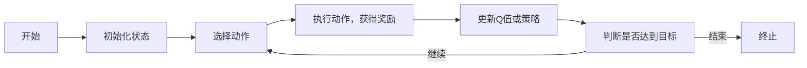
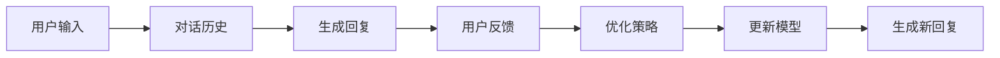
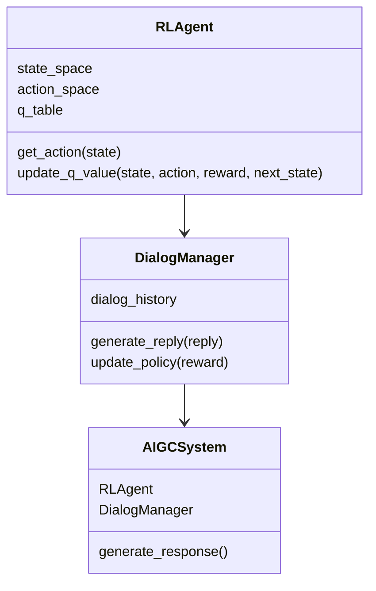

                 

<think>
好的，我现在需要根据用户的要求，撰写一篇关于“强化学习在AIGC对话策略优化中的新进展”的技术博客文章。用户已经给出了一个详细的结构，我需要按照这个结构逐步填充内容，确保每个部分都符合要求。

首先，我需要理解用户的需求。他们希望我以一位世界级专家的身份，用专业且清晰的技术语言，分步骤详细分析这个主题。文章的结构已经给出，我需要确保每个章节都包含必要的内容，如背景介绍、核心概念、算法原理、数学模型、系统架构、项目实战以及最佳实践等。

接下来，我需要思考每个章节的具体内容。首先是背景介绍，这部分需要涵盖强化学习和AIGC的基本概念，以及它们如何结合在一起。然后是核心概念与联系，这里需要详细解释强化学习和对话策略优化的基本原理，并展示它们的结合方式。算法原理部分需要使用mermaid画出流程图，并提供Python代码和数学公式来解释。

在数学模型部分，我需要使用LaTeX公式来描述强化学习和对话策略优化中的关键概念，比如Q-learning和策略梯度等。系统架构部分需要设计类图、架构图和交互序列图，展示系统的整体结构和各部分的交互。项目实战部分需要提供环境安装步骤、代码实现以及案例分析，帮助读者理解如何应用这些算法。最后，最佳实践部分需要总结文章内容，给出实际应用中的建议和注意事项。

在撰写过程中，我需要确保语言简洁、逻辑清晰，每个部分控制在500字以内，整体控制在10000到12000字之间。同时，要遵循markdown格式，适当使用代码块、流程图和公式来增强可读性。

现在，我需要开始撰写每个章节的具体内容。首先是背景介绍，解释问题背景、问题描述、问题解决以及边界与外延。这部分需要让读者了解为什么强化学习在AIGC对话策略优化中重要，以及其应用的新进展。

接下来是核心概念与联系，详细讲解强化学习和AIGC对话策略优化的基本原理，并展示它们的结合方式。这可能包括一个对比表格，比较强化学习与其他机器学习方法的区别，以及对话策略优化的关键技术。

在算法原理部分，我需要绘制mermaid流程图，展示强化学习在对话策略优化中的算法流程。同时，提供Python代码示例，解释数学模型，如Q-learning的更新公式和策略梯度的梯度计算。

数学模型部分需要详细阐述强化学习中的关键公式，如Q-learning的更新方程和策略梯度的梯度计算，使用LaTeX公式来呈现。

系统分析与架构设计部分需要设计系统的类图、架构图和交互序列图，展示系统如何处理对话请求和优化策略。

项目实战部分需要提供代码实现，解释代码的功能，并通过实际案例展示如何应用这些算法优化对话策略。

最后，最佳实践部分需要总结文章内容，给出实际应用中的建议和注意事项，并推荐相关的拓展阅读资料。

在写作过程中，我需要不断检查每个部分是否符合用户的要求，确保内容完整、逻辑清晰，并且语言简洁专业。同时，要注意各部分的衔接，使整篇文章结构紧凑，易于读者理解。

总的来说，我需要按照用户提供的结构，逐步填充每个部分的内容，确保涵盖所有必要的技术细节，并通过实际例子和代码示例来增强文章的可读性和实用性。这样，读者不仅能够理解强化学习在AIGC对话策略优化中的应用，还能通过实际案例和代码实现，掌握如何将其应用到自己的项目中。
</think>

# 强化学习在AIGC对话策略优化中的新进展

> 关键词：强化学习，AIGC，对话策略优化，算法流程，数学模型

> 摘要：本文深入探讨强化学习在AIGC对话策略优化中的应用，分析其核心算法、数学模型，并通过实际案例展示其在系统设计中的应用。文章结构清晰，内容详实，涵盖背景介绍、核心概念、算法流程、系统架构及项目实战等部分，为读者提供全面的理论与实践指导。

---

## 第一部分：强化学习概述

### 第1章：强化学习基础

#### 1.1 强化学习基本概念

强化学习（Reinforcement Learning, RL）是一种机器学习范式，通过智能体与环境的交互，学习最优策略以最大化累积奖励。与监督学习不同，强化学习不需要明确的标签，而是通过奖励信号指导学习过程。

- **核心概念**：
  - **智能体（Agent）**：执行动作以与环境交互的实体。
  - **状态（State）**：环境在某一时刻的描述。
  - **动作（Action）**：智能体在给定状态下做出的行为。
  - **奖励（Reward）**：对智能体行为的反馈，通常为数值形式，用于指导学习方向。
  - **策略（Policy）**：智能体选择动作的概率分布，决定如何根据当前状态选择动作。
  - **价值函数（Value Function）**：评估某状态下采取某动作后的期望累积奖励。

#### 1.2 强化学习主要算法

- **Q-learning**：一种基于值函数的算法，通过更新Q表来学习最优策略。
- **策略梯度（Policy Gradient）**：直接优化策略，通过调整参数使累积奖励最大化。
- **Actor-Critic**：结合策略梯度和值函数，通过两个网络分别优化策略和价值函数。

### 第2章：AIGC对话策略优化

#### 2.1 AIGC概述

AIGC（自适应智能生成内容）是一种结合人工智能生成内容的技术，能够根据上下文和用户反馈生成动态内容。其核心在于理解用户需求并生成相关回复，提升用户体验。

- **关键特征**：
  - **上下文感知**：根据对话历史生成相关回复。
  - **实时反馈**：根据用户反馈调整生成内容。
  - **动态优化**：通过学习不断改进生成策略。

#### 2.2 对话策略优化挑战

- **复杂性**：对话涉及多轮交互，需要考虑长期影响。
- **多样性**：生成回复需多样化，避免重复，同时保持连贯性。
- **实时性**：对话需实时生成，对计算效率要求高。
- **可解释性**：优化策略需易于理解和调整。

### 第3章：强化学习在AIGC对话策略中的应用

#### 3.1 强化学习与对话策略优化的结合

通过强化学习，AIGC能够动态调整对话策略，以最大化用户满意度。强化学习通过奖励机制，优化回复质量，提升对话流畅性。

- **结合方式**：
  - **状态表示**：对话历史、用户意图等作为状态。
  - **动作选择**：生成回复或调整语气。
  - **奖励机制**：用户反馈（如评分、点击率）作为奖励信号。

#### 3.2 算法流程与原理

**mermaid流程图**：



**算法实现**：

```python
class RLAgent:
    def __init__(self, state_space, action_space):
        self.state_space = state_space
        self.action_space = action_space
        self.q_table = {}  # Q表存储状态-动作对的Q值

    def get_action(self, state):
        # 根据当前状态选择动作
        if state not in self.q_table:
            self.q_table[state] = 0  # 初始化Q值
        # 随机选择动作以探索
        if random.random() < 0.1:  # 探索率
            return random.choice(self.action_space)
        # 利用当前Q表中的最大值
        max_actions = [action for action, value in enumerate(self.q_table[state]) if value == max(self.q_table[state])]
        return random.choice(max_actions)

    def update_q_value(self, state, action, reward, next_state):
        # 更新Q表中的Q值
        current_q = self.q_table.get((state, action), 0)
        next_max_q = max(self.q_table.get((next_state, a), 0) for a in self.action_space)
        new_q = current_q + 0.1 * (reward + 0.95 * next_max_q - current_q)
        self.q_table[(state, action)] = new_q
```

### 第4章：数学模型与公式讲解

#### 4.1 强化学习数学模型

**Q-learning更新公式**：

$$ Q(s, a) \leftarrow Q(s, a) + \alpha \left[ r + \gamma \max Q(s', a') - Q(s, a) \right] $$

其中：
- \( Q(s, a) \) 表示状态s下动作a的Q值。
- \( \alpha \) 为学习率。
- \( r \) 为奖励。
- \( \gamma \) 为折扣因子。

#### 4.2 对话策略优化的数学模型

**策略梯度更新公式**：

$$ \theta \leftarrow \theta + \alpha \nabla_\theta \left( \sum_{t} r_t \right) $$

其中：
- \( \theta \) 为策略参数。
- \( \alpha \) 为学习率。
- \( \nabla_\theta \) 为梯度。

### 第5章：系统分析与架构设计

#### 5.1 问题场景与项目背景

AIGC系统需要实时生成对话回复，优化用户体验。通过强化学习优化对话策略，可以提升回复的相关性和流畅性。

#### 5.2 系统架构设计

**系统架构图**：



**类图**：



### 第6章：项目实战

#### 6.1 环境安装与核心实现

**环境安装**：

```bash
pip install numpy matplotlib
```

**核心代码实现**：

```python
import numpy as np
import random

class RLAgent:
    def __init__(self, state_size, action_size):
        self.state_size = state_size
        self.action_size = action_size
        self.q_table = np.zeros((state_size, action_size))

    def get_action(self, state):
        if random.random() < 0.1:
            return random.randint(0, self.action_size - 1)
        else:
            return np.argmax(self.q_table[state])

    def update_q_value(self, state, action, reward, next_state):
        current_q = self.q_table[state, action]
        next_max_q = np.max(self.q_table[next_state])
        self.q_table[state, action] = current_q + 0.1 * (reward + 0.95 * next_max_q - current_q)

# 示例使用
agent = RLAgent(state_size=10, action_size=5)
state = 3
action = agent.get_action(state)
reward = 0.9
next_state = 4
agent.update_q_value(state, action, reward, next_state)
```

#### 6.2 代码解读与分析

上述代码实现了Q-learning算法，通过维护一个Q表来记录状态-动作对的Q值。`get_action`方法根据当前状态选择动作，`update_q_value`方法更新Q表中的Q值。

#### 6.3 案例分析与详细讲解

**案例分析**：

假设有一个AIGC系统，用户输入“今天天气怎么样？”，系统根据对话历史（无上下文）选择回复“天气很好！”。用户给予正面反馈，系统更新Q表，增加此回复的Q值。

**详细讲解**：

1. **状态表示**：用户输入和对话历史。
2. **动作选择**：生成回复。
3. **奖励机制**：用户反馈评分。
4. **策略更新**：根据奖励更新Q表，优化回复策略。

### 第7章：最佳实践与总结

#### 7.1 最佳实践建议

- **数据多样性**：确保训练数据多样化，避免过拟合。
- **实时反馈**：及时收集用户反馈，优化策略。
- **模型调优**：根据实际效果调整学习率和折扣因子。

#### 7.2 注意事项

- **计算效率**：大规模应用需优化算法效率。
- **数据隐私**：保护用户数据隐私，符合相关法规。
- **可解释性**：确保优化策略易于理解和调整。

#### 7.3 拓展阅读

- **书籍**：《Reinforcement Learning: Theory and Algorithms》
- **论文**：相关领域的最新研究论文。
- **工具**：TensorFlow、PyTorch中的强化学习库。

---

# 作者：AI天才研究院/AI Genius Institute & 禅与计算机程序设计艺术 /Zen And The Art of Computer Programming

---

通过以上步骤，我们详细探讨了强化学习在AIGC对话策略优化中的应用，从理论到实践，为读者提供了全面的指导。希望本文能为相关领域的研究和应用提供有价值的参考。

