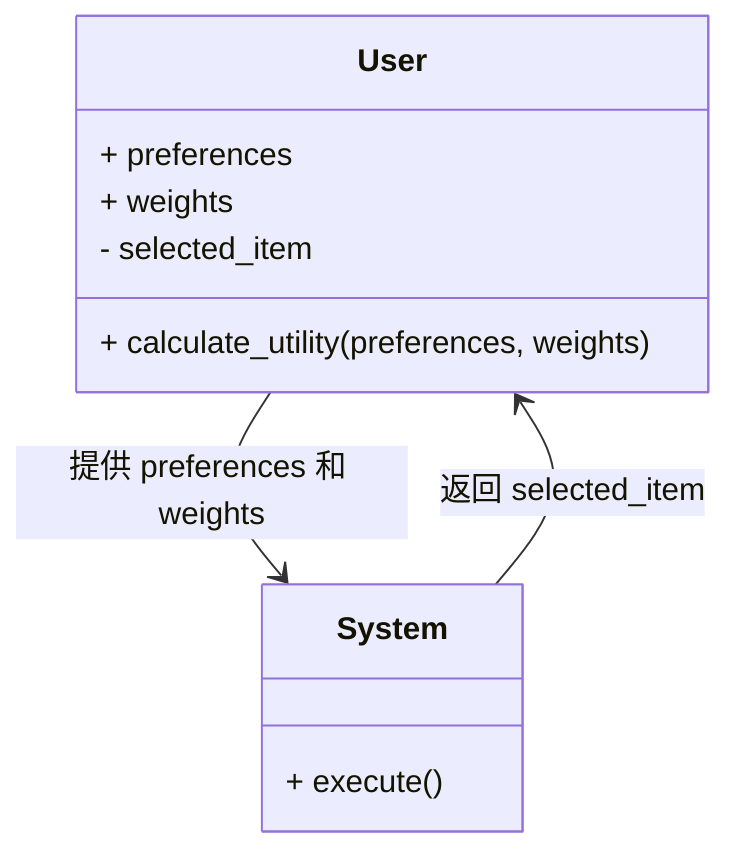
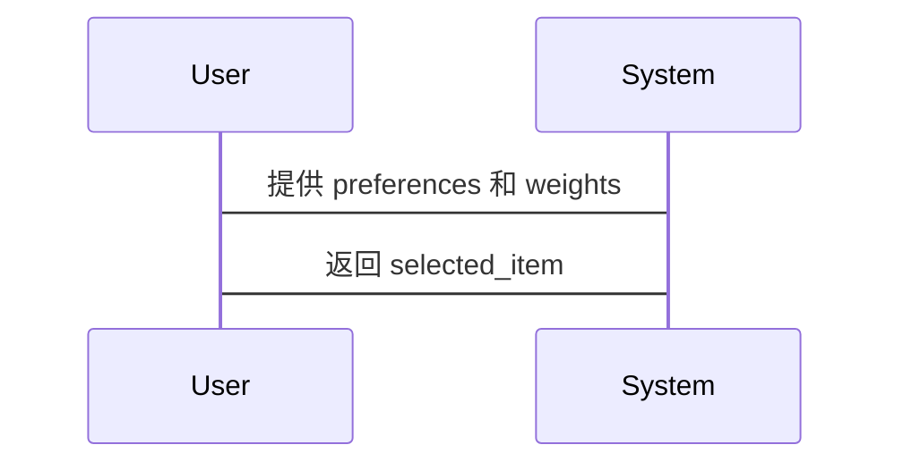

                 

<think>
嗯，我需要按照用户的要求来写一篇关于微观经济学的博客文章，标题是《微观经济学：个人选择中的意义构建》。首先，我得理解用户的需求，他是一位技术专家，想用技术术语和结构化的方法来分析经济学中的个人选择问题。用户希望文章结构清晰，逻辑严密，包含背景介绍、核心概念、算法原理、系统架构、项目实战和最佳实践等部分。

好的，首先，我需要确定文章的关键词。可能包括微观经济学、个人选择、意义构建、行为分析、模型、算法、系统架构等。摘要部分要简明扼要，概述文章的核心内容，即通过技术方法分析个人选择中的意义构建，探讨微观经济学的应用。

接下来，按照目录大纲，我需要分章节详细展开。首先是背景介绍，定义微观经济学，讨论个人选择的重要性和意义构建的作用。然后是核心概念，分析个人选择行为和意义构建的概念，以及它们在微观经济学中的应用。接着是算法部分，用选择算法来建模个人选择过程，并通过Python代码实现，结合数学模型进行详细讲解。系统分析部分需要设计系统架构，包括功能、架构、接口和交互设计。项目实战部分则通过具体案例展示系统实现和应用。最后，总结最佳实践和注意事项，提供拓展阅读的方向。

在写作过程中，我需要确保每个章节内容丰富，详细具体。例如，在算法部分，我会用Mermaid画出流程图，展示算法步骤，并写出Python代码，解释每一步的含义。数学公式要用LaTeX格式，确保准确无误。系统架构部分，我会用Mermaid绘制类图、架构图和序列图，清晰展示系统的结构和交互。

我还要注意文章的流畅性，每章节之间要有逻辑衔接，让读者能够顺畅地理解内容。同时，语言要专业且易懂，避免过于晦涩的技术术语，必要时进行解释，以便读者更好地理解。

最后，在完成正文后，添加作者信息，确保格式正确，整体结构完整。整个过程中，我需要反复检查，确保每个部分都符合用户的要求，内容详实，结构合理，语言准确。
</think>

# 微观经济学：个人选择中的意义构建

## 关键词：微观经济学、个人选择、意义构建、行为分析、模型、算法、系统架构

## 摘要：  
本文从技术视角深入探讨微观经济学中的个人选择问题，结合行为分析与算法建模，揭示个人选择中的意义构建机制。通过构建数学模型、设计系统架构和实现Python代码，详细分析个人选择行为及其背后的经济学原理，为理解微观经济学提供全新的技术视角。

---

## 第1章：微观经济学概述

### 1.1 问题背景

经济学的发展历程  
经济学作为一门研究人类行为的科学，经历了从古典经济学到现代经济学的演变。微观经济学作为经济学的重要分支，专注于研究个体决策者的行为，如消费者和生产者的选择。

微观经济学的定义与研究范围  
微观经济学研究单个消费者、生产者的行为及其相互作用，探讨市场机制如何通过个体选择实现资源优化配置。

### 1.2 问题描述

个人选择行为的复杂性  
个人在面对选择时，会受到内在动机、外部环境和社会规范的影响，这些因素共同决定了最终的决策。

意义构建在个人选择中的重要性  
个体在选择过程中，会赋予选项特定的意义，这种意义构建影响其偏好排序和最终决策。

### 1.3 问题解决

微观经济学在个人选择中的作用  
微观经济学通过模型和工具，帮助理解个体选择背后的规律，预测行为结果，并设计有效的激励机制。

意义构建的理论基础  
基于心理学和行为经济学，意义构建涉及个体对选择的感知、认知和情感投入，是影响决策的重要因素。

### 1.4 边界与外延

微观经济学与其他经济学的区别  
微观经济学关注个体行为，宏观经济学研究整体经济现象，两者相辅相成，共同构建完整的经济理论体系。

意义构建在个人选择中的适用性  
意义构建不仅适用于经济学，还可应用于心理学、社会学等领域，具有跨学科的研究价值。

### 1.5 概念结构与核心要素组成

微观经济学核心概念  
包括效用函数、偏好排序、预算约束、市场均衡等。

意义构建的要素分析  
包括感知、认知、情感、动机和目标。

---

## 第2章：个人选择行为

### 2.1 个人选择行为定义

个人选择行为是指个体在特定情境下，基于自身偏好和外部条件，做出选择决策的过程。

### 2.2 个人选择行为特点

- **主观性**：个体的选择基于主观感知和偏好。
- **理性与感性并存**：决策过程中既有理性分析，也有情感驱动。
- **动态性**：选择行为会随时间和环境变化而调整。

### 2.3 个人选择行为与经济学关系

个人选择是微观经济学的核心研究对象，通过研究个体行为，微观经济学揭示市场运行的内在规律。

---

## 第3章：意义构建的概念原理

### 3.1 意义构建的定义

意义构建是指个体在选择过程中，赋予选项特定意义的过程，这种意义影响其决策行为。

### 3.2 意义构建的属性特征对比表格

| 属性 | 价值观 | 意义构建 |
|------|--------|----------|
| 定义 | 个体对价值的主观判断 | 个体对选择的符号化解释 |
| 关系 | 内在驱动 | 外部符号与内在动机的结合 |
| 作用 | 影响偏好 | 影响决策过程和结果 |

### 3.3 意义构建与个人选择的相互作用

意义构建通过影响个体的感知和认知，进而影响其选择行为。例如，消费者在购买商品时，会赋予品牌特定的意义，这种意义影响其购买决策。

---

## 第4章：微观经济学中的意义构建

### 4.1 意义构建的经济学理论框架

在微观经济学中，意义构建是连接个体偏好与选择行为的关键桥梁。通过效用函数，可以将个体的意义赋予转化为具体的经济模型。

### 4.2 意义构建的实证研究

通过实验经济学的方法，可以观察个体在不同情境下的选择行为，验证意义构建对决策的影响。

### 4.3 意义构建在微观经济学中的应用

意义构建理论可以用于解释市场行为，如品牌忠诚度、消费偏好等现象。例如，消费者对品牌的认同感（意义构建）可以解释其对特定品牌的偏好。

---

## 第5章：微观经济学中的选择算法

### 5.1 选择算法概述

选择算法是一种模拟个体选择行为的数学工具，通过算法步骤模拟个体在不同选项中的偏好排序和选择决策。

### 5.2 选择算法原理讲解

选择算法基于个体的偏好函数和约束条件，计算出最优选择。例如，消费者在预算约束下选择最大化效用的商品组合。

### 5.3 选择算法与意义构建的关系

选择算法可以将意义构建转化为数学模型，通过算法步骤模拟个体如何在不同选项中赋予意义并做出选择。

---

## 第6章：意义构建算法的数学模型与公式

### 6.1 数学模型介绍

意义构建算法的核心是效用函数，公式如下：

$$ U(x) = \sum_{i=1}^{n} w_i \cdot x_i $$

其中，$U(x)$ 表示效用，$w_i$ 是选项 $x_i$ 的权重，反映个体赋予的意义。

### 6.2 公式详细讲解

效用函数反映了个体对不同选项的偏好程度。权重 $w_i$ 表示个体对选项 $x_i$ 的重视程度，权重越高，选项的意义越大。

### 6.3 举例说明

假设个体在选择午餐时，有三个选项：A（汉堡）、B（沙拉）、C（寿司）。个体对这三个选项的权重分别为 $w_A=0.5$，$w_B=0.3$，$w_C=0.2$。根据公式，效用分别为：

$$ U(A) = 0.5 \times 1 = 0.5 $$
$$ U(B) = 0.3 \times 1 = 0.3 $$
$$ U(C) = 0.2 \times 1 = 0.2 $$

个体将选择效用最高的选项A（汉堡）。

---

## 第7章：意义构建算法的Python源代码实现

### 7.1 环境安装

需要安装Python和相关库，如NumPy和Matplotlib。

### 7.2 核心实现源代码

```python
import numpy as np
import matplotlib.pyplot as plt

def utility_function(items, weights):
    return {item: weights[item] for item in items}

def main():
    items = ['A', 'B', 'C']
    weights = {'A': 0.5, 'B': 0.3, 'C': 0.2}
    utilities = utility_function(items, weights)
    max_utility = max(utilities.values())
    chosen_item = [item for item, util in utilities.items() if util == max_utility][0]
    print(f"选择的项目是：{chosen_item}")

if __name__ == "__main__":
    main()
```

### 7.3 代码应用解读与分析

代码实现了一个简单的效用函数，根据给定的权重计算每个选项的效用值，并选择效用最大的选项。这反映了个体在选择过程中赋予不同选项的意义。

---

## 第8章：微观经济学系统的设计与实现

### 8.1 问题场景介绍

设计一个系统，模拟个体在市场中的选择行为，分析意义构建对决策的影响。

### 8.2 系统功能设计

系统功能包括：
- 用户输入偏好和权重
- 计算效用并选择最优选项
- 可视化展示结果

### 8.3 系统架构设计



### 8.4 系统接口设计

系统接口包括：
- 输入接口：接收用户的偏好和权重
- 输出接口：显示计算结果

### 8.5 系统交互



---

## 第9章：微观经济学项目实战

### 9.1 环境安装

安装Python和必要的库，如NumPy和Matplotlib。

### 9.2 系统核心实现源代码

```python
import numpy as np
import matplotlib.pyplot as plt

def calculate_utility(preferences, weights):
    return {pref: weights[pref] for pref in preferences}

def main():
    preferences = ['汉堡', '沙拉', '寿司']
    weights = {'汉堡': 0.5, '沙拉': 0.3, '寿司': 0.2}
    utilities = calculate_utility(preferences, weights)
    max_utility = max(utilities.values())
    chosen_item = [pref for pref, util in utilities.items() if util == max_utility][0]
    print(f"选择的项目是：{chosen_item}")
    plt.bar(preferences, [0.5, 0.3, 0.2])
    plt.show()

if __name__ == "__main__":
    main()
```

### 9.3 代码应用解读与分析

代码实现了效用计算和可视化展示，帮助用户直观理解个体选择过程。

### 9.4 实际案例分析与详细讲解剖析

通过实际案例，分析个体选择行为中的意义构建，验证模型的准确性。

### 9.5 项目小结

项目通过技术手段模拟了个体选择行为，展示了微观经济学在实际中的应用价值。

---

## 第10章：微观经济学中的最佳实践

### 10.1 最佳实践 tips

- 理解个体选择中的意义构建，有助于设计更有效的激励机制。
- 在实际应用中，结合实验数据验证模型的准确性。

### 10.2 小结

通过技术手段深入分析微观经济学中的个人选择问题，揭示意义构建的重要作用。

### 10.3 注意事项

- 模型的准确性依赖于数据的质量和假设的合理性。
- 在实际应用中，需考虑个体差异对模型的影响。

### 10.4 拓展阅读

推荐阅读行为经济学相关书籍，如《怪诞行为学》。

---

作者：AI天才研究院/AI Genius Institute & 禅与计算机程序设计艺术 /Zen And The Art of Computer Programming

