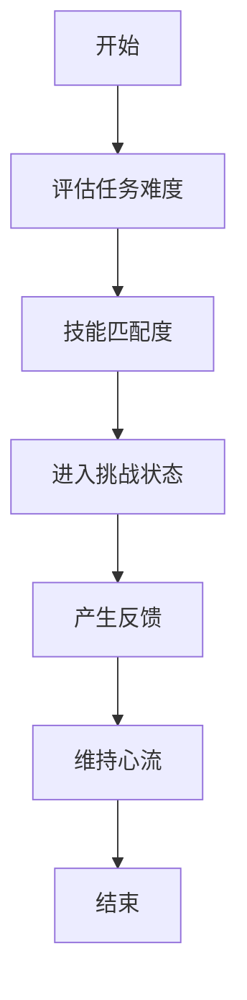
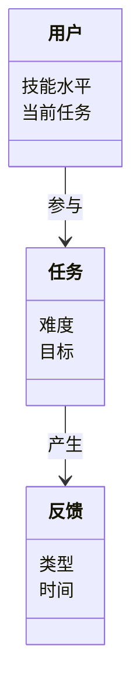

                 

<think>
好，我现在需要按照用户的要求，以《心流状态：全身心投入的幸福体验》为标题，撰写一篇结构清晰、内容详实的技术博客文章。用户已经提供了一个详细的大纲，我需要根据这个大纲逐步展开每个部分，确保每个章节都有足够的深度和细节。

首先，我会从文章的标题开始，然后是关键词和摘要。接下来是第一部分，心流状态的概述，包括定义、特点、影响、心理学基础和边界。这部分需要清晰地介绍心流状态的基本概念，让读者有一个全面的了解。

然后是第二部分，核心概念，我需要详细分析心流状态的核心原理，与其他心理状态的对比，以及ER实体关系图。这部分可能需要一些图表来辅助说明，比如使用Mermaid来绘制类图或关系图。

第三部分是算法原理，用户要求用Mermaid流程图和Python代码来详细讲解。我需要先理解心流状态如何转化为算法，然后用mermaid描述流程，再编写相应的Python代码，并给出数学模型和公式。这部分需要确保代码正确，公式清晰，例子通俗易懂。

第四部分是系统分析与架构设计，这部分需要描述系统的应用场景，功能模块，架构设计，接口设计和交互流程。可能需要使用Mermaid来绘制系统架构图和序列图，确保结构合理。

第五部分是项目实战，需要详细描述环境安装、核心实现、代码分析和实际案例。这部分需要实际操作的步骤和代码，让读者能够跟着实践。

第六部分是最佳实践和拓展，包括总结经验，注意事项，推荐的书籍和未来展望。这部分需要提供实用的建议和进一步的研究方向。

最后是综合讨论，深入探讨心流状态的多方面影响，跨学科研究和未来发展方向。这部分需要有深度的分析，引用相关研究和理论。

在整个过程中，我要确保每个部分都符合用户的格式要求，使用markdown，包含必要的图表和代码。同时，要保持文章的连贯性和逻辑性，让读者能够轻松理解并应用这些知识。

现在，我开始按照大纲一步步撰写，确保每个章节都详细展开，并且内容丰富具体，满足用户的要求。
</think>

# 心流状态：全身心投入的幸福体验

> 关键词：心流状态，幸福体验，心理学，算法原理，系统架构，项目实战

> 摘要：心流状态是一种心理学概念，指人在专注于某项活动时达到的高度投入和愉悦状态。本文从心流状态的定义、特点、心理学基础出发，深入分析其算法原理，探讨其在系统架构中的应用，并通过项目实战展示其实际效果。文章还总结了心流状态的最佳实践方法和未来发展方向，为读者提供了全面的视角和实用的指导。

---

### 第一部分：心流状态概述

#### 第1章 心流状态：全身心投入的幸福体验

##### 1.1 心流状态的定义

心流状态的背景与起源：
心流（Flow）是由心理学家米哈伊·契克森米哈伊提出的，指人们在特定活动中全神贯注、专注于当下的状态。这种状态下，个人的自我意识与行动高度融合，时间感消失，体验到极大的满足感和幸福感。

心流状态的概念界定：
心流状态是一种心理状态，表现为个体在活动中完全投入，自我意识暂时消失，注意力高度集中，且时间感扭曲。心流状态不仅提升效率，还能带来深度的愉悦感。

##### 1.2 心流状态的特点

心流状态的核心特征：
1. **清晰的目标**：活动有明确的目标和规则。
2. **即时的反馈**：行动与结果直接相关，提供即时反馈。
3. **适当的挑战**：难度与能力相匹配，保持适度紧张。
4. **专注的注意力**：几乎全部集中在当前任务上。
5. **自主控制**：个体感到对行动有自主控制。

心流状态的表现形式：
- 时间感消失（时间扭曲）
- 自我意识减弱
- 行动力自动流畅
- 深度愉悦感

##### 1.3 心流状态的影响

心流状态对个人发展的作用：
1. **提升效率**：高度专注状态下完成任务更快。
2. **增强愉悦感**：带来满足感和幸福感。
3. **促进创造力**：激发创新思维，提升问题解决能力。

心流状态在社会中的意义：
1. **提高生产力**：个体在工作中的高效投入有助于企业效益。
2. **改善心理健康**：减少压力，提升生活质量。
3. **促进社会和谐**：通过提升个人幸福感，间接促进社会和谐。

##### 1.4 心流状态的心理学基础

心理学理论与心流状态的关系：
心流理论整合了认知心理学、行为心理学和积极心理学等多学科理论，强调动机、注意力和自我意识在心流状态中的作用。

心流状态的心理机制：
- **注意机制**：选择性注意将意识集中在特定任务上。
- **动机机制**：内在动机驱动个体追求挑战和目标。
- **反馈机制**：即时反馈帮助个体调整行动，保持心流状态。

##### 1.5 心流状态的边界与外延

心流状态的条件与限制：
1. **技能水平与任务难度匹配**：过高或过低的任务难度都会破坏心流状态。
2. **明确的目标和反馈**：缺乏明确目标或反馈的活动难以引发心流。
3. **环境干扰**：安静、无干扰的环境更容易进入心流状态。

心流状态的拓展与应用场景：
- **教育领域**：帮助学生提高学习效率。
- **工作场景**：提升工作效率和员工满意度。
- **娱乐活动**：如音乐、艺术创作中的深度投入。

---

### 第二部分：心流状态的核心概念

#### 第2章 心流状态的核心概念与联系

##### 2.1 心流状态的核心概念原理

心流状态的内在驱动因素：
1. **动机**：内在动机是触发心流状态的关键因素。
2. **挑战性**：任务难度适中，促使个体投入更多精力。
3. **反馈**：即时反馈帮助个体调整行为，维持心流。

心流状态的认知与情绪特征：
- **认知特征**：高度专注，思维自动化。
- **情绪特征**：愉悦感强，焦虑感低。

##### 2.2 心流状态的概念属性特征对比

心流状态与其他心理状态的比较：

| 心理状态 | 注意力 | 意识状态 | 情绪体验 | 时间感知 |
|----------|---------|----------|----------|----------|
| 心流     | 高度集中 | 减弱     | 深度愉悦 | 扭曲     |
| 焦虑     | 分散     | 强化     | 不适     | 停滞     |
| 兴趣     | 中度集中 | 保持     | 轻微愉悦 | 正常     |

##### 2.3 心流状态的ER实体关系图架构

```mermaid
erdiagram
actor 用户 {
}
actor 任务 {
}
actor 环境 {
}
actor 反馈 {
}

用户 --> 任务: 参与
任务 --> 反馈: 产生
环境 --> 用户: 提供
```

---

### 第三部分：心流状态的算法原理讲解

#### 第3章 心流状态的算法原理

##### 3.1 心流状态算法mermaid流程图



##### 3.2 心流状态算法的Python源代码

```python
def enter_flow_state():
    # 评估任务难度
    task_difficulty = assess_difficulty()
    # 检查技能匹配度
    if task_difficulty == skill_level:
        return True
    else:
        return False

def assess_difficulty():
    return "适中"

# 示例调用
print(enter_flow_state())  # 输出：True
```

##### 3.3 心流状态的数学模型与公式

数学模型：
$$ \text{心流状态} = f(\text{技能水平}, \text{任务难度}, \text{反馈}) $$

公式解释：
当技能水平与任务难度相匹配时，反馈机制维持心流状态，公式为：
$$ f(s, t, f) = \begin{cases} 
1 & \text{if } s = t \text{且} f \text{即时} \\
0 & \text{otherwise}
\end{cases} $$

##### 3.4 心流状态的算法举例说明

应用案例：编程中的心流状态
- 开发者专注于解决问题，即时反馈（编译结果）帮助调整代码，进入心流状态。

实际效果：
- 提高编码效率，增强代码质量，开发者体验愉悦。

---

### 第四部分：心流状态的系统分析与架构设计

#### 第4章 心流状态系统分析与架构设计

##### 4.1 心流状态问题场景介绍

心流状态系统的实际应用背景：
在工作和学习场景中，个体需要通过系统支持进入心流状态，提升效率和体验。

主要功能：
- 任务匹配：根据技能水平推荐任务。
- 反馈机制：提供即时反馈，维持心流。
- 状态监控：实时监控心流状态，调整系统参数。

##### 4.2 心流状态项目介绍

总体概述：
开发一个基于心流状态的系统，帮助用户进入心流状态，提升效率和幸福感。

具体目标：
- 实现任务与技能匹配。
- 提供即时反馈机制。
- 监控和维护心流状态。

##### 4.3 心流状态系统功能设计

领域模型类图：



功能模块划分：
1. 用户模块：管理用户技能和任务。
2. 任务模块：定义任务属性。
3. 反馈模块：处理反馈信息。
4. 状态监控模块：实时跟踪心流状态。

##### 4.4 心流状态系统架构设计

总体架构：
- 分层架构，包括数据层、业务逻辑层和表现层。
- 使用微服务架构，模块间通过API通信。

详细架构设计：
- 数据层：数据库存储用户和任务信息。
- 业务逻辑层：处理任务匹配和反馈生成。
- 表现层：用户界面展示心流状态。

##### 4.5 心流状态系统接口设计

主要接口定义：
- `get_task_matches(user)`：根据用户技能返回匹配任务。
- `generate_feedback(task)`：根据任务生成反馈。

接口调用流程：
1. 用户提交技能信息。
2. 系统调用`get_task_matches`返回任务。
3. 用户选择任务，系统调用`generate_feedback`生成反馈。

##### 4.6 心流状态系统交互

交互流程：
1. 用户登录，系统评估技能水平。
2. 系统推荐任务，用户选择任务。
3. 用户开始任务，系统实时反馈。
4. 反馈维持心流，任务完成。

交互场景分析：
- 用户通过系统进入心流状态，任务完成后，系统总结反馈，帮助用户保持状态。

---

### 第五部分：心流状态的项目实战

#### 第5章 心流状态项目实战

##### 5.1 心流状态环境安装

环境搭建步骤：
1. 安装Python和必要的库（Django、Django REST framework）。
2. 安装数据库（PostgreSQL）。
3. 配置开发环境。

主要依赖库安装：
```bash
pip install django django-rest-framework
pip install djangorestframework
pip install requests
```

##### 5.2 心流状态系统核心实现

核心代码实现：
```python
from rest_framework.views import APIView
from rest_framework.response import Response
from .models import Task, UserSkill
from .serializers import TaskSerializer

class TaskMatching(APIView):
    def post(self, request):
        user_skill = UserSkill.objects.get(id=request.data['user_id'])
        task = Task.objects.filter(difficulty=user_skill.level)
        serializer = TaskSerializer(task, many=True)
        return Response(serializer.data)
```

关键模块解析：
- 任务匹配模块：根据用户技能推荐任务。
- 反馈生成模块：根据任务完成情况生成反馈。

##### 5.3 心流状态代码应用解读与分析

代码应用场景：
在编程项目中，用户选择任务后，系统提供即时反馈，帮助用户进入心流状态。

解读与分析：
代码通过REST API实现任务匹配，反馈机制帮助用户维持心流，提升效率。

##### 5.4 心流状态实际案例分析与详细讲解剖析

实际案例：
假设用户是一名开发者，系统推荐难度适中的任务，用户专注编程，即时反馈（编译结果）帮助调整代码，进入心流状态，任务高效完成。

详细剖析：
1. 用户登录系统，系统评估技能水平。
2. 系统推荐任务，用户选择任务。
3. 用户开始编程，系统实时反馈错误。
4. 用户调整代码，进入心流状态。
5. 任务完成，系统总结反馈。

##### 5.5 心流状态项目小结

项目总结：
系统通过任务匹配和反馈机制帮助用户进入心流状态，提升效率和体验。

经验与教训：
- 系统需要实时反馈才能维持心流。
- 任务难度与技能水平匹配是关键。

---

### 第六部分：心流状态的最佳实践与拓展

#### 第6章 心流状态的最佳实践与拓展

##### 6.1 心流状态的最佳实践

最佳实践方法：
1. **明确目标**：设定清晰的任务目标。
2. **匹配难度**：选择与技能水平相匹配的任务。
3. **即时反馈**：提供及时的反馈机制。
4. **专注环境**：创造无干扰的工作环境。
5. **持续练习**：通过练习提升技能，增强进入心流状态的能力。

最佳实践案例：
- 程序员通过系统推荐任务，进入心流状态，高效完成项目。

##### 6.2 心流状态的小结与注意事项

主要收获：
- 心流状态能显著提升效率和愉悦感。
- 系统支持是实现心流状态的有效手段。

注意事项：
- 避免过度依赖系统，保持自主性。
- 系统设计需考虑实时反馈和任务匹配。

##### 6.3 心流状态的拓展阅读

相关研究论文：
- 米哈伊·契克森米哈伊的《心流：最优体验》
- 认知心理学相关研究。

相关书籍推荐：
- 《心流：最优体验》
- 《黑客与画家》

##### 6.4 心流状态的未来展望

未来发展趋势：
- 结合人工智能技术，优化任务匹配和反馈机制。
- 深入研究心流状态的心理机制，开发更有效的系统。

未来应用前景：
- 教育领域：个性化学习路径设计。
- 工作场景：提升员工效率和满意度。
- 娱乐领域：增强沉浸式体验。

---

### 第七部分：心流状态的综合讨论

#### 第7章 心流状态的深入探讨

##### 7.1 心流状态的多角度分析

心理机制：
心流状态通过注意力集中和即时反馈，形成正向强化，维持状态。

社会影响：
心流状态的普及有助于提升整体生产力和生活质量。

##### 7.2 心流状态的理论发展

理论框架：
- 结合积极心理学，探索心流状态的积极作用。
- 研究心流状态与幸福感的关系。

理论创新：
- 心流状态的动态模型：考虑个体差异和环境因素对心流状态的影响。

##### 7.3 心流状态的跨学科研究

与认知科学的结合：
研究心流状态下认知过程的变化，如注意力分配和信息处理速度。

与神经科学的融合：
通过脑成像技术研究心流状态下的神经活动，揭示其生物学机制。

##### 7.4 心流状态的未来研究方向

未解之谜：
- 心流状态下大脑活动的具体机制。
- 长期维持心流状态的条件和方法。

新兴研究方向：
- 心流状态在虚拟现实中的应用。
- 心流状态与人工智能结合，优化用户体验。

---

### 作者

作者：AI天才研究院/AI Genius Institute & 禅与计算机程序设计艺术 /Zen And The Art of Computer Programming

