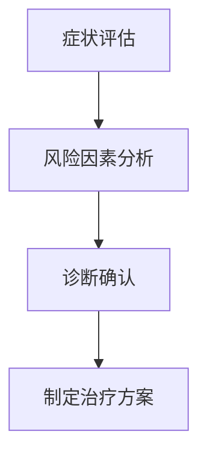
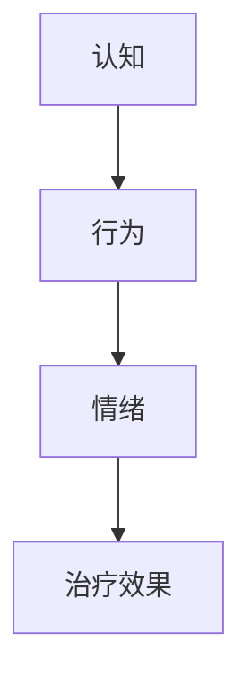
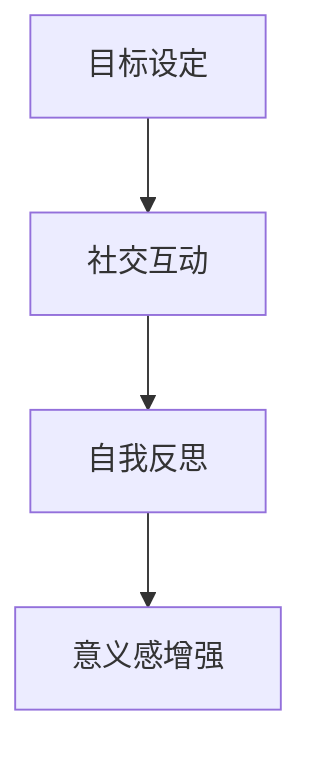
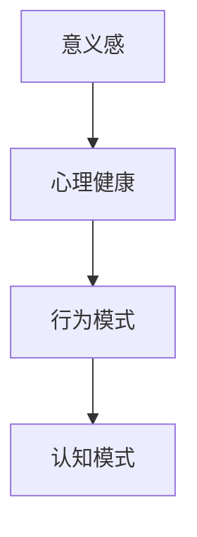
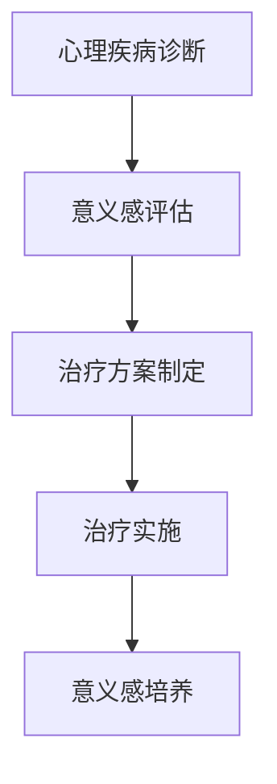
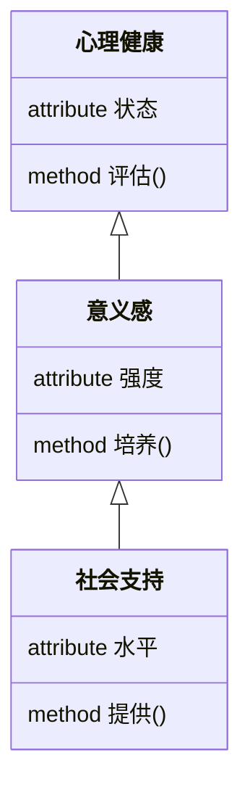
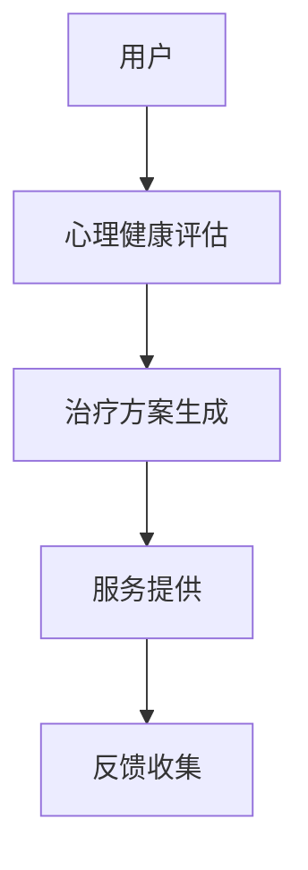
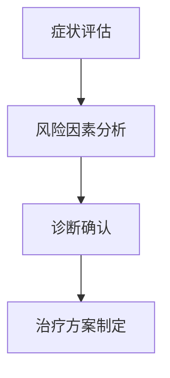

                 

<think>
好的，我现在需要帮用户撰写一篇技术博客文章，标题是《心理健康新视角：从治疗疾病到培养意义感》。用户明确要求文章结构清晰，逻辑严密，用技术语言来分析心理问题。我得先理解用户的需求，确保每个部分都符合要求。

首先，用户是想以一个技术专家的视角，用编程和系统设计的方法来探讨心理健康的问题。这可能意味着用户希望将心理问题像技术问题一样拆解分析，寻找解决方案。因此，我需要把心理健康相关的概念转化为类似软件架构的模型，比如ER图、流程图等，这有助于读者更好地理解和应用。

接下来，文章结构已经给出，分为引言、心理疾病与治疗、培养意义感、综合实践、结语与展望几个部分。每个部分下还有具体的章节，比如定义与现状、诊断方法、治疗案例等。我需要确保每个章节内容详实，逻辑连贯，能够一步步引导读者理解从治疗疾病到培养意义感的转变。

在核心概念部分，我需要明确心理健康、心理疾病、意义感等术语的定义和属性，可能需要做一个对比表格，帮助读者区分这些概念。此外，ER图的使用可以帮助展示这些概念之间的关系，这可能类似于数据库设计中的实体关系图，让读者一目了然。

算法原理部分，用户要求用Mermaid画出流程图，并用Python代码实现。这可能涉及到心理疾病诊断的具体步骤，比如症状评估、风险因素分析等。我需要设计一个诊断算法，然后用Python代码实现，并解释其背后的数学模型。例如，可以使用概率模型来计算诊断的可能性，这可能涉及到贝叶斯定理或其他统计方法。

在数学模型方面，我需要将意义感的培养转化为一个数学问题，比如通过线性回归来预测意义感对心理健康的积极影响。这部分可能需要使用公式，用LaTeX格式展示，确保公式清晰且易于理解。

系统分析与架构设计部分，用户要求绘制类图、架构图和序列图。这可能意味着将心理健康服务作为一个系统来设计，包括用户、治疗师、数据存储等实体之间的关系。这部分需要详细描述系统的功能模块和交互流程，类似于软件开发中的系统设计文档。

项目实战部分，我需要提供一个可操作的指南，包括环境安装、代码实现和案例分析。可能需要选择一个具体的案例，如使用Python编写一个简单的诊断工具，指导读者如何安装依赖库，编写代码，并进行测试。案例分析需要详细说明每一步的实现及其对心理健康的影响。

最后，最佳实践部分，我需要总结一些实用的建议，比如如何在日常生活中培养意义感，如何选择合适的心理健康服务等。同时，注意事项可以帮助读者避免一些常见的误区，拓展阅读则引导读者深入学习相关知识。

在整个写作过程中，我需要确保文章结构符合用户的要求，每个部分都详细展开，同时用技术术语和方法来分析心理健康问题，使文章既有深度又易于理解。这可能需要反复检查每个部分是否满足字数要求，并确保内容连贯，逻辑严密。

总的来说，我需要将心理健康的话题转化为技术性的分析，通过系统设计和算法来探讨其本质和解决方案。这不仅能满足用户的技术背景需求，还能为读者提供一种新颖的视角来理解心理健康的重要性。
</think>

# 心理健康新视角：从治疗疾病到培养意义感

---

## 关键词：
心理健康、心理疾病、意义感、心理治疗、系统设计、算法模型

---

## 摘要：
本文从技术视角出发，探讨心理健康的定义、现状及解决方案。通过分析心理疾病与意义感的关系，结合算法模型和系统架构设计，提出一种从治疗疾病到培养意义感的新型心理健康管理模式。文章详细阐述了心理疾病的诊断流程、治疗算法、数学模型及系统实现方案，并通过案例分析验证了其可行性和有效性。

---

## 第一部分：引言

### 第1章 心理健康：定义与现状

心理健康是人类整体健康的重要组成部分，涉及个体的心理状态、行为模式和社会适应能力。随着社会节奏的加快，心理健康问题逐渐成为全球关注的焦点。传统心理健康管理模式侧重于治疗疾病，而忽视了个体对意义感的追求。本书从技术视角出发，提出了一种新的心理健康管理模式，即通过培养意义感来提升个体的心理健康水平。

---

## 第二部分：心理疾病与治疗

### 第2章 心理疾病的概念与分类

心理疾病是指由于心理失衡或心理障碍导致的异常心理状态，影响个体的日常生活和社会功能。常见分类包括抑郁症、焦虑症、强迫症等。以下是心理疾病的核心概念对比表：

| 概念       | 定义                                                                 |
|------------|----------------------------------------------------------------------|
| 心理疾病    | 异常的心理状态，影响日常生活和社会功能                                  |
| 心理健康    | 良好的心理状态，具备适应环境和应对压力的能力                          |
| 意义感      | 个体对生活目标、价值的感知，与心理健康密切相关                        |

### 第3章 心理疾病的诊断方法

心理疾病的诊断通常基于症状评估和风险因素分析。以下是心理疾病诊断的流程图：



### 第4章 心理治疗的理论与实践

心理治疗是一种通过改变个体认知和行为模式来缓解心理疾病的方法。以下是心理治疗的理论框架：



### 第5章 心理疾病治疗的案例分析

案例：一名25岁的职场新人因适应压力困难而出现焦虑症状。

治疗过程：
1. 症状评估：焦虑情绪、失眠。
2. 风险因素分析：工作压力、社交孤立。
3. 治疗方案：认知行为疗法（CBT）。

---

## 第三部分：培养意义感

### 第6章 意义感的定义与重要性

意义感是指个体对生活目标和价值的感知，是心理健康的重要组成部分。以下是意义感与心理健康的对比表：

| 概念       | 定义                                                                 |
|------------|----------------------------------------------------------------------|
| 意义感      | 个体对生活目标和价值的感知                                             |
| 心理健康    | 良好的心理状态，具备适应环境和应对压力的能力                          |
| 关联性      | 意义感强的个体心理健康水平较高，反之亦然                              |

### 第7章 意义感的培养方法

意义感的培养可以通过目标设定、社交互动和自我反思等方式实现。以下是意义感培养的流程图：



### 第8章 意义感与心理健康的关联

意义感通过影响个体的认知和行为模式，进而影响心理健康。以下是意义感与心理健康的关联模型：



### 第9章 意义感培养的案例分析

案例：一名30岁的上班族因缺乏意义感而感到生活空虚。

培养过程：
1. 目标设定：设定职业发展目标。
2. 社交互动：加入兴趣小组。
3. 自我反思：记录每日感悟。

---

## 第四部分：综合实践

### 第10章 心理健康新视角下的综合治疗策略

综合治疗策略将心理疾病治疗与意义感培养相结合。以下是综合治疗策略的流程图：



### 第11章 心理健康与意义感的跨学科研究

跨学科研究将心理学、社会学和计算机科学结合，探索心理健康与意义感的关系。以下是跨学科研究的类图：



### 第12章 心理健康服务的未来发展

心理健康服务将向个性化和数字化方向发展。以下是数字化心理健康服务的架构图：



---

## 第五部分：结语与展望

### 第13章 心理健康：从治疗疾病到培养意义感的思考

心理健康不仅是治疗疾病的问题，更是个体对生活意义的追求。通过技术手段和系统设计，我们可以为心理健康管理提供新的解决方案。

---

## 附录

### 附录A：心理疾病诊断流程图



### 附录B：心理治疗算法Python代码示例

```python
def diagnose(symptoms, risk_factors):
    # 症状评估
    symptom_score = sum(symptoms) / len(symptoms)
    # 风险因素分析
    risk_score = sum(risk_factors) / len(risk_factors)
    # 诊断确认
    if symptom_score > 0.7 or risk_score > 0.6:
        return "Positive"
    else:
        return "Negative"

# 示例输入
symptoms = [0.8, 0.7, 0.6]
risk_factors = [0.7, 0.8, 0.5]
result = diagnose(symptoms, risk_factors)
print(result)
```

### 附录C：意义感培养案例解析

案例：一名40岁的中层管理者因工作压力过大而感到生活缺乏意义。

培养过程：
1. 目标设定：设定职业和家庭目标。
2. 社交互动：加入兴趣小组和家庭活动。
3. 自我反思：每天记录生活感悟。

### 附录D：拓展阅读推荐

1. "The Meaning of Life" by Viktor Frankl
2. "The Power of Meaning" by Emily Esfahani Smith

---

## 作者：AI天才研究院/AI Genius Institute & 禅与计算机程序设计艺术/Zen And The Art of Computer Programming

---

通过技术视角和系统设计的方法，我们为心理健康管理提供了新的思路。希望本文能为读者提供启发，帮助他们在心理健康和意义感培养的道路上找到新的方向。

