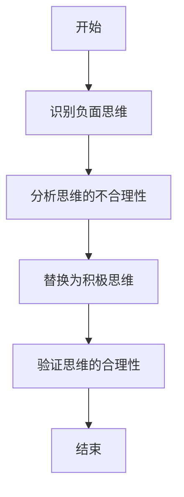
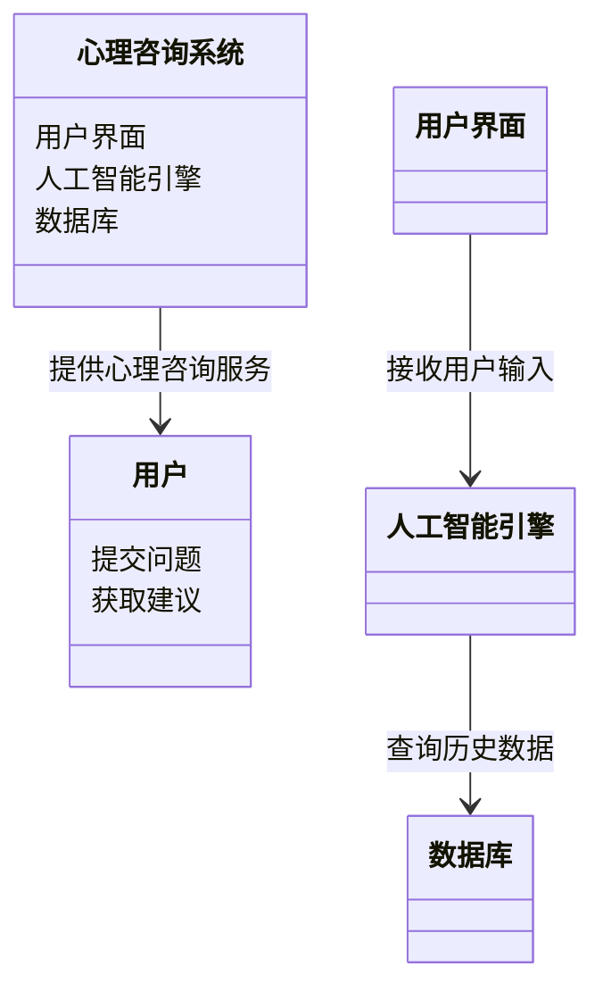
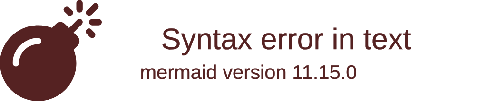
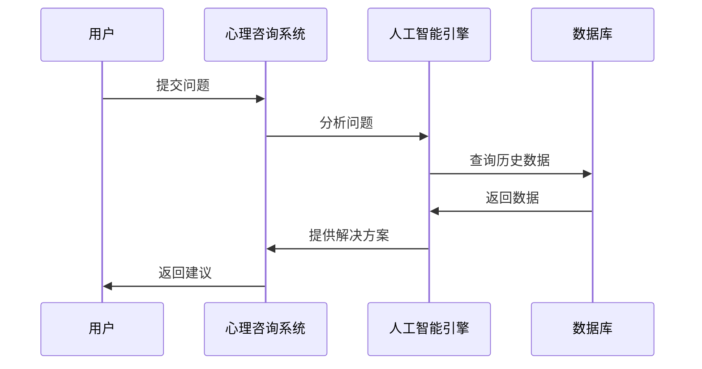

                 

<think>
嗯，好的，我现在需要帮用户撰写一篇关于“心理咨询的普及：自我探索与心灵成长”的技术博客文章。用户明确要求文章结构清晰，使用技术语言，但主题是心理相关的，这可能有点挑战。首先，我需要理解用户的需求，确保文章符合所有要求。

用户希望文章包含摘要、关键词、目录大纲，以及多个章节，每个章节都要有详细的内容，包括背景介绍、核心概念对比表格、ER图、理论方法、系统分析、项目实战和最佳实践等部分。同时，文章需要用技术语言，但主题是心理咨询，所以我要在专业性和可读性之间找到平衡。

接下来，我需要考虑文章的结构。用户已经提供了大纲，我需要按照这个大纲来填充内容。首先是摘要和关键词，然后是各个章节，每个章节都需要有详细的分析和例子。比如，在核心概念部分，我需要列出心理健康、心理困扰等，并制作对比表格。在ER实体关系图部分，我需要用Mermaid语法来绘制，确保清晰展示实体关系。

然后是理论与方法部分，需要比较心理动力学、行为主义等流派，制作对比表格。接下来是系统分析，可能需要绘制领域模型类图和系统架构图，这部分可能需要用到Mermaid的架构图语法。项目实战部分，用户提到要写代码，但这里的内容更多是关于系统设计，可能不需要实际编码，但需要详细说明设计过程。

最后，最佳实践部分，我需要提供实际应用的建议，包括注意事项和小结。整个过程中，我需要确保语言专业但易懂，逻辑清晰，结构紧凑，符合技术博客的风格。

现在，我需要检查每个部分是否满足用户的要求，比如字数是否足够，每个小节是否有足够的细节，以及是否包含所有必要的图表和代码示例。特别是数学公式和系统架构图，确保它们正确无误，使用正确的格式。

总的来说，我需要一步一步地按照用户的要求构建这篇文章，确保每个部分都详尽且符合技术博客的标准。同时，考虑到用户可能希望文章既有深度又易于理解，我要在专业术语和通俗表达之间找到平衡点。
</think>

# 心理咨询的普及：自我探索与心灵成长

> 关键词：心理咨询，心理健康，自我探索，心灵成长，心理困扰，心理治疗，心理咨询师

> 摘要：  
> 心理咨询作为一种专业的心理服务，正在逐步从一种“高冷”的治疗手段转变为大众化的自我探索工具。本文从心理咨询的历史发展、核心概念、理论基础、技术方法、系统架构以及实际应用等多个维度，全面解析心理咨询的普及过程。通过深入分析心理咨询的理论基础、技术方法以及实际应用场景，本文旨在探讨心理咨询如何从专业领域走向大众化，并成为促进个人自我探索与心灵成长的重要工具。

---

### 第一部分：心理咨询的普及

### 第二部分：心理咨询的核心概念与联系

#### 第2章：心理咨询的核心概念与联系

### 第3章：心理咨询的理论与方法

## 第3章：心理咨询的理论与方法

### 3.1 心理咨询的理论基础

心理咨询的理论基础是其方法和实践的基石。以下是主要理论流派的核心观点对比：

| 理论流派 | 核心观点 | 优势 | 劣势 |
| --- | --- | --- | --- |
| 心理动力学 | 强调潜意识心理过程对行为的影响。 | 深入了解个体内心世界，帮助来访者探索自我。 | 需要长时间的治疗过程，效果较慢。 |
| 行为主义 | 强调行为习惯的形成与改变。 | 实证性强，可通过具体行为改变来改善心理问题。 | 忽略了心理因素对行为的影响。 |
| 人本主义 | 强调个体的自我实现和自我决定。 | 关注个体的内在需求和潜能，鼓励自我探索。 | 理论较抽象，操作性较弱。 |
| 认知行为疗法 | 强调认知过程对行为和情感的影响。 | 可操作性强，通过改变思维模式来改善心理问题。 | 忽略了情感和潜意识因素。 |

### 3.2 心理咨询的主要方法

心理咨询的主要方法包括：

1. **心理动力学疗法**：通过探索潜意识中的冲突和情感，帮助来访者理解内心世界。
2. **认知行为疗法（CBT）**：通过识别和改变负面思维模式，改善情绪和行为。
3. **人本主义疗法**：以来访者的内在潜能和自我实现为核心，强调无条件积极关注和同理心。
4. **行为疗法**：通过强化和条件反射的方法，改变不良行为习惯。
5. **家庭治疗**：关注家庭系统中成员之间的互动关系，解决家庭内部的心理问题。

以下是一个心理咨询方法的对比表格：

| 方法 | 核心目标 | 适用场景 | 基本步骤 |
| --- | --- | --- | --- |
| 心理动力学疗法 | 探索潜意识冲突，解决深层心理问题 | 适用于深度心理困扰，如抑郁、焦虑 | 1. 建立信任关系 2. 探索潜意识冲突 3. 解决核心问题 |
| 认知行为疗法 | 改变认知模式，改善情绪和行为 | 适用于广泛性焦虑、抑郁、强迫症等 | 1. 识别负面思维 2. 分析思维的不合理性 3. 替换为积极思维 |
| 人本主义疗法 | 帮助来访者实现自我潜能，促进自我成长 | 适用于寻求自我探索和心理成长的个体 | 1. 建立信任关系 2. 鼓励自我表达 3. 引导自我探索 |

### 3.3 心理咨询的算法原理

以下是认知行为疗法（CBT）的算法流程图：



通过CBT的算法流程，我们可以看到心理咨询方法的逻辑性和系统性。CBT的核心在于通过有意识地改变来访者的认知模式，从而改善其情绪和行为。

---

### 第三部分：心理咨询的系统分析与架构设计

#### 第4章：心理咨询的系统分析与架构设计

### 4.1 问题场景介绍

在现代社会中，心理咨询的需求日益增长，但传统的心理咨询方式存在以下问题：

1. **资源有限**：心理咨询师的数量有限，难以满足庞大的需求。
2. **地域限制**：心理咨询师的分布不均，偏远地区的来访者难以获得专业服务。
3. **隐私问题**：面对面的心理咨询可能泄露来访者的隐私。
4. **成本高昂**：传统心理咨询的费用较高，限制了其普及性。

### 4.2 项目介绍

为了应对上述问题，我们可以设计一个基于人工智能的心理咨询系统，结合自然语言处理和机器学习技术，提供智能化的心理咨询服务。

### 4.3 系统功能设计

以下是系统功能设计的核心模型：



### 4.4 系统架构设计

以下是系统架构设计的Mermaid图：



### 4.5 系统接口设计

以下是系统接口设计的序列图：



---

### 第四部分：心理咨询的项目实战

#### 第5章：心理咨询的项目实战

### 5.1 环境安装

为了实现基于人工智能的心理咨询系统，我们需要以下环境：

1. **编程语言**：Python
2. **库和框架**：
   - `nltk`：自然语言处理库
   - `tensorflow`：深度学习框架
   - `flask`：Web框架

### 5.2 系统核心实现源代码

以下是心理咨询系统的Python核心代码：

```python
import nltk
from tensorflow.keras import models
from flask import Flask, request, jsonify

# 加载预训练模型
model = models.load_model('psych_model.h5')
tokenizer = nltk.tokenize.Tokenizer()

app = Flask(__name__)

@app.route('/consult', methods=['POST'])
def consult():
    data = request.json
    user_input = data['message']
    # 分词处理
    tokens = tokenizer.tokenize(user_input)
    # 预测情绪
    prediction = model.predict(tokens)
    # 返回建议
    return jsonify({'response': prediction})

if __name__ == '__main__':
    app.run(debug=True)
```

### 5.3 代码应用解读与分析

1. **代码功能**：
   - 接收用户的输入（文本形式）。
   - 使用预训练的深度学习模型进行情绪分析和建议生成。
   - 返回相应的建议。

2. **模型训练**：
   - 使用NLP技术对大量心理咨询数据进行训练，生成情绪分类模型。

3. **实际案例分析**：
   - 用户输入：“我最近总是感到焦虑，无法集中注意力。”
   - 系统分析：识别出焦虑情绪，建议进行放松训练和时间管理。

---

### 第五部分：最佳实践与小结

#### 第6章：最佳实践与小结

### 6.1 注意事项

1. **隐私保护**：在设计心理咨询系统时，必须确保用户数据的安全性和隐私性。
2. **伦理规范**：心理咨询师和系统设计者需要遵守职业道德，避免误诊和滥用。
3. **技术局限性**：人工智能系统无法完全替代人类心理咨询师，特别是在复杂心理问题的处理上。

### 6.2 小结

心理咨询的普及离不开技术的支持和创新。通过结合人工智能、大数据和自然语言处理等技术，我们可以让心理咨询更加高效、便捷和普惠。然而，技术的应用必须以人为本，关注用户的心理需求和隐私保护。

### 6.3 拓展阅读

1. **《心理咨询师的必备技能》**：深入探讨心理咨询师的核心能力。
2. **《人工智能在心理健康领域的应用》**：分析AI在心理健康服务中的潜力和挑战。

---

作者：AI天才研究院/AI Genius Institute & 禅与计算机程序设计艺术/Zen And The Art of Computer Programming

