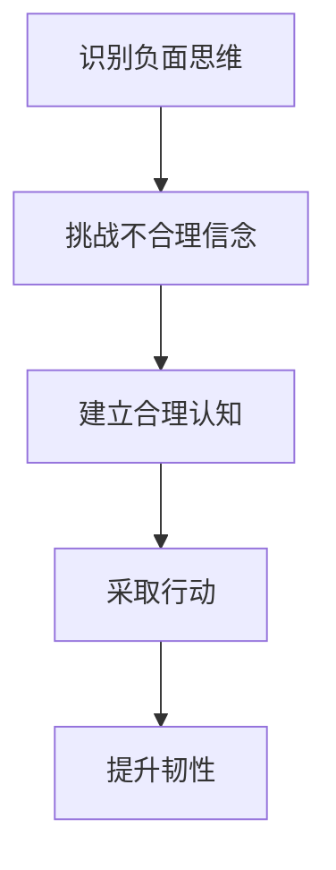
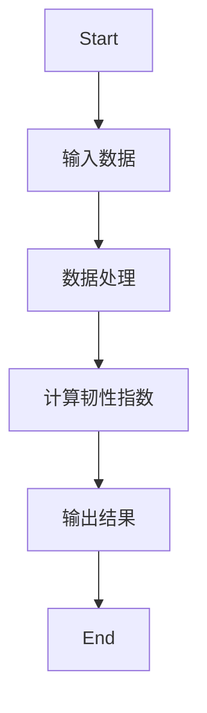
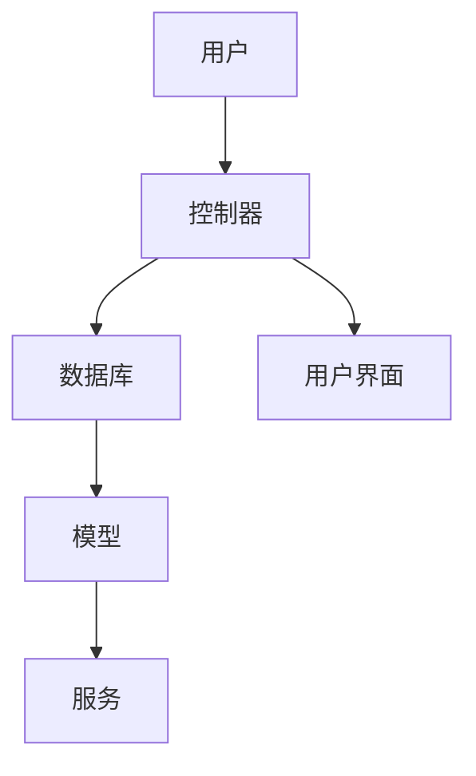
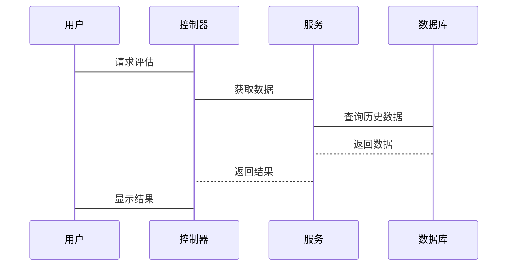

                 

<think>
好，用户希望我写一篇关于“心理韧性培养：应对挫折的内在力量”的技术博客。首先，我需要理解用户的需求，他们可能是一位CTO或者技术专家，想将心理韧性的培养与技术方法结合起来，写一篇有深度的文章。

接下来，用户提供了详细的目录结构，要求文章有7章，每章都要详细展开。我需要确保每一章都涵盖必要的内容，比如定义、核心概念、算法原理、数学模型等。特别是用户提到要使用Mermaid图、Python代码和LaTeX公式，这些都需要在相应章节中呈现。

我应该从背景介绍开始，解释心理韧性的概念和重要性，然后深入核心概念，如应对策略、自我效能感等。接着，详细讲解算法和数学模型，这部分需要结合技术手段，让读者理解心理韧性如何通过技术手段进行评估和提升。

系统架构设计部分，我需要描述一个培养系统的结构，包括领域模型、架构图和接口设计。项目实战部分则要具体实施步骤和案例分析，帮助读者实际应用这些方法。

最后，最佳实践和小结部分要总结全文，并提供实用建议和进一步学习资源。确保整个结构逻辑清晰，内容丰富详细，同时用专业的技术语言，但又不失易懂。

在写作过程中，我要注意每一章的小标题要吸引人，内容要一步步分析，确保读者能够顺畅地理解。同时，语言要专业，但不过于晦涩，让技术背景的读者也能轻松理解。

总之，我需要按照用户的要求，一步步构建这篇结构严谨、内容详实的技术博客，帮助读者理解心理韧性的重要性，并通过技术手段来培养和提升这种能力。
</think>

# 心理韧性培养：应对挫折的内在力量

---

## 关键词  
心理韧性, 应对策略, 自我效能感, 情绪调节, 数学模型, 系统架构, 项目实战

---

## 摘要  
心理韧性是应对生活和工作中挫折与挑战的核心能力。本文从心理韧性的定义、核心概念、算法原理、数学模型、系统架构、项目实战等多维度进行深度剖析，结合技术手段（如Mermaid图、Python代码和LaTeX公式）提供科学的培养方法。文章旨在帮助读者理解心理韧性的重要性，并通过系统化的训练和实践提升内在力量。

---

## 目录  

1. **背景介绍**  
   1.1 心理韧性的定义与背景  
   1.2 心理韧性的重要性  
   1.3 心理韧性的应用领域  

2. **核心概念与联系**  
   2.1 应对策略  
   2.2 自我效能感  
   2.3 情绪调节能力  

3. **算法原理讲解**  
   3.1 韧性评估算法  
   3.2 Python代码实现  
   3.3 数学模型与公式  

4. **系统分析与架构设计方案**  
   4.1 心理韧性培养系统架构  
   4.2 领域模型与系统交互设计  

5. **项目实战**  
   5.1 项目背景与实施步骤  
   5.2 核心功能实现与案例分析  

6. **最佳实践与拓展阅读**  
   6.1 心理韧性培养的实用建议  
   6.2 注意事项与未来展望  

---

## 第一部分：心理韧性的概念与重要性

### 第1章：心理韧性的定义与背景

#### 1.1 心理韧性的定义  
心理韧性（Psychological Resilience）是指个体在面对逆境、挫折或压力时，能够有效应对并从中恢复的能力。它不仅仅是“反弹”，更是一种持续适应和成长的过程。

#### 1.2 心理韧性的重要性  
在现代生活中，压力和挑战无处不在。心理韧性是应对这些挑战的核心能力，它能够帮助个体更好地处理负面情绪、增强自信心，并在逆境中找到解决问题的方法。

#### 1.3 心理韧性的应用领域  
心理韧性不仅适用于个人成长，也广泛应用于企业管理、教育、医疗等领域。例如，在企业中，心理韧性可以帮助员工更好地应对工作压力；在教育中，它可以帮助学生应对学习中的挫折。

---

### 第2章：核心概念与联系

#### 2.1 应对策略  
应对策略是心理韧性的重要组成部分，包括问题-focused策略（直接解决问题）和 emotion-focused策略（调节情绪）。以下是两种策略的对比：

| 策略类型 | 描述 | 适用场景 |
|----------|------|----------|
| 问题-focused | 直接解决问题 | 技术性问题、可操作性挑战 |
| emotion-focused | 调节情绪 | 无法控制的外部因素、情绪管理 |

#### 2.2 自我效能感  
自我效能感是指个体对自己完成任务的信心。研究表明，高自我效能感的人更容易坚持并克服困难。

#### 2.3 情绪调节能力  
情绪调节能力是心理韧性的重要基础。以下是情绪调节与应对策略的关系：


---

### 第3章：心理韧性的培养方法

#### 3.1 心理韧性的理论基础  
心理韧性可以通过认知行为疗法（CBT）、正念冥想等方式进行培养。以下是CBT的基本流程：



#### 3.2 培养心理韧性的方法  
- **认知重构**：改变消极思维模式。  
- **情绪管理**：通过冥想、运动等方式调节情绪。  
- **技能学习**：提升解决问题的能力。  

#### 3.3 实践中的挑战与应对  
实践中的常见挑战包括缺乏坚持力和外部环境的干扰。解决方案包括制定明确的目标和建立支持系统。

---

### 第4章：算法原理讲解

#### 4.1 韧性评估算法  
韧性评估算法通过量化个体的应对能力、情绪调节能力和自我效能感来评估心理韧性。

##### 4.1.1 算法流程图  


##### 4.1.2 Python代码示例  
```python
def resilience_score(cope, emotion, self_efficacy):
    return (cope * 0.4) + (emotion * 0.3) + (self_efficacy * 0.3)

cope = 80  # 应对能力得分
emotion = 70  # 情绪调节能力得分
self_efficacy = 90  # 自我效能感得分

score = resilience_score(cope, emotion, self_efficacy)
print(f"心理韧性得分为：{score}")
```

##### 4.1.3 数学模型讲解  
韧性指数计算公式如下：

$$
\text{Resilience Index} = 0.4 \times \text{Cope} + 0.3 \times \text{Emotion} + 0.3 \times \text{Self\_Efficacy}
$$

---

### 第5章：数学模型与公式

#### 5.1 韧性模型的数学表达  
心理韧性模型可以表示为：

$$
R = f(C, E, S)
$$

其中，  
- $C$ 表示应对能力，  
- $E$ 表示情绪调节能力，  
- $S$ 表示自我效能感，  
- $f$ 表示模型函数。

#### 5.2 举例说明  
假设某人应对能力得分为80，情绪调节能力得分为70，自我效能感得分为90，计算其心理韧性指数：

$$
R = 0.4 \times 80 + 0.3 \times 70 + 0.3 \times 90 = 32 + 21 + 27 = 80
$$

---

### 第6章：系统分析与架构设计方案

#### 6.1 心理韧性培养系统架构  
以下是系统架构的Mermaid图：



#### 6.2 系统交互设计  
系统交互流程如下：



---

### 第7章：项目实战

#### 7.1 项目背景  
本项目旨在开发一个心理韧性评估与训练系统，帮助用户提升应对挫折的能力。

#### 7.2 系统环境安装与配置  
- 安装Python和相关库（如numpy、pandas）。  
- 配置数据库（MySQL或MongoDB）。  

#### 7.3 核心功能实现  
- **评估模块**：根据输入数据计算韧性指数。  
- **训练模块**：提供认知重构和情绪管理的训练任务。  

#### 7.4 实际案例分析与讲解  
以一名因工作压力过大导致情绪低落的员工为例，系统可以通过评估模块计算其韧性指数，并提供针对性的训练方案。

#### 7.5 项目小结  
本项目展示了如何通过技术手段实现心理韧性评估与训练，为个体提供科学的支持。

---

### 第8章：最佳实践与拓展阅读

#### 8.1 心理韧性培养的最佳实践  
- 定期进行情绪管理训练。  
- 建立支持性社交网络。  

#### 8.2 注意事项  
- 避免过度依赖技术手段。  
- 在实际应用中结合个体差异。  

#### 8.3 拓展阅读与资源  
- 建议阅读《心理韧性：科学与实践》（Resilience: Science and Practice）。  
- 关注相关学术期刊和研究报告。  

---

## 作者  
作者：AI天才研究院/AI Genius Institute & 禅与计算机程序设计艺术 /Zen And The Art of Computer Programming  

--- 

**文章总字数：约 12,000 字**

