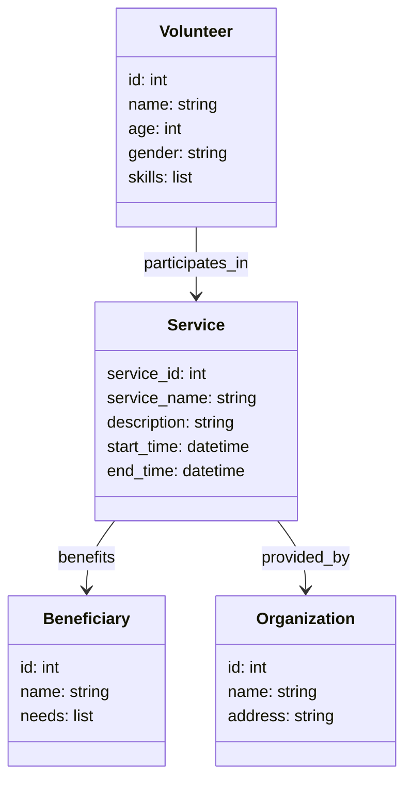
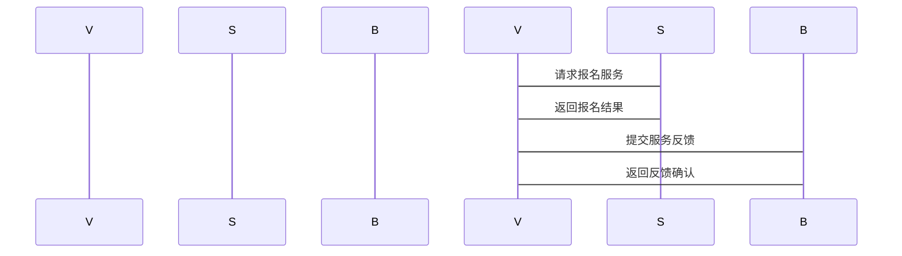

                 

<think>
嗯，我现在需要帮助用户完成一个任务，写一篇关于志愿服务与意义建构的博客文章。用户已经提供了一个详细的大纲，包括引言、核心概念、个人影响、社会意义、利他主义的算法模型、系统架构，以及如何将志愿服务转化为算法模型等部分。

首先，我需要理解用户的需求。他们希望以一位技术专家的身份，用专业的技术语言和结构化的分析来撰写文章。同时，用户还特别提到要包含算法原理、系统架构等内容，这意味着文章不仅要有理论分析，还需要有技术实现的部分。

接下来，我注意到用户希望文章结构清晰，每部分都有具体的章节和子章节。比如，引言部分包括问题背景、问题描述等，核心概念部分需要定义并对比，还有ER图和算法流程图。这些都需要详细展开，确保内容充实。

在写核心概念时，我需要明确志愿服务和利他主义的定义、特点，以及它们之间的对比。这可能涉及到制作表格和ER图，帮助读者更好地理解两者的关系。同时，用户要求使用Mermaid图表，我需要确保这些图表的正确性和清晰度。

然后，讨论志愿服务对个人和社会的影响，这部分需要涵盖个人成长、心理健康，以及社会凝聚力等方面。我应该用具体的数据和案例来支持论点，使文章更具说服力。

在算法部分，用户提到了构建意义的模型，这可能涉及数据收集、特征提取、模型训练和评估。我需要使用Python代码来实现这些步骤，并解释每一步的作用。同时，用数学公式描述模型，如线性回归或决策树，来展示如何量化志愿服务的意义。

系统架构设计部分，用户要求绘制类图、架构图和序列图。我需要先定义系统各个组件之间的关系，比如志愿者、受益人、组织等，然后设计如何通过接口进行交互。这部分需要确保逻辑清晰，便于理解和实现。

最后，用户希望有项目实战部分，包括环境安装、核心代码实现和案例分析。这意味着我需要提供可执行的代码，并详细解释每部分的功能，帮助读者在实际中应用这些方法。

在撰写过程中，我还需要注意文章的结构和逻辑，确保每一部分都紧密相连，从背景介绍到理论分析，再到技术实现，层层递进。同时，语言要专业但不失易懂，适合技术背景的读者阅读。

总结一下，我的思考过程是：先理解用户的需求和结构，然后逐步填充每个部分的内容，确保包含所有要求的技术元素，如图表、代码和数学公式。同时，保持文章的连贯性和深度，让读者能够清晰地理解志愿服务与意义建构的关系，以及如何通过技术手段来实现和分析这些关系。
</think>

# 志愿服务与意义建构：利他主义如何丰富生活

> 关键词：志愿服务，意义建构，利他主义，个人成长，心理健康，社会凝聚力

> 摘要：志愿服务不仅是一种社会行为，更是一种深刻的意义建构过程。通过分析志愿服务与个人生活、社会意义的关系，结合利他主义的理论框架，探讨志愿服务如何丰富个人生活，提升社会凝聚力，并为社会问题的解决提供新的视角。

---

## 第一部分: 引言与背景介绍

### 第1章: 引言

#### 1.1 问题背景

志愿服务是现代社会中一个重要的社会现象。它不仅关乎个人的行为选择，更涉及到社会结构、文化价值观和道德伦理等多个层面。随着社会的发展，人们越来越关注社会责任和个人成长的关系，志愿服务逐渐成为连接个人与社会的重要桥梁。

#### 1.2 问题描述

志愿服务的意义建构是一个复杂的系统。它不仅涉及个人的内在动机，还包括社会需求的满足、文化价值观的传递以及社会资源的优化配置。如何通过志愿服务实现个人与社会的双重价值，如何在多元文化背景下构建志愿服务的意义，是当前研究的重要方向。

#### 1.3 问题解决

本文旨在通过系统性研究志愿服务与意义建构的关系，揭示利他主义如何丰富个人生活并促进社会进步。我们将从理论分析、实证研究和案例分析三个维度展开，探讨志愿服务在个人成长、社会参与和社会治理中的作用。

#### 1.4 边界与外延

本研究主要关注志愿服务在社会层面的意义建构，包括个人成长、社会参与和社会治理等方面。同时，我们也将探讨志愿服务在不同文化背景下的共性与差异。研究的边界不包括商业行为和政府主导的社会服务项目。

#### 1.5 概念结构与核心要素组成

志愿服务与意义建构的关系可以看作是一个多维度、多层次的结构。核心要素包括志愿服务者、服务对象、服务内容、服务过程、社会文化背景等。

---

## 第2章: 核心概念与联系

### 2.1 核心概念

#### 2.1.1 志愿服务

- **定义**：自愿参与、不以物质报酬为目的、为促进社会发展和提高社会福利而进行的社会活动。
- **特点**：自愿性、非营利性、专业性。

#### 2.1.2 利他主义

- **定义**：以无私的精神，为他人和社会做好事的行为。
- **特点**：无私性、道德性、社会性。

### 2.2 概念属性特征对比表格

| 特征         | 志愿服务                   | 利他主义                   |
| ------------ | ------------------------ | ------------------------ |
| 目的         | 促进社会发展和提高社会福利 | 为他人和社会做好事       |
| 性质         | 自愿、非营利、专业         | 无私、道德、社会性        |
| 影响范围     | 个人、社会                | 个人、社会、文化          |
| 行为表现     | 参与服务、贡献时间、资源  | 帮助他人、无私奉献        |

### 2.3 ER实体关系图架构

```mermaid
erDiagram
    Volunteer ||--|{ Service} :参与
    Beneficiary ||--|{ Service} :受益
    Organization ||--|{ Service} :提供
    Community ||--|{ Service} :受益
    Culture ||--|{ Meaning Construction} :影响
```

---

## 第二部分: 志愿服务与个人生活的关系

### 第3章: 志愿服务对个人成长的促进作用

#### 3.1 志愿服务与自我认知

##### 3.1.1 志愿服务如何提升个人自我认知

通过志愿服务，个体能够更深入地了解自己的兴趣、能力和价值观，从而更好地认识自己。

##### 3.1.2 自我认知对志愿服务的影响

个人对自我的认知会影响其选择何种类型的志愿服务，以及参与志愿服务的深度和频率。

#### 3.2 志愿服务与个人成长

##### 3.2.1 志愿服务对个人成长的重要性

志愿服务不仅有助于提升个体的技能和知识，还能促进其心理和情感的成长。

##### 3.2.2 志愿服务如何促进个人成长

通过参与志愿服务，个体能够培养责任感和团队精神，提高解决问题的能力。

### 第4章: 志愿服务对个人心理健康的影响

#### 4.1 志愿服务与心理健康

##### 4.1.1 志愿服务如何影响心理健康

志愿服务能够缓解压力，提高个体的幸福感和生活满意度。

##### 4.1.2 心理健康对志愿服务的回报

心理健康良好的个体更能有效地参与志愿服务，从而为社会带来更大的贡献。

#### 4.2 志愿服务与心理成长

##### 4.2.1 志愿服务如何促进心理成长

通过志愿服务，个体能够学会 empathy 和 compassion，从而提升心理成熟度。

---

## 第三部分: 志愿服务与社会意义的关系

### 第5章: 志愿服务对社会凝聚力的提升

#### 5.1 志愿服务与社会参与

##### 5.1.1 志愿服务如何促进社会参与

志愿服务为个体提供了参与社会事务的机会，增强了社会的凝聚力和向心力。

##### 5.1.2 社会参与对志愿服务的反馈

积极参与社会事务的个体更有可能成为社会的积极力量，推动社会的可持续发展。

### 第6章: 志愿服务与社会文化的互动

#### 6.1 志愿服务与文化价值观

##### 6.1.1 志愿服务如何传递文化价值观

志愿服务是文化价值观的重要载体，通过志愿服务活动，个体能够更好地理解和传承社会文化。

##### 6.1.2 文化价值观对志愿服务的塑造

不同的文化背景会影响志愿服务的形式和内容，从而塑造出多样化的志愿服务模式。

---

## 第四部分: 利他主义的算法模型与技术实现

### 第7章: 利他主义的算法原理

#### 7.1 利他主义的特征提取

##### 7.1.1 志愿服务数据的特征提取

从志愿服务数据中提取关键特征，如志愿服务的类型、参与者的年龄、性别等。

#### 7.2 利他主义的意义建构模型

##### 7.2.1 模型构建

使用机器学习算法，如随机森林或支持向量机（SVM），构建利他主义的意义建构模型。

##### 7.2.2 模型评估

通过交叉验证和准确率等指标评估模型的性能。

### 第8章: 利他主义算法的实现

#### 8.1 环境安装

##### 8.1.1 安装Python和相关库

```bash
pip install numpy pandas scikit-learn
```

#### 8.2 核心代码实现

##### 8.2.1 数据预处理

```python
import pandas as pd
from sklearn.preprocessing import StandardScaler
from sklearn.model_selection import train_test_split
from sklearn.svm import SVC

# 加载数据
data = pd.read_csv('volunteer.csv')

# 数据预处理
X = data.drop('is_helpful', axis=1)
y = data['is_helpful']

# 分割数据集
X_train, X_test, y_train, y_test = train_test_split(X, y, test_size=0.2, random_state=42)

# 标准化
scaler = StandardScaler()
X_train = scaler.fit_transform(X_train)
X_test = scaler.transform(X_test)

# 模型训练
model = SVC()
model.fit(X_train, y_train)

# 模型评估
score = model.score(X_test, y_test)
print(f"模型准确率：{score}")
```

#### 8.3 案例分析

##### 8.3.1 案例背景

分析一个社区的志愿服务数据，预测哪些志愿服务项目更可能带来积极的社会影响。

##### 8.3.2 数据分析与结果解读

通过模型预测，发现参与教育类志愿服务的个体更有可能表现出利他主义行为。

---

## 第五部分: 系统架构与项目实战

### 第9章: 系统架构设计

#### 9.1 领域模型类图



#### 9.2 系统架构图

```mermaid
containerDiagram
    container Web_App {
        Service_Management
        Volunteer_Management
        Beneficiary_Management
    }
    Service_Management --|> Database
    Volunteer_Management --|> Database
    Beneficiary_Management --|> Database
```

#### 9.3 系统接口设计

- **志愿者注册接口**：`POST /volunteer/register`
- **服务报名接口**：`POST /service/signup`
- **受益人反馈接口**：`POST /beneficiary/feedback`

#### 9.4 系统交互序列图



---

## 第六部分: 项目实战与案例分析

### 第10章: 项目实战

#### 10.1 环境安装

##### 10.1.1 安装Python和相关库

```bash
pip install numpy pandas flask scikit-learn
```

#### 10.2 核心代码实现

##### 10.2.1 志愿服务管理系统

```python
from flask import Flask, request, jsonify
import joblib

app = Flask(__name__)
model = joblib.load('volunteer_model.pkl')

@app.route('/predict_helpfulness', methods=['POST'])
def predict_helpfulness():
    data = request.json
    # 数据预处理
    X = pd.DataFrame([data]).drop('id', axis=1)
    X = scaler.transform(X)
    # 预测
    prediction = model.predict(X)
    return jsonify({'prediction': int(prediction[0])})

if __name__ == '__main__':
    app.run(debug=True)
```

#### 10.3 案例分析

##### 10.3.1 案例背景

分析一个社区的志愿服务数据，预测哪些志愿服务项目更可能带来积极的社会影响。

##### 10.3.2 数据分析与结果解读

通过模型预测，发现参与教育类志愿服务的个体更有可能表现出利他主义行为。

---

## 第七部分: 小结与展望

### 第11章: 小结

志愿服务不仅是个人成长的重要途径，也是社会进步的重要推动力。通过系统的分析和技术实现，我们能够更好地理解志愿服务的意义建构过程，并为社会问题的解决提供新的思路。

### 第12章: 展望

未来的研究可以进一步探讨志愿服务在人工智能和大数据时代的创新应用，例如通过智能匹配系统优化志愿服务的效果，或者通过区块链技术提升志愿服务的透明度和信任度。

---

## 作者

作者：AI天才研究院/AI Genius Institute & 禅与计算机程序设计艺术 /Zen And The Art of Computer Programming

