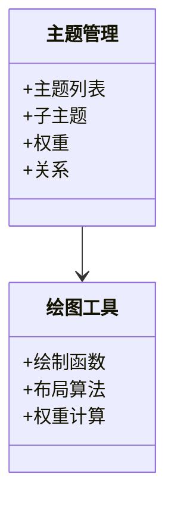
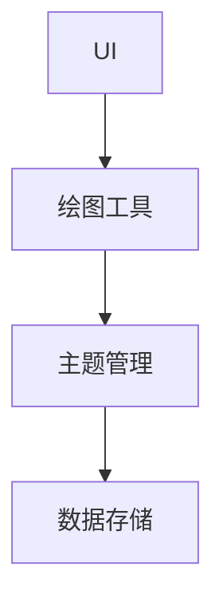
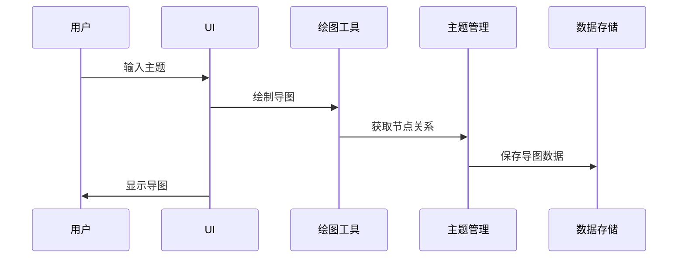

                 

<think>
嗯，我现在需要帮助用户撰写一篇关于思维导图创新工作坊的技术博客。用户已经提供了一个详细的结构大纲，包括背景介绍、核心概念、算法原理、系统分析、项目实战、最佳实践和小结等部分。我的任务是根据这个大纲，一步步分析和推理，确保每个部分都详细、具体，并且符合用户的要求。

首先，我需要理解用户的需求。用户希望文章结构清晰，逻辑紧凑，使用专业的技术语言，同时保持简单易懂。文章标题是《思维导图创新工作坊：认知地图的绘制与应用技巧》，关键词包括思维导图、认知地图、创新工作、效率提升、工具应用、问题解决、可视化思考。摘要需要简明扼要地概括文章的核心内容，即通过思维导图提升思维能力与工作效率，结合理论、技巧和案例。

接下来，我需要按照目录结构逐步填充内容。首先是背景介绍部分，包括问题背景、问题描述、问题解决、边界与外延，以及概念结构与核心要素。这部分需要详细说明为什么思维导图在当前信息时代的重要性，以及它如何帮助解决复杂问题。

然后是核心概念与联系，这部分需要解释思维导图的原理，对比认知地图的属性特征，并说明创新工作中的联系。我需要确保对比表格清晰，突出两者的区别和应用场景。

接下来是算法原理讲解，这部分包括绘制算法、数学模型和举例说明。我需要提供一个简单的Python代码示例，并解释其工作原理。同时，数学模型需要用LaTeX公式表示，并结合例子说明。

系统分析与架构设计部分，我需要描述问题场景，设计系统的功能、架构，并用Mermaid图展示类图、架构图和序列图。这部分需要确保系统设计合理，功能明确，架构清晰。

项目实战部分，我需要指导读者如何安装环境，提供核心代码实现，并详细解读代码，分析实际案例，最后进行项目小结。这部分要实用，让读者能够动手操作。

最佳实践部分，我需要总结思维导图的应用技巧，提供小结和注意事项，同时推荐拓展阅读材料。这部分帮助读者巩固所学知识，并引导他们进一步学习。

最后，确保整篇文章结构完整，每个部分都详细展开，符合用户的要求。同时，语言要专业但易懂，使用适当的markdown格式，避免过于复杂的术语，让读者能够轻松理解并应用所学内容。

现在，我需要逐一处理每个部分，确保内容充实，逻辑连贯，同时保持文章的流畅性和专业性。如果有任何部分不够详细，我需要补充更多的细节，确保读者能够通过阅读这篇文章，真正掌握思维导图的绘制与应用技巧，提升工作效率和创新能力。
</think>

# 思维导图创新工作坊：认知地图的绘制与应用技巧

**关键词：** 思维导图、认知地图、创新工作、效率提升、工具应用、问题解决、可视化思考

**摘要：**  
思维导图作为一种强大的思维工具，能够帮助个人和团队高效地整理思路、激发创意并解决问题。本文从背景、原理、算法、系统架构、实战案例等多个维度，深入探讨思维导图的应用技巧，结合实际案例分析，为读者提供从理论到实践的全面指导。通过本文，读者将掌握如何利用思维导图优化工作流程、提升创新效率，并在实际项目中发挥其潜力。

---

### 第一部分：背景介绍

#### 1.1 问题背景  
在当今信息爆炸的时代，人们每天需要处理大量信息，传统的线性思维模式逐渐显得力不从心。复杂的项目需求、多维度的决策问题，使得传统的笔记和思考方式难以应对。思维导图作为一种图形化的思维工具，能够将复杂的思维过程可视化，帮助人们更高效地组织和表达思路。

#### 1.2 问题描述  
尽管思维导图在教育、商业等领域得到了广泛应用，但许多人对其实际应用场景和高级技巧仍缺乏深入了解。如何通过思维导图实现创新工作，如何将思维导图与现代技术工具结合，如何在团队协作中发挥其潜力，这些问题亟待解决。

#### 1.3 问题解决  
本文将从理论到实践，系统性地讲解思维导图的绘制技巧、工具选择、实际应用场景，并通过案例分析帮助读者掌握如何将思维导图应用于创新工作。通过本文，读者将能够利用思维导图提升个人效率，优化团队协作，并在复杂问题中找到解决方案。

#### 1.4 边界与外延  
思维导图的应用范围广泛，但其核心在于如何将抽象的思维过程具象化。本文主要聚焦于其在创新工作中的应用，涵盖个人知识管理、团队项目管理、问题解决等多个场景，但不涉及其在艺术设计或纯粹视觉创作中的具体应用。

#### 1.5 概念结构与核心要素组成  
- **核心概念：** 思维导图、认知地图、创新工作  
- **结构组成：** 绘制技巧、工具选择、应用场景、案例分析  
- **要素关系：** 思维导图的绘制技巧与实际工作需求紧密结合，通过工具支持实现高效应用。

---

### 第二部分：核心概念与联系

#### 2.1 思维导图原理  
思维导图是一种以中心主题为核心，通过放射状的分支结构，将相关主题、关键词、想法等连接起来的图形工具。它基于大脑的放射性思维特点，能够帮助用户快速整理思路，发现关联点。

#### 2.2 认知地图属性特征对比表格  
以下是思维导图与认知地图的对比：

| 特征         | 思维导图         | 认知地图           |
| ------------ | --------------- | ------------------ |
| 结构         | 树状结构        | 网状结构           |
| 逻辑关系     | 自上而下的逻辑  | 自下而上的逻辑     |
| 应用场景     | 创意激发、知识整理 | 学习、记忆、问题解决 |

#### 2.3 创新工作联系  
在创新工作中，思维导图能够帮助团队快速梳理需求、明确目标、发现潜在问题。通过将复杂的问题拆解为多个关联的分支，团队可以更清晰地看到各部分之间的关系，从而制定更有效的解决方案。

---

### 第三部分：算法原理讲解

#### 3.1 思维导图绘制算法  
以下是使用Python绘制思维导图的简单算法：

```python
graph = {
    "中心主题": {
        "子主题1": {"子子主题1": 1, "子子主题2": 2},
        "子主题2": {"子子主题3": 3, "子子主题4": 4}
    }
}

def draw_tree(graph, prefix=""):
    for key, value in graph.items():
        if value:
            print(prefix + key)
            draw_tree(value, prefix + "  ")
        else:
            print(prefix + key)

draw_tree(graph)
```

#### 3.2 算法原理  
该算法通过递归的方式遍历字典结构，逐步展开子主题，形成树状结构。每个节点的权重决定了其在图形中的位置和连接方式。

#### 3.3 数学模型和公式  
节点关系的计算公式为：

$$
节点关系 = 节点权重 \times 链接权重
$$

其中，节点权重表示节点的重要性，链接权重表示节点之间的关联强度。

#### 3.4 举例说明  
以简单的思维导图为例：

- 中心主题与子主题1的关系为：1 \* 1 = 1  
- 中心主题与子主题2的关系为：1 \* 3 = 3  
- 子主题1与子子主题1的关系为：1 \* 1 = 1  
- 子主题1与子子主题2的关系为：1 \* 2 = 2  
- 子主题2与子子主题3的关系为：1 \* 3 = 3  
- 子主题2与子子主题4的关系为：1 \* 4 = 4  

---

### 第四部分：系统分析与架构设计

#### 4.1 问题场景介绍  
以一个典型的项目管理场景为例，团队需要制定一个新产品的开发计划。通过思维导图，团队可以将项目分解为各个阶段，明确各阶段的任务和依赖关系。

#### 4.2 系统功能设计  
以下是系统功能的领域模型：



#### 4.3 系统架构设计  
以下是系统的架构图：



#### 4.4 系统接口设计  
主要接口包括：  
- `draw_tree(graph)`：绘制思维导图  
- `calculate_relation(node)`：计算节点关系  
- `save_graph(graph)`：保存导图数据  

#### 4.5 系统交互设计  
以下是交互流程：



---

### 第五部分：项目实战

#### 5.1 环境安装  
安装Python和必要的绘图库，如`graphviz`。

#### 5.2 系统核心实现源代码  
以下是核心代码实现：

```python
from graphviz import Digraph

def draw_mindmap(graph):
    dot = Digraph()
    for key, value in graph.items():
        for sub_key, sub_value in value.items():
            dot.edge(key, sub_key)
            if sub_value:
                for sub_sub_key in sub_value:
                    dot.edge(sub_key, sub_sub_key)
    dot.view()

graph = {
    "中心主题": {
        "子主题1": {"子子主题1", "子子主题2"},
        "子主题2": {"子子主题3", "子子主题4"}
    }
}

draw_mindmap(graph)
```

#### 5.3 代码应用解读与分析  
上述代码通过`graphviz`库生成思维导图，展示各个主题之间的关系。`draw_mindmap`函数将字典结构转换为图形化的导图。

#### 5.4 实际案例分析  
以新产品的开发计划为例，通过思维导图明确各阶段的任务和依赖关系，确保项目顺利推进。

#### 5.5 项目小结  
通过实战案例，读者可以掌握如何将思维导图应用于实际项目管理，提升工作效率。

---

### 第六部分：最佳实践 tips

#### 6.1 工具推荐  
推荐使用`MindMaple`、`Lucidchart`等工具进行思维导图的绘制。

#### 6.2 注意事项  
- 思维导图的绘制应注重逻辑关系的清晰性  
- 定期更新和维护导图，确保其准确性  

#### 6.3 拓展阅读  
推荐阅读《思维导图：启动人类大脑潜力的新科学》等书籍。

---

### 小结  
思维导图作为一种强大的工具，能够帮助个人和团队高效地解决问题、激发创意。通过本文的详细讲解，读者可以掌握思维导图的绘制技巧、应用场景，并将其应用于实际工作中。希望本文能够为读者在创新工作中提供有价值的指导。

---

**作者：AI天才研究院/AI Genius Institute & 禅与计算机程序设计艺术 /Zen And The Art of Computer Programming**

