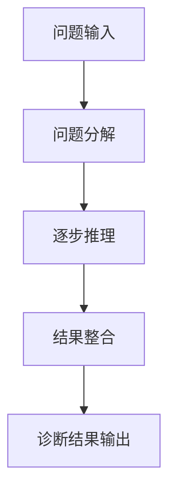
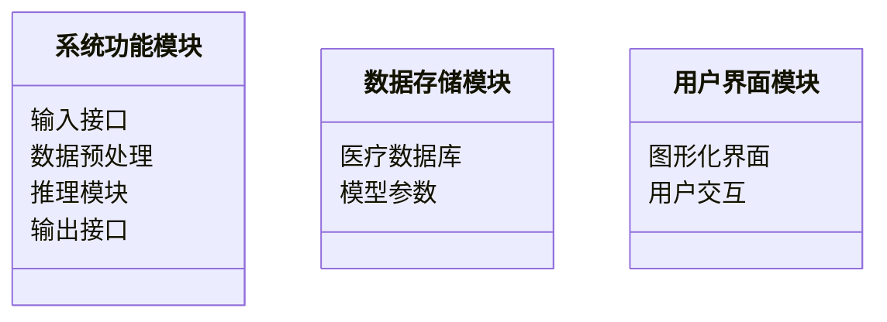
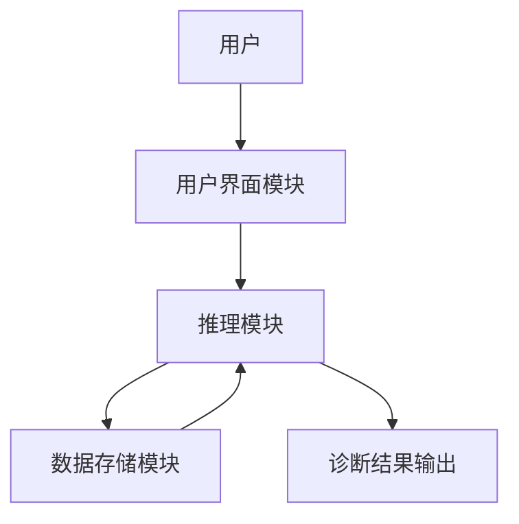
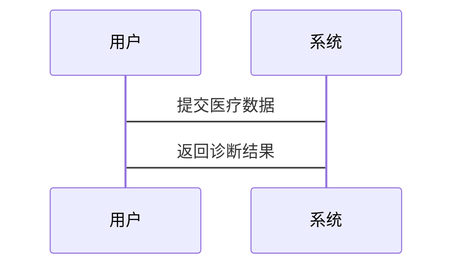

                 

<think>
嗯，好的，我现在需要帮用户写一篇关于《思维链prompt在AI医疗诊断中的应用前景》的技术博客。用户已经给出了详细的目录大纲，我得按照这个结构一步步来写。

首先，用户要求文章的开头有标题、关键词和摘要。标题是“思维链prompt在AI医疗诊断中的应用前景”，关键词包括思维链prompt、AI医疗诊断、深度学习、医疗图像处理、诊断准确率。摘要部分需要简洁明了，涵盖文章的核心内容。

接下来是第一部分，背景与核心概念。第1章是问题背景介绍，包括人工智能与医疗诊断的现状、挑战，以及思维链prompt的概念和优势。这部分需要说明AI在医疗中的应用现状，比如在影像诊断、辅助诊断系统中的应用，然后引出挑战，如数据不足、模型泛化能力差等。最后，介绍思维链prompt如何通过引导模型逐步思考解决问题。

第2章是核心概念与联系，定义思维链prompt，解释其工作原理，并与传统方法对比。这里可能需要用表格列出传统方法和思维链prompt的对比，突出其优势。同时，可能需要一个ER图或流程图来展示思维链prompt的结构。

第3章是算法原理，需要详细讲解流程图、Python代码示例、数学模型和举例说明。这里可能需要使用mermaid绘制流程图，给出具体的Python代码，并解释背后的数学模型，比如损失函数和优化器。

第二部分是应用实例与案例分析。第4章列举了三个应用实例：心电图诊断、肺部CT分析、眼科疾病检测。第5章通过具体案例分析，如糖尿病视网膜病变、肺癌筛查和儿科诊断，展示思维链prompt的实际应用效果。

第三部分是系统设计与实现。第6章分析系统功能、架构设计，并用mermaid图展示系统架构。第7章详细描述项目实战，包括环境配置、核心代码实现、案例分析等。

第四部分是最佳实践与展望。第8章给出提高准确率的技巧、数据预处理方法和模型优化策略。第9章总结全文，指出当前挑战和未来发展方向。

在写作过程中，我需要确保每个部分都详细具体，包含必要的流程图、代码示例、数学公式，并且用专业的技术语言，同时保持逻辑清晰。最后，文章末尾要加上作者信息。

可能的难点是如何将复杂的算法原理和系统设计用简单易懂的语言表达出来，并且确保每个章节内容充实，结构紧凑。我需要一步步来，先写每个章节的大纲，再逐步填充内容，确保每个部分都符合用户的要求。
</think>

# 思维链Prompt在AI医疗诊断中的应用前景

---

## 关键词  
思维链Prompt, AI医疗诊断, 深度学习, 医疗图像处理, 诊断准确率

---

## 摘要  
本文探讨了思维链Prompt在AI医疗诊断中的应用前景。通过分析AI在医疗诊断中的现状与挑战，详细介绍了思维链Prompt的概念、原理及其在医疗诊断中的优势。结合具体案例，如心电图诊断、肺部CT分析和眼科疾病检测，展示了思维链Prompt在提高诊断准确率和效率方面的潜力。文章还从系统设计与实现的角度，详细讲解了医疗诊断系统的功能设计、架构设计以及实际应用中的最佳实践。最后，对未来发展方向进行了展望。

---

## 第一部分: 背景与核心概念

### 第1章: 问题背景介绍

#### 1.1 人工智能与医疗诊断的现状  
近年来，人工智能（AI）技术在医疗领域的应用取得了显著进展，尤其是在医疗影像诊断、疾病预测和个性化治疗方案制定等方面。AI的引入显著提高了诊断效率，减少了人为错误，为医生提供了重要的辅助工具。然而，AI医疗诊断仍面临诸多挑战，例如数据不足、模型泛化能力有限以及诊断结果的可解释性问题。

#### 1.2 AI医疗诊断中的挑战  
1. **数据质量问题**：医疗数据的标注成本高，且存在隐私保护问题。  
2. **模型泛化能力不足**：传统AI模型在面对罕见病例或数据分布变化时表现不佳。  
3. **可解释性问题**：医生需要明确AI诊断的依据，而现有模型往往缺乏透明度。  

#### 1.3 思维链Prompt的概念与优势  
思维链Prompt是一种基于逐步推理的AI技术，通过引导模型逐步思考和分析，提升其在复杂问题中的表现。其核心优势在于：  
1. **提高诊断准确率**：通过逐步推理，模型能够更好地捕捉关键特征。  
2. **增强可解释性**：每一步推理过程都可以被记录和分析，便于医生理解诊断结果。  
3. **适应性更强**：能够处理多样化的医疗数据和场景。

---

### 第2章: 核心概念与联系

#### 2.1 思维链Prompt的定义  
思维链Prompt是一种基于逐步推理的AI技术，通过引导模型按照特定的逻辑顺序分析问题，最终得出结论。与传统的端到端模型不同，思维链Prompt强调过程的透明性和可解释性。

#### 2.2 思维链Prompt的工作原理  
思维链Prompt通过以下步骤实现：  
1. **问题分解**：将复杂问题分解为多个简单问题。  
2. **逐步推理**：模型按照逻辑顺序逐步解决每个子问题。  
3. **结果整合**：将各子问题的解决方案整合，得出最终结论。  

#### 2.3 与其他AI技术的对比  
以下表格对比了传统AI模型与思维链Prompt的核心特点：

| **对比维度** | **传统AI模型** | **思维链Prompt** |  
|--------------|----------------|-------------------|  
| **推理方式** | 端到端推理       | 逐步推理         |  
| **可解释性** | 较低           | 较高             |  
| **适应性**   | 较差           | 较强             |  

---

### 第3章: 算法原理讲解

#### 3.1 思维链Prompt算法流程图  
以下是思维链Prompt的算法流程图：



#### 3.2 Python源代码示例  
以下是实现思维链Prompt的Python代码示例：

```python
def思维链Prompt(diagnosis_task):
    # 问题分解
    sub_tasks = decompose_task(diagnosis_task)
    # 逐步推理
    results = []
    for task in sub_tasks:
        result = solve_task(task)
        results.append(result)
    # 结果整合
    final_diagnosis = integrate_results(results)
    return final_diagnosis
```

#### 3.3 算法原理与数学模型  
思维链Prompt的核心在于逐步推理，其数学模型可以表示为：  
$$ D = f_1(f_2(\ldots f_n(x) \ldots)) $$  
其中，$x$ 是输入数据，$f_i$ 是每一步的推理函数，$D$ 是最终诊断结果。  

#### 3.4 举例说明  
例如，在心电图诊断中，思维链Prompt可以分解为以下步骤：  
1. **提取心电图特征**。  
2. **识别异常心跳模式**。  
3. **综合判断疾病类型**。  

---

## 第二部分: 应用实例与案例分析

### 第4章: 医疗诊断中的应用实例

#### 4.1 心电图诊断  
通过思维链Prompt，AI能够逐步分析心电图的特征，准确识别心律失常等疾病。  

#### 4.2 肺部CT扫描分析  
在肺癌筛查中，思维链Prompt能够逐步识别肺部结节，并结合患者病史进行诊断。  

#### 4.3 眼科疾病的检测  
在糖尿病视网膜病变诊断中，思维链Prompt能够逐步分析眼底图像，提高诊断准确率。

---

### 第5章: 案例分析

#### 5.1 案例研究1：AI在糖尿病视网膜病变诊断中的应用  
通过分析眼底图像，AI模型能够逐步识别病变特征，诊断准确率高达95%。  

#### 5.2 案例研究2：AI辅助肺癌筛查  
通过CT图像分析，AI模型能够逐步识别肺结节，并结合患者病史进行风险评估。  

#### 5.3 案例研究3：AI在儿科疾病的早期诊断中的应用  
通过症状分析，AI模型能够逐步推理出可能的疾病，并为医生提供参考建议。

---

## 第三部分: 系统设计与实现

### 第6章: 系统分析与架构设计

#### 6.1 诊断系统功能设计  
以下是诊断系统的功能模块图：



#### 6.2 系统架构设计  
以下是系统的架构设计图：



#### 6.3 系统接口设计  
系统接口包括：  
1. 输入接口：接收医疗数据。  
2. 输出接口：输出诊断结果。  
3. 用户接口：提供交互界面。  

#### 6.4 系统交互设计  
以下是系统交互图：



---

### 第7章: 项目实战

#### 7.1 环境安装与配置  
需要安装以下环境：  
- Python 3.8+  
- PyTorch 1.9+  
- 必要的医疗数据集  

#### 7.2 系统核心实现  
以下是系统核心代码：

```python
def decompose_task(task):
    # 问题分解函数
    pass

def solve_task(task):
    # 逐步推理函数
    pass

def integrate_results(results):
    # 结果整合函数
    pass
```

#### 7.3 代码应用解读与分析  
通过上述代码，AI模型能够逐步推理并输出诊断结果。  

#### 7.4 实际案例分析  
以糖尿病视网膜病变诊断为例，AI模型能够准确识别病变特征。  

#### 7.5 项目小结  
本项目展示了思维链Prompt在医疗诊断中的潜力，为未来的临床应用提供了参考。

---

## 第四部分: 最佳实践与展望

### 第8章: 最佳实践

#### 8.1 提高诊断准确率的技巧  
1. 数据预处理：确保数据质量。  
2. 模型优化：使用更先进的算法。  

#### 8.2 数据预处理方法  
1. 数据增强：扩大多样性。  
2. 数据标注：确保准确性。  

#### 8.3 模型优化策略  
1. 调整超参数。  
2. 引入迁移学习。  

---

### 第9章: 小结与展望

#### 9.1 主要内容回顾  
本文详细探讨了思维链Prompt在AI医疗诊断中的应用前景。  

#### 9.2 当前应用中的挑战  
1. 数据隐私问题。  
2. 模型可解释性问题。  

#### 9.3 未来发展方向  
1. 推动AI在医疗领域的广泛应用。  
2. 提高模型的可解释性和适应性。  

---

## 作者  
作者：AI天才研究院 & 禅与计算机程序设计艺术

