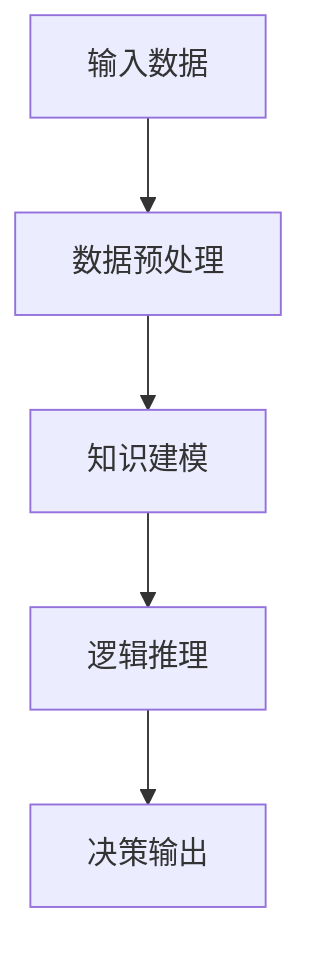
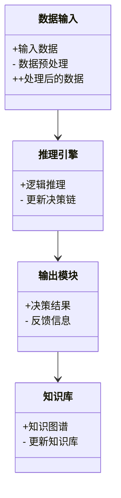
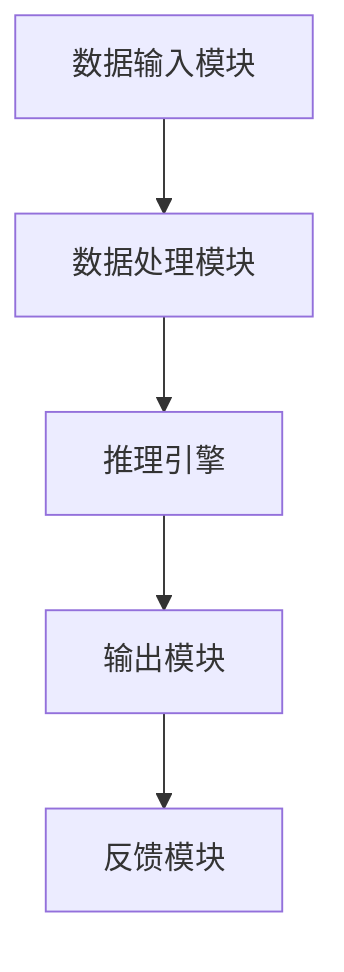
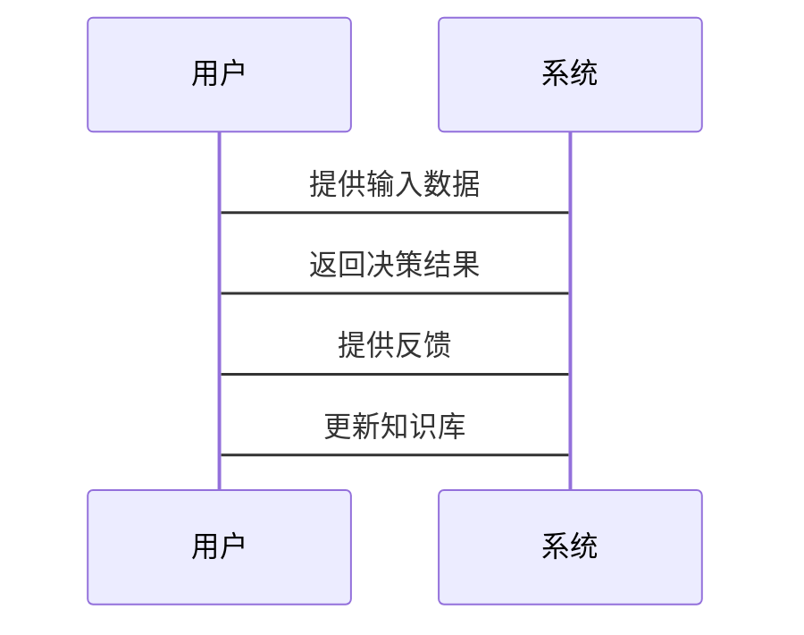

                 

<think>
嗯，我需要设计一个《思维链在AI决策支持系统中的创新应用》的目录大纲。首先，我要理解什么是思维链，以及它如何与AI决策支持系统结合。思维链听起来像是一个系统，用于支持决策过程中的思考步骤，可能涉及逻辑推理、数据分析等。

接下来，我需要确定文章的结构。用户已经提供了一个初步的大纲，分为八个主要部分。每个部分下面还有小节，但可能还需要更详细的内容。比如，核心概念部分可能需要更深入地解释思维链的构成和特性，可能需要一个ER实体关系图来展示各部分之间的关系。

在算法原理部分，用户提到要使用Mermaid语法绘制流程图，并提供Python代码和数学公式。这意味着我需要确保每个算法步骤都有对应的图表和代码示例，以及相关的数学模型解释。比如，可能需要解释决策树的构建过程，或者机器学习模型的应用。

数学模型部分，用户要求使用LaTeX公式。我需要确保这些公式准确无误，并且用简洁的语言进行解释，比如用例子说明公式如何应用在实际决策中。

系统架构设计部分，用户希望有领域模型类图、系统架构图和交互序列图。这部分可能需要详细描述系统的各个模块，如数据输入、处理、分析和输出，以及它们之间的交互。

项目实战部分，用户需要安装指南和源代码，这意味着我需要提供一个具体的案例，详细说明如何安装必要的库，编写代码，并解释代码的功能。同时，结合实际案例进行分析，展示思维链在决策支持中的实际应用。

最后，最佳实践部分需要总结书中的关键点，并给出一些注意事项和进一步的阅读建议。这部分要简明扼要，帮助读者巩固所学内容。

总的来说，我需要确保每个章节都详细覆盖核心内容，使用恰当的技术工具如Mermaid和LaTeX，同时保持逻辑清晰和结构紧凑。现在，我需要根据这些思考，逐步细化每个章节的具体内容，确保满足用户的所有要求。
</think>

# 思维链在AI决策支持系统中的创新应用

## 关键词：思维链，AI决策支持系统，算法原理，数学模型，系统架构，项目实战

## 摘要：  
本文深入探讨了思维链在AI决策支持系统中的创新应用，系统介绍了思维链的概念、算法原理、数学模型、系统架构以及实际项目案例。通过详细的技术分析和实例讲解，展示了如何利用思维链提升AI决策系统的智能化水平和决策效率。本文适合AI工程师、软件架构师及相关领域的读者阅读。

---

## 目录大纲

### 第一部分: 思维链与AI决策支持系统概述

#### 1.1 问题背景与解决方案

##### 1.1.1 问题的提出  
- 当前AI决策支持系统面临的挑战：数据复杂性、决策过程不透明、缺乏动态适应能力。  
- 思维链如何解决这些问题：通过模拟人类思维过程，实现动态推理和决策优化。  

##### 1.1.2 思维链的概念与作用  
- 思维链定义：一种基于逻辑推理和知识图谱的动态决策链，模拟人类思维过程。  
- 思维链的作用：提升决策系统的透明度、可解释性和动态适应性。  

##### 1.1.3 AI决策支持系统的概述  
- AI决策支持系统的定义与核心目标。  
- AI决策支持系统的应用场景：金融、医疗、智能制造等。  

#### 1.2 核心概念与联系

##### 1.2.1 思维链的构成与特性

###### 1.2.1.1 思维链的概念  
- 思维链由节点和边组成，节点代表决策步骤，边代表逻辑关系。  

###### 1.2.1.2 思维链的特性  
- 动态性：能够根据实时数据调整决策链。  
- 可解释性：每一步决策都有明确的逻辑依据。  
- 知识依赖性：依赖于知识图谱和上下文信息。  

###### 1.2.1.3 ER实体关系图  
```mermaid
er
  entity 思维链 {
    类别：决策节点
    属性：节点ID、逻辑关系、决策规则
  }
  entity 决策节点 {
    属性：节点ID、决策逻辑、依赖关系
  }
  entity 逻辑关系 {
    属性：关系类型、权重
  }
```

#### 1.3 AI决策支持系统的基本原理

##### 1.3.1 AI决策支持系统的定义  
- AI决策支持系统是利用AI技术辅助人类或系统进行决策的系统。  

##### 1.3.2 AI决策支持系统的核心组件  
- 数据采集模块：获取实时数据。  
- 数据处理模块：清洗和转换数据。  
- 决策引擎：基于思维链进行推理和决策。  
- 输出模块：生成决策结果并反馈。  

##### 1.3.3 AI决策支持系统的运行机制  
- 数据输入 → 数据处理 → 思维链推理 → 决策输出。  

#### 1.4 本书的结构安排与目标读者

##### 1.4.1 目录结构安排  
- 分为背景介绍、核心概念、算法原理、数学模型、系统架构、项目实战等部分。  

##### 1.4.2 目标读者  
- AI工程师、软件架构师、技术管理者、对AI决策支持系统感兴趣的研究者。  

##### 1.4.3 书写目的  
- 提供理论与实践结合的深度解析，帮助读者掌握思维链在AI决策支持系统中的应用。  

---

### 第二部分: 思维链的算法原理与数学模型

#### 2.1 思维链的算法原理

##### 2.1.1 思维链的算法流程

###### 2.1.1.1 思维链的输入与输出  
- 输入：原始数据、知识库。  
- 输出：决策结果、推理过程。  

###### 2.1.1.2 思维链的推理过程  
- 数据预处理：清洗和转换数据。  
- 知识建模：构建知识图谱。  
- 逻辑推理：基于思维链进行推理。  
- 决策输出：生成决策结果。  

###### 2.1.1.3 算法流程图  


##### 2.1.2 思维链的实现代码

###### 2.1.2.1 数据预处理代码  
```python
import pandas as pd

def preprocess_data(data):
    # 数据清洗
    data = data.dropna()
    # 数据转换
    data['timestamp'] = pd.to_datetime(data['timestamp'])
    return data
```

###### 2.1.2.2 知识建模代码  
```python
from owlready2 import *

def build_knowledge_graph(data):
    # 创建知识图谱
    onto = Ontology()
    with onto:
        class DecisionNode(Thing):
            pass
    create_entity('DecisionNode', data)
    return onto
```

#### 2.2 思维链的数学模型与公式

##### 2.2.1 思维链的逻辑推理模型  
- 基于逻辑回归的推理公式：  
$$ P(A|B) = \frac{P(B|A)P(A)}{P(B)} $$  

##### 2.2.2 思维链的权重计算  
- 使用加权平均法计算逻辑关系的权重：  
$$ weight = \frac{\sum w_i x_i}{\sum w_i} $$  

##### 2.2.3 实际案例：  
假设一个医疗决策场景，患者症状数据输入系统，系统通过思维链推理出可能的诊断结果，并给出每个诊断的概率。  

---

### 第三部分: AI决策支持系统的架构设计与实现

#### 3.1 系统分析与架构设计

##### 3.1.1 问题场景介绍  
- 以金融投资决策为例，描述系统的应用场景。  

##### 3.1.2 系统功能设计  

###### 3.1.2.1 领域模型类图  


##### 3.1.3 系统架构设计  

###### 3.1.3.1 系统架构图  


##### 3.1.4 系统接口设计  

###### 3.1.4.1 接口描述  
- 数据输入接口：接收实时数据。  
- 输出接口：返回决策结果。  
- 反馈接口：更新知识库。  

##### 3.1.5 系统交互序列图  


#### 3.2 项目实战

##### 3.2.1 系统环境安装指南  
- 安装Python、Jupyter Notebook、相关库（如pandas、numpy、owlready2）。  

##### 3.2.2 核心实现源代码  

###### 3.2.2.1 数据处理代码  
```python
import pandas as pd

def load_data(file_path):
    data = pd.read_csv(file_path)
    return data
```

###### 3.2.2.2 知识建模代码  
```python
from owlready2 import *

def build_knowledge_owl(data):
    onto = Ontology("http://example.org/my_ontology/")
    with onto:
        class DecisionStep(Thing):
            pass
    for step in data['step']:
        create_entity(DecisionStep, step)
    return onto
```

##### 3.2.3 代码解读与分析  
- 数据处理模块：读取CSV文件并清洗数据。  
- 知识建模模块：构建知识图谱，存储决策步骤。  

##### 3.2.4 实际案例分析  
- 以金融投资为例，展示如何通过思维链推理出投资建议。  

##### 3.2.5 项目小结  
- 总结项目实现的关键点，强调思维链在实际应用中的优势。  

---

### 第四部分: 思维链的优化与拓展

#### 4.1 最佳实践与注意事项

##### 4.1.1 最佳实践  
- 定期更新知识库，保持知识的准确性。  
- 结合具体场景优化思维链的推理策略。  

##### 4.1.2 注意事项  
- 数据隐私和安全问题。  
- 确保系统的可解释性。  

#### 4.2 小结与总结

##### 4.2.1 小结  
- 回顾书中主要内容，强调思维链的核心作用。  

##### 4.2.2 总结  
- 思维链在AI决策支持系统中的重要性，以及未来的发展方向。  

#### 4.3 拓展阅读

##### 4.3.1 推荐书籍  
- 《AI决策系统的构建与优化》  
- 《知识图谱与智能应用》  

##### 4.3.2 在线资源  
- AI决策支持系统的最新研究论文。  
- 开源项目和工具。  

---

## 作者：AI天才研究院 & 禅与计算机程序设计艺术

