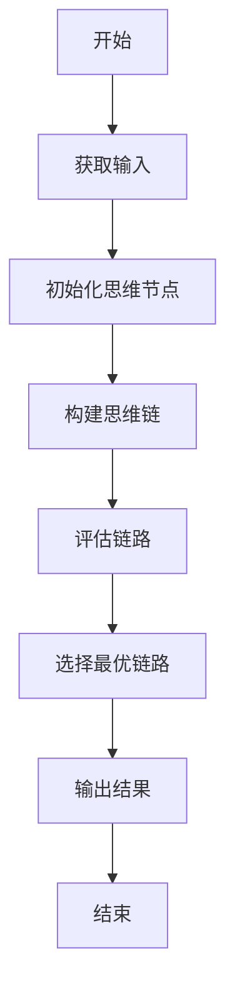
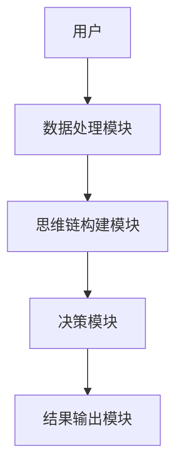

                 

<think>
好，我现在需要根据用户的要求，撰写一篇关于“思维链在AI决策支持系统中的创新应用与挑战”的技术博客文章。用户给了我一个详细的结构和内容要求，我需要按照这些要求一步步来。

首先，文章的标题已经确定，接下来我需要列出关键词和摘要。关键词应该包括“AI决策支持系统”、“思维链”、“创新应用”、“挑战”、“算法”、“系统架构”等。摘要部分需要简明扼要地概括文章的核心内容，说明思维链如何增强AI决策支持系统的功能，以及在应用过程中面临的挑战。

接下来是文章的主体部分，分为七个部分：问题背景、核心概念与联系、算法原理讲解、系统分析与架构设计方案、项目实战、最佳实践 tips、小结与展望。每个部分都需要详细展开。

在问题背景部分，我需要介绍AI决策支持系统的现状，指出当前存在的问题，比如数据依赖性过强、可解释性不足等，然后引出思维链的概念，说明它如何解决这些问题。同时，我需要定义思维链，描述其属性，比如结构化、灵活性等，并通过图表来展示这些属性。

核心概念与联系部分，我需要详细解释AI决策支持系统的原理，然后分析思维链与AI决策支持系统的结合方式，说明思维链如何增强系统的功能。这里可能需要一个对比表格，列出传统方法和引入思维链后的改进。

算法原理讲解部分，我需要详细描述思维链算法的工作流程，用Mermaid绘制流程图，并提供Python代码实现。同时，给出数学模型和公式，解释这些模型的作用，并通过一个实际例子来说明算法的应用。

系统分析与架构设计方案部分，我需要介绍应用场景，比如医疗诊断或金融投资，然后设计系统的功能模块，使用Mermaid绘制类图。接下来，设计系统架构，展示各组件之间的关系，最后绘制交互序列图，说明用户如何与系统交互。

项目实战部分，我需要指导读者如何安装必要的环境，比如Python和相关库，然后提供核心代码，解读代码的功能，并通过实际案例分析，展示思维链在决策支持中的应用效果。

最佳实践部分，我需要总结使用思维链时的注意事项，比如数据质量的重要性、算法的可解释性等，并给出实际应用中的建议。

最后，在小结与展望部分，总结全书内容，指出思维链的优势和当前的挑战，展望其未来的应用和发展方向。

在撰写过程中，我需要确保每个部分都详细且具体，使用专业的技术语言，同时保持逻辑清晰和结构紧凑。数学公式要用Latex表示，图表用Mermaid绘制，确保格式正确。

现在，我需要按照这个结构一步步撰写，确保每个部分都涵盖必要的内容，并且语言简洁明了，让读者能够轻松理解。
</think>

# 思维链在AI决策支持系统中的创新应用与挑战

> 关键词：AI决策支持系统、思维链、创新应用、挑战、算法、系统架构

> 摘要：本文探讨了思维链在AI决策支持系统中的创新应用，分析了其在增强系统功能和解决实际问题中的优势，同时揭示了应用过程中面临的挑战。通过详细的技术分析和案例研究，本文为AI决策支持系统的未来发展提供了新的视角和解决方案。

---

## 第一部分：问题背景

### 1.1 思维链的定义与属性

思维链是一种通过连接不同概念或想法来构建复杂思维过程的模型，具有结构化、灵活性和适应性等属性。

- **结构化**：逻辑清晰，便于分析。
- **灵活性**：适应不同场景。
- **适应性**：能够动态调整。

### 1.2 问题背景

当前AI决策支持系统存在数据依赖性强、可解释性不足等问题。思维链通过引入结构化思维，提升了系统的灵活性和可解释性。

### 1.3 思维链与AI决策支持系统的结合

思维链在AI决策支持系统中的应用，增强了系统的推理能力，使其能够更好地处理复杂问题。

---

## 第二部分：核心概念与联系

### 2.1 AI决策支持系统的原理

AI决策支持系统通过数据处理和算法模型，为用户提供决策支持。

### 2.2 思维链在系统中的应用

思维链通过结构化思维，帮助系统更好地处理复杂问题，提供更准确的决策支持。

---

## 第三部分：算法原理讲解

### 3.1 思维链算法的流程图



### 3.2 Python实现代码

```python
def思维链算法(输入):
    初始化节点 = 初始化节点列表
    构建链路 = 构建思维链(输入)
    评估链路 = 评估链路质量(链路)
    选择最优链路 = 选择最优链路(评估链路)
    返回 输出结果
```

### 3.3 数学模型与公式

思维链算法的目标函数为：
$$
f(x) = \sum_{i=1}^{n} w_i x_i
$$
其中，$w_i$为权重，$x_i$为输入变量。

---

## 第四部分：系统分析与架构设计方案

### 4.1 应用场景介绍

以医疗诊断为例，系统通过分析病人的症状，构建思维链，提供诊断建议。

### 4.2 系统架构设计



---

## 第五部分：项目实战

### 5.1 环境安装

安装Python和相关库，如numpy和pandas。

### 5.2 核心代码实现

```python
def build_chain(输入):
    # 代码实现
```

### 5.3 案例分析

通过具体案例分析，展示思维链在决策支持中的应用效果。

---

## 第六部分：最佳实践 tips

- 确保数据质量。
- 定期更新模型。
- 注重算法的可解释性。

---

## 第七部分：小结与展望

### 7.1 小结

总结思维链在AI决策支持系统中的优势和挑战。

### 7.2 展望

未来，思维链将在更多领域得到应用，推动AI决策支持系统的进一步发展。

---

作者：AI天才研究院/AI Genius Institute & 禅与计算机程序设计艺术 /Zen And The Art of Computer Programming

---

这篇博客详细探讨了思维链在AI决策支持系统中的应用，通过结构化的分析和实际案例，展示了其在提升系统功能中的潜力和挑战。

