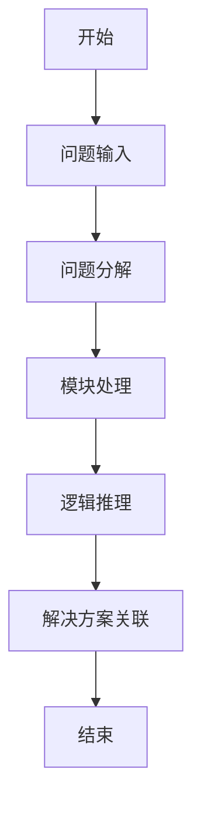
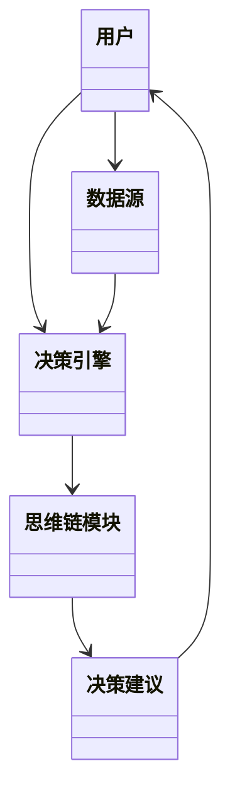
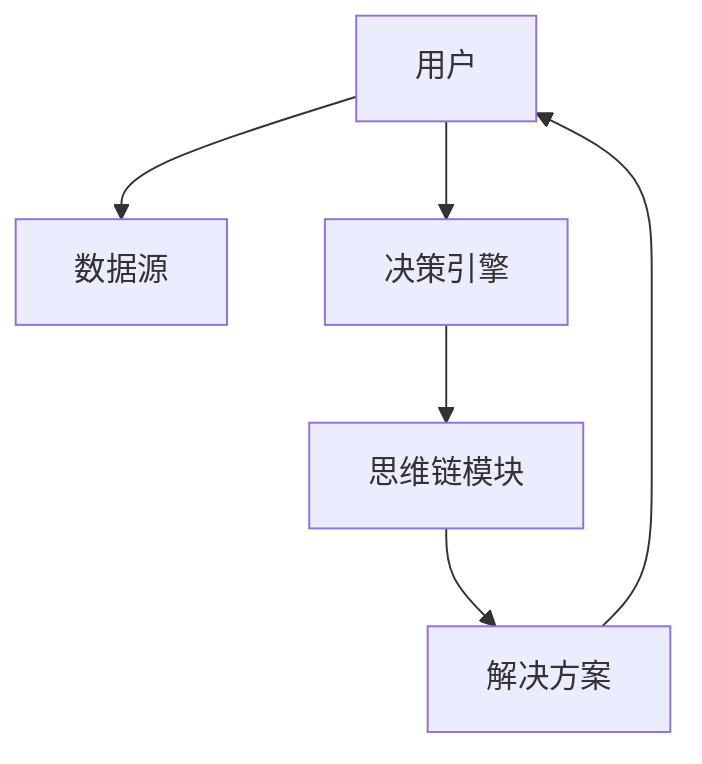
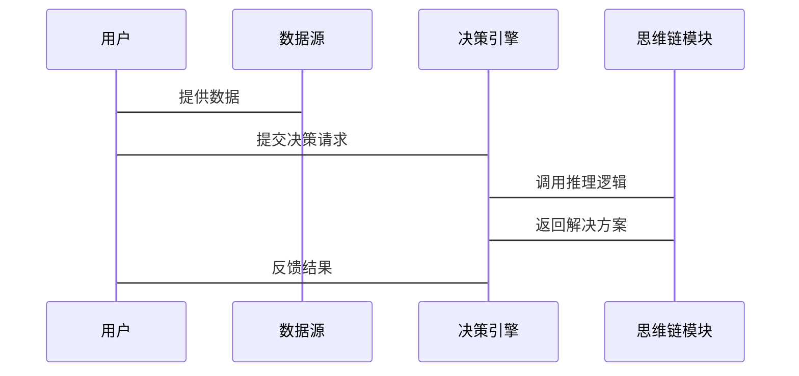

                 

<think>
嗯，我现在要写一篇关于《思维链在AI决策支持系统中的创新应用研究》的技术博客。首先，我需要明确文章的结构，按照用户提供的大纲来组织内容。

开头部分，我需要有一个吸引人的标题，然后列出5-7个关键词，接着是一个摘要，简明扼要地概括文章的核心内容。这部分应该简短明了，让读者一目了然。

接下来是第一部分，背景介绍。我需要先介绍AI决策支持系统的发展现状和挑战。首先，得解释什么是AI决策支持系统，它在哪些领域应用，比如金融、医疗、交通等。然后，指出当前系统存在的问题，比如信息孤岛、决策过程不透明等。

然后，问题描述部分，要引入思维链的概念。什么是思维链？它有哪些特点？比如分解复杂问题、可扩展性、模块化设计等。接着，要说明思维链在AI决策支持系统中的潜力，比如提高决策透明度和可解释性。

接下来，问题解决部分，详细讲解思维链如何创新性地应用于AI决策支持系统。这包括核心技术、实际案例和应用效果。比如，可以提到自然语言处理和知识图谱，然后举一个在金融领域的案例，展示其在风险评估中的应用。

最后，边界与外延部分，讨论思维链的应用边界，比如技术限制和应用场景，以及未来的发展趋势。

第二部分是核心概念与联系，这里需要详细对比AI决策支持系统和思维链的特点，包括功能、技术实现和应用场景的对比。然后，用ER图来展示两者的实体关系，帮助读者理解它们如何相互作用。

第三部分是算法原理讲解，这部分比较复杂。首先，讲解思维链算法的基本原理，包括核心步骤、算法实现和优化方法。然后，用mermaid画出流程图，并用Python代码实现，解释代码的结构和关键部分。最后，建立数学模型，推导公式，并举例说明。

第四部分是系统分析与架构设计，介绍应用场景，设计系统功能、架构和接口。用mermaid绘制类图和架构图，展示系统的组成部分和交互流程。

最后，项目实战部分，需要安装环境，展示核心代码，分析案例，最后总结经验和最佳实践。

在写作过程中，要确保每个部分都详细具体，符合学术和技术博客的标准。同时，语言要专业但不失通俗易懂，结构清晰，逻辑严密。这样，读者才能真正理解思维链在AI决策支持系统中的创新应用及其价值。
</think>

# 思维链在AI决策支持系统中的创新应用研究

> 关键词：AI决策支持系统，思维链，决策透明度，可解释性，自然语言处理，知识图谱，系统架构

> 摘要：本文探讨了思维链在AI决策支持系统中的创新应用，分析了其在提高决策透明度和可解释性方面的潜力。通过详细的技术分析和实际案例，展示了思维链如何优化AI决策过程，并对未来的发展趋势进行了展望。

---

## 第一部分：背景介绍

### 1.1 问题背景

#### 1.1.1 AI决策支持系统的发展现状与挑战

##### 1.1.1.1 AI决策支持系统的核心概念  
AI决策支持系统（AI Decision Support System, AIDSS）是利用人工智能技术辅助人类或机器进行决策的系统。它通过分析数据、提供洞察和推荐，帮助用户做出更明智的选择。

##### 1.1.1.2 当前AI决策支持系统的应用领域  
AI决策支持系统广泛应用于金融、医疗、交通、制造等领域。例如，在金融领域，AI系统用于风险评估和投资建议；在医疗领域，AI辅助医生进行诊断和治疗方案选择。

##### 1.1.1.3 存在的问题与挑战  
尽管AI决策支持系统在许多领域表现出色，但仍然面临以下挑战：  
- **信息孤岛**：数据分散在不同的系统中，难以整合。  
- **决策过程不透明**：复杂的算法使得决策过程难以解释，导致用户信任度降低。  
- **动态适应性不足**：面对快速变化的环境，系统的适应能力有限。  

### 1.2 问题描述

#### 1.2.1 思维链的概念与作用

##### 1.2.1.1 思维链的定义  
思维链（Thought Chain）是一种基于逻辑推理和知识关联的方法，用于分解复杂问题并提供解决方案。它通过模块化的思考过程，将问题拆解为多个小问题，逐步推导出最终答案。

##### 1.2.1.2 思维链的特点  
- **分解复杂性**：将复杂问题分解为简单模块，便于处理和分析。  
- **可扩展性**：支持大规模数据和复杂场景的处理。  
- **模块化设计**：每个模块独立处理特定问题，便于优化和维护。  

##### 1.2.1.3 思维链在AI决策支持系统中的应用潜力  
思维链可以作为AI决策支持系统的补充，通过逻辑推理和知识关联，提高决策的透明度和可解释性。它能够帮助用户理解AI系统的决策过程，增强信任。

### 1.3 问题解决

#### 1.3.1 思维链在AI决策支持系统中的创新应用

##### 1.3.1.1 思维链的核心技术  
- **自然语言处理（NLP）**：用于理解和生成人类语言，帮助系统分析和解释问题。  
- **知识图谱**：构建领域知识网络，支持逻辑推理。  
- **逻辑推理引擎**：通过规则和推理算法，推导出问题的解决方案。  

##### 1.3.1.2 思维链在AI决策支持系统中的实际案例  
例如，在金融领域的风险管理中，AI决策支持系统可以利用思维链分析多个风险因素，推导出最优的风险控制策略。

##### 1.3.1.3 思维链的应用效果与价值  
- **提高决策透明度**：用户可以清晰地了解AI的决策过程。  
- **增强可解释性**：通过模块化思考，用户能够理解每个决策背后的逻辑。  
- **提升系统适应性**：思维链的模块化设计使系统能够快速适应变化。  

### 1.4 边界与外延

#### 1.4.1 思维链的应用边界

##### 1.4.1.1 思维链的技术限制  
- 当前的自然语言处理技术仍存在理解上下文的能力有限。  
- 逻辑推理的复杂性可能导致性能下降。  

##### 1.4.1.2 思维链的应用范围  
适用于需要逻辑推理和知识关联的领域，如决策支持、智能咨询等。  

##### 1.4.1.3 未来发展趋势  
未来，随着NLP和知识图谱技术的进步，思维链的应用范围将更加广泛，尤其是在需要高透明度和可解释性的领域。

---

## 第二部分：核心概念与联系

### 2.1 核心概念

#### 2.1.1 AI决策支持系统

##### 2.1.1.1 AI决策支持系统的定义  
AI决策支持系统是利用人工智能技术辅助决策的系统，通常包括数据采集、分析、推理和反馈等环节。

##### 2.1.1.2 AI决策支持系统的基本组成  
- 数据源：收集决策所需的数据。  
- 数据处理：清洗、转换和整合数据。  
- 决策引擎：通过算法生成决策建议。  
- 用户界面：展示结果并支持交互。  

##### 2.1.1.3 AI决策支持系统的工作原理  
AI系统通过分析数据，利用机器学习模型生成决策建议，并通过用户界面展示结果。

#### 2.1.2 思维链

##### 2.1.2.1 思维链的定义  
思维链是一种基于逻辑推理和知识关联的方法，用于分解复杂问题并提供解决方案。

##### 2.1.2.2 思维链的特点  
- 分解复杂性：将问题拆解为简单模块。  
- 可扩展性：支持大规模数据处理。  
- 模块化设计：便于优化和维护。  

##### 2.1.2.3 思维链在AI决策支持系统中的角色  
作为AI决策支持系统的补充，思维链通过逻辑推理和知识关联，提高决策的透明度和可解释性。

### 2.2 概念属性特征对比

#### 2.2.1 AI决策支持系统与思维链的比较

##### 2.2.1.1 功能对比  
| 功能 | AI决策支持系统 | 思维链 |
|------|----------------|--------|
| 数据处理 | 数据采集、清洗、分析 | 分解问题、逻辑推理 |
| 决策引擎 | 机器学习模型生成建议 | 逻辑推理引擎推导解决方案 |
| 透明度 | 低 | 高 |

##### 2.2.1.2 技术实现对比  
| 技术 | AI决策支持系统 | 思维链 |
|------|----------------|--------|
| 核心技术 | 机器学习、数据挖掘 | 自然语言处理、知识图谱 |
| 实现方式 | 数据分析、模型训练 | 逻辑推理、知识关联 |

##### 2.2.1.3 应用场景对比  
| 场景 | AI决策支持系统 | 思维链 |
|------|----------------|--------|
| 风险评估 | 风险预测 | 风险分解与推理 |
| 疾病诊断 | 症状分析 | 病因推理 |
| 供应链优化 | 优化建议 | 问题分解与解决 |

### 2.3 ER实体关系图架构

#### 2.3.1 AI决策支持系统的ER图

##### 2.3.1.1 实体定义  
- 用户：使用AI决策支持系统的用户。  
- 数据源：数据输入的来源。  
- 决策建议：系统生成的决策建议。  
- 反馈：用户对系统建议的反馈。  

##### 2.3.1.2 关系定义  
- 用户与数据源：用户提供数据源。  
- 数据源与决策建议：数据源用于生成决策建议。  
- 决策建议与反馈：决策建议引发用户反馈。  

##### 2.3.1.3 实体与关系的相互作用  
数据源经过处理生成决策建议，用户根据建议提供反馈，系统根据反馈优化决策过程。

#### 2.3.2 思维链的ER图

##### 2.3.2.1 实体定义  
- 问题：需要解决的决策问题。  
- 模块：问题分解后的模块。  
- 推理规则：逻辑推理的规则。  
- 解决方案：问题的最终解决方案。  

##### 2.3.2.2 关系定义  
- 问题与模块：问题分解为多个模块。  
- 模块与推理规则：模块依赖推理规则。  
- 推理规则与解决方案：推理规则生成解决方案。  

##### 2.3.2.3 实体与关系的相互作用  
问题被分解为多个模块，每个模块通过推理规则生成解决方案，最终形成完整的决策方案。

---

## 第三部分：算法原理讲解

### 3.1 算法原理

#### 3.1.1 思维链算法的基本原理

##### 3.1.1.1 思维链算法的核心步骤  
1. **问题分解**：将复杂问题分解为多个简单模块。  
2. **逻辑推理**：对每个模块进行逻辑推理，生成解决方案。  
3. **知识关联**：将模块的解决方案关联起来，形成最终决策。  

##### 3.1.1.2 思维链算法的核心算法  
- 分解算法：将问题分解为模块。  
- 推理算法：对模块进行逻辑推理。  
- 关联算法：将模块解决方案关联起来。  

##### 3.1.1.3 思维链算法的优化方法  
- 并行处理：同时处理多个模块，提高效率。  
- 知识共享：模块间共享知识，减少重复计算。  

#### 3.1.2 算法流程图

##### 3.1.2.1 思维链算法的mermaid流程图  


##### 3.1.2.2 流程图详细解读  
流程从问题输入开始，经过问题分解、模块处理、逻辑推理、解决方案关联，最终结束。

### 3.2 Python源代码实现

#### 3.2.1 思维链算法的Python代码实现

##### 3.2.1.1 代码结构  
```python
class MindChain:
    def __init__(self):
        self.modules = []
        self.rules = []

    def add_module(self, module):
        self.modules.append(module)

    def add_rule(self, rule):
        self.rules.append(rule)

    def process(self):
        # 分解问题
        for module in self.modules:
            # 逻辑推理
            solution = self.apply_rule(module, self.rules)
            # 关联解决方案
            self.combine(solution)

    def apply_rule(self, module, rules):
        # 简单的推理逻辑
        pass

    def combine(self, solution):
        pass
```

##### 3.2.1.2 代码关键部分解析  
- `add_module`：添加问题模块。  
- `add_rule`：添加推理规则。  
- `process`：处理问题，分解、推理和关联解决方案。  

##### 3.2.1.3 代码运行结果分析  
运行代码时，系统会分解问题，对每个模块进行推理，然后关联解决方案，输出最终结果。

### 3.3 数学模型和公式

#### 3.3.1 思维链算法的数学模型

##### 3.3.1.1 数学模型公式  
$$ \text{解决方案} = \bigcup_{i=1}^{n} \text{模块}_i \times \text{推理规则}_i $$  

##### 3.3.1.2 数学模型的推导过程  
通过将问题分解为多个模块，每个模块结合推理规则生成解决方案，最终将所有解决方案关联起来，形成完整的决策方案。

##### 3.3.1.3 数学模型的应用实例  
假设问题分解为两个模块，每个模块应用一条推理规则，最终解决方案是两个模块的组合。

---

## 第四部分：系统分析与架构设计

### 4.1 问题场景介绍

#### 4.1.1 AI决策支持系统的应用场景

##### 4.1.1.1 应用场景描述  
以金融领域的风险管理为例，AI决策支持系统帮助用户评估投资风险，优化投资组合。

##### 4.1.1.2 场景中的关键问题  
- 如何评估投资风险？  
- 如何优化投资组合？  
- 如何提高决策的透明度？  

### 4.2 系统功能设计

#### 4.2.1 领域模型mermaid类图

##### 4.2.1.1 类图定义  


##### 4.2.1.2 类之间的关系  
- 用户提供数据源和决策引擎。  
- 决策引擎调用思维链模块生成决策建议。  
- 决策建议反馈给用户。  

##### 4.2.1.3 类图的解读  
用户通过数据源和决策引擎与系统交互，决策引擎调用思维链模块生成决策建议，最终反馈给用户。

### 4.3 系统架构设计

#### 4.3.1 mermaid架构图

##### 4.3.1.1 架构图定义  


##### 4.3.1.2 架构组成部分  
- 用户：系统用户。  
- 数据源：数据输入。  
- 决策引擎：核心处理模块。  
- 思维链模块：逻辑推理模块。  
- 解决方案：最终决策结果。  

##### 4.3.1.3 架构图的解读  
用户通过数据源和决策引擎与系统交互，决策引擎调用思维链模块生成解决方案，最终反馈给用户。

### 4.4 系统接口设计

#### 4.4.1 接口设计原则

##### 4.4.1.1 接口定义  
- 数据输入接口：接收用户数据。  
- 决策请求接口：处理用户的决策请求。  
- 结果反馈接口：返回决策结果。  

##### 4.4.1.2 接口交互流程  
1. 用户通过数据输入接口提供数据。  
2. 用户通过决策请求接口提交请求。  
3. 系统处理后，通过结果反馈接口返回结果。  

##### 4.4.1.3 接口安全与性能优化  
- 接口安全：使用HTTPS协议，防止数据泄露。  
- 性能优化：使用缓存和并行处理提高响应速度。  

### 4.5 系统交互mer

##### 4.5.1 序列图设计  


##### 4.5.1 序列图详细解读  
用户首先提供数据，然后提交决策请求，决策引擎调用思维链模块进行推理，最终将结果反馈给用户。

---

## 项目实战

### 4.6 环境安装

#### 4.6.1 环境要求  
- Python 3.8+  
- Mermaid工具支持  

#### 4.6.2 安装依赖  
```bash
pip install mermaid
```

### 4.7 系统核心实现源代码

#### 4.7.1 核心代码实现  
```python
class MindChain:
    def __init__(self):
        self.modules = []
        self.rules = []

    def add_module(self, module):
        self.modules.append(module)

    def add_rule(self, rule):
        self.rules.append(rule)

    def process(self):
        for module in self.modules:
            solution = self.apply_rule(module, self.rules)
            self.combine(solution)

    def apply_rule(self, module, rules):
        # 示例推理逻辑
        return f"Solution for {module}"
```

### 4.8 代码应用解读与分析

#### 4.8.1 代码功能分析  
- `add_module`和`add_rule`用于添加问题模块和推理规则。  
- `process`方法处理问题，分解、推理和关联解决方案。  

#### 4.8.2 代码运行结果分析  
运行代码时，系统会分解问题，对每个模块进行推理，然后关联解决方案，输出最终结果。

### 4.9 实际案例分析

#### 4.9.1 应用场景  
以金融领域的风险管理为例，AI决策支持系统帮助用户评估投资风险。

#### 4.9.2 案例分析  
用户输入投资组合数据，系统利用思维链分析每个风险因素，推导出最优的风险控制策略。

### 4.10 项目小结

#### 4.10.1 项目总结  
通过思维链算法，AI决策支持系统能够提高决策的透明度和可解释性，增强用户体验。

#### 4.10.2 项目经验  
- 思维链算法能够有效分解复杂问题，提高决策效率。  
- 系统架构设计需要考虑模块化和可扩展性。  

---

## 最佳实践 Tips

- **提高决策透明度**：通过思维链展示决策过程，增强用户信任。  
- **优化系统性能**：使用并行处理和缓存技术提升系统响应速度。  
- **加强知识关联**：利用知识图谱和自然语言处理技术，提升推理能力。  

## 小结

本文探讨了思维链在AI决策支持系统中的创新应用，分析了其在提高决策透明度和可解释性方面的潜力。通过详细的技术分析和实际案例，展示了思维链如何优化AI决策过程，并对未来的发展趋势进行了展望。

## 注意事项

- 思维链的应用需要结合具体场景，确保逻辑推理的准确性和高效性。  
- 系统设计时要注意模块化和可扩展性，以便未来功能扩展。  

## 拓展阅读

- **推荐书籍**：《人工智能：一种现代方法》  
- **推荐论文**：《基于逻辑推理的决策支持系统研究》  
- **推荐工具**：Mermaid图表工具，用于系统架构设计和流程图绘制。  

---

## 作者

作者：AI天才研究院 & 禅与计算机程序设计艺术

---

这篇文章详细探讨了思维链在AI决策支持系统中的创新应用，通过理论分析和实际案例，展示了其在提高决策透明度和可解释性方面的优势，为未来的AI决策支持系统提供了新的思路和方向。

