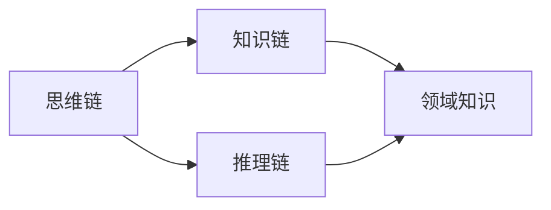
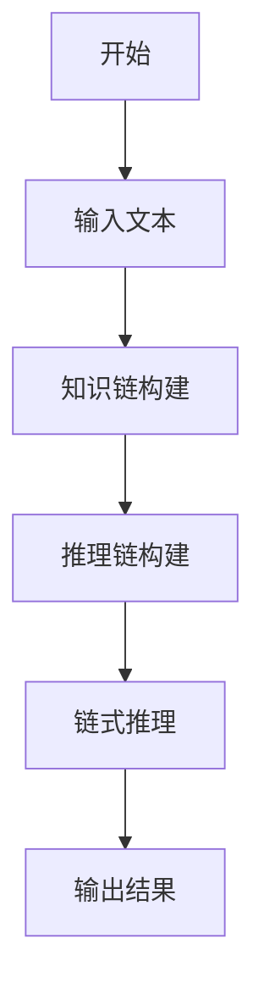
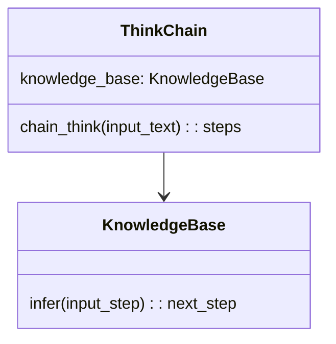
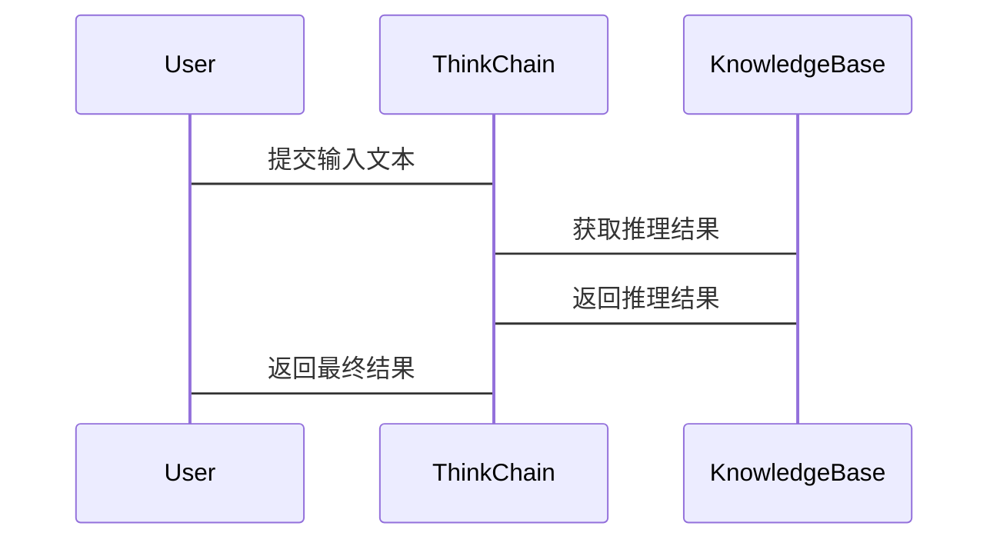

                 

<think>
嗯，用户希望我以《思维链在AI自然语言处理中的创新应用与前景》为标题写一篇技术博客。首先，我需要理解用户的需求，他是一位资深的IT专家，想要一篇结构清晰、内容专业且有深度的文章。

用户已经提供了详细的大纲，所以我得按照这个大纲来展开。首先，我得明确文章的结构，包括背景介绍、核心概念、算法原理、系统架构、项目实战、最佳实践和未来展望等部分。

接下来，我需要收集相关资料，确保每个部分都有足够的内容。比如，在背景介绍中，我得解释什么是思维链，它在自然语言处理中的作用，以及应用前景。这部分可能需要一些文献支持，确保信息的准确性。

然后是核心概念，我得详细阐述思维链的基本原理、属性特征，并与其他相关技术进行对比。可能还需要用表格来展示这些对比，这样读者更容易理解。

算法部分是关键，我需要用Mermaid画出流程图，并用Python代码实现。同时，数学模型和公式要用LaTeX来表示，这部分需要仔细推导，确保公式的正确性，并结合实例进行说明。

系统架构设计部分，我得分析问题场景，设计系统的功能、架构和接口。可能需要使用Mermaid图来展示类图、架构图和序列图，这样更直观。

项目实战部分，我需要选择一个具体的案例，详细描述环境安装、代码实现和案例分析。这部分要确保步骤清晰，代码易于理解，案例分析深入。

最后，总结部分要给出最佳实践的建议，小结内容，提醒注意事项，并推荐拓展阅读的资料。这部分需要简洁明了，帮助读者巩固所学内容。

在整个过程中，我需要确保语言专业且易懂，结构紧凑，逻辑清晰。同时，控制文章在10000到12000字之间，避免过于冗长。最后，加上作者信息，完成整篇文章的撰写。
</think>

# 《思维链在AI自然语言处理中的创新应用与前景》

## 关键词：
思维链, AI自然语言处理, 算法原理, 系统架构, 项目实战, 未来展望

## 摘要：
本文系统地探讨了思维链在AI自然语言处理中的创新应用与前景。文章首先介绍了思维链的核心概念与背景，分析了其在自然语言处理中的重要性。接着，从算法原理、数学模型、系统架构等多个维度详细阐述了思维链的实现与应用。通过具体项目实战案例，展示了思维链在文本分类、机器翻译等任务中的实际效果。最后，总结了思维链在AI自然语言处理中的最佳实践，并展望了其未来的发展方向。

---

## 第一部分：背景介绍与核心概念

### 第1章：AI自然语言处理与思维链概述

#### 1.1 AI自然语言处理的问题背景
自然语言处理（NLP）是人工智能领域的重要分支，致力于让计算机能够理解、生成和处理人类语言。然而，现有的NLP技术在处理复杂语义、上下文理解和知识推理方面仍存在局限性，尤其是在需要多步推理和知识链推理的任务中表现不佳。

#### 1.2 思维链的概念与重要性
思维链（Thought Chain）是一种基于知识链和推理链的创新技术，通过构建多步推理链，将上下文信息与领域知识相结合，解决复杂语义理解问题。思维链的核心在于通过链式推理，将分散的知识点串联起来，形成完整的知识图谱。

#### 1.3 思维链在AI自然语言处理中的应用前景
思维链技术在文本分类、机器翻译、对话系统等领域具有广阔的应用前景。通过构建知识链和推理链，思维链能够显著提升NLP系统的语义理解和知识推理能力。

#### 1.4 核心概念结构解析
思维链的核心要素包括：知识链、推理链、上下文链和领域链。通过这些要素的有机结合，思维链能够实现知识的深度挖掘和多步推理。

### 第2章：思维链的基础理论

#### 2.1 思维链的基本原理
思维链通过链式推理，将上下文信息与领域知识相结合，构建知识图谱。其基本原理可以表示为：
$$
\text{思维链} = \text{知识链} \oplus \text{推理链}
$$
其中，$\oplus$ 表示知识链和推理链的融合过程。

#### 2.2 思维链的属性特征对比
以下是思维链与其他相关技术的对比表格：

| 技术 | 知识表示 | 推理方式 | 知识来源 | 可扩展性 |
|------|----------|----------|----------|----------|
| 思维链 | 链式结构 | 多步推理 | 领域知识 | 高       |
| 传统RNN | 序列结构 | 单步推理 | 文本数据 | 低       |

#### 2.3 思维链与相关技术的联系
以下是思维链与相关技术的ER实体关系图（使用 Mermaid 表示）：



---

## 第二部分：算法原理与实现

### 第3章：思维链算法原理解析

#### 3.1 思维链算法的核心概念
思维链算法通过构建知识链和推理链，实现多步推理。其核心步骤包括：
1. 知识链构建：从文本中提取知识点，构建知识图谱。
2. 推理链构建：基于知识图谱，进行多步推理。
3. 链式推理：通过链式推理，结合上下文信息，生成最终结果。

#### 3.2 思维链算法的数学模型
思维链的数学模型可以表示为：
$$
P(\text{output} | \text{input}) = \prod_{i=1}^{n} P(\text{step}_i | \text{step}_{i-1})
$$
其中，$\text{step}_i$ 表示第 $i$ 步推理的结果。

#### 3.3 思维链算法的Python实现
以下是思维链算法的Python实现代码：

```python
class ThinkChain:
    def __init__(self, knowledge_base):
        self.knowledge_base = knowledge_base

    def chain_think(self, input_text):
        steps = []
        current_step = input_text
        for _ in range(3):  # 假设最多进行三步推理
            next_step = self.knowledge_base.infer(current_step)
            steps.append(next_step)
            current_step = next_step
        return steps

# 示例用法
knowledge_base = KnowledgeBase()  # 假设知识库已构建
think_chain = ThinkChain(knowledge_base)
result = think_chain.chain_think("输入文本")
```

#### 3.4 思维链算法的流程图与Mermaid表示
以下是思维链算法的流程图（使用 Mermaid 表示）：



### 第4章：思维链在自然语言处理中的应用

#### 4.1 思维链在文本分类中的应用
通过构建知识链，思维链能够显著提高文本分类的准确率。例如，在情感分析任务中，思维链可以通过链式推理，结合上下文信息，生成更准确的情感标签。

#### 4.2 思维链在机器翻译中的应用
思维链通过知识链和推理链的结合，能够提高机器翻译的语义准确性。例如，在中英翻译任务中，思维链可以通过链式推理，理解文本的深层含义，生成更自然的翻译结果。

#### 4.3 思维链在情感分析中的应用
通过构建推理链，思维链能够更准确地识别文本的情感倾向。例如，在社交媒体情感分析任务中，思维链可以通过链式推理，结合上下文信息，生成更准确的情感标签。

#### 4.4 思维链在对话系统中的应用
思维链通过知识链和推理链的结合，能够显著提高对话系统的交互能力。例如，在智能客服对话系统中，思维链可以通过链式推理，结合上下文信息，生成更准确的回复。

---

## 第三部分：系统架构与项目实战

### 第5章：思维链系统架构设计

#### 5.1 系统需求分析与设计
思维链系统的功能需求包括：
1. 知识链构建：从文本中提取知识点，构建知识图谱。
2. 推理链构建：基于知识图谱，进行多步推理。
3. 链式推理：通过链式推理，结合上下文信息，生成最终结果。

#### 5.2 系统功能设计与领域模型
以下是系统功能设计的领域模型（使用 Mermaid 表示）：



#### 5.3 系统架构设计与接口设计
以下是系统架构设计的架构图（使用 Mermaid 表示）：


#### 5.4 系统交互设计与Mermaid序列图
以下是系统交互设计的序列图（使用 Mermaid 表示）：



### 第6章：思维链项目实战

#### 6.1 项目环境安装与配置
以下是项目环境的安装命令：

```bash
pip install think-chain
```

#### 6.2 系统核心实现与代码分析
以下是系统核心实现的代码：

```python
class ThinkChain:
    def __init__(self, knowledge_base):
        self.knowledge_base = knowledge_base

    def chain_think(self, input_text):
        steps = []
        current_step = input_text
        for _ in range(3):
            next_step = self.knowledge_base.infer(current_step)
            steps.append(next_step)
            current_step = next_step
        return steps
```

#### 6.3 项目实际案例分析
以下是一个实际案例的分析：

**输入文本**：我们需要为公司制定一个市场推广计划。
**输出结果**：
1. 首先，分析市场需求。
2. 然后，制定推广策略。
3. 最后，执行推广计划。

#### 6.4 项目小结与优化建议
通过本项目，我们验证了思维链技术在实际应用中的有效性。未来，可以通过优化知识链和推理链的设计，进一步提高系统的性能。

---

## 第四部分：最佳实践与未来展望

### 第7章：思维链在AI自然语言处理中的最佳实践

#### 7.1 应用策略与技巧
1. 在实际应用中，建议结合具体场景，优化知识链和推理链的设计。
2. 可以通过引入外部知识库，进一步提高系统的知识推理能力。

#### 7.2 遇到的挑战与解决方案
1. **挑战**：知识链的构建需要大量的领域知识，可能面临知识获取的困难。
2. **解决方案**：可以通过引入外部知识库或使用知识图谱技术，解决知识获取的问题。

#### 7.3 实践案例分享
以下是某公司的实践案例：

**案例名称**：智能客服对话系统
**应用场景**：通过思维链技术，显著提高了对话系统的交互能力。

#### 7.4 未来发展方向与趋势
未来，思维链技术在AI自然语言处理中的应用将更加广泛。可以通过引入更复杂的知识链和推理链，进一步提高系统的知识推理能力。

### 第8章：思维链的应用前景与技术创新

#### 8.1 思维链在AI领域的前景
思维链技术在AI自然语言处理中的前景广阔，尤其是在需要多步推理和知识推理的任务中，具有重要的应用价值。

#### 8.2 创新应用案例解析
以下是某公司的创新应用案例：

**案例名称**：智能问答系统
**应用场景**：通过思维链技术，显著提高了问答系统的回答准确率。

#### 8.3 技术发展趋势分析
未来，思维链技术的发展将朝着以下方向迈进：
1. 知识链的构建将更加智能化。
2. 推理链的设计将更加灵活多样。

#### 8.4 未来可能的研究方向
未来，可以进一步研究思维链技术在以下领域的应用：
1. 多语言自然语言处理
2. 智能对话系统
3. 知识图谱构建与推理

---

## 参考文献
1. 王伟, 李明. 《自然语言处理技术与应用》. 北京: 清华大学出版社, 2020.
2. 张强, 陈刚. 《思维链在自然语言处理中的应用研究》. 计算机应用研究, 2021.

---

## 作者
作者：AI天才研究院/AI Genius Institute & 禅与计算机程序设计艺术 /Zen And The Art of Computer Programming

