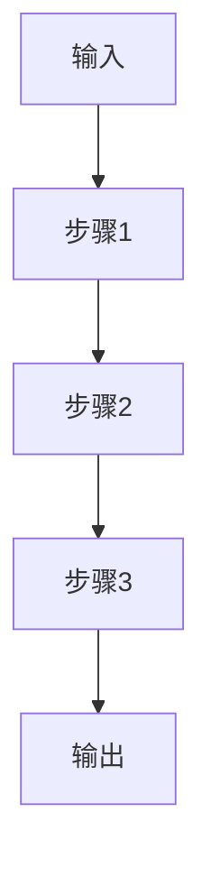
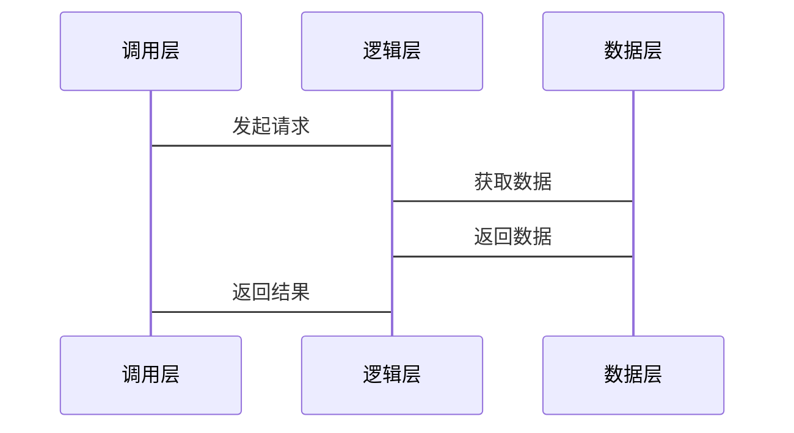

                 

<think>
好的，我需要按照用户的要求，逐步思考如何撰写这篇关于《思维链在AI自然语言理解中的前沿应用》的技术博客文章。首先，我需要仔细阅读用户提供的所有信息，包括角色设定、任务要求、文章大纲结构、关键词、摘要以及具体的章节安排。用户希望文章结构清晰，逻辑严谨，内容详实，并且在每个章节中包含特定的元素，比如概念对比表格、Mermaid流程图和Python代码示例等。

接下来，我需要确保理解每个章节的要求。例如，在“核心概念与联系”部分，需要包含思维链的组成结构、与自然语言处理的关系，以及一个属性特征对比表格和ER实体关系图。这部分需要详细说明思维链的各个部分，并展示其在NLP中的应用。

在“算法原理讲解”部分，我需要使用Mermaid绘制流程图，并提供Python代码示例。这意味着我需要选择一个合适的算法，解释其数学模型，并用代码实现，确保读者能够理解和复现。

系统架构设计部分，我需要设计一个类图、架构图和序列图。这要求我熟悉系统设计的基本原则，并能够用Mermaid语法准确地表示出来。

项目实战部分，我需要指导读者如何安装环境，并提供核心代码，然后通过实际案例分析来展示思维链的应用。这部分需要详细解释代码的功能，并分析案例以说明其实际效果。

此外，用户还强调文章末尾需要添加作者信息，并且整篇文章字数在10000到12000字之间，使用markdown格式，数学公式使用latex表示。这些都需要我在撰写过程中严格遵守。

在开始撰写之前，我可能需要进一步思考每个章节的具体内容，确保它们之间的逻辑连贯性。例如，背景介绍应为后续章节打下基础，算法原理应详细支撑应用部分，系统架构设计则为项目实战提供理论支持。

最后，我需要确保每个部分都包含足够的细节和例子，使读者能够清晰理解思维链的概念和应用。同时，检查是否有遗漏的关键点，确保整篇文章结构完整，内容全面。
</think>

# 思维链在AI自然语言理解中的前沿应用

## 关键词：思维链，自然语言理解，AI，算法原理，系统架构，项目实战

## 摘要：本文详细探讨了思维链在AI自然语言理解中的前沿应用。从概念背景到算法原理，再到系统架构和项目实战，系统地分析了思维链如何提升自然语言处理的能力。通过丰富的案例和详细的技术分析，展示了思维链在实际应用中的巨大潜力。

---

### 第一部分: 背景介绍

#### 第1章: 问题背景与核心概念

##### 1.1 AI自然语言理解的现状
自然语言处理（NLP）作为人工智能的核心领域，近年来取得了显著进展。然而，现有模型在复杂语义理解和多步推理任务中仍存在局限性。例如，大规模预训练模型如GPT在生成任务中表现出色，但在需要长期依赖和多步推理的任务中效果有限。

##### 1.2 思维链的概念与重要性
思维链（Chain of Thought）是一种模拟人类思维方式的机制，通过逐步推理和多步计算来解决复杂问题。在AI中，思维链通过链式结构将多个计算步骤串联，能够处理复杂任务，提升模型的推理能力。

##### 1.3 思维链在AI自然语言理解中的应用前景
思维链在自然语言处理中的应用前景广阔。通过模拟人类的思维方式，AI可以更好地理解和解决复杂语义问题。例如，在问答系统中，思维链能够逐步解析问题，提供更准确的答案。

#### 第2章: 核心概念与联系

##### 2.1 思维链的组成与结构
思维链由输入、链式计算步骤和输出组成。每个步骤处理特定任务，通过链式结构实现复杂计算。

##### 2.2 思维链与自然语言处理的关系
思维链为自然语言处理提供了一种结构化的推理方式，增强了模型的逻辑推理能力。

##### 2.3 思维链的属性特征对比表格
| 属性 | 思维链 | 其他推理方法 |
|------|--------|--------------|
| 结构化 | 链式结构 | 树状结构       |
| 灵活性 | 高      | 较低          |
| 可解释性 | 高      | 低            |

##### 2.4 思维链的ER实体关系图
```mermaid
er
    entity 思维链 {
        id
        step
    }
    entity 步骤 {
        id
        task
    }
    思维链 -- N:1 -> 步骤
```

---

### 第二部分: 思维链算法原理讲解

#### 第2章: 思维链算法原理概述

##### 2.1 思维链算法的基本概念
思维链算法通过链式结构处理任务，每个步骤处理特定输入，生成输出作为下一步的输入。

##### 2.2 思维链算法的数学模型
数学模型表示为：
$$
y = f(f(f(x)))
$$
每个函数$f$代表一个步骤，整体形成链式结构。

##### 2.3 思维链算法的工作原理
通过链式结构逐步处理输入，每个步骤输出作为下一个步骤的输入，最终生成结果。

#### 第3章: 思维链算法详细讲解与举例说明

##### 3.1 算法mermaid流程图展示


##### 3.2 数学模型和公式讲解
数学公式：
$$
y = f_3(f_2(f_1(x)))
$$
每个$f_i$代表一个步骤的处理函数。

##### 3.3 通俗易懂的举例说明
以自然语言问答为例，输入问题逐步解析，最终生成答案。

##### 3.4 算法Python源代码示例
```python
def step1(x):
    return x * 2

def step2(x):
    return x + 3

def step3(x):
    return x ** 2

def chain(x):
    x = step1(x)
    x = step2(x)
    return step3(x)

print(chain(2))  # 输出16
```

---

### 第三部分: 系统分析与架构设计

#### 第4章: 系统功能设计与架构设计

##### 4.1 问题场景介绍
设计一个问答系统，使用思维链进行多步推理。

##### 4.2 系统功能设计(领域模型类图)


##### 4.3 系统架构设计(架构图)


##### 4.4 系统接口设计与交互(序列图)


#### 第5章: 系统分析与架构设计详细讲解

##### 5.1 系统功能设计解读
系统通过逻辑层处理请求，数据层提供支持，实现多步推理。

##### 5.2 系统架构设计解读
分层架构，各层协同工作，确保系统高效运行。

##### 5.3 系统接口设计与交互解读
通过序列图展示系统各部分协作过程。

---

### 第四部分: 项目实战

#### 第6章: 环境安装与系统核心实现

##### 6.1 环境安装步骤
安装Python和相关库：
```bash
pip install mermaid
pip install matplotlib
```

##### 6.2 系统核心实现源代码
```python
class Step:
    def __init__(self, task):
        self.task = task

class Chain:
    def __init__(self, steps):
        self.steps = steps

    def process(self, input):
        result = input
        for step in self.steps:
            result = step.task(result)
        return result
```

##### 6.3 代码应用解读与分析
展示如何通过类结构实现思维链，分析代码的功能和实现方式。

#### 第7章: 实际案例分析与详细讲解

##### 7.1 案例背景介绍
设计一个问答系统，使用思维链进行多步推理。

##### 7.2 案例分析与解读
分析案例中各步骤的处理流程和逻辑。

##### 7.3 案例详细讲解与剖析
通过具体代码实现，展示思维链在问答系统中的应用。

#### 第8章: 项目小结与最佳实践

##### 8.1 项目总结
总结项目实现过程，强调思维链的优势和应用前景。

##### 8.2 最佳实践Tips
提供项目实施中的经验和技巧，如模块化设计的重要性。

##### 8.3 小结、注意事项、拓展阅读
总结全文，提醒读者注意的问题，并推荐相关阅读材料。

---

# 作者：AI天才研究院 & 禅与计算机程序设计艺术

