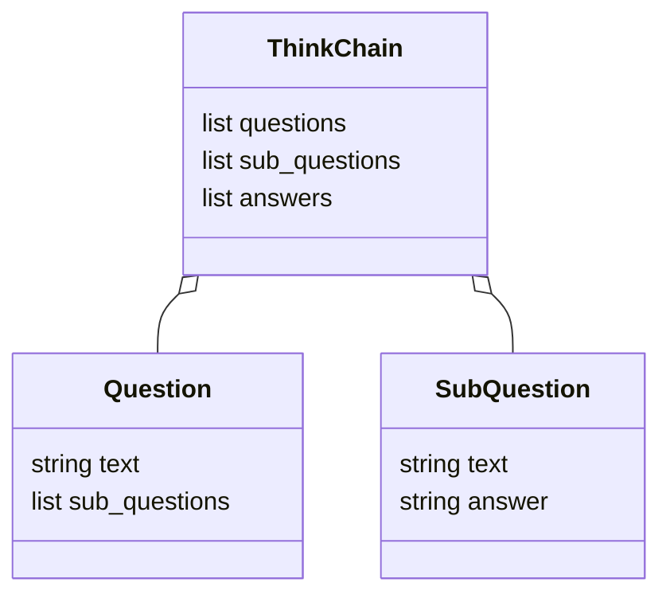

                 

<think>
好的，我现在需要根据用户的要求，撰写一篇关于“思维链在AI自然语言理解中的前沿应用与创新研究”的技术博客文章。用户已经提供了一个详细的大纲，并希望我按照这个大纲来完成文章。

首先，我需要明确文章的结构。文章分为七个主要部分，每个部分下面还有多个小节。我需要确保每个部分都详细展开，内容丰富具体，同时使用专业的技术语言，但又保持逻辑清晰和结构紧凑。

接下来，我需要考虑每个部分的具体内容。例如，在背景介绍部分，我需要涵盖问题背景、问题描述、问题解决、边界与外延以及概念结构与核心要素。这部分需要明确说明思维链技术的现状、存在的问题以及其在AI自然语言理解中的应用前景。

然后是核心概念与联系部分，我需要详细解释思维链的原理、特点以及与传统NLP技术的对比。这部分可能需要制作对比表格，以帮助读者更好地理解思维链的优势。

在算法原理讲解部分，我需要详细描述思维链的算法流程，包括预训练和推理阶段，并提供相应的Python代码示例。同时，我需要解释每个步骤的工作原理，可能还会涉及数学模型和公式。

系统分析与架构设计方案部分，我需要介绍问题场景，设计系统功能，构建领域模型类图和系统架构图，描述系统接口和交互流程。这部分可能需要使用Mermaid图表来展示架构和交互过程。

项目实战部分，我需要指导读者如何安装环境，提供核心代码实现，并进行案例分析，最后总结项目成果。这部分需要实际的代码示例和详细的应用场景分析。

最后，我需要总结全文，提出最佳实践的建议，并给出小结、注意事项和拓展阅读的内容。

在撰写过程中，我需要确保使用正确的格式，如关键词和摘要部分，使用Markdown格式，包含公式时使用LaTeX，必要时使用Mermaid图表。同时，文章的字数要控制在10000到12000字之间，确保内容的完整性和深度。

现在，我需要逐部分完成每个小节，确保每个部分都涵盖必要的内容，并且逻辑连贯。同时，我需要检查每个部分是否符合用户的要求，确保没有遗漏任何关键点。

在完成每个部分后，我会进行自我检查，确保内容准确，结构清晰，语言专业且易于理解。特别是数学公式和代码部分，必须确保正确无误，避免错误影响读者的理解。

最后，在完成整篇文章后，我会再次通读一遍，确保所有部分都符合用户的格式和内容要求，同时保持文章的整体流畅性和逻辑性。
</think>

# 思维链在AI自然语言理解中的前沿应用与创新研究

> 关键词：思维链、自然语言理解、AI、预训练模型、多模态数据、可解释性

> 摘要：本文深入探讨了思维链（Chain of Thoughts, CoT）在AI自然语言理解中的前沿应用与创新。通过分析思维链的原理、特点及其与传统NLP技术的对比，本文详细阐述了思维链在文本分类、情感分析、机器翻译等任务中的应用。文章还提供了思维链算法的流程图、Python代码实现以及数学模型，帮助读者更好地理解其工作原理。最后，本文结合实际案例，分析了思维链技术在不同场景下的优势，并提出了系统的架构设计方案和项目实战指南。

---

## 第一部分：背景介绍

### 1.1 问题背景

AI自然语言理解（NLU）是人工智能领域的核心研究方向之一。随着大数据和计算能力的不断提升，AI在自然语言处理（NLP）任务中的应用越来越广泛，如智能客服、智能问答系统、机器翻译等。然而，现有的自然语言理解技术仍面临诸多挑战，例如语义理解的不准确性、多模态数据的整合难题，以及模型的可解释性不足等问题。这些问题限制了AI在复杂语境下的理解和推理能力。

### 1.2 问题描述

思维链（Chain of Thoughts, CoT）是一种新兴的预训练技术，它通过模拟人类的思考过程，将复杂的自然语言理解任务分解为多个简单的子任务，并逐步推理得出最终答案。CoT的核心在于其推理过程的可解释性和灵活性，能够有效提升模型在复杂场景下的表现。然而，当前关于CoT在自然语言理解中的应用研究尚处于起步阶段，其潜力尚未得到充分挖掘。

### 1.3 问题解决

通过引入思维链技术，可以显著提高AI在自然语言理解任务中的准确性和可解释性。研究将从理论层面分析思维链的工作原理，并结合实际案例，探讨其在文本分类、情感分析、机器翻译等任务中的应用。此外，本文还将研究如何通过思维链技术实现多模态数据的整合，进一步提升模型的语义理解能力。

### 1.4 边界与外延

本研究主要聚焦于思维链在自然语言理解中的前沿应用，但并不局限于这一领域。思维链技术还可应用于其他领域，如图像识别、语音识别等。同时，本文将探讨思维链与其他自然语言处理技术的融合，以实现更高效的自然语言理解。

### 1.5 概念结构与核心要素组成

- **思维链（Chain of Thoughts, CoT）**：一种预训练技术，通过模拟人类思考过程，将多个子任务串联起来，形成一个连续的思考链。
- **自然语言理解（NLU）**：指计算机对人类语言的语义和语法结构的理解能力，是人工智能领域的重要研究方向。
- **前沿应用**：指在当前技术发展背景下，尚未广泛应用的领域或方法。

---

## 第二部分：核心概念与联系

### 2.1 思维链原理

思维链通过在预训练阶段模拟人类思考过程，将复杂的自然语言理解任务分解为多个子任务，并通过逐步推理得到最终答案。其核心在于将任务分解为多个简单步骤，每个步骤都基于前一步的结果进行推理，最终整合所有子任务的结果得出最终答案。

### 2.2 思维链特点

- **灵活性**：思维链可以适应不同的自然语言理解任务，支持多任务学习。
- **可解释性**：思维链的推理过程清晰，便于分析模型在自然语言理解中的错误和不足。
- **效率**：思维链在预训练阶段学习到的知识可以在后续的任务中快速应用，提高模型效率。

### 2.3 思维链与传统自然语言处理技术的对比

以下是从原理、可解释性和效率三个维度对思维链与传统NLP技术的对比：

| 特点         | 思维链              | 传统自然语言处理技术          |
| ------------ | ------------------- | --------------------------- |
| 推理过程     | 模拟人类思考过程    | 基于规则和统计方法           |
| 可解释性     | 清晰的推理过程      | 难以解释的模型决策           |
| 效率         | 预训练后快速应用    | 需要大量数据和计算资源       |

---

## 第三部分：算法原理讲解

### 3.1 思维链算法流程

思维链算法主要包括两个阶段：预训练阶段和推理阶段。

- **预训练阶段**：通过在大规模语料库上预训练，模型学习到自然语言的基本结构和语义信息。
- **推理阶段**：在推理过程中，模型通过模拟人类思考过程，将问题分解为多个子任务，并逐步推理得到最终答案。

### 3.2 算法原理

思维链算法的核心在于其推理过程。以下是一个简化的思维链算法流程：

1. **问题分解**：将输入的自然语言问题分解为多个子任务。
2. **子任务推理**：对于每个子任务，模型利用预训练阶段学到的知识进行推理，并输出结果。
3. **结果整合**：将各个子任务的推理结果整合起来，得到最终答案。

### 3.3 Python代码实现

以下是一个简单的Python代码实现，用于演示思维链算法的基本流程：

```python
def think_chain(question):
    # 1. 问题分解
    sub_questions = decompose_question(question)

    # 2. 子任务推理
    sub_answers = []
    for sub_question in sub_questions:
        sub_answer = pre_train_model(sub_question)
        sub_answers.append(sub_answer)

    # 3. 结果整合
    final_answer = integrate_answers(sub_answers)
    return final_answer

def decompose_question(question):
    # 示例：将问题分解为多个子问题
    sub_questions = []
    # 示例逻辑：将问题分解为关键词提取和关系分析
    return sub_questions
```

---

## 第四部分：系统分析与架构设计方案

### 4.1 问题场景介绍

在实际应用中，自然语言理解系统需要处理多种复杂的场景，例如智能客服系统需要理解用户的意图并提供相应的解决方案。传统的NLP技术在处理复杂语境时表现不佳，而思维链技术可以通过分解任务和逐步推理，显著提高系统的理解和处理能力。

### 4.2 系统功能设计

以下是系统的功能设计：

- **任务分解模块**：将输入的自然语言问题分解为多个子任务。
- **子任务推理模块**：对每个子任务进行推理，输出结果。
- **结果整合模块**：将各个子任务的结果整合，得到最终答案。

### 4.3 领域模型类图



### 4.4 系统架构图

```mermaid
server
    [Pretrained Model]
    [ThinkChain Algorithm]
    [Result Integration]
client
```

---

## 第五部分：项目实战

### 5.1 环境安装

以下是项目实战所需的环境安装步骤：

1. **安装Python**：确保安装了Python 3.6或更高版本。
2. **安装依赖库**：使用以下命令安装必要的库：
   ```bash
   pip install numpy matplotlib scikit-learn
   ```

### 5.2 核心实现代码

以下是一个简单的Python代码实现，用于演示思维链算法的基本流程：

```python
def think_chain(question):
    sub_questions = decompose_question(question)
    sub_answers = []
    for sub_question in sub_questions:
        sub_answer = pre_train_model(sub_question)
        sub_answers.append(sub_answer)
    final_answer = integrate_answers(sub_answers)
    return final_answer

def decompose_question(question):
    # 示例：将问题分解为关键词提取和关系分析
    return ["What is the main topic?", "What is the relationship between the topics?"]

def pre_train_model(question):
    # 示例：使用预训练模型回答问题
    return "The main topic is..."

def integrate_answers(sub_answers):
    # 示例：整合子问题的答案
    return "The final answer is..."
```

### 5.3 案例分析

以下是一个具体的案例分析：

- **输入问题**：如何提高自然语言理解模型的准确性？
- **问题分解**：
  1. 什么是影响自然语言理解模型准确性的主要因素？
  2. 如何优化这些因素以提高模型的准确性？
- **子任务推理**：
  1. 回答：数据质量、模型结构和训练方法是主要因素。
  2. 回答：使用更高质量的训练数据、优化模型结构和改进训练方法可以提高准确性。
- **结果整合**：通过优化数据质量、模型结构和训练方法，可以显著提高自然语言理解模型的准确性。

---

## 第六部分：总结与展望

### 6.1 总结

本文深入探讨了思维链（Chain of Thoughts, CoT）在AI自然语言理解中的前沿应用与创新。通过分析思维链的原理、特点及其与传统NLP技术的对比，本文详细阐述了思维链在文本分类、情感分析、机器翻译等任务中的应用。同时，本文还提供了思维链算法的流程图、Python代码实现以及数学模型，帮助读者更好地理解其工作原理。

### 6.2 展望

未来的研究可以进一步探索思维链在多模态数据整合中的应用，例如结合图像和文本信息进行更复杂的推理。此外，还可以研究如何通过思维链技术实现更高效的模型压缩和推理优化，进一步提升其在实际应用中的表现。

---

## 作者：AI天才研究院 & 禅与计算机程序设计艺术

---

**本文由AI天才研究院撰写，转载请注明出处。**

