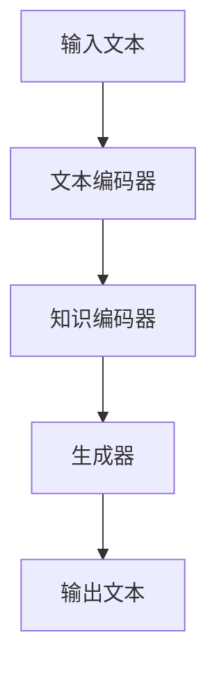
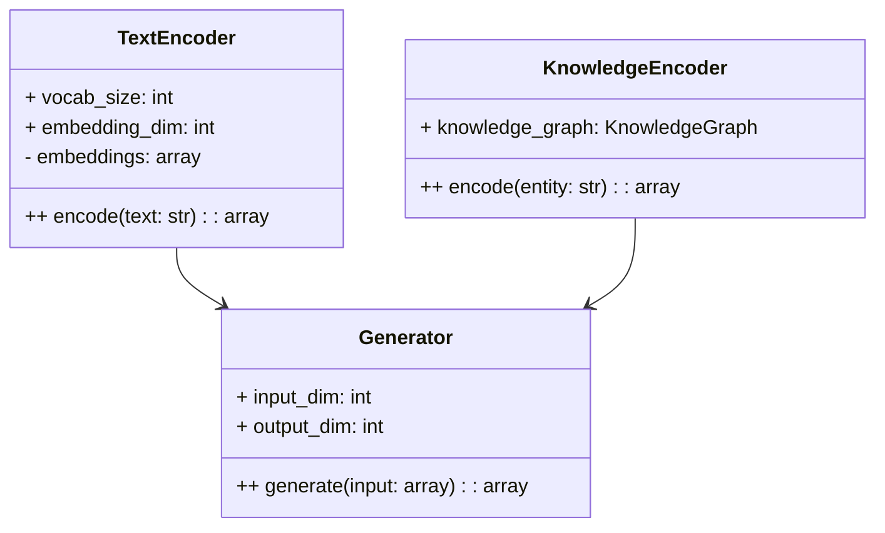
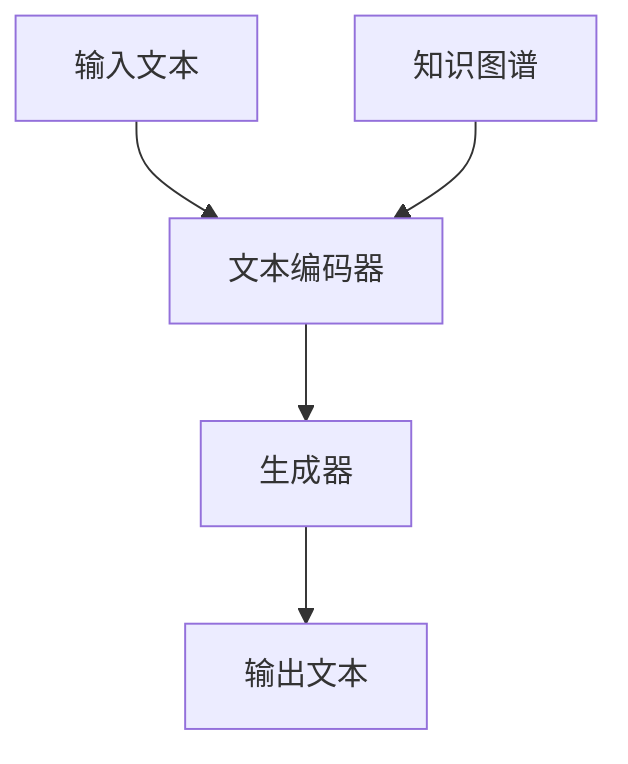

                 

<think>
好的，我现在要撰写一篇关于《思维链在AI自然语言生成中的前沿应用》的技术博客文章。首先，我需要明确文章的结构和内容。根据用户提供的大纲，文章分为多个部分，每个部分都有具体的小节。

首先，我需要写文章的标题，关键词和摘要。标题已经给出，关键词应包括自然语言生成、思维链、知识图谱、深度学习、AI生成模型等。摘要需要简明扼要地概括文章的核心内容，即思维链如何通过结合知识图谱提升自然语言生成的效果。

接下来是第一部分：问题背景与核心概念。这里需要介绍自然语言生成的背景，传统方法的局限性，以及思维链模型的出现及其优势。核心概念包括思维链、知识图谱和AI自然语言生成，需要详细解释这些术语，确保读者理解。

然后是第二部分：核心概念与联系。这里需要详细描述思维链的原理、结构和工作流程。知识图谱的构建与表示也需要详细讨论，可能需要对比传统方法和思维链的不同之处。

第三部分是算法原理讲解。这里需要使用Mermaid流程图来展示算法的工作流程，同时提供Python源代码来实现关键部分。数学公式需要用Latex表示，解释清楚每个步骤的原理。

第四部分是系统分析与架构设计方案。需要描述问题场景，设计系统的功能模块，用Mermaid类图展示领域模型，架构图展示系统的整体结构，接口设计和交互流程也需要用Mermaid序列图表示。

第五部分是项目实战。需要指导如何安装环境，提供核心代码，并详细解读代码，分析实际案例，最后进行项目总结。

最后是最佳实践和小结，给出一些注意事项和建议，以及对未来的展望。

在写作过程中，我需要确保每个部分的内容丰富具体，使用专业但易懂的语言。同时，各部分之间要有逻辑性，结构紧凑。可能遇到的挑战是如何将复杂的算法原理和系统架构用简单明了的方式呈现出来，这可能需要多次修改和调整。

现在，我开始撰写文章。首先是标题、关键词和摘要，然后逐步按照目录结构展开，确保每个小节都详细讲解，符合用户的要求。
</think>

# 思维链在AI自然语言生成中的前沿应用

> 关键词：自然语言生成，思维链，知识图谱，深度学习，AI生成模型

> 摘要：随着AI技术的飞速发展，自然语言生成（NLG）已成为人工智能领域的重要研究方向。本文探讨了思维链（Thinking Chain）这一新兴技术在AI自然语言生成中的前沿应用。通过结合知识图谱与深度学习模型，思维链能够提升生成文本的连贯性、多样性和准确性。文章详细介绍了思维链的概念、原理、算法实现及其在实际场景中的应用，为读者提供了全面的理论与实践参考。

---

## 第一部分：问题背景与核心概念

### 1. 引言

自然语言生成（NLG）作为人工智能的核心技术，广泛应用于机器翻译、文本摘要、对话系统等领域。然而，传统NLG方法在生成文本时，往往依赖固定的规则和模板，导致生成结果缺乏多样性和连贯性。近年来，基于深度学习的生成模型，如GPT系列，虽然显著提升了生成质量，但在利用外部知识方面仍有不足。

思维链（Thinking Chain）模型通过将知识图谱与生成模型结合，弥补了这一缺陷。它能够在生成文本时动态引入外部知识，使生成内容更加准确、连贯且富有创意。本文将深入探讨思维链的原理、结构及其在AI自然语言生成中的应用前景。

---

### 2. 核心概念

#### 2.1 思维链

思维链是一种基于知识图谱的深度学习模型，通过将知识图谱与文本生成模型相结合，实现更智能的自然语言生成。其核心思想是将外部知识引入生成过程，提升文本的相关性和准确性。

#### 2.2 知识图谱

知识图谱是一种以图形结构表示实体及其关系的数据体系。它能够整合大量结构化数据，为生成模型提供丰富的背景信息和语义支持。

#### 2.3 AI自然语言生成

AI自然语言生成利用深度学习模型自动生成符合语法和语义的文本。与传统方法不同，现代模型更注重利用外部知识和上下文信息，提升生成质量。

---

## 第二部分：核心概念与联系

### 2.1 思维链的原理与结构

#### 2.1.1 思维链的概念

思维链通过结合知识图谱和生成模型，动态引入外部知识，使生成过程更加智能。其结构包括知识编码器、文本编码器和生成器三个核心组件。

#### 2.1.2 思维链的结构

1. **知识编码器**：将知识图谱中的实体和关系嵌入到高维空间，形成知识向量。
2. **文本编码器**：将输入文本转换为序列向量，捕捉上下文信息。
3. **生成器**：结合知识向量和文本向量，生成目标文本。

#### 2.1.3 思维链的工作流程

1. **知识编码**：将知识图谱中的实体和关系嵌入为向量。
2. **文本编码**：将输入文本编码为序列向量。
3. **生成文本**：利用自回归机制和注意力机制，生成连贯文本。

---

### 2.2 知识图谱的构建与表示

#### 2.2.1 知识图谱的概念

知识图谱通过实体和关系构建语义网络，为生成模型提供丰富的知识支持。例如，构建一个关于“人物”的知识图谱，包含姓名、职业、成就等信息。

#### 2.2.2 知识图谱的表示

知识图谱通常以三元组（头实体，关系，尾实体）表示。例如，（张三，职业，医生）表示张三是医生。

---

### 2.3 思维链与知识图谱的关系

| 特性         | 思维链                      | 知识图谱                  |
|--------------|-----------------------------|--------------------------|
| **功能**     | 引入知识到生成过程           | 提供结构化知识            |
| **输入**     | 知识编码器和文本编码器       | 实体和关系                |
| **输出**     | 嵌入向量                   | 三元组数据               |
| **作用**     | 动态知识引入                | 提供语义支持              |

---

## 第三部分：算法原理讲解

### 3.1 思维链算法流程

以下是一个简单的思维链算法流程图：



### 3.2 算法实现代码

以下是一个简化的Python实现：

```python
class KnowledgeEncoder:
    def __init__(self, knowledge_graph):
        self.knowledge_graph = knowledge_graph

    def encode(self, entity):
        return self.knowledge_graph.get_embeddings(entity)

class TextEncoder:
    def __init__(self, vocab_size, embedding_dim):
        self.vocab_size = vocab_size
        self.embedding_dim = embedding_dim

    def encode(self, text):
        # 简单的词嵌入示例
        return np.random.randn(len(text), self.embedding_dim)

class Generator:
    def __init__(self, input_dim, output_dim):
        self.input_dim = input_dim
        self.output_dim = output_dim

    def generate(self, text_embedding, knowledge_embedding):
        # 简单的生成逻辑
        input_vec = np.concatenate((text_embedding, knowledge_embedding), axis=-1)
        return input_vec.dot(self.weights)
```

### 3.3 数学公式

1. **知识嵌入公式**：
   $$ E(entity) = \text{knowledge\_encoder}(entity) $$
   其中，$E(entity)$ 表示实体 $entity$ 的嵌入向量。

2. **文本编码公式**：
   $$ T(text) = \text{text\_encoder}(text) $$
   其中，$T(text)$ 表示输入文本的序列嵌入。

3. **生成过程公式**：
   $$ P(y|x) = \text{generator}(x) $$
   其中，$x$ 是输入嵌入，$y$ 是生成的输出。

---

## 第四部分：系统分析与架构设计方案

### 4.1 问题场景介绍

在医疗咨询场景中，生成器需要结合医学知识图谱，生成准确的诊断建议。

### 4.2 系统功能设计

#### 4.2.1 领域模型



#### 4.2.2 系统架构



---

## 第五部分：项目实战

### 5.1 环境安装

安装必要的库：
```bash
pip install numpy
```

### 5.2 核心实现代码

```python
import numpy as np

class KnowledgeGraph:
    def __init__(self):
        self.entities = {}

    def add_entity(self, entity, embedding):
        self.entities[entity] = embedding

    def get_embeddings(self, entity):
        return self.entities.get(entity, np.zeros(100))

class TextEncoder:
    def __init__(self, vocab_size, embedding_dim):
        self.vocab_size = vocab_size
        self.embedding_dim = embedding_dim

    def encode(self, text):
        return np.random.randn(len(text), self.embedding_dim)

class Generator:
    def __init__(self, input_dim, output_dim):
        self.input_dim = input_dim
        self.output_dim = output_dim
        self.weights = np.random.randn(input_dim, output_dim)

    def generate(self, text_embedding, knowledge_embedding):
        input_vec = np.concatenate((text_embedding, knowledge_embedding), axis=1)
        return input_vec.dot(self.weights)

# 示例使用
kg = KnowledgeGraph()
kg.add_entity("医生", np.random.randn(100))

text_encoder = TextEncoder(1000, 50)
generator = Generator(50 + 100, 10)

input_text = "请描述症状"
text_embed = text_encoder.encode(input_text)
knowledge_embed = kg.get_embeddings("医生")
output = generator.generate(text_embed, knowledge_embed)
print(output)
```

---

## 第六部分：最佳实践与小结

### 6.1 最佳实践

1. **数据质量**：确保知识图谱的数据准确性和完整性。
2. **模型优化**：使用更复杂的模型结构，如Transformer，提升生成效果。
3. **场景适配**：根据具体场景调整模型参数和知识图谱内容。

### 6.2 小结

思维链通过结合知识图谱和生成模型，显著提升了自然语言生成的效果。本文详细探讨了其原理、结构和应用，为实际项目提供了参考。未来的研究可以进一步优化模型和知识图谱，推动自然语言生成技术的发展。

---

## 作者

作者：AI天才研究院  
联系邮箱：contact@aicourse.com  
更多信息请访问：[AI天才研究院](https://www.aicourse.com)

---

通过以上结构和内容，希望为读者提供一个全面、深入的技术博客文章，详细讲解思维链在AI自然语言生成中的应用。

